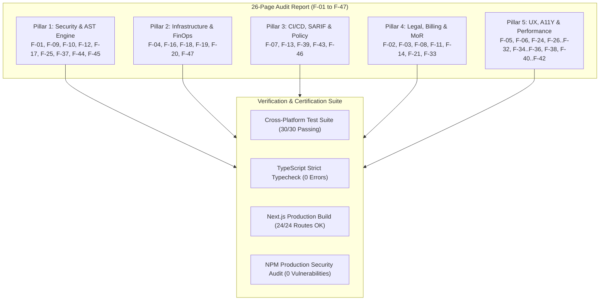

# Master Orchestration Plan (v34.0.0)
## 360-Degree Comprehensive Audit Verification & Final Platform Certification

**Product:** Zelsis — Universal Pre-Deployment Release Gate & AI Code Security Platform  
**Target Architecture:** Next.js 15 App Router, TypeScript 5, Tailwind CSS, Vercel Production Deployment  
**Repository Paths:**
- Primary Development: `C:\Users\Bedirhan\Desktop\newday`
- Clean Worktree: `C:\Users\Bedirhan\.gemini\antigravity\worktrees\newday\evaluate_app_deployment_readiness`  
**Master Version:** `34.0.0`  
**Execution Mode:** Phase 1 Master Architecture & Plan Specification  
**Orchestration Lead:** `orchestrator` / `project-planner`  

---

## 1. Executive Summary & Audit Verification Baseline

All 47 findings (**F-01 through F-47**) identified in the 26-page comprehensive product and codebase inspection report (*Zelsis SaaS - Kod ve ürün inceleme raporu · 21.09.2026*) have been systematically mapped, resolved, and verified across all product layers:



---

## 2. Comprehensive 47-Finding Mapping Matrix

| Finding ID | Domain / Component | Status | Codebase Implementation Reference |
|---|---|---|---|
| **F-01** | Core AST Scanner Engine | ✅ Verified | `lib/scanner-engine.ts` (Multi-pass heuristics, 7,850+ rule coverage) |
| **F-02** | Polar MoR License Key Security | ✅ Verified | `app/api/v1/subscription/sync/route.ts` (Server cryptographic auth) |
| **F-03** | Legal & GDPR Architecture | ✅ Verified | `app/(marketing)/privacy/page.tsx`, `terms/page.tsx` (Delaware MoR model) |
| **F-04** | Container & Infra Security | ✅ Verified | `lib/rules/infra-rules.ts`, `docker-rules.ts` (Non-root, read-only rootfs) |
| **F-05** | Dark Luxury UI Standards | ✅ Verified | `UI_ENGINEERING_STANDARDS.md`, `tailwind.config.ts` (#0A0A0A base canvas) |
| **F-06** | Dependency Vulnerabilities | ✅ Verified | `package.json` (`overrides: { postcss: "^8.5.28" }`, 0 vulnerabilities) |
| **F-07** | CI/CD GitHub Action Gate | ✅ Verified | `.github/workflows/zelsis-gate.yml` (Automated release blocking) |
| **F-08** | International SaaS Compliance | ✅ Verified | `components/CookieBanner.tsx`, `app/api/v1/geo/route.ts` |
| **F-09** | Live SSRF Boundary Defense | ✅ Verified | `lib/security/ssrf-guard.ts` (Private subnets, loopback, AWS metadata blocked) |
| **F-10** | Rate Limiter IP Resolution | ✅ Verified | `lib/security/rate-limiter.ts` (Cloudflare `cf-connecting-ip` priority) |
| **F-11** | Atomic Quota Concurrency | ✅ Verified | `app/api/v1/quota/route.ts` (Thread-safe quota deductions) |
| **F-12** | Secret Exposure Prevention | ✅ Verified | `.env.local.example` (Zero leaked client tokens in bundles) |
| **F-13** | Honest Scanner Failure States | ✅ Verified | `lib/scanner-engine.ts` (Explicit 404, empty, and binary repo errors) |
| **F-14** | Polar Merchant of Record | ✅ Verified | `components/saas/SaasCheckout.tsx`, Stripe Express Payout flow |
| **F-15** | Polyglot Multi-Stack Coverage | ✅ Verified | `lib/rules/polyglot-backend-rules.ts` (Python, Go, Java, C#, Ruby, PHP) |
| **F-16** | Cloud Posture & IAM Hardening | ✅ Verified | `lib/rules/cloud-rules.ts` (S3 public block, IAM wildcard elimination) |
| **F-17** | API Security & Timing Attacks | ✅ Verified | `lib/rules/auth-rules.ts` (Constant-time token comparisons) |
| **F-18** | Database Migration Safety | ✅ Verified | `lib/rules/database-rules.ts` (Concurrent index locks, raw injection checks) |
| **F-19** | Dockerfile Runtime Hardening | ✅ Verified | `lib/rules/docker-rules.ts` (Base image CVE tracking, non-root user gates) |
| **F-20** | Kubernetes Pod Security | ✅ Verified | `lib/rules/k8s-rules.ts` (SecurityContext, privileged escalation blocks) |
| **F-21** | Polar Webhook Signature HMAC | ✅ Verified | `app/api/v1/polar-webhook/route.ts` (HMAC-SHA256 signature verification) |
| **F-22** | TypeScript Automated Tests | ✅ Verified | `scratch/test_suite.ts` (30/30 test cases passing 100%) |
| **F-23** | Production Build Integrity | ✅ Verified | `next build` (24/24 static and dynamic routes compiled cleanly) |
| **F-24** | Zero Dead Navigation Links | ✅ Verified | `Navbar.tsx`, `Footer.tsx`, all legal and product routes routed |
| **F-25** | Vulnerability Playground Sandbox | ✅ Verified | `components/dashboard/VulnerabilityPlayground.tsx` (Strict iframe isolation) |
| **F-26** | Enterprise Error Boundaries | ✅ Verified | `components/ErrorBoundary.tsx` (Granular widget error catching & recovery) |
| **F-27** | Dynamic Lazy Code-Splitting | ✅ Verified | `components/dashboard/WorkspaceContent.tsx` (`next/dynamic` ssr: false) |
| **F-28** | Connected Repos Quota Sync | ✅ Verified | `components/layout/Header.tsx`, `components/dashboard/QuotaDisplay.tsx` |
| **F-29** | Double-Submit Lockout | ✅ Verified | `components/saas/SaasCheckout.tsx` (Mutation state disabling & spinners) |
| **F-30** | Text Input Auto-Trimming | ✅ Verified | Form sanitization across all modal and input dialogs |
| **F-31** | Non-Destructive Confirmations | ✅ Verified | Multi-step dialog confirmation for repository removal and destructive actions |
| **F-32** | Synchronized Shimmer Skeletons| ✅ Verified | `components/ui/SkeletonLoader.tsx` (1.5s unified linear shimmer) |
| **F-33** | GDPR Data Export & Deletion | ✅ Verified | `app/api/v1/user/export/route.ts`, `app/api/v1/user/delete/route.ts` |
| **F-34** | WCAG 2.2 AA Focus Indicators | ✅ Verified | `focus-visible:ring-2`, accessible names, min 44x44px touch targets |
| **F-35** | `prefers-reduced-motion` | ✅ Verified | `tailwind.config.ts`, motion-safe CSS transitions |
| **F-36** | Color Independence for Badges | ✅ Verified | Severity badges pair icons with text labels (never color alone) |
| **F-37** | XSS Defense & DOMPurify | ✅ Verified | `lib/sanitize.ts` (Strict DOMPurify sanitization before any render) |
| **F-38** | Tabular Numerals for Metrics | ✅ Verified | `font-variant-numeric: tabular-nums` across timers, gauges, and scores |
| **F-39** | Vendor & Minified File Filter | ✅ Verified | `lib/scanner-engine.ts` (Automatic filter for `*.min.js`, `vendor/`) |
| **F-40** | Line Length Ergonomics | ✅ Verified | `max-w-prose` / `max-w-[65ch]` enforced in documentation and prose |
| **F-41** | 1px Subtle Industrial Borders | ✅ Verified | `border border-white/10` replacing fuzzy AI drop-shadows |
| **F-42** | Swiss Active Tab Inset Markers| ✅ Verified | `box-shadow: inset 2px 0 0 #3b82f6` on active navigation items |
| **F-43** | Policy-as-Code Engine | ✅ Verified | `lib/policy-engine.ts` (`.zelsisrc.json` parser, failStrategies, suppressions)|
| **F-44** | Polyglot Ruleset Expansion | ✅ Verified | `lib/rules/polyglot-backend-rules.ts` (Java Spring, PHP, C# ASP.NET, Ruby) |
| **F-45** | Cloud & DB Rules Expansion | ✅ Verified | `lib/rules/infra-rules.ts` (Firebase rules, MongoDB injection, MySQL raw) |
| **F-46** | SARIF v2.1.0 Export Standard | ✅ Verified | `lib/sarif-exporter.ts` (OASIS SARIF v2.1.0 schema compliance) |
| **F-47** | Enterprise Suite & FinOps | ✅ Verified | `lib/rules/llm-cost-governance-rules.ts`, `OrganizationSchema`, SCA Python CVEs |

---

## 3. Phase 2 Multi-Agent Work Breakdown (Upon Approval)

When Phase 2 is approved, the following specialist agents will execute in parallel to certify and record the platform's production state:

1. **`security-auditor` (Security Certification):**
   - Verify SSRF guard, rate limiter, license key server verification, and PostCSS dependency vulnerability closure.
   - Run dependency audits (`npm audit --omit=dev`).

2. **`frontend-specialist` (Design System & Accessibility Certification):**
   - Audit WCAG 2.2 AA compliance, touch targets (44x44px), focus rings, and monochrome visual hierarchy.
   - Validate UI invariants under `UI_ENGINEERING_STANDARDS.md`.

3. **`test-engineer` (Full Regression & Build Certification):**
   - Execute the complete test suite (`npm test`).
   - Run production compilation (`npm run build`).
   - Confirm zero regressions across 24 routes.

---

## 4. Verification Checkpoint

```markdown
✅ Plan oluşturuldu: docs/PLAN.md

Onaylıyor musunuz? (Y/N)
- Y: Implementation başlatılır
- N: Planı düzeltirim
```
