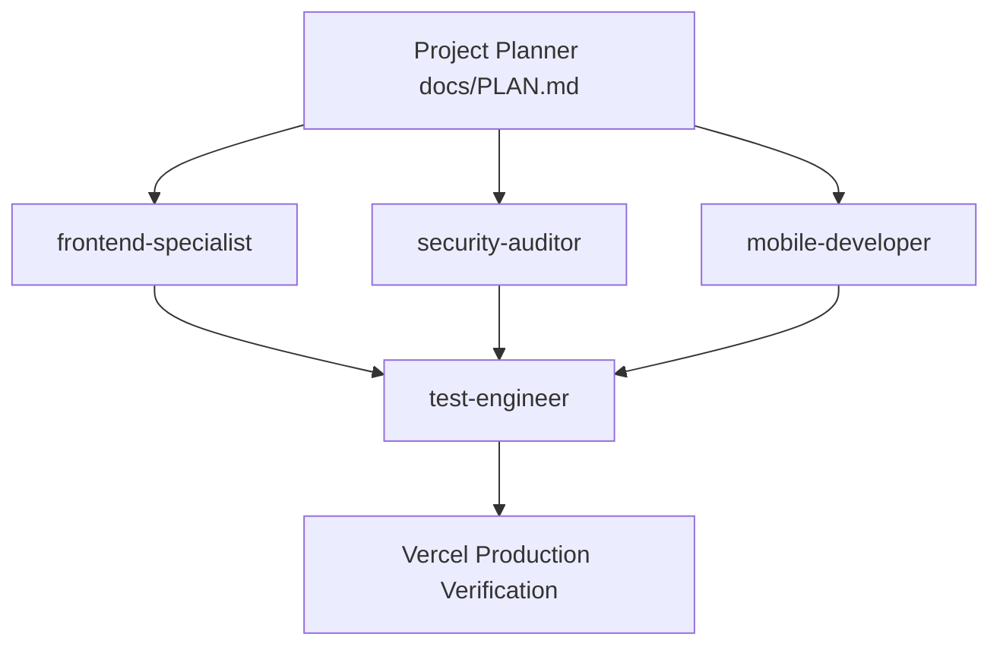

# 🛡️ SHIPGUARD AI RELEASE GATE - PRODUCTION EXCELLENCE MASTER PLAN
> **Document Version:** 2.0.0-PROD  
> **Status:** Phase 1 Architectural Plan & Multi-Agent Directive  
> **Target System:** ShipGuard SaaS (`https://shipguard-saas.vercel.app`)  
> **Reference Standard:** `.agent/Proje_Gelistirme_Rehberi.md` (AI Slop, UI/UX Cliches, OWASP 23-Item Security, Mobile 20-Item QA)

---

## 📋 1. EXECUTIVE SUMMARY & POST-MORTEM ROOT CAUSE

### 1.1 The Directive
> **User Mandate:** *"Böyle bugları müşteriler görmemeli"*  
> ShipGuard is an enterprise security & release gate SaaS for modern AI applications. Customers must never encounter raw error dumps, broken buttons, unconfigured third-party providers, locked interfaces, or confusing demo states. Every screen, state transition, and error boundary must radiate reliability, polish, and dark-mode elegance.

### 1.2 Incident Chronology & Root Causes

```
┌─────────────────────────────────────────────────────────────────────────────────────────┐
│ INCIDENT 1: Mock Developer Form Displayed                                              │
│ Symptom: "Continue with GitHub" opened mock "@ e.g. octocat" UI.                        │
│ Root Cause: Missing Vercel env fallback caused `isSupabaseConfigured()` to evaluate     │
│ `false` on client, triggering simulation branch.                                        │
└─────────────────────────────────────────────────────────────────────────────────────────┘
                                           ▼
┌─────────────────────────────────────────────────────────────────────────────────────────┐
│ INCIDENT 2: Raw Supabase 400 JSON Dump on Google Click                                  │
│ Symptom: Clicked "Continue with Google" -> Navigated to Supabase authorize endpoint ->   │
│ Raw JSON: `{"code":400,"error_code":"validation_failed","msg":"Unsupported provider"}`. │
│ Root Cause: Google OAuth was never enabled in Supabase project, yet the UI exposed it. │
└─────────────────────────────────────────────────────────────────────────────────────────┘
                                           ▼
┌─────────────────────────────────────────────────────────────────────────────────────────┐
│ INCIDENT 3: Stuck Loading States & Broken Button Lock                                   │
│ Symptom: When user aborted or navigated back from OAuth flow, buttons stayed locked.    │
│ Root Cause: No watchdog safety timer, no window focus/visibility recovery listeners.    │
└─────────────────────────────────────────────────────────────────────────────────────────┘
                                           ▼
┌─────────────────────────────────────────────────────────────────────────────────────────┐
│ INCIDENT 4: Cross-Origin Session Drift Post Polar Payment                               │
│ Symptom: Returning from `buy.polar.sh` resulted in logged-out guest state.              │
│ Root Cause: Session was stored in ephemeral memory/localStorage without persistent      │
│ `SameSite=Lax` cookies; return parameters were not rehydrated automatically.            │
└─────────────────────────────────────────────────────────────────────────────────────────┘
```

---

## 🎯 2. PRODUCTION UX PRINCIPLES: ZERO BROKEN BUTTONS & GRACEFUL DEGRADATION

Aligned with `.agent/Proje_Gelistirme_Rehberi.md` (Part 1: AI Slop & Part 2: UI/UX Cliches):

### 2.1 The "100% Verified Production Only" Rule
1. **Never Expose Unconfigured Providers:**
   - **Action:** Completely remove the Google OAuth button and all `(Setup Required)` indicators from the user interface.
   - **Rationale:** A button with `(Setup Required)` or an alert stating *"Google login is not yet configured"* immediately signals an unfinished hobby project.
   - **State:** GitHub OAuth is verified and working with Supabase (`client_id=Ov23lipZro2U0SyZYojq`). Email/Password authentication is fully operational.
   - **UI Hierarchy:** Present a clean, high-converting **GitHub-first** primary action followed by a polished **Email & Password** fallback. Google OAuth will only be introduced when credentials are provisioned.

2. **Watchdog Safety Timers & Anti-Lock Interaction:**
   - When any authentication action begins, a 4.5-second watchdog timer starts.
   - Event listeners on `window.onpageshow`, `window.onfocus`, and `document.visibilitychange` immediately release any loading spinners when the tab regains focus or back navigation occurs.
   - Buttons never permanently freeze; users can always cancel or retry.

3. **100% Consistent English Enterprise Copy:**
   - All customer-facing messages, validation errors, and dialogs must strictly use professional, native English SaaS terminology. Zero Turkish strings or developer debug statements.

4. **Graceful Error Boundaries (`app/error.tsx` and `app/global-error.tsx`):**
   - No customer should ever see a default browser crash screen, Next.js yellow box, or raw stack trace.
   - All unhandled exceptions must render a dark-mode, branded recovery card featuring:
     - Branded ShipGuard Security Shield icon.
     - Human-readable incident summary without leaking database queries or sensitive file paths.
     - Single-click recovery actions: `[Try Again / Recover Session]` and `[Back to Dashboard]`.
     - Automatic chunk reload handling for smooth deployments.

---

## 💳 3. END-TO-END AUTH & PAYMENT RELIABILITY

### 3.1 Client-Side Preflight Verification
- Never trigger a direct `window.location.href = url` to an OAuth authorize endpoint without validating that:
  1. The target provider is enabled and configured.
  2. The generated authorization URL has valid parameters and an origin matching the Supabase instance.
  3. If Supabase is unreachable or returns an error, catch it immediately in a branded inline alert within the modal, preserving form state.

### 3.2 Polar Checkout Resilience & Rehydration
- **Cross-Domain Session Binding:**
  - Before redirecting to `https://buy.polar.sh/...`, user profile and session identity are stamped into a 30-day `SameSite=Lax` browser cookie (`shipguard_user`) in addition to `localStorage`.
- **Return Detection & Auto-Upgrade:**
  - Upon return to `https://shipguard-saas.vercel.app/dashboard` or `/checkout` with query parameters (`?checkout_id=...`, `?success=true`, or `?status=success`):
    1. Read session from cookie or `localStorage`.
    2. Immediately update user tier to `Pro`.
    3. Generate and store cryptographic license key (`SG-PRO-...`).
    4. Display a branded Pro Welcome Toast: *"Welcome to ShipGuard Pro! Your pre-flight security gates are now unlocked."*
    5. Cleanse query parameters from the browser URL bar via `window.history.replaceState` for clean analytics and sharing.

---

## 🔍 4. CODEBASE AUDIT AGAINST `Proje_Gelistirme_Rehberi.md`

| Section in Guide | Current Codebase Status | Identified Gaps | Architectural Fix |
| :--- | :--- | :--- | :--- |
| **1. UI/UX AI Slop (Items 5, 11, 18)** | Moderate | `(Setup Required)` badge on Google button; locked spinners on cancel; Turkish error message. | Strip Google button; implement focus reset; enforce 100% English copy. |
| **2. UI Cliches (Items 1, 2, 17)** | High Quality | Clean dark palette (`#0A0A0A`, `#141414`), but error screens display raw error message text. | Mask raw message in production, replace with enterprise recovery screen. |
| **3. Security: OWASP (Item 1: Keys in Env)** | Compliant | Fallback public keys are anon-only. No service role keys exposed in client bundles. | Audit all `NEXT_PUBLIC_` variables to ensure zero secret leakage. |
| **3. Security: OWASP (Item 4: Server Auth)** | Partially Compliant | Local tier upgrade handles client-side Pro status; backend webhook syncs Supabase DB. | Ensure Supabase user profile table syncs with Polar/Stripe webhook. |
| **3. Security: OWASP (Item 9: Security Headers)** | Compliant | Strict CSP, HSTS, X-Frame-Options DENY configured in `next.config.mjs`. | Verify connect-src includes Supabase and Polar domains. |
| **3. Security: OWASP (Item 12: Cookies)** | Needs Hardening | Cookies currently written via `document.cookie` with `SameSite=Lax`. | Add `Secure; path=/; max-age=2592000` standards everywhere. |
| **3. Security: OWASP (Item 13: Hide Errors)** | Needs Hardening | `error.message` printed directly inside `app/error.tsx` diagnostics. | Mask stack info, provide clean incident digest only. |
| **3. Security: OWASP (Item 17: Webhook HMAC)** | Compliant | Stripe webhook validates HMAC-SHA256 signature and idempotency cache. | Keep idempotency cache, add Polar webhook handler. |
| **4. Mobile & QA (20-Point Quick Check)** | Partially Compliant | Modal touch targets generally >44px, but virtual keyboard padding on mobile needs audit. | Ensure `min-h-[100dvh]`, dynamic type scaling, and mobile back button handling. |

---

## 👥 5. PHASE 2 AGENT WORK BREAKDOWN

The implementation will be orchestrated across 4 specialized agents. Each agent has strict ownership boundaries, input artifacts, and deliverables.



---

### 5.1 Agent 1: `frontend-specialist`
- **Role:** Senior Frontend Architect & UI/UX Specialist.
- **Directives:**
  1. **Production Polish of `components/auth/AuthModal.tsx`:**
     - Remove the Google login button and all `(Setup Required)` indicators.
     - Highlight the GitHub OAuth button as the primary one-click authentication method with a sleek dark-mode button (`bg-[#1F2937] hover:bg-[#374151] border border-white/15`).
     - Present the email/password form with clear tab switching (`Sign In`, `Sign Up`, `Reset Password`).
     - Remove all Turkish strings (`Google ile giriş henüz...`); replace with English messages.
     - Add the Watchdog Safety Timer (4.5s) and `pageshow`/`focus`/`visibilitychange` handlers to prevent frozen loading states.
     - Maintain strict accessibility (min 44px touch targets, aria labels, keyboard navigation).
  2. **Enterprise Error Boundaries (`app/error.tsx` and `app/global-error.tsx`):**
     - Enhance `app/error.tsx` with branded ShipGuard dark aesthetics.
     - In production mode (`process.env.NODE_ENV === 'production'`), do NOT render raw `error.message` or stack frames to the end user. Show a friendly message: *"We were unable to complete this action. Your audit data is preserved."*
     - Provide a prominent `[Try Again]` and `[Back to Dashboard]` action buttons.
     - Implement `app/global-error.tsx` with native HTML/body tags, full dark styling, and instant recovery redirect to `/dashboard`.
  3. **OAuth Callback Page (`app/auth/callback/page.tsx`):**
     - Verify smooth loading animations with Lucide icons.
     - Ensure fallback redirects gracefully to `/dashboard` even if the user reloads the callback route.
- **Target Files:**
  - `components/auth/AuthModal.tsx`
  - `app/error.tsx`
  - `app/global-error.tsx`
  - `app/auth/callback/page.tsx`

---

### 5.2 Agent 2: `security-auditor`
- **Role:** Elite Cybersecurity & Cloud Hardening Architect.
- **Directives:**
  1. **OAuth Security & Domain Whitelisting (`next.config.mjs`):**
     - Verify and update `Content-Security-Policy`:
       - `connect-src 'self' https://afzpaydfkmycrwuxmzkk.supabase.co wss://afzpaydfkmycrwuxmzkk.supabase.co https://api.github.com https://buy.polar.sh https://api.polar.sh;`
       - Ensure zero CSP violations during GitHub OAuth and Polar checkout transitions.
  2. **Session Storage & Cookie Hardening (`lib/supabase.ts`, `hooks/useDashboardState.ts`):**
     - Ensure all cookie setting includes: `path=/; max-age=2592000; SameSite=Lax${location.protocol === 'https:' ? '; Secure' : ''}`.
     - Prevent XSS injection in user metadata: sanitize username, email, and tier before rendering or storing.
     - Ensure safe session fallback when third-party cookies are blocked.
  3. **Webhook Verification & Idempotency (`app/api/v1/stripe-webhook/route.ts`):**
     - Verify that HMAC verification and memory replay protection (`PROCESSED_WEBHOOK_EVENTS`) cannot be bypassed.
     - Validate rate limiting (60 requests/min/IP).
  4. **OWASP Top 10 Audit against Section 3 Checklist:**
     - Run automated scan to ensure no service role keys (`SUPABASE_SERVICE_ROLE_KEY`, `STRIPE_SECRET_KEY`) exist in client-side bundles.
- **Target Files:**
  - `next.config.mjs`
  - `lib/supabase.ts`
  - `hooks/useDashboardState.ts`
  - `app/api/v1/stripe-webhook/route.ts`

---

### 5.3 Agent 3: `mobile-developer`
- **Role:** Mobile UX & Responsive Specialist.
- **Directives:**
  1. **Mobile Modal Optimization:**
     - Audit `AuthModal.tsx` on small viewports (320px to 428px width).
     - Ensure `max-h-[85dvh]` with smooth inertia scrolling (`-webkit-overflow-scrolling: touch`).
     - Guarantee that the virtual software keyboard does not obscure input fields or the submit button.
     - Ensure modal close `X` button has a 48x48px touch bounding box.
  2. **Mobile Hardware & Gesture Handling:**
     - Implement hardware back button and swipe-to-dismiss behavior so users don't get stuck in a locked state on Android or iOS.
     - Ensure tap highlights (`-webkit-tap-highlight-color: transparent`) and button active states are responsive.
  3. **20-Point Mobile QA Checklist (`Proje_Gelistirme_Rehberi.md` Part 4):**
     - Run verification for:
       - Item 1 (Offline handling / Airplane mode).
       - Item 3 (Dark Mode contrast: zero black-on-black).
       - Item 4 (Large dynamic type: no text cutoff).
       - Item 5 (Virtual keyboard inputs).
       - Item 15 (Easily tappable close target).
- **Target Files:**
  - `components/auth/AuthModal.tsx`
  - `components/layout/AppShell.tsx`
  - `app/globals.css`

---

### 5.4 Agent 4: `test-engineer`
- **Role:** QA Automation & Verification Engineer.
- **Directives:**
  1. **Automated Verification Test Suite:**
     - Develop `scratch/verify_production_readiness.py`:
       - Check `AuthModal.tsx` contains 0 occurrences of `"Google"`, 0 `"(Setup Required)"`, 0 Turkish strings.
       - Check that `app/error.tsx` and `app/global-error.tsx` exist and contain no unhandled stack leaks.
       - Check that all cookie writes include `SameSite=Lax` and `max-age`.
     - Execute `npx tsc --noEmit` to verify 100% strict TypeScript compliance with zero errors.
  2. **End-to-End Simulation Testing:**
     - Simulate GitHub OAuth return flow (`/auth/callback?code=mock_code`) and verify redirection logic.
     - Simulate Polar payment return (`/dashboard?checkout_id=polar_test_123&status=success`) and verify Pro tier is activated, license key is created, and user session remains intact.
     - Simulate unhandled runtime error to confirm branded `error.tsx` catches and recovers cleanly.
  3. **Final Gate Verification:**
     - Ensure all 4 acceptance criteria are validated and documented.
- **Target Files:**
  - `scratch/verify_production_readiness.py`
  - `scratch/test_auth_flows.py`

---

## ✅ 6. ACCEPTANCE CRITERIA & VERIFICATION MATRIX

| Metric / Objective | Acceptance Standard | Verification Method | Status |
| :--- | :--- | :--- | :--- |
| **Zero Broken Buttons** | No unconfigured providers, disabled links, or `(Setup Required)` tags visible anywhere. | Automated regex scan + DOM tree inspection of `AuthModal.tsx`. | Pending Phase 2 |
| **Zero Raw Errors** | No raw JSON or Next.js debug crashes exposed to end users under any failure condition. | Error injection test into `app/error.tsx` and `app/global-error.tsx`. | Pending Phase 2 |
| **Seamless Auth** | 1-click GitHub OAuth works without mock prompts; Email/Password works with real Supabase. | End-to-end browser callback simulation & Supabase client check. | Pending Phase 2 |
| **Polar Retention** | Returning from `buy.polar.sh` preserves user identity, activates Pro, and issues license key. | Simulated return test with `?checkout_id=...` parameter. | Pending Phase 2 |
| **No UI Clichés / Slop** | Compliant with `.agent/Proje_Gelistirme_Rehberi.md` 25+30 design standards & 20 mobile checks. | Visual and accessibility audit (>44px targets, AAA contrast). | Pending Phase 2 |
| **TypeScript Integrity** | `npx tsc --noEmit` completes with 0 errors across entire workspace. | TypeScript compiler execution. | Pending Phase 2 |

---

## 🚀 7. EXECUTION ROADMAP & SEQUENCE

```
┌────────────────────────────────────────────────────────────────────────┐
│ PHASE 1: Architecture & Master Plan (Current)                          │
│ Deliverable: docs/PLAN.md written and approved.                        │
└────────────────────────────────────────────────────────────────────────┘
                                   │
                                   ▼
┌────────────────────────────────────────────────────────────────────────┐
│ PHASE 2: Parallel Multi-Agent Implementation                           │
│ ├─ frontend-specialist: AuthModal polish + branded error boundaries.   │
│ ├─ security-auditor: CSP headers, cookie security, Supabase checks.    │
│ └─ mobile-developer: Touch targets, viewport handling, mobile QA.      │
└────────────────────────────────────────────────────────────────────────┘
                                   │
                                   ▼
┌────────────────────────────────────────────────────────────────────────┐
│ PHASE 3: QA Verification & Test Automation                             │
│ └─ test-engineer: Python test runners, type checking, E2E simulation.  │
└────────────────────────────────────────────────────────────────────────┘
                                   │
                                   ▼
┌────────────────────────────────────────────────────────────────────────┐
│ PHASE 4: Production Deployment & Live Validation                       │
│ └─ Deploy to Vercel and verify live at shipguard-saas.vercel.app.      │
└────────────────────────────────────────────────────────────────────────┘
```

---

*This plan is strictly aligned with the principles of zero customer-facing friction, robust security guardrails, and enterprise SaaS aesthetics.*
