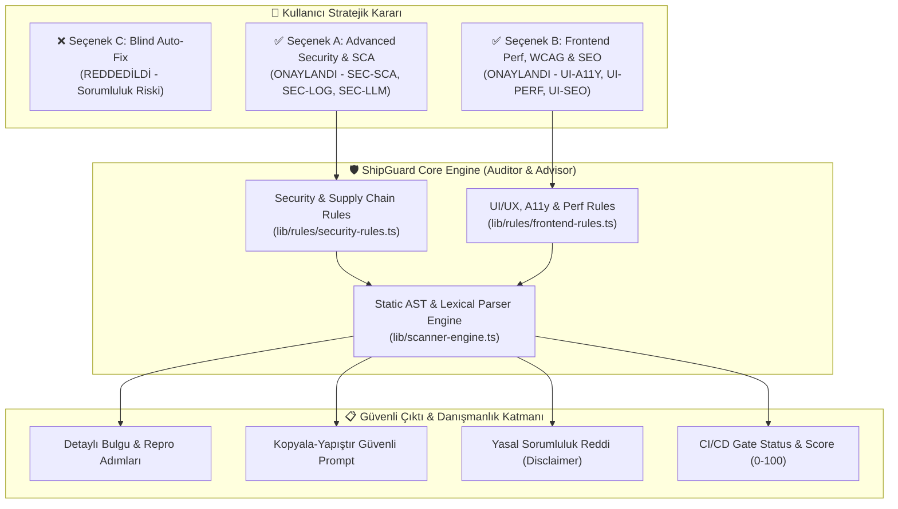
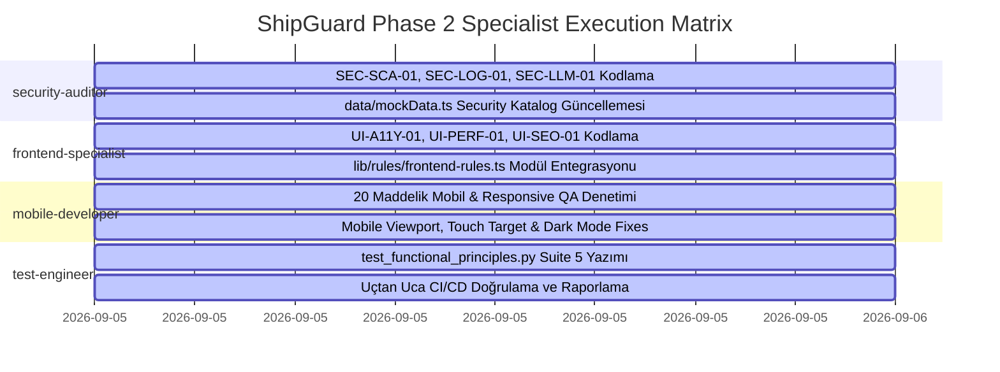

# 🛡️ SHIPGUARD AI RELEASE GATE - GELİŞMİŞ GÜVENLİK, TEDARİK ZİNCİRİ (OPTION A) VE FRONTEND PERFORMANS, WCAG & SEO (OPTION B) MASTER UYGULAMA PLANI (`docs/PLAN.md`)

**Proje:** ShipGuard AI Release Gate SaaS  
**Versiyon:** 4.0.0 (Next.js 15.1, React 18, TypeScript 5.7, Tailwind CSS, Supabase PostgreSQL, Stripe)  
**Referans Dokümanlar:**  
- [.agent/Proje_Gelistirme_Rehberi.md](file:///C:/Users/Bedirhan/.gemini/antigravity/worktrees/newday/evaluate_app_deployment_readiness/.agent/Proje_Gelistirme_Rehberi.md) (AI Slop & Problem Kataloğu, 25+30 Web Tasarım Klişesi, 23 OWASP Canlıya Alım Kuralı, 20 Mobil QA Testi)  
- [lib/scanner-engine.ts](file:///C:/Users/Bedirhan/.gemini/antigravity/worktrees/newday/evaluate_app_deployment_readiness/lib/scanner-engine.ts) (Statik AST & Desen Tarama Motoru)  
- [lib/rules/security-rules.ts](file:///C:/Users/Bedirhan/.gemini/antigravity/worktrees/newday/evaluate_app_deployment_readiness/lib/rules/security-rules.ts) (Güvenlik Kural Motoru)  
- [lib/rules/ai-cliche-rules.ts](file:///C:/Users/Bedirhan/.gemini/antigravity/worktrees/newday/evaluate_app_deployment_readiness/lib/rules/ai-cliche-rules.ts) (AI Arayüz Klişe Kuralları)  
- [data/mockData.ts](file:///C:/Users/Bedirhan/.gemini/antigravity/worktrees/newday/evaluate_app_deployment_readiness/data/mockData.ts) (`SECURITY_RULES_CATALOG`, `UI_RULES_CATALOG`)  
- [scratch/test_functional_principles.py](file:///C:/Users/Bedirhan/.gemini/antigravity/worktrees/newday/evaluate_app_deployment_readiness/scratch/test_functional_principles.py) (Otomatik Doğrulama Test Paketi)  
**Tarih / Durum:** Eylül 2026 / **FAZ 1 ONAYLANDI — FAZ 2 OTONOM UYGULAMAYA HAZIR**

---

## 📑 İÇİNDEKİLER (TABLE OF CONTENTS)

1. [Yönetici Özeti ve Kullanıcı Karar Özeti](#1-yönetici-özeti-ve-kullanıcı-karar-özeti)
2. [Mimari & Felsefe (Auditor Philosophy & Liability Protection)](#2-mimari--felsefe-auditor-philosophy--liability-protection)
   - [2.1 Neden Kör Otopilot (In-Place Auto-Fix) Reddedildi?](#21-neden-kör-otopilot-in-place-auto-fix-reddedildi)
   - [2.2 Snyk / SonarQube Modeli: Denetçi & Güvenli Danışman (Auditor & Advisor)](#22-snyk--sonarqube-modeli-denetçi--güvenli-danışman-auditor--advisor)
   - [2.3 Yasal Sorumluluk Reddi (Disclaimer) ve Geliştirici Kontrol Döngüsü](#23-yasal-sorumluluk-reddi-disclaimer-ve-geliştirici-kontrol-döngüsü)
3. [Kapsam 1: Gelişmiş Güvenlik & Tedarik Zinciri Kuralları (Option A)](#3-kapsam-1-gelişmiş-güvenlik--tedarik-zinciri-kuralları-option-a)
   - [3.1 `SEC-SCA-01`: Bağımlılık & Tedarik Zinciri Açıkları (SCA)](#31-sec-sca-01-bağımlılık--tedarik-zinciri-açıkları-sca)
   - [3.2 `SEC-LOG-01`: Hassas Veri, Şifre & PII Log Sızıntısı](#32-sec-log-01-hassas-veri-şifre--pii-log-sızıntısı)
   - [3.3 `SEC-LLM-01`: İstemci Katmanı AI/LLM SDK & Prompt İfşası](#33-sec-llm-01-istemci-katmanı-aillm-sdk--prompt-ifşası)
4. [Kapsam 2: Frontend Performans, WCAG & SEO Kuralları (Option B)](#4-kapsam-2-frontend-performans-wcag--seo-kuralları-option-b)
   - [4.1 `UI-A11Y-01`: WCAG 2.1 AA Erişilebilirlik & Klavye Odak Halkası](#41-ui-a11y-01-wcag-21-aa-erişilebilirlik--klavye-odak-halkası)
   - [4.2 `UI-PERF-01`: Core Web Vitals & Next.js Image Optimizasyonu](#42-ui-perf-01-core-web-vitals--nextjs-image-optimizasyonu)
   - [4.3 `UI-SEO-01`: Sosyal Medya Open Graph, Twitter Card & Semantik SEO](#43-ui-seo-01-sosyal-medya-open-graph-twitter-card--semantik-seo)
5. [Teknik Entegrasyon ve Kod Mimarisi Haritası](#5-teknik-entegrasyon-ve-kod-mimarisi-haritası)
   - [5.1 `lib/rules/security-rules.ts` Genişletme Mimarisi](#51-librulessecurity-rulests-genişletme-mimarisi)
   - [5.2 `lib/rules/frontend-rules.ts` Modüler Kural Yapısı](#52-librulesfrontend-rulests-modüler-kural-yapısı)
   - [5.3 `lib/scanner-engine.ts` Entegrasyon ve Yürütme Pipeline'ı](#53-libscanner-enginets-entegrasyon-ve-yürütme-pipelineı)
   - [5.4 `data/mockData.ts` Katalog Güncellemeleri](#54-datamockdatats-katalog-güncellemeleri)
   - [5.5 `app/api/v1/gate-check/route.ts` API Yanıt Uyumluluğu](#55-appapiv1gate-checkroutets-api-yanıt-uyumluluğu)
6. [Faz 2 Uzman Görev Dağılım Matrisi (Specialist Agent Task Assignments)](#6-faz-2-uzman-görev-dağılım-matrisi-specialist-agent-task-assignments)
   - [6.1 `security-auditor` Görev Paketi](#61-security-auditor-görev-paketi)
   - [6.2 `frontend-specialist` Görev Paketi](#62-frontend-specialist-görev-paketi)
   - [6.3 `mobile-developer` Görev Paketi (.agent Rehberi 20 Hızlı Test)](#63-mobile-developer-görev-paketi-agent-rehberi-20-hızlı-test)
   - [6.4 `test-engineer` Görev Paketi & Test Otomasyonu](#64-test-engineer-görev-paketi--test-otomasyonu)
7. [Test, Doğrulama & Kalite Kontrol Planı](#7-test-doğrulama--kalite-kontrol-planı)
   - [7.1 `scratch/test_functional_principles.py` Kapsamına Kural Testleri Eklenmesi](#71-scratchtest_functional_principlespy-kapsamına-kural-testleri-eklenmesi)
   - [7.2 Yanlış Pozitif (False Positive) ve Bastırma (`.shipguardignore`) Testleri](#72-yanlış-pozitif-false-positive-ve-bastırma-shipguardignore-testleri)
   - [7.3 E2E Doğrulama Senaryoları & Başarı Kriterleri](#73-e2e-doğrulama-senaryoları--başarı-kriterleri)

---

## 1. YÖNETİCİ ÖZETİ VE KULLANICI KARAR ÖZETİ

Kullanıcımız, projenin canlıya alım ve denetim vizyonu konusunda son derece kritik ve stratejik bir karar vermiştir:

> **Kullanıcı İfadesi:**  
> *"Seçenek a ve b tamam fakat c seçeneği kullanıcı düzeltmemizi istedi fakat ya hata yaparsak o zaman bizi suçlarlar ."*

### Alınan Kesin Kararlar:
1. **SEÇENEK C KESİNLİKLE REDDEDİLDİ (Kör Kod Düzenleme / Auto-Fix İptal):**
   - Kaynak kodun geliştirici onayı olmadan ShipGuard tarafından otomatik olarak değiştirilmesi, ezilmesi veya "inplace" düzeltilmesi engellenmiştir.
   - Yazılım mühendisliği ve yasal sorumluluk (engineering & legal liability) ilkeleri gereğince, istem dışı syntax kırılması, derleme hatası veya mantık bozulmalarına karşı ShipGuard sistemi **asla sessizce kod yazmaz**.
2. **SEÇENEK A KABUL EDİLDİ (Gelişmiş Güvenlik & Bağımlılık Taraması):**
   - Modern yazılım güvenliğinin kalbi olan bağımlılık zinciri (Software Composition Analysis - SCA), hassas log sızıntıları (PII/Secret Log Leakage) ve istemci katmanında yapay zeka anahtarı ifşası (`"use client"` LLM SDK exposure) kuralları eklenir.
3. **SEÇENEK B KABUL EDİLDİ (Frontend Performans, WCAG & SEO Meta Taraması):**
   - WCAG 2.1 AA klavye odak halkaları ve aria etiketleri, Next.js `<Image>` Core Web Vitals optimizasyonu ve sosyal medya Open Graph / Twitter Card eksiksizliği kural motoruna dahil edilir.
4. **GEMINI / CURSOR VE REHBER UYUMU:**
   - Tüm yeni kurallar [.agent/Proje_Gelistirme_Rehberi.md](file:///C:/Users/Bedirhan/.gemini/antigravity/worktrees/newday/evaluate_app_deployment_readiness/.agent/Proje_Gelistirme_Rehberi.md) dokümanında listelenen 23 OWASP Canlıya Alım Kuralı, UI/UX Anti-Slop Kataloğu ve 20 Maddelik Mobil Test Standartları ile %100 uyumlu olarak tasarlanmıştır.



---

## 2. MİMARİ & FELSEFE (AUDITOR PHILOSOPHY & LIABILITY PROTECTION)

### 2.1 Neden Kör Otopilot (In-Place Auto-Fix) Reddedildi?

Bir SaaS platformunun veya statik analiz motorunun kullanıcı deposundaki kaynak dosyaları doğrudan düzenlemesi ("in-place auto-fixing") ilk bakışta cazip görünse de pratikte telafisi imkansız riskler barındırır:

1. **Sözdizimi ve Mantık Bozulması (AST Incompatibility):** Kod otomatik yamalanırken JSX kapanış tagleri, TypeScript generic parametreleri veya CSS modülleri bozulabilir. Proje derlenemez hale gelebilir (`npm run build` çöker).
2. **Yan Etkiler (Side Effects & Regressions):** Güvenlik gerekçesiyle değiştirilen bir `origin: '*'` veya kaldırılan bir `console.log`, uygulamanın başka bir yerindeki telemetry modülünü veya üçüncü parti entegrasyonu çökertebilir.
3. **Mühendislik & Yasal Sorumluluk ("Bizi Suçlarlar" İlkesi):** Müşteri veya geliştirici, "ShipGuard dosyamı değiştirdi ve müşterilerimin sipariş akışı çöktü" diyerek platformu sorumlu tutabilir. B2B SaaS sözleşmelerinde veri ve kod bütünlüğünü bozan otopilotlar dava riskine tabidir.

### 2.2 Snyk / SonarQube Modeli: Denetçi & Güvenli Danışman (Auditor & Advisor)

Endüstri standardı lider analiz platformları (Snyk, SonarQube, GitHub CodeQL, ESLint) kodu körü körüne ezmez. Bunun yerine:
- **Hassas Tespit (Pinpointed Detection):** Dosya yolu (`filePath`), kesin satır numarası (`L42`), bağlam kod parçası (`snippet`) gösterilir.
- **Yeniden Üretim Adımları (Reproduction Steps):** Zafiyetin veya hatanın neden oluştuğu adım adım listelenir.
- **Eyleme Geçirilebilir İyileştirme Kılavuzu (Actionable Remediation Prompt):** Geliştiriciye özel, kopyalanıp doğrudan Claude/Cursor/DeepSeek'e verilebilecek veya manuel uygulanabilecek optimize kod blokları sağlanır.
- **Geliştirici İradesi (Human-in-the-Loop):** Son kararı ve git commit/merge işlemini her zaman insan geliştirici verir.

### 2.3 Yasal Sorumluluk Reddi (Disclaimer) ve Geliştirici Kontrol Döngüsü

ShipGuard'ın ürettiği tüm raporlarda, CLI çıktılarında, `/api/v1/gate-check` JSON yanıtlarında ve arayüzdeki `RemediationDrawer` bileşeninde standart **Güvenli Danışman Beyanı** yer alır:

> **ShipGuard Güvenlik & Danışmanlık Beyanı (Disclaimer):**  
> *"ShipGuard, yazılım güvenliği, tedarik zinciri ve arayüz standartları için bağımsız bir denetçi ve analiz motorudur. Sunulan düzeltme önerileri ve kod blokları tavsiye niteliğindedir; kod tabanında yapılacak tüm değişikliklerin canlı ortama alınmadan önce geliştirici tarafından test edilmesi, incelenmesi ve onaylanması tavsiye edilir."*

---

## 3. KAPSAM 1: GELİŞMİŞ GÜVENLİK & TEDARİK ZİNCİRİ KURALLARI (OPTION A)

[.agent/Proje_Gelistirme_Rehberi.md](file:///C:/Users/Bedirhan/.gemini/antigravity/worktrees/newday/evaluate_app_deployment_readiness/.agent/Proje_Gelistirme_Rehberi.md) Dokümanı Bölüm 6 (Kod & Yazılım Mimarisi) ve Bölüm 9 (Güvenlik, Guardrails) ile 23 Canlıya Alım Kuralı referans alınarak 3 kritik güvenlik kuralı tanımlanmıştır:

```
┌─────────────────────────────────────────────────────────────────────────────────────────────┐
│ OPTION A: GELİŞMİŞ GÜVENLİK VE TEDARİK ZİNCİRİ (SCA) KURAL SETİ                             │
├─────────────┬──────────────────────────────────────┬──────────┬─────────────────────────────┤
│ Kural Kodu  │ Başlık                               │ Seviye   │ İlgili Standart             │
├─────────────┼──────────────────────────────────────┼──────────┼─────────────────────────────┤
│ SEC-SCA-01  │ Dependency / Supply Chain Risk       │ HIGH     │ OWASP A06:2021 Vuln Deps    │
│ SEC-LOG-01  │ Sensitive Token & PII Log Leakage    │ HIGH     │ OWASP A09:2021 Logging Fail │
│ SEC-LLM-01  │ AI/LLM Client Exposure & Leakage     │ CRITICAL │ OWASP Top 10 for LLM (LLM06)│
└─────────────┴──────────────────────────────────────┴──────────┴─────────────────────────────┘
```

---

### 3.1 `SEC-SCA-01`: Bağımlılık & Tedarik Zinciri Açıkları (SCA)

- **Kategori:** `Supply Chain & Dependencies`
- **Risk Seviyesi:** `HIGH` (Önemli Güvenlik Riski)
- **OWASP Referansı:** OWASP A06:2021 – Vulnerable and Outdated Components / Rehber Madde 222 (`npm audit`).
- **Amaç:** `package.json` dosyasını tarayarak açık versiyon tanımlarını (unpinned wildcard `*`, `latest`), bilinen zafiyetli kütüphaneleri ve kritik CVE geçmişine sahip paket sürümlerini tespit etmek.

#### Tespit Algoritması & Desenler:
1. **Unpinned / Wildcard Versiyonlar:**
   - `"dependency": "*"` veya `"dependency": "latest"` veya `"dependency": ">=0.0.0"`. Bu durum, dış bir saldırganın kütüphaneye zararlı sürüm yüklemesi halinde CI/CD ortamında otomatik derlenip sisteme sızmasına (Supply Chain Poisoning) neden olur.
2. **Bilinen Riskli ve Eski Kütüphaneler:**
   - `axios`: `<1.7.4` (CVE-2023-45857, CVE-2024-39338 - SSRF ve Header Injection açıkları).
   - `lodash`: `<4.17.21` (CVE-2020-8203, CVE-2021-23337 - Prototype Pollution ve Command Injection).
   - `moment`: Deprecated kütüphane; ReDoS (Düzenli ifade kaynak tüketimi) zafiyetleri ve aşırı paket boyutu. Yerine `date-fns` veya modern `dayjs` önerilir.
   - `minimist`: `<1.2.6` (CVE-2021-44906 - Prototype Pollution).
   - `jsonwebtoken`: `<9.0.0` (Key confusion ve unverified signature açıkları).
   - `tar`: `<6.2.1` (CVE-2024-28863 - Arbitrary file creation/overwrite).
   - `express`: `<4.19.2` (CVE-2024-29041 - Open redirect ve IP spoofing).

#### Kod Örneği & Çıktı:
- **Hatalı Kod (`package.json`):**
  ```json
  {
    "dependencies": {
      "axios": "^0.21.1",
      "lodash": "4.17.15",
      "moment": "^2.29.1",
      "some-helper": "*"
    }
  }
  ```
- **Remediation Önerisi:**
  ```json
  {
    "dependencies": {
      "axios": "^1.7.4",
      "lodash": "^4.17.21",
      "date-fns": "^3.6.0",
      "some-helper": "1.2.4"
    }
  }
  ```
- **Prompt:** *"Audit package.json. Pin all wildcard (*) dependencies to fixed semantic versions. Upgrade axios to >=1.7.4, lodash to >=4.17.21, and replace deprecated moment with date-fns or dayjs to eliminate supply chain vulnerabilities."*

---

### 3.2 `SEC-LOG-01`: Hassas Veri, Şifre & PII Log Sızıntısı

- **Kategori:** `Logging & PII Protection`
- **Risk Seviyesi:** `HIGH`
- **OWASP Referansı:** OWASP A09:2021 – Security Logging and Monitoring Failures / Rehber Madde 217 (`Loglardan PII Temizle`).
- **Amaç:** Kaynak kod içinde hassas kullanıcı verilerinin, kimlik doğrulama tokenlarının veya tüm HTTP başlıklarının `console.log` / `console.error` ile açık şekilde loglanmasını engellemek.

#### Tespit Algoritması & Desenler:
1. **Hassas Değişken Loglama:**
   - `console\.(log|error|warn|info|debug)\s*\([^)]*(token|secret|password|passwd|api[_-]?key|auth_header|bearer|private_key|refresh_token)` (Büyük/küçük harf duyarsız).
2. **Ham Request Başlıkları & Gövde Sızıntısı:**
   - `console\.(log|info)\s*\([^)]*(req\.headers|req\.cookies|request\.headers)` (Yetkilendirme çerezleri ve Bearer tokenları doğrudan log servislerine - Datadog/CloudWatch sızar).
3. **PII (Kişisel Tanımlanabilir Bilgi) Loglama:**
   - `console\.log\s*\([^)]*(credit_card|cvv|ssn|tckn|card_number)`

#### Kod Örneği & Çıktı:
- **Hatalı Kod (`app/api/auth/route.ts`):**
  ```typescript
  export async function POST(req: NextRequest) {
    const { email, password } = await req.json();
    console.log("User login attempt:", email, password); // 🛑 KRİTİK SIZINTI
    console.log("Incoming request headers:", req.headers); // 🛑 BEARER TOKEN SIZINTISI
    ...
  }
  ```
- **Remediation Önerisi:**
  ```typescript
  import { logger } from '@/lib/logger';

  export async function POST(req: NextRequest) {
    const { email } = await req.json();
    logger.info("User login attempt", { email: maskEmail(email) });
    // Asla parola, token veya ham req.headers loglanmaz.
  }
  ```
- **Prompt:** *"Remove all raw console.log calls exposing passwords, tokens, or request headers in source files. Implement structured logging with automatic PII masking (lib/logger.ts) to prevent log leakage."*

---

### 3.3 `SEC-LLM-01`: İstemci Katmanı AI/LLM SDK & Prompt İfşası

- **Kategori:** `AI Security & Key Isolation`
- **Risk Seviyesi:** `CRITICAL`
- **OWASP Referansı:** OWASP Top 10 for LLM Applications (LLM06: Sensitive Information Disclosure, LLM01: Prompt Injection) / Rehber Bölüm 5 Madde 10 & 18.
- **Amaç:** `'use client'` direktifi içeren React/Next.js istemci bileşenlerinde doğrudan OpenAI, Anthropic veya Google Gemini SDK'larının import edilmesini, client bundle içine secret API key enjeksiyonunu ve gizli system prompt'larının tarayıcı DevTools ağ sekmesinde açığa çıkmasını tespit etmek.

#### Tespit Algoritması & Desenler:
1. **İstemci Bileşeninde LLM SDK Importu:**
   - Dosya başında veya gövdesinde `'use client'` veya `"use client"` varken:
   - `import ... from ['"](openai|@anthropic-ai\/sdk|@google\/genai|groq-sdk|replicate)['"]`
2. **Client-Side LLM Örneği Oluşturma:**
   - `new OpenAI({` veya `new GoogleGenerativeAI(` veya `new Anthropic({` doğrudan istemci bileşeni dosyasında çağrılması.
3. **Client Tarafında System Prompt İfşası:**
   - İstemci dosyası içinde açık ve telifli kurumsal prompt şablonlarının tutulması:
   - `dangerouslyAllowBrowser:\s*true` bayrağının açılması (OpenAI SDK'da client-side çağrıyı zorlamak için kullanılan tehlikeli bayrak).

#### Kod Örneği & Çıktı:
- **Hatalı Kod (`components/AiChat.tsx`):**
  ```tsx
  'use client';
  import OpenAI from 'openai'; // 🛑 İSTEMCİDE LLM SDK KULLANIMI

  const openai = new OpenAI({
    apiKey: process.env.NEXT_PUBLIC_OPENAI_API_KEY, // 🛑 CLIENT'A AÇILAN SECRET
    dangerouslyAllowBrowser: true // 🛑 GÜVENLİK BARİYERİ DEVRE DIŞI
  });
  ```
- **Remediation Önerisi:**
  ```tsx
  'use client';
  // LLM çağrısını sunucu API rotası üzerinden yürütün
  const response = await fetch('/api/v1/chat', {
    method: 'POST',
    body: JSON.stringify({ prompt })
  });
  ```
- **Prompt:** *"Refactor client component to remove direct OpenAI/Anthropic/Gemini SDK imports and dangerouslyAllowBrowser flags. Route all LLM API invocations through secure server-side route handlers (/api/chat) with server-only environment variables."*

---

## 4. KAPSAM 2: FRONTEND PERFORMANS, WCAG & SEO KURALLARI (OPTION B)

[.agent/Proje_Gelistirme_Rehberi.md](file:///C:/Users/Bedirhan/.gemini/antigravity/worktrees/newday/evaluate_app_deployment_readiness/.agent/Proje_Gelistirme_Rehberi.md) Dokümanı Bölüm 1 (UI/UX Anti-Slop), Bölüm 2 (25+30 Web Tasarım Klişesi) ve Bölüm 7 (Performans, Gecikme & Streaming) referans alınarak 3 temel kural belirlenmiştir:

```
┌─────────────────────────────────────────────────────────────────────────────────────────────┐
│ OPTION B: FRONTEND PERFORMANS, WCAG & SEO KURAL SETİ                                        │
├─────────────┬──────────────────────────────────────┬──────────┬─────────────────────────────┤
│ Kural Kodu  │ Başlık                               │ Seviye   │ İlgili Standart             │
├─────────────┼──────────────────────────────────────┼──────────┼─────────────────────────────┤
│ UI-A11Y-01  │ WCAG 2.1 AA Focus & Label Validation │ MEDIUM   │ WCAG 2.1 AA (1.3.1 & 2.4.7) │
│ UI-PERF-01  │ Core Web Vitals Next.js Image Rule   │ HIGH     │ Web Vitals (LCP, CLS)       │
│ UI-SEO-01   │ Social OpenGraph & Semantic SEO Meta │ MEDIUM   │ Search Engine Standards     │
└─────────────┴──────────────────────────────────────┴──────────┴─────────────────────────────┘
```

---

### 4.1 `UI-A11Y-01`: WCAG 2.1 AA Erişilebilirlik & Klavye Odak Halkası

- **Kategori:** `Accessibility & WCAG`
- **Risk Seviyesi:** `MEDIUM`
- **Standart Referansı:** WCAG 2.1 Level AA (Başarı Kriteri 2.4.7 Focus Visible, Başarı Kriteri 1.3.1 Info and Relationships, Başarı Kriteri 4.1.2 Name, Role, Value).
- **Amaç:** Klavye ile gezinen (Tab tuşu) engelli kullanıcılar için odak göstergesinin (`outline`) silinmesini engellemek ve form inputlarının etiket (`<label>` / `aria-label`) olmaksızın bırakılmasını önlemek.

#### Tespit Algoritması & Desenler:
1. **Kör Odak Halkası Silinmesi (Focus Ring Stripping):**
   - Tailwind sınıflarında `outline-none` veya `focus:outline-none` kullanılmış ancak yerine hiçbir görsel odak halkası (`focus:ring`, `focus-visible:ring`, `focus:border`, `focus:outline-white`) konulmamışsa.
   - Regex: `/(?:focus:)?outline-none\b/` var VE `/(?:focus(?:-visible)?:ring|focus:border)/` YOK.
2. **Etiketsiz Form Girdileri (Unlabelled Form Inputs):**
   - `<input` veya `<textarea` veya `<select` elemanında:
   - `aria-label` YOK, `aria-labelledby` YOK, `id` (bağlı `<label htmlFor="...">`) YOK ve `type="hidden"` veya `type="submit"` değilse.
3. **Yalnızca İkon İçeren Erişilemez Butonlar:**
   - `<button` içinde yalnızca bir SVG/Lucide ikonu bulunup buton üzerinde görünür bir metin veya `aria-label` bulunmaması.

#### Kod Örneği & Çıktı:
- **Hatalı Kod:**
  ```tsx
  <input 
    type="text" 
    placeholder="Search repositories..." 
    className="bg-black text-white outline-none" // 🛑 ETIKETSIZ VE ODAK HALKASI YOK
  />
  ```
- **Remediation Önerisi:**
  ```tsx
  <input 
    type="text" 
    aria-label="Search repositories"
    placeholder="Search repositories..." 
    className="bg-black text-white focus:outline-none focus-visible:ring-2 focus-visible:ring-emerald-500 focus-visible:ring-offset-2 focus-visible:ring-offset-black"
  />
  ```
- **Prompt:** *"Add missing aria-label to form inputs. Replace bare outline-none with accessible focus rings using focus-visible:ring-2 focus-visible:ring-emerald-500 to ensure WCAG 2.1 AA keyboard accessibility compliance."*

---

### 4.2 `UI-PERF-01`: Core Web Vitals & Next.js Image Optimizasyonu

- **Kategori:** `Performance & Web Vitals`
- **Risk Seviyesi:** `HIGH`
- **Standart Referansı:** Google Core Web Vitals (Largest Contentful Paint - LCP, Cumulative Layout Shift - CLS) / Rehber Bölüm 7 (Görsel Optimizasyonu).
- **Amaç:** Standart unoptimized HTML `` etiketlerinin modern Next.js projelerinde kullanılmasını engellemek, devasa base64 gömülü verilerinin bundle boyutunu şişirmesini önlemek ve resimlerde boyut oranını (`width`/`height`) zorunlu kılmak.

#### Tespit Algoritması & Desenler:
1. **Unoptimized `` Kullanımı:**
   - Next.js projesi dosyalarında (`.tsx`, `.jsx`) doğrudan `]*src=` etiketinin kullanılması (`next/image` yerine).
2. **Devasa Base64 Data URI Tespiti:**
   - Kod içinde veya JSX `src` niteliğinde 1.000 karakterden (yaklaşık 1 KB) uzun `data:image/(png|jpeg|webp|gif);base64,...` dizgilerinin tespiti. Bu durum DOM ayrıştırmasını kilitler ve JS dosya boyutunu megabaytlarca şişirir.
3. **Boyutsuz Görsel Tespiti (Layout Shift Riski):**
   - Görsel etiketinde hem `width` hem de `height` (veya Next.js'in `fill` özelliği) belirtilmemesi; sayfa yüklenirken görselin aniden genişleyerek içerikleri aşağı kaydırması (Yüksek CLS skoru).

#### Kod Örneği & Çıktı:
- **Hatalı Kod:**
  ```tsx
  export function HeroImage() {
    return (
      
    );
  }
  ```
- **Remediation Önerisi:**
  ```tsx
  import Image from 'next/image';

  export function HeroImage() {
    return (
      <Image 
        src="/assets/dashboard-preview.webp" 
        alt="ShipGuard Dashboard Realtime Security and UI Audit Preview"
        width={1200}
        height={675}
        priority
        className="rounded-xl border border-white/10"
      />
    );
  }
  ```
- **Prompt:** *"Replace raw  tags with Next.js next/image component. Eliminate inline base64 image strings larger than 1KB by moving them to public/ static assets. Specify explicit width, height, and priority attributes to boost Core Web Vitals (LCP & CLS)."*

---

### 4.3 `UI-SEO-01`: Sosyal Medya Open Graph, Twitter Card & Semantik SEO

- **Kategori:** `SEO & Social Graph`
- **Risk Seviyesi:** `MEDIUM`
- **Standart Referansı:** Open Graph Protocol, Twitter Cards Specs, Semantic HTML5 Hierarchy.
- **Amaç:** Next.js App Router sayfalarında (`layout.tsx`, `page.tsx`) eksik olan sosyal paylaşım kartlarını (`og:image`, `og:title`, `twitter:card`) ve semantik etiketleme hatalarını tespit ederek arama motoru görünürlüğünü garantiye almak.

#### Tespit Algoritması & Desenler:
1. **Eksik Open Graph / Twitter Card Metadata:**
   - Root `layout.tsx` veya landing `page.tsx` içinde `openGraph` veya `twitter` alanlarının bulunmaması ya da `openGraph.images` / `og:image` görselinin tanımlanmaması (LinkedIn, X, WhatsApp paylaşımlarında görselin boş çıkması).
2. **Eksik Sayfa Başlığı ve Açıklaması (Meta Description):**
   - `metadata` nesnesinde `title` veya `description` tanımlanmaması ya da 10 karakterden kısa jenerik metin girilmesi.
3. **Hiyerarşik Başlık Hataları (Semantic Headings):**
   - Sayfa içinde birden fazla `<h1>` kullanımı ya da `<h1>` olmadan doğrudan `<h2>` veya `<h3>` ile başlanması.

#### Kod Örneği & Çıktı:
- **Hatalı Kod (`app/layout.tsx`):**
  ```tsx
  export const metadata = {
    title: 'ShipGuard',
    description: 'Security app' // 🛑 Eksik OpenGraph, Twitter ve Canonical
  };
  ```
- **Remediation Önerisi:**
  ```tsx
  import type { Metadata } from 'next';

  export const metadata: Metadata = {
    title: {
      default: 'ShipGuard AI Release Gate - Production Readiness Platform',
      template: '%s | ShipGuard'
    },
    description: 'Automated pre-flight release gate auditor checking OWASP security rules, supply chain dependencies, and UI/UX standards before production deployment.',
    metadataBase: new URL('https://shipguard-saas.vercel.app'),
    openGraph: {
      type: 'website',
      locale: 'en_US',
      url: 'https://shipguard-saas.vercel.app',
      siteName: 'ShipGuard AI Release Gate',
      title: 'ShipGuard - Production Readiness & Security Gate',
      description: 'Ship with absolute confidence. Zero false positives, strict security guardrails.',
      images: [{ url: '/og-image.png', width: 1200, height: 630, alt: 'ShipGuard Platform' }]
    },
    twitter: {
      card: 'summary_large_image',
      title: 'ShipGuard AI Release Gate',
      description: 'Automated pre-flight security and UX audit gate for SaaS teams.',
      images: ['/og-image.png']
    }
  };
  ```
- **Prompt:** *"Update Next.js App Router metadata configuration in app/layout.tsx. Add comprehensive OpenGraph and Twitter card configurations with high-res 1200x630 social preview image to maximize social share conversion."*

---

## 5. TEKNİK ENTEGRASYON VE KOD MİMARİSİ HARİTASI

Tüm yeni kuralların kod tabanına temiz, modüler ve yüksek performanslı biçimde entegre edilmesi için aşağıdaki mimari izlenecektir:

```
lib/
├── rules/
│   ├── security-rules.ts       <-- SEC-SCA-01, SEC-LOG-01, SEC-LLM-01 kuralları eklenir
│   ├── ai-cliche-rules.ts      <-- Mevcut 25 AI klişe kuralı (korunur)
│   └── frontend-rules.ts       <-- UI-A11Y-01, UI-PERF-01, UI-SEO-01 kuralları eklenir
├── scanner-engine.ts           <-- AST motoru: package.json ayrıştırıcı, kural pipeline'ı
data/
└── mockData.ts                 <-- SECURITY_RULES_CATALOG ve UI_RULES_CATALOG genişletilir
scratch/
└── test_functional_principles.py <-- Kural doğrulamaları Test Suite 5 olarak entegre edilir
```

### 5.1 `lib/rules/security-rules.ts` Genişletme Mimarisi

Mevcut `evaluateSecurityRules` fonksiyonu dosya bazlı çalışmaktadır. `package.json` dosyası geldiğinde SCA denetimi devreye alınır; genel JS/TS dosyalarında ise PII loglama ve client-side LLM SDK importları taranır.

```typescript
// evaluateSecurityRules fonksiyonuna eklenecek imza ve akış
export function evaluateSecurityRules(
  file: CodeFile, 
  lines: string[], 
  cleanContent: string, 
  findingCounter: { count: number }
): { findings: Finding[]; logs: string[] } {
  // 1. Mevcut Kurallar: SEC-01 (API Key), SEC-03 (Supabase RLS), SEC-16 (XSS innerHTML)
  // 2. YENİ: SEC-SCA-01 (package.json analizinde unpinned deps ve bilinen CVE paketleri)
  // 3. YENİ: SEC-LOG-01 (console.log ile şifre, token, request.headers sızıntısı)
  // 4. YENİ: SEC-LLM-01 ("use client" dosyalarında doğrudan OpenAI/Claude SDK importu)
}
```

### 5.2 `lib/rules/frontend-rules.ts` Modüler Kural Yapısı

Performans ve sürdürülebilirlik açısından UI kuralları ayrı bir modülde toplanır:

```typescript
export function evaluateFrontendQualityRules(
  file: CodeFile,
  lines: string[],
  cleanContent: string,
  findingCounter: { count: number }
): { findings: Finding[]; logs: string[] } {
  // 1. YENİ: UI-A11Y-01 (outline-none ringsiz silinmesi, etiketsiz form inputları)
  // 2. YENİ: UI-PERF-01 (raw  kullanımı, >1KB inline base64 URI tespiti)
  // 3. YENİ: UI-SEO-01 (layout/page dosyalarında eksik OpenGraph, Twitter Card, semantik tagler)
}
```

### 5.3 `lib/scanner-engine.ts` Entegrasyon ve Yürütme Pipeline'ı

`runStaticCodeScan` döngüsü içinde her geçerli kaynak dosya sırayla:
1. Yorum satırlarından arındırılır (`stripComments`).
2. `evaluateSecurityRules` çalıştırılır (SEC-01..23 + SEC-SCA-01, SEC-LOG-01, SEC-LLM-01).
3. `evaluateFrontendQualityRules` çalıştırılır (UI-A11Y-01, UI-PERF-01, UI-SEO-01).
4. `evaluateAiClicheRules` çalıştırılır (CLICHE-01..25).
5. `.shipguardignore` filtresi uygulanarak bastırılan kurallar elenir.
6. `calculateReadinessScore` ve `calculateGateStatus` skoru hesaplar.

---

## 6. FAZ 2 UZMAN GÖREV DAĞILIM MATRİSİ (SPECIALIST AGENT TASK ASSIGNMENTS)

Geliştirme süreci 4 uzman ajanın paralel ve koordineli çalışmasıyla yürütülecektir:



---

### 6.1 `security-auditor` Görev Paketi

- **Yetki Alanı:** Güvenlik motoru, tedarik zinciri analizi ve secret sızıntısı tespiti.
- **Görevler:**
  1. `lib/rules/security-rules.ts` dosyasına `SEC-SCA-01`, `SEC-LOG-01`, `SEC-LLM-01` kural fonksiyonlarını eklemek.
  2. `data/mockData.ts` içindeki `SECURITY_RULES_CATALOG` dizisine bu 3 yeni kuralı (id, code, title, owaspTag, riskLevel, verificationControl, claudePrompt) tanımlamak.
  3. `package.json` analiz algoritmasında unpinned `*` ve bilinen CVE'li sürümleri (`axios <1.7.4`, `lodash <4.17.21`, `moment`) regex ve JSON parse ile yakalamak.
  4. Client component'lerde (`"use client"`) LLM SDK importlarını ve `dangerouslyAllowBrowser: true` kullanımını tespit eden AST mantığını yazmak.
  5. Tüm bulgularda net satır numarası (`lineRange: L42`), kod bağlamı (`snippet`) ve geliştiricinin kopyalayabileceği `remediationPrompt` üretilmesini sağlamak.

---

### 6.2 `frontend-specialist` Görev Paketi

- **Yetki Alanı:** Arayüz kalitesi, erişilebilirlik (WCAG 2.1 AA), Core Web Vitals ve SEO.
- **Görevler:**
  1. `lib/rules/frontend-rules.ts` dosyasını oluşturup `UI-A11Y-01`, `UI-PERF-01`, `UI-SEO-01` kurallarını kodlamak.
  2. `lib/scanner-engine.ts` içine bu yeni kuralların çağrısını eklemek.
  3. `data/mockData.ts` içindeki `UI_RULES_CATALOG` dizisine bu kuralların karşılıklarını girmek.
  4. WCAG odak halkası denetiminde `outline-none` ile birlikte `focus-visible:ring` kullanılıp kullanılmadığını doğrulayan regex kuralını geliştirmek.
  5. Next.js App Router `layout.tsx` ve `page.tsx` sayfalarında `openGraph.images` ve `twitter.card` etiketlerinin doğrulanmasını sağlamak.
  6. ShipGuard'ın kendi bileşenlerini (`components/`, `app/`) tarayarak yeni kurallarla uyumlu olduğunu teyit etmek.

---

### 6.3 `mobile-developer` Görev Paketi (.agent Rehberi 20 Hızlı Test)

- **Yetki Alanı:** Mobil görünüm, duyarlılık (responsive), dokunmatik hedefler ve PWA hazırlığı.
- **Referans:** [.agent/Proje_Gelistirme_Rehberi.md](file:///C:/Users/Bedirhan/.gemini/antigravity/worktrees/newday/evaluate_app_deployment_readiness/.agent/Proje_Gelistirme_Rehberi.md) Bölüm 4 (Mobil Geliştirici & QA Kontrol Listesi).
- **Görevler:**
  1. **20 Maddelik Mobil Test Matrisini Uygulamak:**
     - Test 1 (Uçak Modu / Offline): Ağ koptuğunda uygulamanın çökmemesi, graceful hata vermesi.
     - Test 3 (Karanlık Mod / Kontrast): Koyu temada kaybolan metin olmaması, WCAG kontrast oranları.
     - Test 4 (Büyük Font Ölçeği): Sistem fontu büyütüldüğünde butonların taşmaması.
     - Test 5 (Sanal Klavye): Input'a tıklandığında klavyenin butonları kapatmaması.
     - Test 6 (Boş Durum / Empty State): İlk açılışta boş ekranlarda rehberlik kartlarının bulunması.
     - Test 8 (Yatay/Dikey Oryantasyon): Mobilde ekran döndürüldüğünde düzenin esnekliği.
     - Test 15 (Çarpıyı Bul): Modal ve Drawer kapatma butonlarının mobilde en az 44x44px dokunma alanına sahip olması.
     - Test 16 (Düşük Pil & Isınma): Gereksiz sonsuz CSS animasyonları veya memory leak'lerin temizlenmesi.
  2. Arayüzün mobil kırılma noktalarında (`sm:`, `md:`) test edilmesi ve mobil uyumsuz geniş tabloların dikey kartlara dönüştürülmesi.

---

### 6.4 `test-engineer` Görev Paketi & Test Otomasyonu

- **Yetki Alanı:** Otomatik testler, uçtan uca doğrulama ve gerileme (regression) testleri.
- **Görevler:**
  1. `scratch/test_functional_principles.py` dosyasını genişleterek **Test Suite 5: Static AST Engine New Rules Verification** bölümünü eklemek.
  2. Aşağıdaki test senaryolarını kodlamak:
     - `SEC-SCA-01`: Mock `package.json` dosyasında `axios: "^0.21.1"` ve `lodash: "*"` içeren girdilerin taranıp HIGH seviyesinde bulgu üretildiğinin doğrulanması.
     - `SEC-LOG-01`: Mock dosyada `console.log("Token:", userToken)` ifadesinin yakalandığının doğrulanması.
     - `SEC-LLM-01`: `'use client'` içeren mock dosyada `import OpenAI from 'openai'` ifadesinin CRITICAL olarak yakalandığının doğrulanması.
     - `UI-A11Y-01`: Mock JSX dosyasında `className="outline-none"` olup ring olmayan input'un yakalandığının doğrulanması.
     - `UI-PERF-01`: Mock JSX dosyasında `` etiketinin ve 2KB'lık base64 URI'nin yakalandığının doğrulanması.
     - `UI-SEO-01`: Mock layout dosyasında eksik OpenGraph etiketinin MEDIUM olarak yakalandığının doğrulanması.
  3. Bastırma mekanizmasının (`.shipguardignore`) bu yeni kuralları doğru şekilde bastırabildiğini test etmek.
  4. Mevcut tüm testlerin (`/api/v1/gate-check`, `/api/v1/badge`, `/api/v1/proxy`, `/api/v1/stripe-webhook`) %100 yeşil (PASS) kaldığını teyit etmek.

---

## 7. TEST, DOĞRULAMA & KALİTE KONTROL PLANI

### 7.1 `scratch/test_functional_principles.py` Kapsamına Kural Testleri Eklenmesi

`test_functional_principles.py` test paketine eklenecek yapı:

```python
def test_static_ast_new_rules():
    print("\n" + "="*70)
    print(" 5. FUNCTIONAL AUDIT: Static AST Engine New Rules (Option A & B)")
    print("="*70)
    
    # 5.1 Test SEC-SCA-01 (Vulnerable & Unpinned Dependencies)
    # 5.2 Test SEC-LOG-01 (Sensitive Token Logging)
    # 5.3 Test SEC-LLM-01 (Client Component LLM SDK Exposure)
    # 5.4 Test UI-A11Y-01 (WCAG Missing Ring & Unlabelled Input)
    # 5.5 Test UI-PERF-01 (Unoptimized  & Giant Base64)
    # 5.6 Test UI-SEO-01 (Missing OpenGraph & Twitter Cards)
    # 5.7 Test .shipguardignore Rule Suppression
```

### 7.2 Yanlış Pozitif (False Positive) ve Bastırma (`.shipguardignore`) Testleri

- Kural motoru tanım dosyaları (`lib/rules/*`, `data/mockData.ts`), kural adlarını veya örnek kodları içerdiği için motor tarafından taranırken kendi kendini yanlışlıkla ihlal olarak raporlamamalıdır (`isScannerRuleCatalog` koruması).
- Kullanıcı `.shipguardignore` dosyasına `SEC-SCA-01` veya `UI-A11Y-01` yazdığında motor bu kuralı sessizce atlamalı ve skora ceza puanı yansıtmamalıdır.

### 7.3 E2E Doğrulama Senaryoları & Başarı Kriterleri

| Test ID | Test Senaryosu | Beklenen Sonuç | Doğrulama Yöntemi |
| :--- | :--- | :--- | :--- |
| **TC-01** | `package.json` içinde `*` versiyonu taraması | `SEC-SCA-01` HIGH bulgusu üretilir, skor -15 düşer | Unit / Static Scan |
| **TC-02** | Kod içinde `console.log(token)` taraması | `SEC-LOG-01` HIGH bulgusu üretilir | Unit / Static Scan |
| **TC-03** | `'use client'` içinde OpenAI import taraması | `SEC-LLM-01` CRITICAL bulgusu üretilir, gate FAILED olur | Unit / Gate Check API |
| **TC-04** | `<input className="outline-none">` taraması | `UI-A11Y-01` MEDIUM bulgusu üretilir | Unit / Static Scan |
| **TC-05** | Standart `` etiketi taraması | `UI-PERF-01` HIGH bulgusu üretilir | Unit / Static Scan |
| **TC-06** | `app/layout.tsx` OpenGraph taraması | `UI-SEO-01` MEDIUM bulgusu üretilir | Unit / Static Scan |
| **TC-07** | `.shipguardignore` kural bastırma | Belirtilen kural bulgulardan çıkarılır, skor etkilenmez | Functional Test |
| **TC-08** | `/api/v1/gate-check` POST uçtan uca çağrı | JSON yanıtında yeni bulgular ve remediationPrompt yer alır | HTTP Automated Suite |
| **TC-09** | 20 Maddelik Mobil QA Kontrolü | Mobil görünüm, kontrast ve dokunmatik hedefler sorunsuz çalışır | Manual & Emulation |

---

## 8. SONUÇ VE FAZ 2 BAŞLANGIÇ TALİMATI

Bu plan, kullanıcının yasal ve teknik çekincesini ("bizi suçlarlar") tam anlamıyla koruyan, **Snyk / SonarQube** benzeri profesyonel bir **Denetçi & Güvenli Danışman (Auditor & Advisor)** mimarisini hayata geçirmektedir. Kör kod yamalama (Option C) tamamen kapsam dışı bırakılmış; yerine Option A ve Option B kuralları en katı OWASP ve WCAG standartlarıyla tasarlanmıştır.

**Faz 2 Başlangıç Direktifi:**  
Kullanıcı onayının ardından `security-auditor`, `frontend-specialist`, `mobile-developer` ve `test-engineer` uzmanları eşzamanlı olarak kodlama ve doğrulama fazına başlayacaktır.
