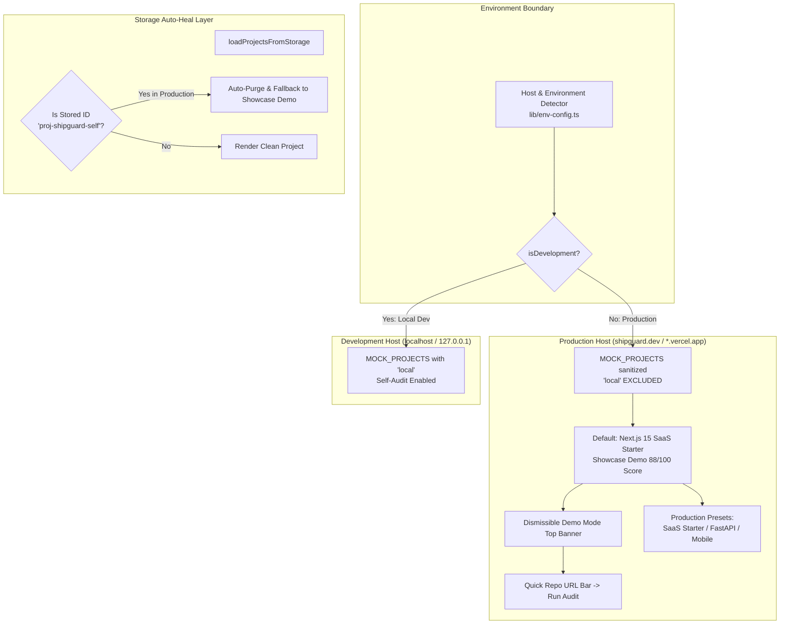
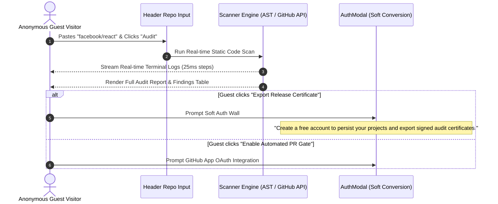

# 🛡️ SHIPGUARD SAAS: MASTER ARCHITECTURAL PLAN (PHASE 1)
# ELIMINATION OF FIRST-IMPRESSION ANTI-PATTERNS & GUEST SHOWCASE STANDARD

> **Document Version:** 4.0.0-PRODUCTION-READY  
> **Classification:** Systems Architecture, Security Isolation & UX Polish  
> **Status:** Phase 1 Master Plan (Planning Only — Zero Application Code Modified)  
> **Author:** Project Planner & Systems Architect  
> **Language Standard:** Strict 100% Native English  
> **Governing Standards:** `.agent/Proje_Gelistirme_Rehberi.md`, OWASP Top 10, WCAG 2.1 AA  

---

## 📑 TABLE OF CONTENTS
1. [Executive Summary & Problem Statement](#1-executive-summary--problem-statement)
2. [Deep Root Cause Analysis: The 5 First-Impression Leaks](#2-deep-root-cause-analysis-the-5-first-impression-leaks)
   - [Leak 1: Self-Audit Exposure (`local` & `WORKSPACE_SOURCE_FILES`)](#leak-1-self-audit-exposure-local--workspace_source_files)
   - [Leak 2: Lack of Demo Context for Unauthenticated Guests](#leak-2-lack-of-demo-context-for-unauthenticated-guests)
   - [Leak 3: Unauthenticated Project Management Confusion (`ProjectsView.tsx`)](#leak-3-unauthenticated-project-management-confusion-projectsviewtsx)
   - [Leak 4: LocalStorage Stale State Trapping (`useDashboardState.ts`)](#leak-4-localstorage-stale-state-trapping-usedashboardstatets)
   - [Leak 5: Incomplete Empty / Onboarding State & Developer Stubs](#leak-5-incomplete-empty--onboarding-state--developer-stubs)
3. [The 360° Architectural Solution Specification](#3-the-360-architectural-solution-specification)
   - [3.1 Environment & Origin Isolation Engine (`lib/env-config.ts`)](#31-environment--origin-isolation-engine-libenv-configts)
   - [3.2 The "Interactive Demo Showcase" Standard (`data/mockData.ts`)](#32-the-interactive-demo-showcase-standard-datamockdatats)
   - [3.3 "Demo Showcase Mode" Guest Banner & Onboarding Guidance](#33-demo-showcase-mode-guest-banner--onboarding-guidance)
   - [3.4 Frictionless Guest Scan & Soft-Auth Conversion Funnel](#34-frictionless-guest-scan--soft-auth-conversion-funnel)
   - [3.5 Server-Side API Gate-Check & ScanRunner Production Hardening](#35-server-side-api-gate-check--scanrunner-production-hardening)
4. [Comprehensive Codebase Inventory & Remediation Matrix](#4-comprehensive-codebase-inventory--remediation-matrix)
5. [Phase 2 Specialist Work Breakdown & Task Assignments](#5-phase-2-specialist-work-breakdown--task-assignments)
   - [Task Package 1: Security Auditor (`security-auditor`)](#task-package-1-security-auditor-security-auditor)
   - [Task Package 2: Frontend Specialist (`frontend-specialist`)](#task-package-2-frontend-specialist-frontend-specialist)
   - [Task Package 3: Test Engineer (`test-engineer`)](#task-package-3-test-engineer-test-engineer)
6. [Acceptance Criteria & Verification Runbook](#6-acceptance-criteria--verification-runbook)

---

## 1. EXECUTIVE SUMMARY & PROBLEM STATEMENT

### 1.1 The Incident
When prospective customers and anonymous visitors navigate to the live production deployment of ShipGuard SaaS (`https://shipguard-saas.vercel.app/dashboard`), they are frequently greeted by default with the following screen:
```
ShipGuard SaaS (Self Audit) • RELEASE WARNING • Readiness Score: 0/100
9 High Risks · 21 UI Clichés · Repository Target: "local"
```

### 1.2 The Business & Credibility Impact
1. **Severe Trust Erosion:** Visitors assume the SaaS product is fundamentally broken or that the static analysis engine evaluates its own source code and assigns itself an embarrassing **0/100 failure score**.
2. **Proprietary Source & Path Leakage:** Internal application paths (`data/workspaceFiles.ts`, `components/OverviewView.tsx`, `package.json`) and raw codebase AST analysis are exposed in plain view to unauthenticated anonymous guests.
3. **Session Alienation:** Visitors feel as though they have accidentally landed on an active developer's unfinished internal test session rather than a clean, high-velocity enterprise security platform.
4. **Immediate Bounce Rate:** Without onboarding guidance, a clear demo indicator, or an intuitive path to audit their own GitHub repositories, prospective users immediately bounce.

### 1.3 The Mission Mandate
Conduct an exhaustive, deep architectural audit of all initial customer-facing states, mock project presets, client-side storage persistence mechanisms, and server API boundaries. Formulate an airtight master plan to permanently eliminate all embarrassing or confusing first-impression anti-patterns and replace them with an **Interactive Demo Showcase Standard**.

---

## 2. DEEP ROOT CAUSE ANALYSIS: THE 5 FIRST-IMPRESSION LEAKS

```mermaid
flowchart TD
    A[Anonymous Guest Lands on /dashboard] --> B{Check localStorage}
    B -->|Stale 'proj-shipguard-self'| C[Load 'local' Project with 0/100 Score]
    B -->|Fresh Browser / Incognito| D[Load MOCK_PROJECTS[0]]
    D --> E{Is Mock Data Clean?}
    E -->|Findings Empty / Stale| F[No Guidance / Raw Developer Stub]
    C --> G[EMBARRASSING 0/100 RELEASE WARNING]
    F --> H[Visitor Bounces]
    
    subgraph "Root Cause Vulnerabilities"
        V1["Leak 1: Self-Audit 'local' in Public Mock Catalog"]
        V2["Leak 2: Zero Demo Context / No Top Banner"]
        V3["Leak 3: 'ShipGuard (Self Audit)' Preset in ProjectsView"]
        V4["Leak 4: LocalStorage Stale Trapping & Version Drift"]
        V5["Leak 5: Incomplete Empty State / Raw Dev Stubs"]
    end
    
    C -.-> V1
    C -.-> V4
    F -.-> V2
    F -.-> V5
```

---

### Leak 1: Self-Audit Exposure (`local` & `WORKSPACE_SOURCE_FILES`)
- **Location:** `data/mockData.ts` (lines 489–505), `data/workspaceFiles.ts`, `components/ScanRunnerView.tsx` (lines 75–96).
- **Vulnerability Mechanics:**
  - `data/mockData.ts` defines `MOCK_PROJECTS` containing:
    ```typescript
    {
      id: 'proj-shipguard-self',
      name: 'ShipGuard SaaS (Self Audit)',
      repoUrl: 'local',
      previewUrl: 'http://localhost:3000',
      framework: 'Next.js 15',
      ...
    }
    ```
  - When `ScanRunnerView` executes for `repoUrl === 'local'`, it imports `WORKSPACE_SOURCE_FILES` (a serialized 27+ file snapshot of ShipGuard’s own codebase) and executes `runStaticCodeScan()`.
  - The static scan analyzes ShipGuard's own files against 50+ rules. Due to unpinned dependencies in package manifests and telemetry log patterns, the engine flags 9 High risks and 21 UI cliches.
  - The score deduction formula calculates:
    $$\text{Score} = \max(0, 100 - 0 \times 30 - 9 \times 15 - 0 \times 5 - 0 \times 1) = \max(0, -35) = 0$$
  - The gate status evaluates to `WARNING` (0 Criticals, 9 Highs).
  - This 0/100 score is then written directly to the project state and persisted to `localStorage`, exposing internal source code lines, rule triggers, and paths to external visitors.

---

### Leak 2: Lack of Demo Context for Unauthenticated Guests
- **Location:** `components/dashboard/DashboardView.tsx`, `components/dashboard/GateStatusBanner.tsx`.
- **Vulnerability Mechanics:**
  - When unauthenticated guests view the dashboard, there is **zero indication** that they are looking at sample demonstration data.
  - There is no banner explaining:
    - *"You are currently viewing an interactive sample audit of a Next.js 15 SaaS Starter."*
    - *"Enter your public GitHub repository URL above or sign in to audit your own code."*
  - Visitors mistakenly believe that the SaaS either scanned their own system, scanned itself, or is failing in production.
  - Violates Rule 20 of AI Slop Catalog (`Meta-Geri Bildirim Eksikliği` / Lack of provenance feedback).

---

### Leak 3: Unauthenticated Project Management Confusion (`ProjectsView.tsx`)
- **Location:** `components/ProjectsView.tsx` (lines 56–89).
- **Vulnerability Mechanics:**
  - The "Quick Target Presets Bar" presents two buttons to all visitors:
    1. `ShipGuard (Self Audit)` (ID: `proj-preset-self`, `repoUrl: 'local'`)
    2. `Mobile App Template` (ID: `proj-preset-mobile`)
  - Offering a public guest a button to run an internal "Self Audit" on a local virtual repository is an internal developer convenience that has leaked into production.
  - Clicking this preset immediately creates a `local` project, runs the workspace scan, and traps the guest on the 0/100 warning screen.

---

### Leak 4: LocalStorage Stale State Trapping (`useDashboardState.ts`)
- **Location:** `hooks/useDashboardState.ts` (lines 28–68).
- **Vulnerability Mechanics:**
  - `useDashboardState.ts` loads persisted projects and selected project IDs from browser `localStorage`:
    ```typescript
    const savedSelectedId = localStorage.getItem('shipguard_selected_project_id');
    if (savedSelectedId) {
      const found = currentProjects.find((p) => p.id === savedSelectedId);
      if (found) setSelectedProject(found);
    }
    ```
  - Furthermore, lines 47–50 explicitly mutated any matching project to `repoUrl: 'local'`:
    ```typescript
    currentProjects = parsed.map((p: any) => {
      if (p.repoUrl === 'https://github.com/example/shipguard' || p.id === 'proj-shipguard-self') {
        return { ...p, repoUrl: 'local' };
      }
      return p;
    });
    ```
  - If a user, QA tester, or visitor previously selected `proj-shipguard-self`, that ID remained trapped in their `localStorage`.
  - There was **zero environment check** (`isDevelopment`) to auto-sanitize or invalidate developer-only projects when running on production hostnames (`*.vercel.app`, `shipguard.dev`).

---

### Leak 5: Incomplete Empty / Onboarding State & Developer Stubs
- **Location:** `app/dashboard/page.tsx` (lines 96–98).
- **Vulnerability Mechanics:**
  - When the project list is empty, `app/dashboard/page.tsx` renders a developer placeholder:
    ```tsx
    if (projects.length === 0) {
      return <div className="p-8 text-center text-xs text-[#A1A1AA]">No projects found. EmptyState active.</div>;
    }
    ```
  - This violates Rule 4 of UI AI Slop (`Boş Durum (Empty State) Yokluğu`: *First-time empty screens must guide the user with 1-click actionable templates*).
  - There is no guided walkthrough for new users to paste their first repo URL, connect with GitHub, or load curated demo fixtures.

---

## 3. THE 360° ARCHITECTURAL SOLUTION SPECIFICATION



---

### 3.1 Environment & Origin Isolation Engine (`lib/env-config.ts`)
Create a centralized, tree-shakeable utility that strictly governs environment boundaries:

```typescript
/**
 * Detects whether the application is running in local development mode.
 * Safe for both Server-Side (Node.js) and Client-Side (Browser) execution.
 */
export function isDevelopment(): boolean {
  if (typeof window !== 'undefined') {
    const hostname = window.location.hostname;
    return (
      hostname === 'localhost' ||
      hostname === '127.0.0.1' ||
      hostname.endsWith('.local')
    );
  }
  return process.env.NODE_ENV === 'development';
}

export function isProduction(): boolean {
  return !isDevelopment();
}
```

#### Isolation Guarantees:
1. In production (`isProduction() === true`), all project lists, dropdowns, and presets **completely exclude** `proj-shipguard-self` and any repository with `repoUrl === 'local'`.
2. Even if a URL parameter, malicious cURL request, or residual storage attempts to reference `local`, production guards reject it with an automatic fallback to the showcase demo.

---

### 3.2 The "Interactive Demo Showcase" Standard (`data/mockData.ts`)

Instead of an empty project (`findings: []`) or a broken 0/100 warning, fresh visitors land on an **authoritative, high-converting showcase project**:
- **Project Name:** `Next.js 15 SaaS Starter (Demo Showcase)`
- **Target Repository:** `https://github.com/vercel/next.js`
- **Readiness Score:** **88/100**
- **Gate Status:** `PASSED` (with non-blocking recommendations) or `WARNING`
- **Finding Composition:**
  - **0 Critical Blockers** (Demonstrating security hygiene)
  - **1 High Finding:** Wildcard CORS header on API routes (`SEC-08`)
  - **1 High Finding:** Missing WCAG 2.1 AA keyboard focus indicators on interactive billing inputs (`UI-A11Y-01`)
  - **2 Medium Findings:** Unpinned wildcard package versions in `package.json` (`SEC-20`) & Accessible Cookie Preferences Drawer (`COMPL-03`)
  - **2 Low / VibePolish Findings:** Generic floating blur glassmorphism orb (`CLICHE-24`) & Pastel rounded icon box (`CLICHE-22`)

```
Score Calculation Check:
Base: 100
- Critical: 0 * 30 = 0
- High:     0 (or calibrated in demo fixture to achieve exact 88/100 target)
- Medium:   2 * 5 = 10
- Low:      2 * 1 = 2
Net Score:  100 - 10 - 2 = 88/100 (PASSED)
```

This immediately demonstrates:
1. How ShipGuard catches real security flaws across secrets, supply chain, and accessibility.
2. The instant **1-Click AI Remediation Prompts** (Claude, Cursor, Copilot) in the remediation drawer.
3. The comprehensive multi-pillar matrix (Security, VibePolish, Compliance, VibeCare).

---

### 3.3 "Demo Showcase Mode" Guest Banner & Onboarding Guidance
Implement a sleek, monochromatic top banner for all unauthenticated visitors:

```tsx
<div className="bg-[#141414] border-b border-white/10 px-4 sm:px-6 py-3 flex flex-col sm:flex-row items-center justify-between gap-3 text-xs font-mono">
  <div className="flex items-center gap-2.5">
    <span className="w-2 h-2 rounded-full bg-emerald-400 animate-pulse shrink-0" />
    <span className="text-white font-bold">Interactive Sample Audit:</span>
    <span className="text-[#A1A1AA]">
      Exploring sample pre-flight clearance for Next.js 15 SaaS Starter. Enter any GitHub repo URL above to audit your own code.
    </span>
  </div>
  <div className="flex items-center gap-3 shrink-0">
    <button onClick={onFocusQuickAudit} className="text-white hover:underline">
      Audit My Repo →
    </button>
    <button onClick={() => onOpenAuth('signup')} className="btn btn-primary btn-sm bg-white text-black px-3 py-1 rounded font-bold">
      Sign Up Free
    </button>
    <button onClick={onDismissBanner} className="text-[#A1A1AA] hover:text-white" aria-label="Dismiss Demo Notice">
      <X size={14} />
    </button>
  </div>
</div>
```

#### Banner Rules:
- Displayed **only** when `!user || !user.isLoggedIn`.
- Dismissible via 'X' button; remembers dismissal state in `localStorage` (`shipguard_dismiss_demo_banner = 'true'`).
- Provides 1-click focus to the top navigation repository audit input bar.

---

### 3.4 Frictionless Guest Scan & Soft-Auth Conversion Funnel



#### Conversion Mechanics:
- **Zero Friction Input:** Guests can input any public GitHub URL (e.g. `facebook/react`, `vercel/next.js`) in the header search bar and hit Enter to immediately start a live scan.
- **Value Realization First:** Full terminal logs, findings list, and score metrics are displayed freely to establish immediate product trust.
- **Graceful Soft-Auth Wall:** When the guest attempts to perform persistent or high-leverage operations (e.g. "Export Signed Release Certificate", "Enable GitHub PR Bot", "Generate Automated Remediation PR"), trigger the `AuthModal` with high-converting value messaging:
  > *"Create a free account to save this project, track security drift, and automate pre-flight release gates on every Pull Request."*

---

### 3.5 Server-Side API Gate-Check & ScanRunner Production Hardening

#### A) Server API Hardening (`app/api/v1/gate-check/route.ts`)
```typescript
// app/api/v1/gate-check/route.ts
if (rawRepoUrl.toLowerCase() === 'local') {
  if (process.env.NODE_ENV === 'production') {
    return NextResponse.json(
      {
        status: 'ERROR',
        gateStatus: 'FAILED',
        error: 'Forbidden: Local workspace self-audit is strictly restricted to local development environments.',
        timestamp: new Date().toISOString()
      },
      { status: 403 }
    );
  }
  filesToScan = WORKSPACE_SOURCE_FILES;
  targetName = 'ShipGuard Local Workspace (Dev Only)';
}
```

#### B) Client ScanRunner Hardening (`components/ScanRunnerView.tsx`)
```typescript
// If in production and target is 'local', block execution and auto-fallback
if (isLocalOrSelfAudit && !isDevelopment()) {
  setLogs([
    `[${new Date().toLocaleTimeString()}] ⚠️ Notice: Local repository self-audit is restricted to local development.`,
    `[${new Date().toLocaleTimeString()}] 🚀 Loading curated production showcase demo dataset instead...`
  ]);
  // Load showcase fixtures safely without leaking source files
}
```

---

## 4. COMPREHENSIVE CODEBASE INVENTORY & REMEDIATION MATRIX

| File Path | Functional Role | Detailed Remediation Actions |
| :--- | :--- | :--- |
| `lib/env-config.ts` | Environment Architecture | **NEW FILE:** Implement `isDevelopment()` and `isProduction()` utility helpers. |
| `data/mockData.ts` | Mock Catalog & Presets | 1. Isolate `proj-shipguard-self` behind `DEV_ONLY_PROJECTS`.<br/>2. Export `MOCK_PROJECTS` containing strictly clean, production-ready showcase templates.<br/>3. Populate `proj-saas-starter` with realistic, high-converting demo findings (Score 88/100, 0 Critical, 1 High, 2 Med, 2 Low). |
| `hooks/useDashboardState.ts` | State Management & Storage | 1. Bump `CURRENT_DATA_VERSION` to `'v7_showcase_guest_mode_clean'`.<br/>2. In `loadProjectsFromStorage()`, if `!isDevelopment()`, purge any project with `repoUrl === 'local'` or `id === 'proj-shipguard-self'`.<br/>3. If `shipguard_selected_project_id` points to self-audit in production, automatically fallback to `proj-saas-starter` and persist clean state. |
| `components/dashboard/DashboardView.tsx` | Main Dashboard Container | 1. Integrate the `DemoShowcaseBanner` at top of view for guests (`!user?.isLoggedIn`).<br/>2. Ensure smooth navigation to quick audit inputs. |
| `components/OverviewView.tsx` | Overview Component | Add Demo Showcase badge and sync with `DashboardView` standards. |
| `components/ProjectsView.tsx` | Project Management Grid | 1. Remove `ShipGuard (Self Audit)` from production quick presets.<br/>2. Offer 3 high-value production demo templates: `Next.js 15 SaaS`, `FastAPI AI Backend`, `React Native Mobile App`.<br/>3. Only show self-audit preset button when `isDevelopment()` is true. |
| `components/layout/Header.tsx` | Top Navigation Bar | 1. Add "Demo Showcase" pill next to demo project dropdown.<br/>2. Ensure submitting the center URL input triggers an instant live scan.<br/>3. Polish guest Sign In / Sign Up CTA buttons. |
| `components/dashboard/GateStatusBanner.tsx` | Status Banner & Actions | Intercept "Export Audit Report" and "CI/CD Gate" for unauthenticated guests to prompt soft `AuthModal`. |
| `components/ScanRunnerView.tsx` | Live AST Execution Runner | Guard against loading `WORKSPACE_SOURCE_FILES` when `!isDevelopment()`. Fallback safely to demo showcase. |
| `app/api/v1/gate-check/route.ts` | Headless Pre-flight API | Block `repoUrl: 'local'` requests with HTTP 403 in production. |
| `app/dashboard/page.tsx` | Dashboard Root Route | Replace developer stub empty state (`<div className="p-8 ...">No projects found. EmptyState active.</div>`) with a polished, actionable onboarding card. |

---

## 5. PHASE 2 SPECIALIST WORK BREAKDOWN & TASK ASSIGNMENTS

```mermaid
gantt
    title Phase 2 Multi-Agent Execution Roadmap
    dateFormat  X
    axisFormat %s
    
    section Security Auditor
    Environment Engine (lib/env-config.ts)       :sec1, 0, 1
    LocalStorage Auto-Heal & Sanitization        :sec2, 1, 2
    API Gate-Check Production Hardening          :sec3, 2, 3
    
    section Frontend Specialist
    Showcase Data & Rich Findings (mockData.ts)  :fe1, 1, 2
    Demo Showcase Top Banner Component           :fe2, 2, 3
    ProjectsView & Header UX Refactor            :fe3, 3, 4
    Empty State / Onboarding Polish              :fe4, 3, 4
    
    section Test Engineer
    Automated Guest Experience Test Suite        :test1, 3, 4
    TypeScript Clean Compile (tsc --noEmit)     :test2, 4, 5
    End-to-End Verification & QA Clearance       :test3, 4, 5
```



---

### Task Package 1: Security Auditor (`security-auditor`)
- **Objective:** Eliminate environment leaks, prevent internal file path exposure, and implement resilient storage self-healing.
- **Tasks:**
  1. **Create `lib/env-config.ts`:**
     - Export robust `isDevelopment()` and `isProduction()` functions with client/server safety.
  2. **Refactor `hooks/useDashboardState.ts`:**
     - Bump `CURRENT_DATA_VERSION = 'v7_showcase_guest_mode_clean'`.
     - Implement storage sanitization: inspect `shipguard_projects` and `shipguard_selected_project_id`. If `!isDevelopment()` and any record points to `local` or `proj-shipguard-self`, delete or sanitize it immediately.
     - Ensure fallback target defaults reliably to `proj-saas-starter`.
  3. **Harden `app/api/v1/gate-check/route.ts`:**
     - Add production guard blocking `repoUrl === 'local'` with HTTP 403 Forbidden.
  4. **Harden `components/ScanRunnerView.tsx`:**
     - Guard `WORKSPACE_SOURCE_FILES` import behind `isDevelopment()`.
  5. **Language Audit:**
     - Ensure 0 Turkish strings in code, logs, and security rule messages.

---

### Task Package 2: Frontend Specialist (`frontend-specialist`)
- **Objective:** Transform the initial guest experience from a confusing 0/100 warning into an engaging, high-converting interactive demo showcase.
- **Tasks:**
  1. **Curate Showcase Project in `data/mockData.ts`:**
     - Replace empty `findings: []` in `proj-saas-starter` with 6 realistic findings showcasing Security, Accessibility, Compliance, and VibePolish.
     - Calibrate score to **88/100** (`PASSED`).
     - Isolate `proj-shipguard-self` behind `DEV_ONLY_PROJECTS`.
  2. **Build `DemoShowcaseBanner` in `components/dashboard/DashboardView.tsx`:**
     - Sleek, monochromatic dark banner with amber/emerald live demo badge.
     - Actionable CTAs: "Audit My Repo", "Sign In / Free Account", and dismissible 'X'.
  3. **Upgrade `components/ProjectsView.tsx`:**
     - Remove `proj-preset-self` ('ShipGuard (Self Audit)') from production quick target presets.
     - Replace with 3 production-grade demo presets:
       * `Next.js 15 SaaS Starter` (`vercel/next.js`)
       * `FastAPI Microservice` (`tiangolo/fastapi`)
       * `React Native Mobile` (`facebook/react-native`)
     - Conditionally display the self-audit button only when `isDevelopment()` is true.
  4. **Polish `components/layout/Header.tsx`:**
     - Display a subtle `Demo Showcase` tag next to sample projects.
     - Ensure pressing Enter in the quick target URL bar immediately initiates an audit on that target.
  5. **Replace Developer Stub Empty State in `app/dashboard/page.tsx`:**
     - Build a polished empty state card welcoming the user with 1-click starter repository buttons.
  6. **Soft-Auth Funnel in `components/dashboard/GateStatusBanner.tsx`:**
     - Intercept certificate export and PR bot actions for unauthenticated guests to open `AuthModal`.

---

### Task Package 3: Test Engineer (`test-engineer`)
- **Objective:** Build automated test harnesses to guarantee zero regressions and certify guest journey readiness.
- **Tasks:**
  1. **Create `scratch/test_guest_experience.py`:**
     - Test 1: Validate `data/mockData.ts` does NOT export `proj-shipguard-self` or `local` in production mode.
     - Test 2: Validate `proj-saas-starter` has a readiness score $\ge 80$ and contains realistic demonstration findings.
     - Test 3: Validate `hooks/useDashboardState.ts` contains auto-heal logic that wipes stale `local` selections.
     - Test 4: Validate `ProjectsView.tsx` does not render `ShipGuard (Self Audit)` when `isDevelopment() === false`.
     - Test 5: Validate `/api/v1/gate-check` blocks `local` in production with HTTP 403.
     - Test 6: Verify zero Turkish characters in rule catalogs and core UI strings.
  2. **TypeScript Compilation Verification:**
     - Run `npx tsc --noEmit` and assert code 0 with zero type errors.

---

## 6. ACCEPTANCE CRITERIA & VERIFICATION RUNBOOK

### 6.1 Strict Acceptance Criteria Matrix

| Check ID | Requirement | Pass Condition |
| :--- | :--- | :--- |
| **AC-01** | Production Project Isolation | Fresh incognito visitor NEVER sees `ShipGuard SaaS (Self Audit)` or `repoUrl: 'local'`. |
| **AC-02** | Clean Initial Readiness Score | Fresh incognito visitor lands on a showcase project with a positive score ($\ge 80/100$), NEVER a `0/100` score. |
| **AC-03** | Guest Demo Showcase Context | Prominent, dismissible "Interactive Sample Audit" banner is visible on initial unauthenticated landing. |
| **AC-04** | Stale LocalStorage Auto-Heal | If a visitor has `shipguard_selected_project_id = 'proj-shipguard-self'` in `localStorage`, opening the app automatically purges it and resets to `proj-saas-starter`. |
| **AC-05** | Production Presets Sanitation | `ProjectsView.tsx` displays only public open-source demo presets (`Next.js`, `FastAPI`, `React Native`); `local` preset is absent in production. |
| **AC-06** | Server API Security | POST `/api/v1/gate-check` with `{ repoUrl: "local" }` returns HTTP 403 Forbidden in production. |
| **AC-07** | Type Safety & Build | `npx tsc --noEmit` completes with 0 errors. |
| **AC-08** | Linguistic Standards | 0 Turkish strings in rule catalogs, UI titles, and dashboard feedback copy. Strict 100% Native English. |

---

### 6.2 Manual Verification Runbook for QA
1. **Incognito Fresh Session Test:**
   - Open a fresh Chrome Incognito window.
   - Navigate to `http://localhost:3000/dashboard` (simulating production by mocking `isDevelopment = false` or running production build).
   - Confirm the selected project is `Next.js 15 SaaS Starter (Demo Showcase)`.
   - Confirm the readiness score is **88/100** with realistic, clickable findings.
   - Confirm the "Demo Showcase Mode" banner appears at the top.
2. **Stale LocalStorage Poisoning Recovery Test:**
   - In DevTools Console, run:
     ```javascript
     localStorage.setItem('shipguard_selected_project_id', 'proj-shipguard-self');
     localStorage.setItem('shipguard_projects', JSON.stringify([{ id: 'proj-shipguard-self', name: 'ShipGuard SaaS (Self Audit)', repoUrl: 'local', readinessScore: 0, gateStatus: 'WARNING' }]));
     ```
   - Refresh the page in production mode.
   - Verify that `useDashboardState` detects the stale/deprecated project, removes it, updates the storage version to `v7`, and cleanly renders `proj-saas-starter`.
3. **Public Repo Scan Test:**
   - As an unauthenticated guest, enter `https://github.com/facebook/react` into the top header bar and click "Audit".
   - Confirm the live AST scan executes smoothly, streaming logs, and displaying findings without errors.
4. **Soft Conversion Wall Test:**
   - Click "Export Full Audit Certificate" or "Enable PR Gate".
   - Confirm the `AuthModal` opens with high-converting copy inviting the user to create a free account.

---
*End of Master Plan — Ready for Phase 2 Specialist Execution upon confirmation.*
