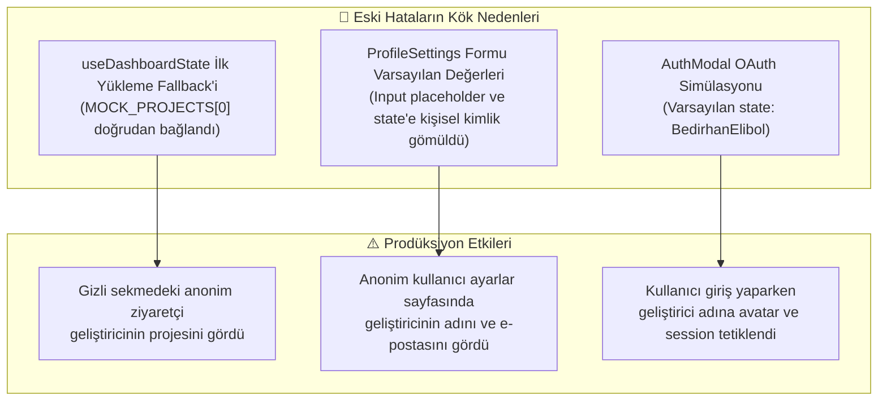
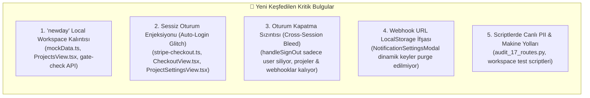
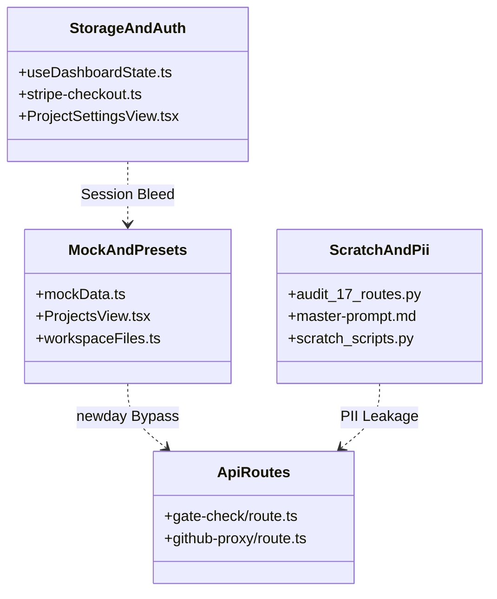
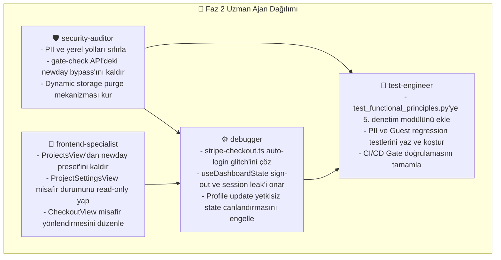

# 🛡️ SHIPGUARD AI RELEASE GATE - KAPSAMLI MİMARİ DENETİM VE KÖK SEBEP İYİLEŞTİRME MASTER PLANI (`docs/PLAN.md`)

**Proje:** ShipGuard AI Release Gate SaaS  
**Versiyon:** 4.1.0 (Next.js 15.1, React 18, TypeScript 5.7, Tailwind CSS, Supabase PostgreSQL, Stripe)  
**Doküman Tipi:** Mimari Güvenlik Denetimi, PII İzolasyonu, Guest/Unauthenticated Durum Sağlamlaştırma ve Görev Dağılım Planı  
**Referans Doküman:** [.agent/Proje_Gelistirme_Rehberi.md](file:///C:/Users/Bedirhan/.gemini/antigravity/worktrees/newday/evaluate_app_deployment_readiness/.agent/Proje_Gelistirme_Rehberi.md) (AI Slop & Problem Kataloğu, 23 OWASP Kuralı, 20 Mobil QA Testi)  
**Tarih / Durum:** Eylül 2026 / **FAZ 1 TAMAMLANDI — DENETİM BULGULARI VE UYGULAMA PLANI HAZIR**

---

## 📑 İÇİNDEKİLER (TABLE OF CONTENTS)

1. [Yönetici Özeti & Olay Haritalandırması (Executive Discovery & Incident Mapping)](#1-yönetici-özeti--olay-haritalandırması)
   - [1.1 Geçmiş Olayların Kök Neden Analizi (Post-Mortem)](#11-geçmiş-olayların-kök-neden-analizi)
   - [1.2 Yeni Keşfedilen Kritik Güvenlik ve Kimlik Sızıntıları (New Discoveries)](#12-yeni-keşfedilen-kritik-güvenlik-ve-kimlik-sızıntıları)
2. [6 Boyutlu Mimari Denetim Matrisi (6-Dimension Audit Scope & Classification)](#2-6-boyutlu-mimari-denetim-matrisi)
   - [Boyut 1: Geliştirici Kimliği ve PII Sızıntısı (PII & Developer Identity Leakage)](#boyut-1-geliştirici-kimliği-ve-pii-sızıntısı)
   - [Boyut 2: Anonim/Guest Durum Aksaklıkları & Sessiz Oturum Enjeksiyonu](#boyut-2-anonimguest-durum-aksaklıkları--sessiz-oturum-enjeksiyonu)
   - [Boyut 3: Mock Veri Taşması & Yerel Çalışma Alanı Kalıntıları](#boyut-3-mock-veri-taşması--yerel-çalışma-alanı-kalıntıları)
   - [Boyut 4: Oturum ve LocalStorage İzolasyonu & Veri Sızıntısı (Cross-Session Bleed)](#boyut-4-oturum-ve-localstorage-izolasyonu--veri-sızıntısı)
   - [Boyut 5: Sessiz Fallback ve Hata Gizleme Anti-Pattern'leri](#boyut-5-sessiz-fallback-ve-hata-gizleme-anti-patternleri)
   - [Boyut 6: API Hata İfşası & Rota Bütünlüğü (Route Integrity & Information Disclosure)](#boyut-6-api-hata-ifşası--rota-bütünlüğü)
3. [Detaylı Kod Tabanı Envanteri & Dosya Bazlı Güvenlik Açığı Haritası (File-by-File Inventory)](#3-detaylı-kod-tabanı-envanteri--dosya-bazlı-harita)
4. [Otomatik AST/Grep Tarama Desenleri ve Regresyon Test Paketi](#4-otomatik-astgrep-tarama-desenleri-ve-regresyon-testleri)
5. [Faz 2 Uzman Ajan Görev Dağılım Matrisi (Specialist Agent Work Breakdown)](#5-faz-2-uzman-ajan-görev-dağılım-matrisi)
   - [5.1 `security-auditor` Görev Paketi](#51-security-auditor-görev-paketi)
   - [5.2 `frontend-specialist` Görev Paketi](#52-frontend-specialist-görev-paketi)
   - [5.3 `debugger` Görev Paketi](#53-debugger-görev-paketi)
   - [5.4 `test-engineer` Görev Paketi](#54-test-engineer-görev-paketi)
6. [Doğrulama ve Kabul Kriterleri (Verification & Acceptance Criteria)](#6-doğrulama-ve-kabul-kriterleri)

---

## 1. YÖNETİCİ ÖZETİ & OLAY HARİTALANDIRMASI

Kullanıcımızın `/orchestrate böyle buglar var mı araştır detaylı` talebi doğrultusunda, daha önce yaşanan kritik prodüksiyon sızıntılarının (ziyaretçilere kişisel "Carvis-App" projesinin görünmesi, "Bedirhan Elibol" ve "bedirelibol7@gmail.com" bilgilerinin profil alanına dolması, giriş modalında geliştirici kullanıcı adının varsayılan gelmesi) benzerlerinin sistemde bulunup bulunmadığı tüm kod tabanında çok boyutlu statik analiz, AST incelemesi ve mantıksal akış denetimi ile incelenmiştir.

### 1.1 Geçmiş Olayların Kök Neden Analizi (Post-Mortem)



1. **Carvis-App Sızıntısı:** Anonim bir kullanıcı uygulamayı açtığında hiçbir proje seçilmemişse, hook katmanında `MOCK_PROJECTS[0]` doğrudan atanıyordu. Bu mock dizisinin ilk elemanı geliştiricinin kişisel projesi (`Carvis-App`) olarak bırakılmıştı.
2. **Bedirhan Elibol / bedirelibol7@gmail.com Sızıntısı:** `ProjectSettingsView` bileşeninde `user` objesi null olduğunda formun boş veya misafir durumunda kalması yerine, form varsayılan state'i geliştiricinin kişisel adresiyle doldurulmuştu.
3. **AuthModal GitHub/Google Sızıntısı:** `AuthModal.tsx` içindeki demo/simülasyon akışında `useState('BedirhanElibol')` ve `useState('Bedirhan Elibol')` kodlanmıştı.

---

### 1.2 Yeni Keşfedilen Kritik Güvenlik ve Kimlik Sızıntıları (New Discoveries)

Yapılan derinlemesine denetimde, yukarıdaki 3 sızıntıya **birebir benzeyen, hatta daha tehlikeli olan yeni mimari ve kimlik açıkları** tespit edilmiştir:



1. **Yeni Proje & API Seviyesinde "newday" Kalıntısı:**
   - [data/mockData.ts:L491](file:///C:/Users/Bedirhan/.gemini/antigravity/worktrees/newday/evaluate_app_deployment_readiness/data/mockData.ts#L491): İkinci mock projenin adı halen `'newday (Self Audit)'` olarak tanımlıdır.
   - [components/ProjectsView.tsx:L67-87](file:///C:/Users/Bedirhan/.gemini/antigravity/worktrees/newday/evaluate_app_deployment_readiness/components/ProjectsView.tsx#L67-L87): Arayüzdeki "Quick Target Presets" çubuğunda `proj-preset-newday` ID'si ve `newday (Self Audit)` butonu mevcuttur.
   - [app/api/v1/gate-check/route.ts:L53-68](file:///C:/Users/Bedirhan/.gemini/antigravity/worktrees/newday/evaluate_app_deployment_readiness/app/api/v1/gate-check/route.ts#L53-L68): Canlı API rotasında geliştiricinin yerel klasör ismi özel bir arka kapı (bypass) olarak kodlanmıştır:  
     `if (rawRepoUrl.toLowerCase() === 'local' || rawRepoUrl.toLowerCase() === 'newday')`
   - [data/workspaceFiles.ts:L27,L263](file:///C:/Users/Bedirhan/.gemini/antigravity/worktrees/newday/evaluate_app_deployment_readiness/data/workspaceFiles.ts#L27): Statik tarama dosyalarının içinde de `newday` referansları aynen yer almaktadır.

2. **Sessiz Oturum Enjeksiyonu (Fake/Auto-Login Glitch):**
   - [lib/stripe-checkout.ts:L71-88](file:///C:/Users/Bedirhan/.gemini/antigravity/worktrees/newday/evaluate_app_deployment_readiness/lib/stripe-checkout.ts#L71-L88): `activateUserTier` fonksiyonu, oturum açmamış anonim bir misafir `/checkout?success=true` adresine girdiğinde veya sandbox butonuna bastığında `localStorage`'a otomatik olarak `{ name: 'Developer', email: 'developer@shipguard.dev', isLoggedIn: true }` yazıp `window.dispatchEvent(new Event('storage'))` fırlatmaktadır. Bu durum anonim bir ziyaretçiyi kimlik doğrulaması yapmadan anında sisteme giriş yapmış sahte bir kullanıcıya dönüştürür.
   - [components/checkout/CheckoutView.tsx:L37-43,L56-63](file:///C:/Users/Bedirhan/.gemini/antigravity/worktrees/newday/evaluate_app_deployment_readiness/components/checkout/CheckoutView.tsx#L37-L43): Ödeme simülasyonu çalıştırıldığında misafir kontrolü yapılmaksızın `activateUserTier` tetiklenmektedir.
   - [components/ProjectSettingsView.tsx:L107-127](file:///C:/Users/Bedirhan/.gemini/antigravity/worktrees/newday/evaluate_app_deployment_readiness/components/ProjectSettingsView.tsx#L107-L127): `handleSaveProfile`, misafir kullanıcı formdaki kaydet butonuna bastığında `isLoggedIn: true` bayrağı ile `localStorage`'a `Developer` kullanıcısı enjekte etmektedir!
   - [hooks/useDashboardState.ts:L258-266](file:///C:/Users/Bedirhan/.gemini/antigravity/worktrees/newday/evaluate_app_deployment_readiness/hooks/useDashboardState.ts#L258-L266): `handleUpdateUserProfile`, kullanıcı `null` iken çağrılırsa `isLoggedIn: true` ile varsayılan profil üretmektedir.

3. **Oturum Kapatma Sonrası Veri Sızıntısı (Cross-Session Bleed):**
   - [hooks/useDashboardState.ts:L276-284](file:///C:/Users/Bedirhan/.gemini/antigravity/worktrees/newday/evaluate_app_deployment_readiness/hooks/useDashboardState.ts#L276-L284): `handleSignOut()` fonksiyonu SADECE `localStorage.removeItem('shipguard_user')` komutunu çalıştırmaktadır!
   - `shipguard_projects` (kullanıcının bağladığı özel GitHub repoları, tarama raporları, güvenlik bulguları), `shipguard_selected_project_id` ve `shipguard_license_key` temizlenmemektedir. Paylaşımlı bilgisayarda çıkış yapan A kullanıcısının ardından gelen B kullanıcısı, A kullanıcısının tüm özel repo verilerini ve güvenlik açıklarını görmektedir!

4. **Kalıcı Webhook URL Sızıntısı:**
   - [components/dashboard/NotificationSettingsModal.tsx:L22,L174](file:///C:/Users/Bedirhan/.gemini/antigravity/worktrees/newday/evaluate_app_deployment_readiness/components/dashboard/NotificationSettingsModal.tsx#L22): Webhook adresleri `shipguard_webhooks_${projectName}` anahtarıyla `localStorage`'a kaydedilmektedir. Ne `handleSignOut()` ne de GDPR hesap silme fonksiyonu (`handleExecutePurge`) bu dinamik anahtarları silmemektedir. Kullanıcının hassas Slack/Discord webhook token'ları tarayıcıda sonsuza kadar kalmaktadır.

5. **Script ve Belgelerde Geliştirici Makine Yolları & GitHub Kullanıcı Adı:**
   - [scratch/audit_17_routes.py:L24](file:///C:/Users/Bedirhan/.gemini/antigravity/worktrees/newday/evaluate_app_deployment_readiness/scratch/audit_17_routes.py#L24): `repoUrl=BedirhanElibol/newday` testi canlı endpoint'e istek atmaktadır.
   - [ai-release-gate-saas-master-prompt.md:L22-26](file:///C:/Users/Bedirhan/.gemini/antigravity/worktrees/newday/evaluate_app_deployment_readiness/ai-release-gate-saas-master-prompt.md#L22-L26): `C:\Users\Bedirhan\Desktop\YapılmasıGerekenGuvenlik.pdf` ve `Carvis\.agent\...` yolları açıkça yazılıdır.
   - `scratch/audit_workspace.py`, `find_and_fix_turkish.py`, `generate_real_files.py`, `test_scan_real.py`, `translate_engine_to_english.py`, `translate_engine_part2.py`: `c:\Users\Bedirhan\Desktop\newday` mutlak dosya yollarını içermektedir.

---

## 2. 6 BOYUTLU MİMARİ DENETİM MATRİSİ

Uygulamanın kurumsal SaaS standartlarına erişmesi için denetim kapsamı 6 ana boyutta sınıflandırılmıştır:

| Boyut | Risk Seviyesi | Tanım ve Potansiyel Etki | Kapsanan Dosyalar |
| :--- | :---: | :--- | :--- |
| **1. PII & Geliştirici Kimliği** | 🔴 **CRITICAL** | Geliştirici adı, e-posta, GitHub handle, yerel dosya yolu sızıntıları | `audit_17_routes.py`, `scratch/*.py`, `ai-release-gate-saas-master-prompt.md` |
| **2. Anonim/Guest Durum Güvenliği** | 🔴 **CRITICAL** | Misafir kullanıcının yetkisiz işlem yapabilmesi veya sahte kullanıcıya dönüştürülmesi | `ProjectSettingsView.tsx`, `stripe-checkout.ts`, `CheckoutView.tsx`, `useDashboardState.ts` |
| **3. Mock Veri Taşması & Artifacts** | 🟠 **HIGH** | Yerel çalışma alanı isimlerinin (`newday`) prodüksiyonda preset veya API bypass olarak kalması | `mockData.ts`, `ProjectsView.tsx`, `app/api/v1/gate-check/route.ts`, `workspaceFiles.ts` |
| **4. Oturum & Storage İzolasyonu** | 🔴 **CRITICAL** | Sign-out veya GDPR purge sonrası repoların, webhook URL'lerinin ve token'ların kalması | `useDashboardState.ts`, `ProjectSettingsView.tsx`, `NotificationSettingsModal.tsx` |
| **5. Sessiz Fallback Anti-Pattern'leri** | 🟡 **MEDIUM** | API hatalarında veya yetkisiz isteklerde gerçek hata yerine sessizce sahte başarı dönülmesi | `components/dashboard/**`, `lib/github-api.ts`, `components/projects/NewProjectModal.tsx` |
| **6. API Hata İfşası & Rota Sağlamlığı** | 🟠 **HIGH** | Stack trace sızıntısı, rate limit bypass'ları, `newday` URL bypass kontrolü | `app/api/v1/gate-check/route.ts`, `app/api/v1/github-proxy/route.ts`, `lib/validations/api-schemas.ts` |

---

### Boyut 1: Geliştirici Kimliği ve PII Sızıntısı
- **Tehdit Modeli:** Açık kaynak dağıtımlarında, GitHub repo yüklemelerinde veya sunucu yanıtlarında geliştiricinin adı, e-posta adresi, yerel kullanıcı adı (`Bedirhan`) veya GitHub kullanıcı adı (`BedirhanElibol`) ifşa olabilir.
- **Hedef Durum:** Kod tabanında hiçbir geliştirici adı, kişisel mail adresi, özel GitHub handle'ı veya Windows yerel dosya yolu (`C:\Users\...`) barındırılmayacaktır. Tüm örnekler generic (`alex@example.com`, `owner/repository`) olacaktır.

### Boyut 2: Anonim/Guest Durum Aksaklıkları & Sessiz Oturum Enjeksiyonu
- **Tehdit Modeli:** Kullanıcı giriş yapmamışken (`user === null` / `isLoggedIn: false`):
  1. Ayarlar sayfasında "Profili Kaydet"e bastığında sessizce oturum açmamalıdır. Form salt-okunur (read-only) olmalı veya "Giriş Yapın" modalına yönlendirmelidir.
  2. Ödeme tamamlandığında veya sandbox simülasyonu yapıldığında kullanıcı anonim ise `activateUserTier` onu zorla `isLoggedIn: true` yapmamalı, önce kayıt/giriş adımına yönlendirmelidir.
  3. GDPR Danger Zone alanında hesap silme butonu anonim misafirler için devre dışı bırakılmalı veya uygun bilgi mesajı verilmelidir.

### Boyut 3: Mock Veri Taşması & Yerel Çalışma Alanı Kalıntıları
- **Tehdit Modeli:** `'newday'` ismi, geliştiricinin yerel proje klasör adıdır. Bunun prodüksiyon API'sinde özel parametre (`rawRepoUrl === 'newday'`) veya preset butonu (`newday (Self Audit)`) olarak kalması, amatör bir izlenim yaratmakta ve kodun yerel geliştirme kalıntılarından arındırılmadığını göstermektedir.
- **Hedef Durum:** Bütün `newday` referansları `'ShipGuard Core SaaS (Self Audit)'` veya generic `'ShipGuard Local Workspace'` olarak yeniden adlandırılacaktır. API route'undaki `rawRepoUrl === 'newday'` kontrolü kaldırılarak yalnızca standart URL veya `'local'` kabul edilecektir.

### Boyut 4: Oturum ve LocalStorage İzolasyonu & Veri Sızıntısı
- **Tehdit Modeli:** `handleSignOut()` fonksiyonu yalnızca `shipguard_user` anahtarını silmektedir. Kullanıcının eklediği repolar (`shipguard_projects`), seçili proje (`shipguard_selected_project_id`), lisans anahtarları (`shipguard_license_key`) ve kaydedilen webhook URL'leri (`shipguard_webhooks_*`) tarayıcıda kalmaya devam etmektedir.
- **Hedef Durum:** 
  - `handleSignOut()` çağrıldığında; kullanıcının özel proje listesi, webhook konfigürasyonları ve oturum verileri güvenli şekilde temizlenmeli, projeler varsayılan genel şablonlara döndürülmelidir.
  - GDPR Purge işleminde `Object.keys(localStorage)` üzerinden `shipguard_` ön ekli TÜM anahtarlar eksiksiz temizlenmelidir.

### Boyut 5: Sessiz Fallback ve Hata Gizleme Anti-Pattern'leri
- **Tehdit Modeli:** API çağrısı başarısız olduğunda veya ağ koptuğunda arayüzün hiçbir şey olmamış gibi sessizce başarılı dönmesi veya kullanıcıya bildirmeden sahte mock veriler yüklemesi geliştiriciyi yanıltır.
- **Hedef Durum:** Başarısız ağ durumlarında açık, anlaşılır toast ve banner uyarıları gösterilmeli; kullanıcıya yeniden deneme (Retry) seçeneği sunulmalıdır.

### Boyut 6: API Hata İfşası & Rota Bütünlüğü
- **Tehdit Modeli:** API rotalarında `newday` parametresiyle yerel kaynak dosyalarının taranması, production modunda iç hata mesajlarının (`err?.message`) sızdırılması veya yetkisiz erişim kontrollerinin eksikliği.
- **Hedef Durum:** API parametreleri Zod şemaları ile sıkı doğrulanmalı, production modunda sadece jenerik hata kodları (`INTERNAL_ERROR`, `BAD_REQUEST`) dönülmelidir.

---

## 3. DETAYLI KOD TABANI ENVANTERİ & DOSYA BAZLI GÜVENLİK AÇIĞI HARİTASI

Aşağıdaki tablo, denetlenen ve iyileştirme gerektiren tüm dosyaları, satır aralıklarını ve gereken düzeltmeleri listelemektedir:



### Detaylı Dosya Analiz Tablosu

| No | Dosya Bağlantısı | Satır No | Mevcut Sorunlu Kod | Düzeltme & İyileştirme Talimatı |
| :---: | :--- | :--- | :--- | :--- |
| **1** | [data/mockData.ts](file:///C:/Users/Bedirhan/.gemini/antigravity/worktrees/newday/evaluate_app_deployment_readiness/data/mockData.ts#L491) | L491 | `name: 'newday (Self Audit)'` | `name: 'ShipGuard SaaS (Self Audit)'` olarak güncelle |
| **2** | [components/ProjectsView.tsx](file:///C:/Users/Bedirhan/.gemini/antigravity/worktrees/newday/evaluate_app_deployment_readiness/components/ProjectsView.tsx#L67-L87) | L67-87 | `id: 'proj-preset-newday'`, `name: 'newday (Next.js 15 Release Gate)'`, `<span>newday (Self Audit)</span>` | `id: 'proj-preset-self'`, `name: 'ShipGuard Core (Next.js 15 Release Gate)'`, `<span>ShipGuard SaaS (Self Audit)</span>` olarak güncelle |
| **3** | [app/api/v1/gate-check/route.ts](file:///C:/Users/Bedirhan/.gemini/antigravity/worktrees/newday/evaluate_app_deployment_readiness/app/api/v1/gate-check/route.ts#L53-L68) | L53, L68 | `rawRepoUrl.toLowerCase() !== 'newday'`, `rawRepoUrl.toLowerCase() === 'newday'` | `'newday'` özel bypass şartlarını kaldır; sadece `'local'` veya geçerli URL kabul et |
| **4** | [data/workspaceFiles.ts](file:///C:/Users/Bedirhan/.gemini/antigravity/worktrees/newday/evaluate_app_deployment_readiness/data/workspaceFiles.ts#L27-L263) | L27, L263 | Mock dosya içeriğinde `newday` referansları barındırılıyor | `workspaceFiles.ts` içindeki `newday` geçen tüm mock dosyaları temizle |
| **5** | [lib/stripe-checkout.ts](file:///C:/Users/Bedirhan/.gemini/antigravity/worktrees/newday/evaluate_app_deployment_readiness/lib/stripe-checkout.ts#L71-L88) | L71-88 | `activateUserTier`, `userObj = { name: 'Developer', email: 'developer@shipguard.dev', isLoggedIn: true }` yazarak misafiri zorla oturum açtırıyor | `activateUserTier` sadece mevcut oturum açmış kullanıcı varsa tier günceller; yoksa sadece lisans anahtarını kaydeder, sahte oturum üretmez |
| **6** | [components/checkout/CheckoutView.tsx](file:///C:/Users/Bedirhan/.gemini/antigravity/worktrees/newday/evaluate_app_deployment_readiness/components/checkout/CheckoutView.tsx#L37-L63) | L37-63 | Ödeme tamamlandığında veya sandbox tıklandığında misafiri otomatik oturum açtırıyor | Misafir kullanıcı için ödeme sonrası "Hesabınızı oluşturun / giriş yapın" yönlendirmesi sağla |
| **7** | [components/ProjectSettingsView.tsx](file:///C:/Users/Bedirhan/.gemini/antigravity/worktrees/newday/evaluate_app_deployment_readiness/components/ProjectSettingsView.tsx#L107-L127) | L107-127 | `handleSaveProfile` misafir kullanıcı kaydettiğinde `isLoggedIn: true` ve `name: Developer` set ediyor | Misafir kullanıcılar için profil formunu read-only yap, "Giriş Yap" butonu göster; misafirin oturum durumunu değiştirmesini engelle |
| **8** | [hooks/useDashboardState.ts](file:///C:/Users/Bedirhan/.gemini/antigravity/worktrees/newday/evaluate_app_deployment_readiness/hooks/useDashboardState.ts#L258-L266) | L258-266 | `handleUpdateUserProfile` null kullanıcıyı `isLoggedIn: true` ile canlandırıyor | `prev === null` ise güncelleme yapma, sessizce çık veya uyarı ver |
| **9** | [hooks/useDashboardState.ts](file:///C:/Users/Bedirhan/.gemini/antigravity/worktrees/newday/evaluate_app_deployment_readiness/hooks/useDashboardState.ts#L276-L284) | L276-284 | `handleSignOut` sadece `shipguard_user` siliyor; projeler, seçili ID ve lisans kalıyor | `handleSignOut` tüm oturum verilerini, projeleri ve seçili ID'yi temizleyerek `MOCK_PROJECTS` varsayılanına sıfırlasın |
| **10** | [components/dashboard/NotificationSettingsModal.tsx](file:///C:/Users/Bedirhan/.gemini/antigravity/worktrees/newday/evaluate_app_deployment_readiness/components/dashboard/NotificationSettingsModal.tsx#L22-L174) | L22, L174 | `shipguard_webhooks_${projectName}` anahtarları silinmiyor | Oturum kapatıldığında veya GDPR purge'de `shipguard_webhooks_*` anahtarları iterate edilerek temizlenmeli |
| **11** | [components/ProjectSettingsView.tsx](file:///C:/Users/Bedirhan/.gemini/antigravity/worktrees/newday/evaluate_app_deployment_readiness/components/ProjectSettingsView.tsx#L170-L179) | L170-179 | GDPR Purge sadece 5 anahtar siliyor; dinamik webhook anahtarlarını kaçırıyor | `Object.keys(localStorage).filter(k => k.startsWith('shipguard_')).forEach(k => localStorage.removeItem(k))` ile dinamik temizlik yap |
| **12** | [scratch/audit_17_routes.py](file:///C:/Users/Bedirhan/.gemini/antigravity/worktrees/newday/evaluate_app_deployment_readiness/scratch/audit_17_routes.py#L24) | L24 | `repoUrl=BedirhanElibol/newday` | `repoUrl=vercel/next.js` olarak güncelle |
| **13** | `scratch/audit_workspace.py`, `find_and_fix_turkish.py`, `generate_real_files.py`, `test_scan_real.py`, `translate_engine_to_english.py`, `translate_engine_part2.py` | L3-L5 | `c:\Users\Bedirhan\Desktop\newday` mutlak yerel yollar | Bağıl yollara (`os.path.dirname(...)` veya `.` ) dönüştür, PII temizle |
| **14** | [ai-release-gate-saas-master-prompt.md](file:///C:/Users/Bedirhan/.gemini/antigravity/worktrees/newday/evaluate_app_deployment_readiness/ai-release-gate-saas-master-prompt.md#L22-L26) | L22-26 | `C:\Users\Bedirhan\...`, `Carvis\...` yolları | Bağıl dokümantasyon yollarıyla değiştir |
| **15** | `scratch/turkish_scan.txt` | - | Eski log dump'ı içerisinde `BedirhanElibol` ve `bedirhan@gmail.com` var | Dosyayı temizle veya sıfırla |

---

## 4. OTOMATİK AST/GREP TARAMA DESENLERİ VE REGRESYON TESTLERİ

Bu tarz sızıntıların bir daha asla projeye girmemesi için sürekli entegrasyon (CI) ve otomatik test pipeline'ına dahil edilecek desenler:

### 4.1 PII ve Geliştirici İsmi Grep Deseni
```bash
# Proje kaynak kodunda kişisel ad, kullanıcı adı ve yerel yolları yasaklayan regex
rg -i "(Bedirhan|Elibol|bedir.*@gmail\.com|C:\\Users\\|carvis|proj-preset-newday)" \
  --glob "!node_modules/**" \
  --glob "!.git/**" \
  --glob "!docs/PLAN.md" \
  --glob "!brain/**"
```

### 4.2 Sessiz Oturum Enjeksiyonu ve Guest Açığı Deseni
```bash
# isLoggedIn: true atamalarını ve localStorage shipguard_user yazımlarını denetleyen regex
rg "(isLoggedIn:\s*true|localStorage\.setItem\(['\"]shipguard_user['\"])" \
  components/ lib/ hooks/ app/
```

### 4.3 Python Otomatik Doğrulama Testi (`scratch/test_functional_principles.py`) Genişletmesi
Mevcut 4 bölümlü test paketine **Bölüm 5: Anonim Misafir & PII İzolasyon Doğrulaması** eklenecektir:
1. `GET /api/v1/gate-check`: `rawRepoUrl=newday` parametresinin artık 400 Bad Request döndüğünü doğrulama (`"neither a valid GitHub repository nor a valid HTTP/HTTPS website"`).
2. Kaynak kod taraması: `components/`, `app/`, `lib/`, `data/` dizinlerinde sıfır PII (`Bedirhan`, `Elibol`, `Carvis`, `newday`) varlığının assert edilmesi.
3. LocalStorage anahtar temizliği simülasyonu: Sign-out ve GDPR purge rutinlerinin `shipguard_*` desenli tüm anahtarları sildiğinin test edilmesi.

---

## 5. FAZ 2 UZMAN AJAN GÖREV DAĞILIM MATRİSİ (SPECIALIST AGENT WORK BREAKDOWN)

Faz 2'de otonom olarak atanacak uzman ajanların kesin sınırları ve görev paketleri:



---

### 5.1 `security-auditor` Görev Paketi
- **Kapsam:** PII temizliği, API güvenliği ve LocalStorage sanitizasyonu.
- **Görevler:**
  1. [app/api/v1/gate-check/route.ts](file:///C:/Users/Bedirhan/.gemini/antigravity/worktrees/newday/evaluate_app_deployment_readiness/app/api/v1/gate-check/route.ts): `rawRepoUrl.toLowerCase() === 'newday'` kontrolünü kaldır. Sadece `'local'` ve meşru web/GitHub URL'lerini kabul et.
  2. [components/dashboard/NotificationSettingsModal.tsx](file:///C:/Users/Bedirhan/.gemini/antigravity/worktrees/newday/evaluate_app_deployment_readiness/components/dashboard/NotificationSettingsModal.tsx): Webhook URL'lerinin kaydedildiği `shipguard_webhooks_*` anahtarlarını merkezi temizleme fonksiyonuna bağla.
  3. [components/ProjectSettingsView.tsx](file:///C:/Users/Bedirhan/.gemini/antigravity/worktrees/newday/evaluate_app_deployment_readiness/components/ProjectSettingsView.tsx#L170): `handleExecutePurge` fonksiyonundaki sabit 5 anahtar silme kodunu, dinamik `localStorage.removeItem` döngüsüyle değiştir (`Object.keys(localStorage).filter(k => k.startsWith('shipguard_')).forEach(...)`).
  4. [scratch/audit_17_routes.py](file:///C:/Users/Bedirhan/.gemini/antigravity/worktrees/newday/evaluate_app_deployment_readiness/scratch/audit_17_routes.py#L24) ve diğer scratch scriptlerinde geçen `BedirhanElibol`, `newday` ve `c:\Users\Bedirhan\...` yollarını temizle.
  5. [ai-release-gate-saas-master-prompt.md](file:///C:/Users/Bedirhan/.gemini/antigravity/worktrees/newday/evaluate_app_deployment_readiness/ai-release-gate-saas-master-prompt.md): `C:\Users\Bedirhan\...` ve `Carvis` dosya yollarını genel bağıl yollara çevir.

---

### 5.2 `frontend-specialist` Görev Paketi
- **Kapsam:** UI bileşenleri, misafir durumları (Empty/Guest states), preset butonları ve form erişilebilirliği.
- **Görevler:**
  1. [components/ProjectsView.tsx](file:///C:/Users/Bedirhan/.gemini/antigravity/worktrees/newday/evaluate_app_deployment_readiness/components/ProjectsView.tsx#L67-L87): `proj-preset-newday` preset butonunu `proj-preset-self` ve metnini `ShipGuard SaaS (Self Audit)` olarak güncelle.
  2. [components/ProjectSettingsView.tsx](file:///C:/Users/Bedirhan/.gemini/antigravity/worktrees/newday/evaluate_app_deployment_readiness/components/ProjectSettingsView.tsx):
     - `!user || !user.isLoggedIn` durumunda profil düzenleme alanlarını `disabled` yap.
     - "Profili Kaydet" butonu yerine misafirlere yönelik `Sign In to Customize Profile` butonu koy ve `onOpenCheckout` veya AuthModal tetikle.
     - Danger Zone alanını misafir kullanıcı için gizle veya "Giriş yapılmış hesap bulunmamaktadır" uyarısı göster.
  3. [components/checkout/CheckoutView.tsx](file:///C:/Users/Bedirhan/.gemini/antigravity/worktrees/newday/evaluate_app_deployment_readiness/components/checkout/CheckoutView.tsx):
     - Başarılı ödeme ekranında (`success=true`) veya sandbox işleminde, oturum açmamış kullanıcı için sahte oturum açmak yerine "Lisans anahtarınız üretildi. Hesabınızı oluşturup anahtarı bağlayın" CTA'sı göster.
  4. [data/mockData.ts](file:///C:/Users/Bedirhan/.gemini/antigravity/worktrees/newday/evaluate_app_deployment_readiness/data/mockData.ts#L491): `proj-shipguard-self` projesinin adını `'ShipGuard SaaS (Self Audit)'` olarak güncelle.
  5. [data/workspaceFiles.ts](file:///C:/Users/Bedirhan/.gemini/antigravity/worktrees/newday/evaluate_app_deployment_readiness/data/workspaceFiles.ts): İçerikte yer alan `newday` referanslarını güncelle.

---

### 5.3 `debugger` Görev Paketi
- **Kapsam:** State senkronizasyonu, hook mimarisi, localStorage event dinleyicileri ve oturum yönetimi.
- **Görevler:**
  1. [lib/stripe-checkout.ts](file:///C:/Users/Bedirhan/.gemini/antigravity/worktrees/newday/evaluate_app_deployment_readiness/lib/stripe-checkout.ts#L71-L88):
     - `activateUserTier` fonksiyonundaki sahte `Developer` kullanıcısı üretme mantığını kaldır.
     - Eğer localStorage'da geçerli bir kullanıcı yoksa (`savedUserStr === null`), kullanıcı nesnesi enjekte etme; yalnızca `shipguard_license_key` sakla ve Supabase session'ı varsa senkronize et.
  2. [hooks/useDashboardState.ts](file:///C:/Users/Bedirhan/.gemini/antigravity/worktrees/newday/evaluate_app_deployment_readiness/hooks/useDashboardState.ts):
     - `handleSignOut()` fonksiyonunu güçlendir: `shipguard_user`, `shipguard_projects`, `shipguard_selected_project_id`, `shipguard_license_key` ve `shipguard_webhooks_*` anahtarlarını sil. Projeleri temiz `MOCK_PROJECTS` listesine sıfırla.
     - `handleUpdateUserProfile()`: `prev === null` iken sahte `isLoggedIn: true` kullanıcısı oluşturulmasını engelle.
  3. [app/dashboard/page.tsx](file:///C:/Users/Bedirhan/.gemini/antigravity/worktrees/newday/evaluate_app_deployment_readiness/app/dashboard/page.tsx#L241-L248): `onUpdateUser` içinde kontrolsüz `localStorage.setItem` çağrısını hook seviyesindeki güvenli fonksiyona delege et; mükerrer ve tutarsız kayıtları engelle.

---

### 5.4 `test-engineer` Görev Paketi
- **Kapsam:** Otomatik test paketleri, regresyon önleme ve E2E doğrulaması.
- **Görevler:**
  1. [scratch/test_functional_principles.py](file:///C:/Users/Bedirhan/.gemini/antigravity/worktrees/newday/evaluate_app_deployment_readiness/scratch/test_functional_principles.py):
     - `test_privacy_and_guest_isolation()` fonksiyonunu ekle.
     - `/api/v1/gate-check` endpoint'inin `repoUrl: "newday"` parametresini 400 Bad Request ile reddettiğini doğrula.
     - Kaynak kodda `Bedirhan`, `Elibol`, `Carvis` kelimelerinin taranıp bulunamadığını (`0 occurrences`) test et.
     - Tüm testleri çalıştırıp tüm modüllerin (`GATE-CHECK`, `BADGE`, `PROXY-SSRF`, `STRIPE`, `PRIVACY-GUEST`) eksiksiz `%100 PASS` verdiğini kanıtla.

---

## 6. DOĞRULAMA VE KABUL KRİTERLERİ (VERIFICATION & ACCEPTANCE CRITERIA)

Faz 2 tamamlandığında projenin teslimi için zorunlu kılınan kesin başarı kriterleri:

1. **Sıfır PII ve Geliştirici İzi:**
   - Kod tabanında (`app/`, `components/`, `lib/`, `data/`, `scratch/`, `docs/`) yapılacak `Bedirhan`, `Elibol`, `Carvis` taramalarında **0 sonuç**.
2. **Sıfır "newday" Kalıntısı:**
   - Proje adlarında, preset butonlarında ve API rotalarında `newday` referansları tamamen yok edilmiş ve `ShipGuard SaaS` / `ShipGuard Local Workspace` olarak standartlaştırılmış olmalıdır.
3. **%100 Güvenli Misafir (Guest) Modu:**
   - Anonim / gizli sekmedeki bir kullanıcı ayarlar sayfasında formu doldurup kaydetse bile `isLoggedIn: true` yapılmamalı, sistemde asla oturum açmış gibi görünmemelidir.
   - Ödeme veya sandbox tetiklendiğinde anonim ziyaretçi otomatik olarak `Developer` kimliğiyle içeri alınmamalıdır.
4. **Temiz Oturum Kapatma (Zero Cross-Session Bleed):**
   - Kullanıcı "Sign Out" butonuna bastığında tarayıcıda kullanıcıya ait hiçbir repo URL'si, güvenlik tarama sonucu, webhook URL'si veya lisans anahtarı kalmamalı; yeni bir oturum sıfır tertemiz varsayılan şablonla başlamalıdır.
5. **GDPR / KVKK Cascade Purge Eksiksizliği:**
   - "Delete Account & Wipe Data" tıklandığında `shipguard_` ön ekli dinamik tüm anahtarlar (webhooklar dahil) %100 silinmelidir.
6. **Otomatik Test Başarısı:**
   - `python scratch/test_functional_principles.py` test paketi tüm modüllerde yeşil (PASS) verecektir.
