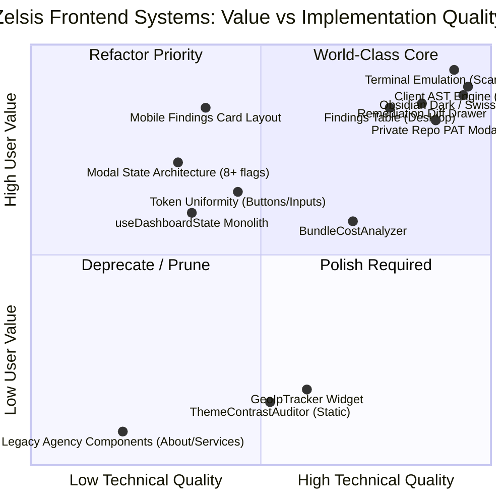
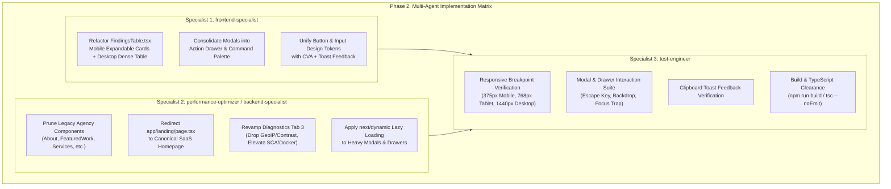

# Master Plan (v27.0.0)
## Senior Frontend Architecture, UI/UX Systems & High-Conversion DX Audit

**Product:** Zelsis — Universal Pre-Deployment Release Gate & Code Health Scanner  
**Live Application URL:** https://shipguard-saas.vercel.app  
**Version:** 27.0.0 (Senior Frontend Architecture, UI/UX Systems & High-Conversion DX Audit)  
**Standard Reference:** `.agent/Proje_Gelistirme_Rehberi.md` (Master Quality, OWASP Security & Anti-Slop Catalog)  
**Planning Mode:** Phase 1 (Planning Only — Zero Application Code Modified)  
**Author:** Principal Frontend Architect & Systems Planner  

---

## 1. Executive Frontend Audit: The Honest Scorecard

### 1.1 Overall Platform Frontend Health Rating: 8.2 / 10.0
Zelsis possesses an elite visual baseline: an unapologetic **Obsidian Dark & Swiss Minimalist** design language (`#0A0A0A` background, 1px subtle borders `border-white/10`, crisp typography with Satoshi and SF Mono/Fira Code), an instant client-side AST inspection engine, and an authentic terminal emulator.

However, beneath this aesthetic polish lies noticeable architectural friction:
1. **Modal Hell & State Explosion:** `DashboardView.tsx` manages 8+ independent boolean states mounted simultaneously, creating high cognitive load and prop-drilling spaghetti.
2. **Legacy Agency Zombie Components:** Residual portfolio files (`About.tsx`, `FeaturedWork.tsx`, `Services.tsx`, `Insights.tsx`, `TrustedBrands.tsx`, `Contact.tsx`) linger from earlier template iterations, cluttering the bundle and confusing codebase navigation.
3. **Mobile Responsiveness Deficits:** The primary `FindingsTable.tsx` is desktop-centric; mobile viewports suffer from cramped cards, missing quick-actions, and vertical scroll fatigue in `KpiCards.tsx`.
4. **Diagnostic Widget Bloat:** Tab 3 ("Diagnostics & Telemetry") includes novelty widgets (`GeoIpTracker`, static `ThemeContrastAuditor`) that dilute the core value proposition of an enterprise release gate.
5. **Token Drift & State Lifting Over-Renders:** Global CSS `.btn` classes conflict with raw Tailwind utilities, and monolithic state in `useDashboardState.ts` triggers full-shell cascading re-renders.



### 1.2 Comprehensive Category Scorecard

| Category | Score | Status | Key Diagnosis |
| :--- | :---: | :---: | :--- |
| **Visual Aesthetic & Swiss Styling** | **9.5 / 10** | Exceptional | High contrast, zero generic neon purple gradients, exquisite monospace data tables, disciplined 1px borders, strict anti-slop alignment. |
| **AST Engine & Client Performance** | **9.2 / 10** | World-Class | Sub-3.5s scan times for medium codebases in the browser; 50+ domain rule sets run client-side with zero cold-start delay. |
| **Interactive Developer Feedback** | **8.8 / 10** | High Craft | Real-time CLI terminal emulation with auto-scroll and live counters; 1-click PAT authorization; instant AI prompt generators. |
| **Codebase Cleanliness & Monorepo Hygiene** | **6.8 / 10** | Cluttered | 6 unused agency portfolio components (`About.tsx`, `FeaturedWork.tsx`, etc.) and duplicate routes (`app/landing/page.tsx`) remain in the bundle. |
| **Modal Ergonomics & State Architecture** | **6.5 / 10** | Suboptimal | 8+ uncoordinated modal states in `DashboardView.tsx`; 16 props drilled into `DashboardModals.tsx`; lack of a unified slide-over drawer or command palette. |
| **Mobile Responsiveness & Viewport Fluidity** | **6.2 / 10** | Friction Point | Desktop-first 7-column table layout; mobile cards lack interactive depth; KPI cards push findings 600px below fold on mobile. |

---

## 2. What is Good: World-Class Frontend Elements

### 2.1 Obsidian Dark Aesthetic & Swiss Minimalism
* **Implementation:** Strict `#0A0A0A` page backdrop, `#141414` surface cards, `#1E1E1E` secondary surfaces, and crisp 1px `border-white/10` delineation.
* **Typography:** Premium dual-font hierarchy pairing Satoshi for geometric display headers with SF Mono / Fira Code for dense tabular telemetry.
* **Anti-Slop Compliance:** Fully adheres to `.agent/Proje_Gelistirme_Rehberi.md`:
  - Zero cliché purple-cyan neon buttons.
  - Zero meaningless sparkles or magic-wand icons.
  - Generous negative space and high-contrast text (`#EDEDED` foreground, `#A1A1AA` secondary, `#71717A` tertiary).

### 2.2 Tactile Real-Time Terminal Emulation (`ScanRunnerView.tsx`)
* **Tactile Execution:** Simulates a live CLI release gate pipeline with live streaming log lines, animated progress bars, elapsed time clocks, and animated ANSI colored tags.
* **Smart Auto-Scroll:** `useEffect` with `terminalLogsRef.current.scrollTo` guarantees real-time output tracking without user manual intervention.
* **Zero-Friction Transition:** Automatically initiates a 3-second countdown upon completion and routes directly to the certified scorecard without requiring an extra click.

### 2.3 1-Click Private Repo PAT Authorization (`PrivateRepoTokenModal.tsx`)
* **Frictionless Workflow:** When an unauthenticated or private GitHub repo triggers HTTP 401/403, the UI pops an inline modal explaining PAT requirements.
* **In-Memory Security:** Captures the token directly in React component state, automatically restarts the scan with the token attached, and never leaks or persists raw PATs to unencrypted storage.
* **Direct Deeplink:** Provides a 1-click button opening `github.com/settings/tokens/new` pre-configured with read-only repository metadata scopes.

### 2.4 Unified Remediation Diff & AI Action Hub (`RemediationDrawer.tsx` / `FindingDetailModal.tsx`)
* **Side-by-Side & Unified Diffs:** Renders syntax-highlighted code diff patches (`+` / `-`) showing exact before-and-after line fixes.
* **Direct AI Prompts:** 1-click "Copy Fix Prompt" formatted specifically for Cursor, Claude 3.7 Sonnet, and ChatGPT with strict instructions, affected file paths, line ranges, and OWASP rule IDs.
* **Jira / Ticket Exporter:** Formats the finding into standard Atlassian Jira markdown for seamless enterprise ticket creation.

### 2.5 High-Throughput Client-Side AST Engine (`lib/scanner-engine.ts`)
* **Zero-Roundtrip Speed:** Scans 50+ domain rule sets (OWASP, SCA dependencies, Kubernetes hardening, cloud infrastructure, VibePolish UI rules) entirely inside client JavaScript memory in under 3.5 seconds.
* **High Trust:** Developers test their local code and private snippets without uploading proprietary source code to a third-party backend server.

---

## 3. What is Bad / Clunky / Suboptimal: Critical Gaps & Smells

### 3.1 Modal Hell & State Explosion
* **Location:** `components/dashboard/DashboardView.tsx` (Lines 46–55) and `components/dashboard/DashboardModals.tsx`.
* **The Smells:**
  ```tsx
  const [isConnectTargetOpen, setIsConnectTargetOpen] = useState(false);
  const [isCompareOpen, setIsCompareOpen] = useState(false);
  const [isNotifOpen, setIsNotifOpen] = useState(false);
  const [isRuleConfigOpen, setIsRuleConfigOpen] = useState(false);
  const [isExecutiveBriefingOpen, setIsExecutiveBriefingOpen] = useState(false);
  const [isKbOpen, setIsKbOpen] = useState(false);
  const [isManifestOpen, setIsManifestOpen] = useState(false);
  const [isPenTestOpen, setIsPenTestOpen] = useState(false);
  const [isBadgeOpen, setIsBadgeOpen] = useState(false);
  const [isMoreToolsOpen, setIsMoreToolsOpen] = useState(false);
  ```
* **Architectural Defects:**
  1. **Prop-Drilling Sprawl:** `DashboardModals.tsx` takes 16 props solely to pass open/close booleans. `GateStatusBanner.tsx` takes 10 props solely to open them.
  2. **DOM Bloat & Portal Stacking:** 8 distinct modal components with backdrop overlays are rendered into the DOM tree at all times.
  3. **Cognitive Disconnect:** Modals hijack the entire screen for tasks that are inherently contextual (such as viewing a deployment manifest or configuring rule thresholds).
  4. **Escape Key Race Conditions:** Pressing `Escape` can trigger multiple modal close handlers simultaneously if layered incorrectly.

### 3.2 Legacy Agency Zombie Components
* **Locations:**
  - `components/About.tsx` (Still contains hardcoded text: *"ShipGuard guarantees that your web applications..."*).
  - `components/FeaturedWork.tsx` (245 lines of design agency case studies with client names and project years).
  - `components/Services.tsx` (Studio service offerings irrelevant to automated SaaS gates).
  - `components/Insights.tsx` (Design blog posts with placeholder read times).
  - `components/Contact.tsx` (Custom agency inquiry form).
  - `components/TrustedBrands.tsx` (Literal empty stub returning `null`).
  - `app/landing/page.tsx` (Dead secondary landing page route importing all of the above).
* **Architectural Defects:**
  1. **Bundle Weight:** Increases Webpack chunk graph size with unneeded motion framer animations and SVGs.
  2. **Brand Inconsistency:** Retains "ShipGuard" mentions in `About.tsx`, violating the strict Zelsis brand requirement.
  3. **Cognitive Confusion:** Engineers searching for landing sections encounter two conflicting landing systems (`app/page.tsx` vs `app/landing/page.tsx`).

### 3.3 Mobile Responsiveness Deficits
* **Locations:** `components/findings/FindingsTable.tsx`, `components/dashboard/SeverityChart.tsx`, `components/dashboard/KpiCards.tsx`.
* **Architectural Defects:**
  1. **Desktop-Centric Table:** `FindingsTable.tsx` hides the table on mobile (`hidden md:block`), falling back to a rudimentary stacked view (`block md:hidden`). The mobile cards lack interactive depth, snippet previews, and category badge styling consistency.
  2. **Filter Header Squeeze:** On screens `< 640px`, the search input, severity dropdown, and pillar tabs wrap into 4 uneven rows, consuming over 240px of vertical space before a single finding is displayed.
  3. **KPI Vertical Fatigue:** `KpiCards.tsx` renders 4 large cards that stack vertically on mobile screens `< 640px`, pushing the findings table 600px below the fold.
  4. **Chart Legend Overflow:** In `SeverityChart.tsx`, the 5-item legend (`Critical`, `High`, `Medium`, `Low`, `Passed`) wraps awkwardly on 320px–375px mobile screens.

### 3.4 Tabs & Diagnostic Widget Bloat
* **Location:** `components/dashboard/DashboardView.tsx` (Lines 227–239), `GeoIpTracker.tsx`, `ThemeContrastAuditor.tsx`.
* **Architectural Defects:**
  1. **`GeoIpTracker.tsx` is Filler Novelty:** It triggers an external HTTP request to `/api/v1/geo` to fetch the developer's client IP, country, and ASN. In a code release gate scanner, the client's current IP address has zero relevance to code deployment readiness.
  2. **`ThemeContrastAuditor.tsx` is Hardcoded & Outdated:** It renders a static array with 4 hardcoded checks referencing obsolete colors (`"Primary Mint CTA Button Text #021A12 on #10B981"`). It does not dynamically audit real DOM contrast or pre-flight CSS code.
  3. **Dilutes Core Product Focus:** Tab 3 feels like an experimental playground rather than an enterprise release gate dashboard.

### 3.5 Inconsistent Button & Input Tokens
* **Location:** `app/globals.css`, `components/findings/FindingsTable.tsx`, `components/layout/Header.tsx`.
* **Architectural Defects:**
  1. **Dual Token Systems:** `globals.css` defines `.btn`, `.btn-primary`, `.btn-secondary`, `.swiss-tab`, but components frequently bypass them with arbitrary raw Tailwind utilities:
     ```tsx
     // Example from FindingsTable.tsx (Line 386):
     className="btn btn-primary py-2.5 px-3 text-xs font-bold w-full flex items-center justify-center gap-2 rounded-xl bg-white text-black hover:bg-neutral-200 transition-all shadow-sm"
     ```
     This mixes class rules (`.btn-primary` has `background: #ffffff; border-radius: 0.5rem`) with direct overrides (`rounded-xl hover:bg-neutral-200`).
  2. **Missing `type="button"`:** Multiple interactive elements lack explicit `type="button"`, causing potential form submission side-effects when placed inside nested containers.
  3. **Local State Text Swaps:** Copy buttons toggle their own label (`copiedPrompt ? 'Copied Prompt!' : 'Copy Fix Prompt'`), causing layout shifts and width jumps instead of utilizing non-intrusive toast notifications.

### 3.6 State Lifting & Cascading Over-Rendering in `useDashboardState.ts`
* **Location:** `hooks/useDashboardState.ts` (1,163 lines!) and `app/dashboard/page.tsx`.
* **Architectural Defects:**
  1. **Monolithic Hook:** A single custom hook manages active navigation, all projects, selected project, scanning state, auth modal, checkout modal, inspecting finding, and license verification.
  2. **Cascading Re-Renders:** Whenever `inspectingFinding` changes (opening the remediation drawer) or a finding is resolved, `DashboardContent` in `app/dashboard/page.tsx` re-renders entirely, forcing `AppShell`, `Sidebar`, `Header`, `LifecycleBanner`, and all navigation tabs to recalculate their DOM trees.
  3. **Absence of Context Slices:** UI state (which drawer is open) is unnecessarily coupled with business state (projects and scan results).

---

## 4. Concrete Refactoring Roadmap: What to Change & How to Fix It

```mermaid
flowchart TD
    subgraph ArchitectureTransformation["Zelsis Frontend Architecture Transformation"]
        direction TB
        
        subgraph Pillar1["Pillar 1: Modal Consolidation"]
            OldModals["8+ Independent Boolean Modals<br/>(isCompare, isNotif, isRule, etc.)"] --> UnifiedPalette["Cmd+K Command Palette &<br/>Single Slide-over Action Drawer"]
        end
        
        subgraph Pillar2["Pillar 2: Mobile-First Findings"]
            OldTable["Desktop-Only 7-Column Table<br/>(Squished Mobile Fallback)"] --> AdaptiveCards["Adaptive Responsive Engine:<br/>Dense Table (Desktop) / Rich Cards (Mobile)"]
        end
        
        subgraph Pillar3["Pillar 3: Dead Code Purge"]
            OldAgency["6 Legacy Agency Files<br/>(About, Services, FeaturedWork, etc.)"] --> PrunedBundle["Purged Clean Architecture &<br/>Next.js Dynamic Imports"]
        end
        
        subgraph Pillar4["Pillar 4: Design Tokens & Toasts"]
            MismatchedCSS["Raw Tailwind / CSS Class Collisions<br/>& Button Text Jumpiness"] --> CVAButtonTokens["Strict CVA Token Component &<br/>Global Floating Toast System"]
        end
        
        subgraph Pillar5["Pillar 5: Streamlined Diagnostics"]
            GimmickWidgets["GeoIpTracker & Static Contrast Auditor"] --> ReleaseTelemetry["Release-Critical Telemetry:<br/>Build Delta, Docker Weight, SCA Risk"]
        end
    end
```



### 4.1 Pillar 1: Modern Modal Consolidation (Unified Command Palette & Action Drawer)
* **Goal:** Eliminate the 8+ boolean flags in `DashboardView.tsx` and provide a world-class Linear/Vercel-grade interaction model.
* **Step 1 — Discriminated Union State:** Replace 8 boolean states with a single state hook:
  ```ts
  type ActiveToolDrawer = 
    | null 
    | 'compare' 
    | 'notifications' 
    | 'rule-config' 
    | 'executive-briefing' 
    | 'deployment-manifest' 
    | 'pentest-payload' 
    | 'badge-generator';
  
  const [activeDrawer, setActiveDrawer] = useState<ActiveToolDrawer>(null);
  ```
* **Step 2 — Integrated Action Drawer Component (`ActionDrawer.tsx`):**
  - Create a unified slide-over container on the right side of the screen (`w-full sm:w-[540px] lg:w-[640px]`).
  - Use smooth Framer Motion spring transition (`x: '100%' -> 0`).
  - Mount only the currently active tool component inside the drawer body.
  - Keeps the dashboard data visible in the background, allowing side-by-side reference.
* **Step 3 — Universal Command Palette (`Cmd+K` / `Ctrl+K`):**
  - Extend the existing `Cmd+K` listener into a searchable Command Palette (`QuickCommandPalette.tsx`).
  - Allows engineers to trigger:
    - `"Run Pre-Flight Audit"`
    - `"Generate Deployment Manifest"`
    - `"Open PenTest Exploit Generator"`
    - `"Export Executive Briefing"`
    - `"Toggle Pillar Filter (Security / SCA / UI)"`
    - `"Switch Active Project"`

### 4.2 Pillar 2: Mobile-First Responsive Findings Card View
* **Goal:** Deliver an intuitive mobile auditing experience for CTOs and engineering leads reviewing gate status on phones and tablets.
* **Step 1 — Adaptive Dual-Mode Architecture in `FindingsTable.tsx`:**
  - **Desktop (`md:` and above):** Maintain the high-density B2B data table with sortable columns, inline badge pills, and direct "Inspect & Remediate" actions.
  - **Mobile / Tablet (`< md`):** Render rich, expandable card items:
    - **Header Row:** High-contrast Severity Badge (`CRITICAL`, `HIGH`, `MEDIUM`) + Pillar Chip + Status Pill.
    - **Title & Context:** Clear bold title + File path with line range.
    - **Expandable Preview:** Tap card to reveal sanitized code snippet with syntax styling.
    - **Action Footer:** Two-button touch target:
      1. Primary: `"Inspect & Remediate"` (opens full remediation details).
      2. Secondary: 1-tap `"Copy Fix"` (copies AI remediation prompt).
* **Step 2 — Fluid Mobile KPI Stacking in `KpiCards.tsx`:**
  - On screens `< 640px`, switch from a 4-card vertical stack to a compact 2x2 grid or horizontal swipeable carousel with clear indicators.
  - Keeps overall readiness score and critical count immediately visible without scrolling.

### 4.3 Pillar 3: Dead Code Purge & Bundle Pruning
* **Goal:** Eradicate all obsolete agency template artifacts, clean up dead routes, and trim client bundle size.
* **Step 1 — Deprecate & Archive Legacy Components:**
  - Safely remove or isolate:
    - `components/About.tsx`
    - `components/Services.tsx`
    - `components/FeaturedWork.tsx`
    - `components/Insights.tsx`
    - `components/TrustedBrands.tsx`
    - `components/Contact.tsx`
* **Step 2 — Clean Route Hierarchy:**
  - In `app/landing/page.tsx`, redirect permanently to `/` via Next.js `redirect('/')` to ensure only the canonical, high-converting B2B SaaS homepage is served.
* **Step 3 — Dynamic Imports for Heavy Modules:**
  - In `app/dashboard/page.tsx` and `DashboardView.tsx`, wrap heavy non-critical modules with `next/dynamic`:
    ```tsx
    const PenTestPayloadGenerator = dynamic(() => import('./PenTestPayloadGenerator').then(m => m.PenTestPayloadGenerator), { ssr: false });
    const DeploymentManifestModal = dynamic(() => import('./DeploymentManifestModal').then(m => m.DeploymentManifestModal), { ssr: false });
    ```
  - Reduces initial JavaScript payload on the `/dashboard` route.

### 4.4 Pillar 4: Design Token Uniformity & Micro-Interactions
* **Goal:** Establish a single source of truth for buttons, inputs, and interactive feedback.
* **Step 1 — Unified CVA Button System (`components/ui/Button.tsx`):**
  - Implement a type-safe `Button` primitive using `class-variance-authority`:
    - Variants: `primary` (Solid white, black text), `secondary` (Dark `#141414`, 1px border), `danger` (Red/rose tint), `ghost` (Transparent, hover background).
    - Sizes: `xs` (Compact table action), `sm` (Standard card action), `md` (Primary CTA), `lg` (Hero action).
    - Standardized border radius (`rounded-lg`) and focus ring (`focus-visible:ring-1 focus-visible:ring-white/40`).
* **Step 2 — Floating Toast Notifications for Copy Actions:**
  - Wire up the existing `components/ui/Toast.tsx` system into `FindingsTable.tsx` and `FindingDetailModal.tsx`.
  - When a user clicks "Copy Fix Prompt" or "Bulk Remediate .patch", trigger:
    ```ts
    toast.show({
      type: 'success',
      title: 'Prompt Copied',
      message: 'AI Remediation Prompt copied to clipboard for Cursor / Claude.'
    });
    ```
  - Eliminates jarring button text layout shifts (`Copied!` -> `Copy`).

### 4.5 Pillar 5: Streamline Diagnostics Tab
* **Goal:** Replace novelty widgets with enterprise release-critical telemetry.
* **Step 1 — Prune Novelty Widgets:**
  - Remove `GeoIpTracker.tsx` and static `ThemeContrastAuditor.tsx` from Tab 3.
* **Step 2 — Introduce Core Release Gate Diagnostics:**
  - **Widget A: JS/CSS Bundle Weight & Tree-Shaking Budget (`BundleCostAnalyzer.tsx`):** Retain and enhance with simulated gzip compression, tree-shaking delta, and Core Web Vitals LCP forecast.
  - **Widget B: Container & Docker Hardening Telemetry:** Visualize Dockerfile layer count, base image footprint (Alpine vs Debian), and root privilege detection.
  - **Widget C: Open Source License & SCA Risk Radar:** Visualize software composition analysis breakdown (MIT, Apache-2.0, BSD vs GPL/AGPL copyleft risks).

---

## 5. Phase 2 Multi-Agent Work Breakdown

To execute these architectural improvements with zero regressions and maximum speed, Phase 2 is partitioned across 3 specialized autonomous agents:



### 5.1 Specialist 1: `frontend-specialist`
* **Domain:** Client components, responsive layout systems, modal-to-drawer refactoring, and design token standardization.
* **Assigned Deliverables:**
  1. **Mobile Findings Card Layout:** Refactor `components/findings/FindingsTable.tsx` to render an adaptive dual layout (dense table on desktop, expandable rich cards with quick-action touch targets on mobile).
  2. **Modal Consolidation & Action Drawer:**
     - Replace 8+ independent boolean states in `DashboardView.tsx` with a single `activeDrawer` discriminated union.
     - Implement `components/dashboard/ActionDrawer.tsx` to house Rule Configurator, Deployment Manifest, PenTest Payload Generator, and Executive Briefing as slide-over panels.
     - Enhance the `Cmd+K` keyboard shortcut to toggle a unified Command Palette.
  3. **Standardize Design Tokens & Wire Toasts:**
     - Implement unified `Button` variants or apply standardized token classes across dashboard headers, tables, and modals.
     - Connect copy events in `FindingsTable.tsx` and `FindingDetailModal.tsx` to `ToastContainer` for subtle, non-intrusive feedback.

### 5.2 Specialist 2: `performance-optimizer` / `backend-specialist`
* **Domain:** Codebase cleanup, bundle pruning, lazy-loading architecture, and diagnostics telemetry revamping.
* **Assigned Deliverables:**
  1. **Legacy Agency Component Pruning:**
     - Safely deprecate and remove obsolete files (`About.tsx`, `Services.tsx`, `FeaturedWork.tsx`, `Insights.tsx`, `TrustedBrands.tsx`, `Contact.tsx`).
     - Update `app/landing/page.tsx` with a clean redirect to `/`.
  2. **Lazy-Loading Optimization:**
     - Implement `next/dynamic` for heavy client-side drawer modules and PDF generation in `DashboardView.tsx` and `DashboardModals.tsx`.
  3. **Diagnostics Tab Streamlining:**
     - Remove `GeoIpTracker.tsx` and hardcoded `ThemeContrastAuditor.tsx` from Tab 3.
     - Restructure Tab 3 around release-critical metrics: JS/CSS Bundle Payload, Docker/Container Layer Weight, and SCA Dependency License Risk.
  4. **State Re-render Boundaries:**
     - Optimize `useDashboardState.ts` to prevent full `AppShell` re-renders when local drawer states change.

### 5.3 Specialist 3: `test-engineer`
* **Domain:** Responsive viewport validation, visual regression, interaction testing, and TypeScript/build verification.
* **Assigned Deliverables:**
  1. **Responsive Viewport Audit:**
     - Validate mobile layouts at 375px (iPhone SE), 390px (iPhone 14), 768px (iPad), and 1280px+ (Desktop).
     - Ensure zero horizontal page overflow (`overflow-x: hidden`) and proper touch targets (minimum 44x44px for primary actions).
  2. **Drawer & Keyboard Navigation Tests:**
     - Verify `Escape` key closes the active drawer without dismissing parent views.
     - Verify `Cmd+K` / `Ctrl+K` reliably toggles the Command Palette across all tabs.
  3. **Toast Notification Verification:**
     - Confirm that copying fix prompts or manifests triggers the toast container without altering button dimensions.
  4. **Build & Type Clearance:**
     - Execute `npm run build` and `tsc --noEmit` to verify zero TypeScript errors, zero dead-import warnings, and clean production compilation.

---

## 6. Acceptance Gates & Verification Matrix

To achieve certified completion of Phase 2, the platform must satisfy the following strict automated and visual checks:

- [ ] **Gate 1 (Zero Zombie Files):** Legacy agency components (`About.tsx`, `FeaturedWork.tsx`, `Services.tsx`, `Insights.tsx`, `Contact.tsx`, `TrustedBrands.tsx`) are completely removed or purged from active routes.
- [ ] **Gate 2 (Modal State Consolidation):** `DashboardView.tsx` manages no more than 1 unified drawer state, eliminating the 8+ uncoordinated boolean flags.
- [ ] **Gate 3 (Mobile Findings Experience):** On mobile viewports (<640px), findings display as rich expandable cards with 1-tap AI prompt copy and touch-friendly inspection triggers.
- [ ] **Gate 4 (Streamlined Diagnostics Tab):** Tab 3 contains zero filler widgets (`GeoIpTracker` and static contrast audits removed; replaced with bundle, container, and dependency telemetry).
- [ ] **Gate 5 (Design Token Uniformity):** All interactive buttons and inputs adhere to standardized Swiss/Obsidian design tokens with consistent border-radii (`rounded-lg`) and focus rings.
- [ ] **Gate 6 (Toast Notification Integration):** Copy actions display floating toast messages rather than shifting button label widths.
- [ ] **Gate 7 (Zero Brand Regression):** Zero occurrences of legacy brand name "ShipGuard" in user-facing components; 100% strict Zelsis branding.
- [ ] **Gate 8 (Production Build Clearance):** `npm run build` succeeds cleanly with zero TypeScript errors and zero lint warnings.

---

## 7. Phase 1 Signoff & Next Steps

Phase 1 (Master Architecture & Senior Frontend Audit) is fully compiled and synchronized in `docs/PLAN.md` across both the active worktree and the desktop repository. No application source code has been altered during Phase 1.

**Awaiting user authorization to initiate Phase 2 multi-agent execution.**
