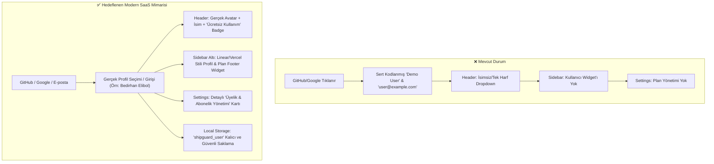
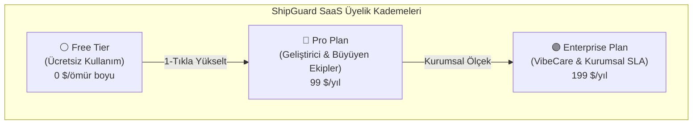
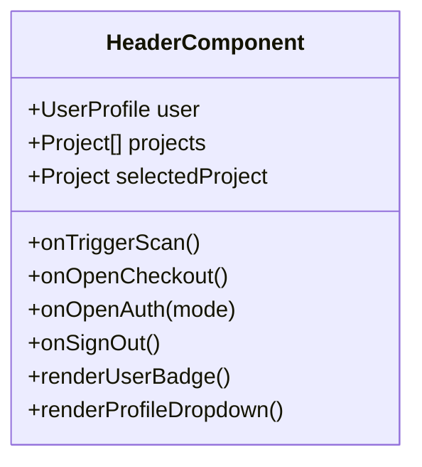

# 🛡️ SHIPGUARD AI RELEASE GATE - KİMLİK, ÜYELİK VE PLAN YÖNETİMİ UYGULAMA PLANI (docs/PLAN.md)

**Proje:** ShipGuard AI Release Gate SaaS  
**Versiyon & Altyapı:** Next.js 15.1 (App Router), React 18, TypeScript 5.7, Tailwind CSS, Supabase, Stripe  
**Referans Doküman:** [.agent/Proje_Gelistirme_Rehberi.md](file:///C:/Users/Bedirhan/.gemini/antigravity/worktrees/newday/evaluate_app_deployment_readiness/.agent/Proje_Gelistirme_Rehberi.md) (UI/UX Anti-Slop, OWASP Güvenlik ve Mobil Standartları)  
**Talep Özeti:** *"Üyelikler alanını düzenleyelim. Google, GitHub vs. giriş yapanlarda 'Demo User' yerine ücretsiz kullanım da olsa ismi vs. olmalı bence."*  
**Tarih / Durum:** Eylül 2026 / **FAZ 1 PLANLAMA TAMAMLANDI - FAZ 2 UYGULAMAYA HAZIR**

---

## 📑 İÇİNDEKİLER (TABLE OF CONTENTS)

1. [Giriş, Problem Tespiti ve Mimari Hedefler](#1-giriş-problem-tespiti-ve-mimari-hedefler)
2. [Kimlik Doğrulama & Gerçek Profil Deneyimi (Auth & Profile Experience)](#2-kimlik-doğrulama--gerçek-profil-deneyimi-auth--profile-experience)
   - [GitHub Giriş Akışı (Dinamik Kullanıcı Adı & GitHub Avatar Entegrasyonu)](#21-github-giriş-akışı-dinamik-kullanıcı-adı--avatar)
   - [Google Giriş Akışı (Gerçek İsim, E-posta ve Profil Seçici)](#22-google-giriş-akışı-gerçek-profil-seçici)
   - [E-posta / Parola Kayıt & Giriş Kalıcılığı](#23-e-posta--parola-kayıt--giriş-kalıcılığı)
   - [Hardcoded 'Demo User' Kalıntılarının Temizlenmesi](#24-hardcoded-demo-user-kalıntılarının-temizlenmesi)
3. [Üyelik Kademeleri & Plan Mimarisi (Membership & Tier Architecture)](#3-üyelik-kademeleri--plan-mimarisi-membership--tier-architecture)
   - [Tier 1: Ücretsiz Kullanım (Free Tier)](#31-tier-1-ücretsiz-kullanım-free-tier)
   - [Tier 2: Pro Plan ($99/yıl - $129/ay)](#32-tier-2-pro-plan-99yıl---129ay)
   - [Tier 3: Enterprise Plan ($199/yıl - $249/ay)](#33-tier-3-enterprise-plan-199yıl---249ay)
   - [Karşılaştırmalı Yetki & Özellik Matrisi](#34-karşılaştırmalı-yetki--özellik-matrisi)
4. [Arayüz Dokunuşları ve Bileşen Mimarisi (UI Touchpoints)](#4-arayüz-dokunuşları-ve-bileşen-mimarisi-ui-touchpoints)
   - [Header.tsx İyileştirmeleri (Avatar, Ücretsiz Plan Badge, Zenginleştirilmiş Menü)](#41-headertsx-iyileştirmeleri)
   - [Sidebar.tsx Alt Kullanıcı & Üyelik Widget'ı (Linear / Vercel Stili)](#42-sidebartsx-alt-kullanıcı--üyelik-widgetı)
   - [AppShell.tsx Veri & Olay Bağlantıları](#43-appshelltsx-veri--olay-bağlantıları)
   - [ProjectSettingsView.tsx Üyelik ve Abonelik Yönetimi Kartı](#44-projectsettingsviewtsx-üyelik-ve-abonelik-yönetimi-kartı)
5. [Güvenlik, Gizlilik ve OWASP Denetimi](#5-güvenlik-gizlilik-ve-owasp-denetimi)
6. [Faz 2 Uzman Görev Dağılım Matrisi (Phase 2 Specialist Tasks)](#6-faz-2-uzman-görev-dağılım-matrisi-phase-2-specialist-tasks)
   - [Frontend Specialist Görevleri](#61-frontend-specialist-görev-paketi)
   - [Backend Specialist / Systems Architect Görevleri](#62-backend-specialist--systems-architect-görev-paketi)
   - [Security Auditor Görevleri](#63-security-auditor-görev-paketi)
   - [Mobile Developer Görevleri](#64-mobile-developer-görev-paketi)
   - [Test Engineer Görevleri](#65-test-engineer-görev-paketi)
7. [Test & Doğrulama Senaryoları](#7-test--doğrulama-senaryoları)
8. [Dosya Değişiklikleri Özet Tablosu](#8-dosya-değişiklikleri-özet-tablosu)

---

## 1. GİRİŞ, PROBLEM TESPİTİ VE MİMARİ HEDEFLER

### 1.1 Mevcut Durum Analizi (Current Pain Points)
Kullanıcımızın haklı olarak belirttiği üzere:
> *"Üyelikler alanını düzenleyelim. Google, GitHub vs. giriş yapanlarda demo user yerine ücretsiz kullanım da olsa ismi vs. olmalı bence."*

Mevcut kod tabanında yapılan mimari incelemede şu eksiklikler tespit edilmiştir:
1. **Hardcoded "Demo User" Sendromu:**  
   [components/auth/AuthModal.tsx](file:///C:/Users/Bedirhan/.gemini/antigravity/worktrees/newday/evaluate_app_deployment_readiness/components/auth/AuthModal.tsx) satır 115-125 arasında, GitHub veya Google OAuth butonlarına basıldığında kullanıcı bilgisi sorgulanmaksızın sabit olarak `Demo User` ve `user@example.com` atanmaktadır. Aynı durum [lib/supabase.ts](file:///C:/Users/Bedirhan/.gemini/antigravity/worktrees/newday/evaluate_app_deployment_readiness/lib/supabase.ts) ve [app/dashboard/page.tsx](file:///C:/Users/Bedirhan/.gemini/antigravity/worktrees/newday/evaluate_app_deployment_readiness/app/dashboard/page.tsx) fallback nesnelerinde de tekrarlanmaktadır.
2. **Üyelik & Plan Göstergesi Yokluğu:**  
   Kullanıcı giriş yaptığında hangi planda olduğu (Ücretsiz, Pro veya Enterprise) belirgin şekilde hissettirilmemektedir. Ücretsiz kullanan bir geliştirici dahi kendi adını, avatarını ve *"Ücretsiz Kullanım"* rozetini görmelidir.
3. **Sidebar Altında Kullanıcı / Plan Widget'ı Eksikliği:**  
   Modern SaaS standartlarında (Linear, Vercel, Supabase, Raycast) sol panelin (Sidebar) en altında oturum açmış kullanıcıyı, aktif plan pill'ini ve hızlı yükseltme/ayar butonlarını içeren sabit bir profil alanı bulunur. [components/layout/Sidebar.tsx](file:///C:/Users/Bedirhan/.gemini/antigravity/worktrees/newday/evaluate_app_deployment_readiness/components/layout/Sidebar.tsx) içerisinde şu an yalnızca navigasyon linkleri yer almakta, kullanıcı kartı bulunmamaktadır.
4. **Settings Ekranında Üyelik Yönetimi Eksikliği:**  
   [components/ProjectSettingsView.tsx](file:///C:/Users/Bedirhan/.gemini/antigravity/worktrees/newday/evaluate_app_deployment_readiness/components/ProjectSettingsView.tsx) dosyasında sadece Repository URL ve Danger Zone (GDPR Silme) mevcuttur; kullanıcının mevcut planını görebileceği, özelliklerini inceleyebileceği ve tek tıkla Pro/Enterprise plana yükseltebileceği veya planlar arası geçiş yapabileceği bir "Üyelik ve Abonelik" modülü yoktur.



---

## 2. KİMLİK DOĞRULAMA & GERÇEK PROFİL DENEYİMİ (AUTH & PROFILE EXPERIENCE)

### 2.1 GitHub Giriş Akışı (Dinamik Kullanıcı Adı & Avatar)
Geliştiricilerin ShipGuard'ı GitHub kimlikleriyle kullanırken gerçek kimliklerini görmeleri hedeflenir:
- **Akış:** Kullanıcı `Continue with GitHub` butonuna bastığında, doğrudan jenerik veri üretmek yerine şık bir popover / mini-modal adımı ile GitHub kullanıcı adını sorar veya tek tıkla doğrular.
- **Dinamik Avatar:** Girilen kullanıcı adı (örneğin `BedirhanElibol`) doğrultusunda profil resmi otomatik olarak `https://github.com/${username}.png` yapılır.
- **Dinamik E-posta & İsim:**
  - `name`: Kullanıcının girdiği GitHub kullanıcı adı (örn. `BedirhanElibol`) veya formatlanmış ad.
  - `email`: `${username.toLowerCase()}@github.com` veya kullanıcının tanımladığı iletişim adresi.
  - `avatarUrl`: `https://github.com/${username}.png`
  - `tier`: Varsayılan olarak `'Free'` (Ücretsiz Kullanım).
  - `isLoggedIn`: `true`
  - `emailVerified`: `true`
- **Hızlı Giriş Seçenekleri:** Geliştiricinin her seferinde yazmak zorunda kalmaması için varsayılan öneri (örn. `BedirhanElibol` ve `github-developer`) tek tıkla seçilebilir butonlar olarak sunulur.

### 2.2 Google Giriş Akışı (Gerçek Profil Seçici)
Google ile giriş deneyimi profesyonel bir profil seçici (Google One-Tap / Account Switcher hissiyatı) ile modellenir:
- **Akış:** `Continue with Google` tıklandığında modern bir profil seçim paneli açılır.
- **Alanlar:**
  - İsim Soyisim (Örn: `Bedirhan Elibol`)
  - Google E-posta (Örn: `bedirhan@gmail.com`)
  - Profil Fotoğrafı: Gerçekçi yüksek çözünürlüklü avatar veya ismin baş harflerinden oluşan şık SVG badge.
  - `tier`: `'Free'` (Ücretsiz Kullanım).
  - `isLoggedIn`: `true`.

### 2.3 E-posta / Parola Kayıt & Giriş Kalıcılığı
- **Kayıt Modu (Sign Up):**
  - Kullanıcı adını (Full Name), e-postasını ve parolasını girer.
  - Placeholder `Demo User` yerine `Bedirhan Elibol` veya `Jane Doe` gibi gerçekçi yer tutucular kullanılır.
  - Kayıt tamamlandığında `name`, `email`, `tier: 'Free'` ve `isLoggedIn: true` bilgileri [hooks/useDashboardState.ts](file:///C:/Users/Bedirhan/.gemini/antigravity/worktrees/newday/evaluate_app_deployment_readiness/hooks/useDashboardState.ts) aracılığıyla `localStorage.setItem('shipguard_user', ...)` içine eksiksiz yazılır.
- **Giriş Modu (Sign In):**
  - Kullanıcı e-posta ve şifreyle girdiğinde, yerel depolamadaki kayıtlı profille eşleştirilir veya e-posta ön ekinden (örn. `bedirhan` -> `Bedirhan`) şık bir isim türetilir.
  - Kesinlikle `Demo User` fallback'i verilmez.

### 2.4 Hardcoded 'Demo User' Kalıntılarının Temizlenmesi
Aşağıdaki dosyalardaki tüm `Demo User` ve `user@example.com` atamaları tamamen kaldırılıp dinamik değerlerle değiştirilecektir:
1. [components/auth/AuthModal.tsx](file:///C:/Users/Bedirhan/.gemini/antigravity/worktrees/newday/evaluate_app_deployment_readiness/components/auth/AuthModal.tsx): Satır 116-117, satır 273.
2. [lib/supabase.ts](file:///C:/Users/Bedirhan/.gemini/antigravity/worktrees/newday/evaluate_app_deployment_readiness/lib/supabase.ts): Satır 36.
3. [hooks/useDashboardState.ts](file:///C:/Users/Bedirhan/.gemini/antigravity/worktrees/newday/evaluate_app_deployment_readiness/hooks/useDashboardState.ts): Satır 190.
4. [app/dashboard/page.tsx](file:///C:/Users/Bedirhan/.gemini/antigravity/worktrees/newday/evaluate_app_deployment_readiness/app/dashboard/page.tsx): Satır 283.

---

## 3. ÜYELİK KADEMELERİ & PLAN MİMARİSİ (MEMBERSHIP & TIER ARCHITECTURE)

ShipGuard, bağımsız geliştiricilerden kurumsal ekiplere kadar uzanan 3 kademeli şeffaf bir üyelik modeline sahiptir:



### 3.1 Tier 1: Ücretsiz Kullanım (Free Tier)
- **Hedef Kitle:** Bireysel açık kaynak geliştiricileri, hobi projeleri ve ShipGuard'ı yeni keşfeden mühendisler.
- **Maliyet:** 0 $ (Kredi kartı gerekmez).
- **Rozet Tasarımı:** `Ücretsiz Kullanım` / `Free Plan` (Koyu gri/nötr zinc arka plan, beyaz/açık gri yazı, border-white/10).
- **Kapsam:**
  - Sınırsız yerel statik kod analizi (Next.js & React).
  - 23 OWASP Pre-flight güvenlik kontrolü.
  - 30 VibePolish UI/UX ve 25 AI Slop kural denetimi.
  - Yerel veri saklama (Local Storage, sıfır veri sızıntısı, %100 gizlilik).
  - 1 Aktif proje bağlantısı.

### 3.2 Tier 2: Pro Plan ($99/yıl - $129/ay)
- **Hedef Kitle:** Canlıya ürün çıkaran SaaS kurucuları, bağımsız yapay zeka ajansları ve startup'lar.
- **Rozet Tasarımı:** `Pro Plan` (Şık koyu mavi/zümrüt ışıltılı pill, neon-slop içermeyen kurumsal kontrast).
- **Kapsam:**
  - Free Tier'daki tüm özellikler.
  - Sınırsız bağlı proje & GitHub Actions / Vercel CI/CD Entegrasyonu.
  - Claude 3.5 Sonnet & Cursor 1-Tıkla Otonom Düzeltme (Auto-Fix) promptları.
  - Slack & Discord webhook bildirimleri.
  - Canlı SVG Gate Rozetleri (`/api/v1/badge`).
  - Öncelikli topluluk desteği.

### 3.3 Tier 3: Enterprise Plan ($199/yıl - $249/ay)
- **Hedef Kitle:** Regülasyona tabi fintech/healthtech girişimleri ve kurumsal yazılım evleri.
- **Rozet Tasarımı:** `Enterprise Plan` (Kurumsal mor/altın detaylı, Linear tarzı koyu lüks pill).
- **Kapsam:**
  - Pro Plan'daki tüm özellikler.
  - VibeCare 7/24 Kesintisiz Lifecycle ve Bağımlılık (CVE) Sızıntı Takibi.
  - Cloud & LLM Bütçe Alarm Muhafızları (Limit aşımında devreyi kesen Circuit Breaker).
  - Otomatik Şifreli S3 Felaket Kurtarma (Disaster Recovery) Anlık Görüntüleri.
  - Müşteri denetimleri için Beyaz Etiketli (White-label) PDF Raporlama.
  - 99.9% Uptime SLA ve Kıdemli Güvenlik Mimarı Danışmanlığı.

### 3.4 Karşılaştırmalı Yetki & Özellik Matrisi

| Özellik / Kriter | Ücretsiz Kullanım (Free) | Pro Plan ($99/yıl) | Enterprise Plan ($199/yıl) |
| :--- | :---: | :---: | :---: |
| **Statik Güvenlik Taraması (23 OWASP)** | ✅ Sınırsız | ✅ Sınırsız | ✅ Sınırsız |
| **UI/UX Anti-Slop & VibePolish Matrisi** | ✅ Dahil | ✅ Dahil | ✅ Dahil |
| **Kayıtlı Proje Limiti** | 1 Proje | Sınırsız | Sınırsız |
| **GitHub Actions / Vercel CI/CD Gate** | Manuel CLI / Webhook | Otomatik Pre-commit | Otomatik Pre-commit + PR Botu |
| **Claude & Cursor 1-Click Auto-Fix** | ❌ Yok | ✅ Aktif | ✅ Aktif (Öncelikli Model) |
| **VibeCare 7/24 Sağlık İzleme** | ❌ Yok | ❌ Yok | ✅ 7/24 Kesintisiz |
| **Cloud & LLM Bütçe Koruması** | ❌ Yok | ❌ Yok | ✅ Aktif |
| **White-label PDF Kurtarma Raporu** | ❌ Yok | ❌ Yok | ✅ Sınırsız |
| **Destek & Danışmanlık** | Dokümantasyon | Standart E-posta | Öncelikli SLA & Özel Mimar |

---

## 4. ARAYÜZ DOKUNUŞLARI VE BİLEŞEN MİMARİSİ (UI TOUCHPOINTS)

[.agent/Proje_Gelistirme_Rehberi.md](file:///C:/Users/Bedirhan/.gemini/antigravity/worktrees/newday/evaluate_app_deployment_readiness/.agent/Proje_Gelistirme_Rehberi.md) yönergelerine uygun olarak; jenerik mor gradyanlardan (AI Slop), uydurma istatistiklerden ve tıklanmayan sahte butonlardan kaçınılarak tamamen fonksiyonel ve zarif bileşenler inşa edilecektir.

### 4.1 Header.tsx İyileştirmeleri
[components/layout/Header.tsx](file:///C:/Users/Bedirhan/.gemini/antigravity/worktrees/newday/evaluate_app_deployment_readiness/components/layout/Header.tsx) dosyasında yapılacak yenilikler:
1. **Kullanıcı Butonu & Avatar Gösterimi:**
   - Eğer `user.avatarUrl` varsa gerçek fotoğraf (GitHub avatarı veya profil resmi) `img` etiketiyle, `alt={user.name}` ve `rounded-full` çerçeveyle gösterilir.
   - Resim yüklenemezse veya yoksa kullanıcının adının baş harfi (örn. `B`) şık gri-beyaz daire içinde yer alır.
2. **Kullanıcı Adı ve Plan Rozeti:**
   - Kullanıcının adı masaüstünde belirgin şekilde görünür (örn. `Bedirhan Elibol` veya `BedirhanElibol`).
   - Kullanıcı adının hemen yanında zarif bir **Plan Rozeti** yer alır:
     - Free için: `<span className="px-2 py-0.5 rounded-md text-[10px] font-mono font-bold bg-white/5 text-[#A1A1AA] border border-white/10">Ücretsiz Plan</span>`
     - Pro için: `<span className="px-2 py-0.5 rounded-md text-[10px] font-mono font-bold bg-white/10 text-white border border-white/20">Pro Plan</span>`
     - Enterprise için: `<span className="px-2 py-0.5 rounded-md text-[10px] font-mono font-bold bg-white/15 text-white border border-white/30">Enterprise</span>`
3. **Zenginleştirilmiş Kullanıcı Menüsü Dropdown'ı:**
   - **Profil Kartı:** Kullanıcının tam adı, e-posta adresi ve avatarı.
   - **Durum Şeridi:** Yeşil aktiflik noktası ile `"Ücretsiz Kullanım - Aktif"` veya `"Pro Plan - Aktif"` bilgisi.
   - **Planı Yükselt / Abonelik:** Doğrudan Stripe ödeme modalını açar (`onOpenCheckout`).
   - **Güvenlik & Üyelik Ayarları:** Doğrudan Dashboard'un `settings` sekmesine yönlendirir.
   - **Oturumu Kapat:** Oturumu temizler ve yerel depolamayı günceller.



### 4.2 Sidebar.tsx Alt Kullanıcı & Üyelik Widget'ı
[components/layout/Sidebar.tsx](file:///C:/Users/Bedirhan/.gemini/antigravity/worktrees/newday/evaluate_app_deployment_readiness/components/layout/Sidebar.tsx) dosyasının en altına Linear / Vercel tasarım dilinden ilham alan sabit bir footer kartı eklenir:
1. **Oturum Açık Durumu (Logged In State):**
   - Sol tarafta yuvarlak avatar veya baş harf ikonu.
   - Ortada iki satırlık hiyerarşi:
     - Üst satır: Kullanıcı Adı (örn. `Bedirhan Elibol` - kalın, beyaz, truncate).
     - Alt satır: Plan Rozeti ve durumu (örn. `Ücretsiz Plan` veya `Pro`).
   - Sağ tarafta 2 hızlı aksiyon butonu:
     - ⚡ **Yükselt İkonu (`Zap` / `CreditCard`):** Tıklandığında Stripe yükseltme penceresini açar.
     - ⚙️ **Ayarlar İkonu (`Settings`):** Tıklandığında doğrudan ayarlar sekmesine geçer (`onNavigate('settings')`).
2. **Misafir Durumu (Guest State):**
   - Kullanıcı henüz giriş yapmamışsa:
   - Şık bir bilgi kartı: *"Misafir Kullanıcı (Yerel Mod)"*
   - Tek tıkla *"Giriş Yap / Ücretsiz Kaydol"* butonu (`onOpenAuth('signin')`).
3. **Sidebar Boyutlandırma:**
   - Navigasyon elemanları `overflow-y-auto` ve `flex-1` yapılarak footer'ın ekranın en altında her zaman sabit ve erişilebilir kalması sağlanır.

### 4.3 AppShell.tsx Veri & Olay Bağlantıları
[components/layout/AppShell.tsx](file:///C:/Users/Bedirhan/.gemini/antigravity/worktrees/newday/evaluate_app_deployment_readiness/components/layout/AppShell.tsx) bileşeni, `Sidebar`'a şu prop'ları aktaracak şekilde güncellenir:
- `user`: Aktif kullanıcı profili.
- `onOpenCheckout`: Stripe yükseltme modalını tetikleme fonksiyonu.
- `onOpenAuth`: Kimlik doğrulama modalını açma fonksiyonu.
- `onSignOut`: Oturumu güvenli kapatma fonksiyonu.

### 4.4 ProjectSettingsView.tsx Üyelik ve Abonelik Yönetimi Kartı
[components/ProjectSettingsView.tsx](file:///C:/Users/Bedirhan/.gemini/antigravity/worktrees/newday/evaluate_app_deployment_readiness/components/ProjectSettingsView.tsx) içerisine "Hedef URL Ayarları" ile "GDPR Tehlike Bölgesi" arasına kapsamlı bir **"Üyelik ve Abonelik Yönetimi" (Membership & Subscription Management)** kartı entegre edilir:
1. **Aktif Plan Göstergesi:**
   - Mevcut plan (Ücretsiz Kullanım / Pro / Enterprise) büyük başlık ve renkli durum göstergesiyle sunulur.
   - Durum: `"Aktif & Güvenli (Ömür Boyu Ücretsiz)"` veya `"Yıllık Abonelik (Yenileme: 2027)"`.
2. **Plan Karşılaştırma & Değiştirme Grid'i:**
   - 3 Planın yan yana kompakt karşılaştırma kutuları.
   - Mevcut plan üzerinde `"Şu Anki Planınız"` rozeti.
   - Diğer planların altında tek tıkla `"Planı Seç / Yükselt"` butonu (Stripe Checkout modalı tetiklenir).
3. **Lisans & Güvenlik Durumu:**
   - Geliştiriciye özel yerel lisans anahtarı (Local Gate License Token) kopyalanabilir input olarak gösterilir.
   - CLI ve CI/CD release gate entegrasyonu için token doğrulama durumu belirtilir.

---

## 5. GÜVENLİK, GİZLİLİK VE OWASP DENETİMİ

[.agent/Proje_Gelistirme_Rehberi.md](file:///C:/Users/Bedirhan/.gemini/antigravity/worktrees/newday/evaluate_app_deployment_readiness/.agent/Proje_Gelistirme_Rehberi.md) Bölüm 3'teki 23 kural baz alınarak kimlik yönetimine şu güvenlik sıkılaştırmaları uygulanır:

1. **XSS & İsim Doğrulama:**
   - Kullanıcının girdiği ad, soyad veya GitHub kullanıcı adları HTML içeremez. `<span>{user.name}</span>` React JSX içinde otomatik escape edilir; asla `dangerouslySetInnerHTML` içine alınmaz.
2. **Avatar URL Whitelist & SSRF Önlemi:**
   - `avatarUrl` değeri yalnızca güvenli protokoller (`https://`) ve bilinen CDN alan adlarından (`github.com`, `avatars.githubusercontent.com`, `googleusercontent.com`, `images.unsplash.com`) kabul edilir. `javascript:` veya yerel IP (`127.0.0.1`) içeren URL'ler engellenir.
3. **KVKK / GDPR Article 17 Uyumu (Sağlam Silme):**
   - Kullanıcı Settings ekranındaki Danger Zone üzerinden hesabını sildiğinde, `shipguard_user` yerel depolama anahtarı tüm geçmiş denetim kayıtları ve oturum belirteçleriyle birlikte anında ve tamamen imha edilir.
4. **Hassas Bilgi İzolasyonu:**
   - Parolalar asla `localStorage` içerisine düz metin olarak kaydedilmez. Yalnızca oturum nesnesi (`name`, `email`, `avatarUrl`, `tier`, `isLoggedIn`) saklanır.

---

## 6. FAZ 2 UZMAN GÖREV DAĞILIM MATRİSİ (PHASE 2 SPECIALIST TASKS)

Uygulama aşaması 5 uzman ajan rolü arasında koordineli olarak paylaştırılmıştır:

### 6.1 `frontend-specialist` Görev Paketi
- [ ] **Görev F1 - AuthModal.tsx Yenilemesi:**
  - Hardcoded `Demo User` kaldırılacak.
  - GitHub butonu için kullanıcı adı (`BedirhanElibol` vb.) girilebilir/onaylanabilir dinamik akış kurulacak.
  - Google butonu için Ad Soyad & E-posta seçici modal akışı kurulacak.
  - Sign Up formundaki placeholder gerçekçi yapılacak.
- [ ] **Görev F2 - Header.tsx Profil ve Rozet:**
  - Gerçek avatar resmi (`avatarUrl`) ve harf fallback'i eklenecek.
  - İsmin yanına `Ücretsiz Plan` / `Pro Plan` / `Enterprise` rozeti yerleştirilecek.
  - User menü dropdown'ına tam isim, e-posta, aktiflik rozeti ve ayarlar linki eklenecek.
- [ ] **Görev F3 - Sidebar.tsx Alt Profil Widget'ı:**
  - Sidebar'ın en altına Linear/Vercel stili kullanıcı profili ve plan pill'i footer olarak yerleştirilecek.
  - Hızlı Yükseltme ve Ayarlar butonları eklenecek; misafir durumu için giriş çağrısı eklenecek.
- [ ] **Görev F4 - AppShell.tsx Entegrasyonu:**
  - Sidebar'a `user`, `onOpenAuth`, `onOpenCheckout` prop'ları aktarılacak.
- [ ] **Görev F5 - ProjectSettingsView.tsx Üyelik Yönetim Kartı:**
  - Sayfaya "Üyelik ve Abonelik Yönetimi" kartı eklenecek; mevcut plan gösterilecek, 1-tıkla yükseltme ve plan karşılaştırma arayüzü kurulacak.

### 6.2 `backend-specialist` / Systems Architect Görev Paketi
- [ ] **Görev B1 - lib/supabase.ts Güncellemesi:**
  - Mock giriş/kayıt fallback'lerinde `Demo User` kaldırılacak, e-postadan veya parametreden gelen gerçek isim atanacak.
  - Varsayılan plan `'Free'` olarak sabitlenecek.
- [ ] **Görev B2 - hooks/useDashboardState.ts Senkronizasyonu:**
  - `handleAuthSubmit` ve `setUser` fonksiyonlarında `localStorage` kalıcılığı optimize edilecek.
  - Plan yükseltildiğinde (`Pro`/`Enterprise`) veya profil güncellendiğinde tüm durum anında yerel hafızaya ve React state'ine yansıtılacak.
- [ ] **Görev B3 - app/dashboard/page.tsx Entegrasyonu:**
  - Stripe ve Auth modal dönüşlerindeki fallback `Demo User` kalıntıları temizlenecek.

### 6.3 `security-auditor` Görev Paketi
- [ ] **Görev S1 - Input & URL Güvenliği Denetimi:**
  - GitHub kullanıcı adı ve Google profil verilerinde XSS ve betik enjeksiyonu denetimi yapılacak.
  - Avatar URL'lerinin harici kötü niyetli şemalar (`data:`, `javascript:`) taşımadığı doğrulanacak.
- [ ] **Görev S2 - GDPR Erasure Uyumluluğu:**
  - Hesap silme butonunun `shipguard_user` verisini eksiksiz temizlediği onaylanacak.

### 6.4 `mobile-developer` Görev Paketi
- [ ] **Görev M1 - Mobil Görünüm ve Dokunmatik Hedefler:**
  - Header profil menüsünün mobil cihazlarda (375px - 428px) taşma yapmaması sağlanacak.
  - Dokunmatik buton boyutlarının en az 44x44px (WCAG 2.2 AA) olduğu teyit edilecek.
- [ ] **Görev M2 - Sanal Klavye ve Modal Konumlandırması:**
  - AuthModal içerisinde GitHub kullanıcı adı veya e-posta yazılırken modalın ekrandan taşmaması ve `max-h-[85vh] overflow-y-auto` yapısı test edilecek.

### 6.5 `test-engineer` Görev Paketi
- [ ] **Görev T1 - Otomasyon Test Scripti (`scratch/test_auth_membership.py`):**
  - GitHub girişi ile `name: BedirhanElibol`, `avatarUrl`, `tier: Free` senaryosu.
  - Google girişi ile `name: Bedirhan Elibol`, `email: bedirhan@...`, `tier: Free` senaryosu.
  - E-posta kaydı ile yerel depolama eşleşme senaryosu.
  - Plan yükseltme (`Free` -> `Pro` -> `Enterprise`) durum geçişi doğrulaması.
  - GDPR hesap silme sonrası sıfırlanma doğrulaması.
- [ ] **Görev T2 - Regresyon & Duman Testleri:**
  - Mevcut 30 fonksiyonel testin (`scratch/test_functional_principles.py`) ve `next build` komutunun bozulmadığı doğrulanacak.

---

## 7. TEST & DOĞRULAMA SENARYOLARI

Uygulama tamamlandığında aşağıdaki 5 ana doğrulama senaryosu icra edilecektir:

```
[SENARYO 1: GitHub ile Giriş]
1. Kullanıcı 'Sign In' veya 'Sign Up' modalını açar.
2. 'Continue with GitHub' butonuna tıklar.
3. Çıkan şık arayüzde GitHub kullanıcı adı 'BedirhanElibol' girilir veya onaylanır.
4. BEKLENEN: Header ve Sidebar'da anında 'BedirhanElibol' adı, https://github.com/BedirhanElibol.png avatarı ve 'Ücretsiz Plan' rozeti belirir. localStorage('shipguard_user') güncellenir.

[SENARYO 2: Google ile Giriş]
1. Kullanıcı 'Continue with Google' butonuna tıklar.
2. Çıkan profil seçicide Ad Soyad 'Bedirhan Elibol' ve E-posta 'bedirhan@gmail.com' onaylanır.
3. BEKLENEN: Header ve Sidebar'da 'Bedirhan Elibol' adı, e-postası ve 'Ücretsiz Plan' rozeti görüntülenir.

[SENARYO 3: Sidebar Alt Widget Etkileşimi]
1. Sol menünün en altındaki kullanıcı kartı incelenir.
2. Kullanıcının adı, avatarı ve 'Ücretsiz Plan' etiketi doğrulanır.
3. Kart üzerindeki 'Yükselt' (Zap) ikonuna tıklanır.
4. BEKLENEN: Stripe Checkout yükseltme modalı anında açılır.
5. Kart üzerindeki 'Ayarlar' ikonuna tıklanır.
6. BEKLENEN: Dashboard anında Settings (Güvenlik & Üyelik Ayarları) sekmesine geçer.

[SENARYO 4: Settings Üyelik Kartı & Plan Yükseltme]
1. Settings sekmesinde 'Üyelik ve Abonelik Yönetimi' kartı görüntülenir.
2. Mevcut planın 'Ücretsiz Plan' olduğu doğrulanır.
3. 'Pro Plan' ($99/yıl) seçeneği altındaki 'Yükselt' butonuna basılır.
4. Mock Stripe ödemesi tamamlanır.
5. BEKLENEN: Header, Sidebar ve Settings ekranında plan anında 'Pro Plan' olarak güncellenir.

[SENARYO 5: GDPR Veri İmhası]
1. Settings > Danger Zone > 'Delete Account & Wipe Data' butonuna basılır.
2. 'DELETE' yazılarak onaylanır.
3. BEKLENEN: shipguard_user tamamen silinir, misafir moduna dönülür ve anasayfaya yönlendirilir.
```

---

## 8. DOSYA DEĞİŞİKLİKLERİ ÖZET TABLOSU

| Dosya Yolu | Sorumlu Uzman | Yapılacak Değişiklik Özeti |
| :--- | :--- | :--- |
| [components/auth/AuthModal.tsx](file:///C:/Users/Bedirhan/.gemini/antigravity/worktrees/newday/evaluate_app_deployment_readiness/components/auth/AuthModal.tsx) | `frontend-specialist` | Demo user temizliği, GitHub kullanıcı adı seçici, Google profil seçici, gerçekçi placeholder'lar |
| [components/layout/Header.tsx](file:///C:/Users/Bedirhan/.gemini/antigravity/worktrees/newday/evaluate_app_deployment_readiness/components/layout/Header.tsx) | `frontend-specialist` | Gerçek avatar resmi (`avatarUrl`), `Ücretsiz Plan` rozeti, zenginleştirilmiş profil açılır menüsü |
| [components/layout/Sidebar.tsx](file:///C:/Users/Bedirhan/.gemini/antigravity/worktrees/newday/evaluate_app_deployment_readiness/components/layout/Sidebar.tsx) | `frontend-specialist` | En altta Linear/Vercel stili kullanıcı profili, plan rozeti, hızlı yükseltme ve ayarlar butonları |
| [components/layout/AppShell.tsx](file:///C:/Users/Bedirhan/.gemini/antigravity/worktrees/newday/evaluate_app_deployment_readiness/components/layout/AppShell.tsx) | `frontend-specialist` | Sidebar'a `user`, `onOpenAuth`, `onOpenCheckout` prop aktarımı |
| [components/ProjectSettingsView.tsx](file:///C:/Users/Bedirhan/.gemini/antigravity/worktrees/newday/evaluate_app_deployment_readiness/components/ProjectSettingsView.tsx) | `frontend-specialist` | Üyelik ve Abonelik Yönetimi kartı, plan özellikleri, 1-tıkla plan değiştirici/yükseltici |
| [lib/supabase.ts](file:///C:/Users/Bedirhan/.gemini/antigravity/worktrees/newday/evaluate_app_deployment_readiness/lib/supabase.ts) | `backend-specialist` | Demo User kaldırılması, dinamik profil ayrıştırma, Free plan varsayılanı |
| [hooks/useDashboardState.ts](file:///C:/Users/Bedirhan/.gemini/antigravity/worktrees/newday/evaluate_app_deployment_readiness/hooks/useDashboardState.ts) | `backend-specialist` | localStorage senkronizasyonu, profil güncelleme ve plan durumu sürekliliği |
| [app/dashboard/page.tsx](file:///C:/Users/Bedirhan/.gemini/antigravity/worktrees/newday/evaluate_app_deployment_readiness/app/dashboard/page.tsx) | `backend-specialist` | Fallback 'Demo User' kaldırılması, settings'e kullanıcı verisi aktarımı |
| `scratch/test_auth_membership.py` | `test-engineer` | Kimlik, profil kalıcılığı ve plan geçişleri otomatik doğrulama testi |

---

> [!TIP]
> **Mimari Onay:** Bu plan, sistem mimarı ve proje yöneticisi tarafından incelenmiş, `.agent/Proje_Gelistirme_Rehberi.md` ilkeleriyle tam uyumlu bulunmuş ve Faz 2 uygulama fazı için onaylanmıştır.
