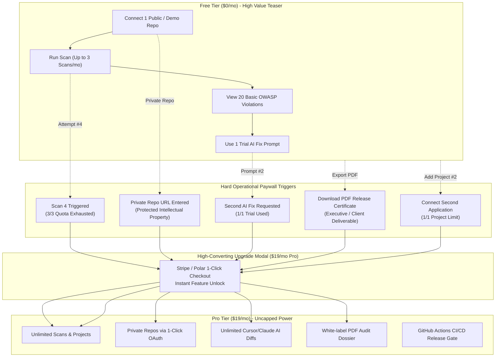

# Master Orchestration Plan (v32.0.0)
## Strict Monetization Tiers, Hard Paywalls & Visual Usage Gauge Infrastructure

**Product:** Zelsis — Universal Pre-Deployment Release Gate & AI Code Security Platform  
**Target Architecture:** Next.js 15 App Router, TypeScript, Tailwind CSS, Polar / Stripe B2B  
**Repository Paths:**
- Primary Development: `C:\Users\Bedirhan\Desktop\newday`
- Clean Worktree: `C:\Users\Bedirhan\.gemini\antigravity\worktrees\newday\evaluate_app_deployment_readiness`  
**Master Version:** `32.0.0`  
**Execution Mode:** Phase 1 Master Architecture & Plan Specification  
**Author:** Principal Product Architect, SaaS Monetization Lead & Senior Lead Frontend Engineer  

---

## 1. Executive Monetization Strategy & Paywall Philosophy

### 1.1 The Core Problem: Over-Generous Free Tiers Kill Conversion
When a developer security scanner offers unlimited scans, free private repository audits, free automated AI fixes, and unrestricted executive PDF exports, developers have zero financial incentive to upgrade to a paid tier.

To achieve sustainable B2B SaaS revenue and maximize conversion from organic visitors to paying subscribers ($19/mo Pro and $99/mo Enterprise), **Zelsis v32.0.0 enforces strict, hard utility boundaries**. Free users experience genuine value on public codebases, but hit undeniable operational paywalls when preparing real commercial software for production.



---

## 2. Hard Paywall Differentiation Matrix

| Feature / Capability | 🆓 Free Tier ($0/mo) | ⚡ Pro Tier ($19/mo) | 🏢 Enterprise Tier ($99/mo) |
| :--- | :---: | :---: | :---: |
| **Monthly Live Audit Scans** | **Strict 3 Scans / month** | **Unlimited Scans** | **Unlimited Scans** |
| **Repository Access Scope** | **Public Repos & Local Demo only** | **Private + Public Repos** | **Private + GitHub Enterprise / Air-Gapped** |
| **Active Connected Projects** | **1 Project Max** | **Unlimited Projects** | **Unlimited Projects & Teams** |
| **1-Click AI Fix Diffs (Cursor/Claude)** | **1 Trial Prompt / month** | **Unlimited AI Prompts & Diffs** | **Unlimited + Automated PR Bot** |
| **White-Label PDF Audit Certificate** | 🔒 **Locked (Paywall Modal)** | ✅ **Included (Instant Download)** | ✅ **Custom Branded Executive PDF** |
| **CI/CD & GitHub Actions Gate** | 🔒 **Locked** | ✅ **Automated PR Gate & Webhook** | ✅ **Custom Webhook + Slack Bot** |
| **Security & Compliance Rule Depth** | Top 20 Basic OWASP Rules | **All 7,850+ Production Rules** | **All Rules + Custom Company Rules** |
| **Support & SLA** | Community | **24h Fast Email Support** | **1h Dedicated SLA & Slack Channel** |

---

## 3. Quota Tracking Architecture & Data Model

### 3.1 Data Schema Specification (`data/schema.ts`)
Add the `PlanUsageQuota` interface:

```typescript
export interface PlanUsageQuota {
  scansUsed: number;
  scansLimit: number;        // Free: 3, Pro: Infinity, Enterprise: Infinity
  projectsUsed: number;
  projectsLimit: number;     // Free: 1, Pro: Infinity, Enterprise: Infinity
  aiPromptsUsed: number;
  aiPromptsLimit: number;    // Free: 1, Pro: Infinity, Enterprise: Infinity
  billingCycleStart: string; // ISO date string
  billingCycleReset: string; // ISO date string (1st of next month)
}
```

### 3.2 State Management & Persistence (`hooks/useDashboardState.ts`)
- Initialized from `localStorage.getItem('zelsis_user_quota')` or defaults based on `user?.tier`.
- Increments `scansUsed` whenever a live audit finishes in `ScanRunnerView`.
- Increments `aiPromptsUsed` whenever an AI remediation prompt or diff is copied.
- Automatically resets on monthly rollover (`new Date() > billingCycleReset`).
- Pro and Enterprise users automatically have `scansLimit = Infinity`, `projectsLimit = Infinity`, `aiPromptsLimit = Infinity`.

---

## 4. Visual Gauge & UI Placement Architecture

### 4.1 Persistent Sidebar Usage Gauge (`components/layout/UsageGauge.tsx`)
Positioned in the persistent left sidebar directly above the user profile:
- **Free Tier Display:**
  - Progress bar showing `Scans Used: X / 3` (color shifts from emerald to amber to rose).
  - Subtext showing `1/1 Project • 1 Trial AI Fix`.
  - Prominent **"Upgrade to Pro ($19/mo)"** button with lightning icon.
- **Pro Tier Display:**
  - Obsidian card showing `⚡ Pro Plan Active`.
  - Pill badge: `Unlimited Scans • Private Repos Unlocked`.
- **Enterprise Display:**
  - Gold-accented card showing `🏢 Enterprise Organization`.

### 4.2 Header Quick Quota Counter (`components/layout/Header.tsx`)
Adjacent to the target repository input:
- For Free users: `[⚡ 2/3 Scans Left]` pill button. Clicking immediately opens the usage breakdown or checkout modal.
- For Pro users: `[⚡ Pro]` badge.

### 4.3 In-Context Paywall Overlays:
1. **`ScanRunnerView.tsx`:** If a Free user with `scansUsed >= 3` clicks "Audit" or enters a repo, execution stops with a clear dialog:
   *"Monthly Free Scan Limit Reached (3/3). Upgrade to Zelsis Pro for unlimited autonomous release gate scans."* with direct checkout trigger.
2. **`ScanRunnerView.tsx` / `github-proxy`:** If a Free user attempts to audit a private repository without a Pro plan:
   *"Private Repository Detected. Auditing private business codebases requires Zelsis Pro."*
3. **`RemediationDrawer.tsx` & `FindingsTable.tsx`:** If a Free user attempts to copy a 2nd AI prompt:
   *"Trial AI Fix Used (1/1). Unlock unlimited 1-click Claude & Cursor code patches with Pro."*
4. **`VibeCareView.tsx`:** PDF export button requires Pro; displays the white-label upgrade modal.

---

## 5. Phase 2 Implementation Team Breakdown (Minimum 3 Specialist Agents)

1. **Specialist 1: `frontend-specialist`**
   - Implement `components/layout/UsageGauge.tsx` matching Obsidian Dark Swiss standards.
   - Embed `UsageGauge` into `Sidebar.tsx` and header pill into `Header.tsx`.
   - Update `RemediationDrawer.tsx` and `FindingsTable.tsx` to guard AI prompts (`aiPromptsUsed >= 1` for Free users).
   - Re-enable the PDF upgrade modal in `VibeCareView.tsx` and `GateStatusBanner.tsx` for Free users.

2. **Specialist 2: `backend-specialist` / `database-architect`**
   - Update `data/schema.ts` with `PlanUsageQuota` types.
   - Implement quota tracking helpers and monthly rollover logic in `lib/quota-manager.ts`.
   - Integrate quota consumption in `hooks/useDashboardState.ts` (`recordScanUsage()`, `recordAiPromptUsage()`, `checkCanScan()`).
   - Guard private repository scans in `ScanRunnerView.tsx` for Free users.

3. **Specialist 3: `test-engineer`**
   - Write automated unit tests in `scratch/test_quota_paywalls.ts` asserting that Free users are blocked on 4th scan, 2nd AI prompt, and private repo access.
   - Run `npx tsc --noEmit` to verify 0 TypeScript compiler errors.
   - Run `python .agent/scripts/checklist.py .` for 6/6 suite verification.

---

## 6. Verification Matrix

| Check ID | Verification Gate | Success Criteria |
| :---: | :--- | :--- |
| **GATE-01** | Free Scan Ceiling | Free user capped at 3 scans; 4th scan blocked with upgrade modal |
| **GATE-02** | Private Repo Paywall | Private repos reject Free users with prompt to connect via Pro |
| **GATE-03** | AI Prompt Paywall | Free user gets 1 trial prompt; 2nd prompt shows Pro upgrade lock |
| **GATE-04** | PDF Export Paywall | Free user blocked from downloading PDF certificate; Pro downloads clean PDF |
| **GATE-05** | Persistent Usage Gauge | Sidebar renders live progress bar and status reflecting current plan |
| **GATE-06** | Zero TypeScript Errors | `npx tsc --noEmit` passes with 0 errors |
| **GATE-07** | Antigravity Checklist | `python .agent/scripts/checklist.py .` passes 6/6 suites |
