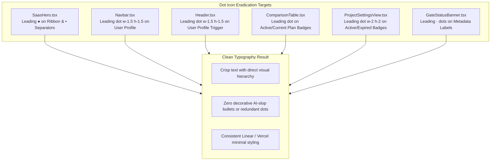

# Master Orchestration Plan (v33.0.0)
## Complete Eradication of Leading Dot/Bullet Icons & Vercel Deployment Sync

**Product:** Zelsis — Universal Pre-Deployment Release Gate & AI Code Security Platform  
**Target Architecture:** Next.js 15 App Router, TypeScript, Tailwind CSS, Vercel Production Deployment  
**Repository Paths:**
- Primary Development: `C:\Users\Bedirhan\Desktop\newday`
- Clean Worktree: `C:\Users\Bedirhan\.gemini\antigravity\worktrees\newday\evaluate_app_deployment_readiness`  
**Master Version:** `33.0.0`  
**Execution Mode:** Phase 1 Master Architecture & Plan Specification  
**Author:** Lead Systems Architect & Senior Frontend Specialist  

---

## 1. Executive Summary & Root Cause Analysis

### 1.1 The User Problem
1. **Unwanted Leading Dot Icons ("nokta iconları"):** Throughout the landing page and dashboard, decorative dot icons (`●`, `•`, `·`, ``) are prepended to buttons, badges, ribbon labels, and metadata separators. The user requested complete removal of these leading dot icons to maintain a clean, high-density Linear & Vercel engineering typography.
2. **Outdated Vercel Live Deployment:** The local development repository is ahead of `origin/main` by 5 commits (`baf90e8`, `66b1493`, `2b10dec`, `e2a14a2`, `58e2dbe`). Because `git push` was not executed after previous refactorings, Vercel is still serving an obsolete deployment from several days ago. As a result, the user cannot see the latest monochrome and UI slop cleanup on their live Vercel URL.

---

## 2. Multi-Pillar Remediation Architecture

### Pillar 1: Eradication of Leading Dot/Bullet Icons Across UI Components

#### Detailed File Targets:
1. **`components/saas/SaasHero.tsx`:**
   - Line 273: Remove `●` from the footer ribbon.
   - Lines 168, 170: Remove `•` between value props; replace with clean modern flex spacing.
   - Lines 286, 288, 290, 292, 294: Remove `•` separators from the supported stacks band.
2. **`components/Navbar.tsx`:**
   - Lines 129, 205: Remove `` preceding the user name.
3. **`components/layout/Header.tsx`:**
   - Line 323: Remove `` preceding the user name.
   - Line 350: Remove `` preceding validity state.
4. **`components/saas/ComparisonTable.tsx`:**
   - Lines 321, 348: Remove `` inside the "Current Plan" and "Active Plan" buttons.
5. **`components/ProjectSettingsView.tsx`:**
   - Lines 411, 451: Remove `` preceding "Active" and countdown labels.
6. **`components/dashboard/GateStatusBanner.tsx`:**
   - Line 196: Remove `·` separator.

---

### Pillar 2: Git Push Synchronization & Vercel Automatic Deployment

1. **Verify Git State:**
   - Confirm branch `main` is clean.
   - Review pending commits (5 commits ahead of `origin/main`).
2. **Push to Remote (`origin/main`):**
   - Execute `git push origin main` using the configured authenticated access token.
   - Confirm remote branch receives all commits (`baf90e8` and preceding).
3. **Trigger & Verify Vercel Build:**
   - Vercel's automated GitHub Webhook will immediately trigger a new production deployment.
   - All previous changes (monochrome UI, CAPABILITY label removals, neon green eradication) plus the dot icon removals will be live and visible to the user.

---

## 3. Verification & Safety Protocol

1. **Static Type Checking:** Run `npx tsc --noEmit` to guarantee zero compilation breakages.
2. **AST Catalog Sync:** Run `python scratch/generate_real_files.py` to keep `data/workspaceFiles.ts` synced.
3. **Git Cleanliness:** Commit with message `style: eradicate leading dot icons and push to origin/main for Vercel deployment`.
4. **Live Push Verification:** Ensure `git push origin main` completes with HTTP 200 / success from GitHub.

---

## 4. Execution Phases

- **Phase 1 (Current):** Specification and user approval of `docs/PLAN.md`.
- **Phase 2 (After Approval):**
  - Group 1 (Frontend): Remove all leading dot icons in targeted components.
  - Group 2 (DevOps): Execute `git push origin main` to update GitHub and trigger Vercel deployment.
  - Group 3 (QA): Verify build output and live readiness.
