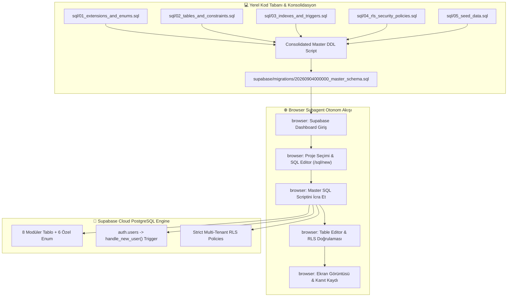
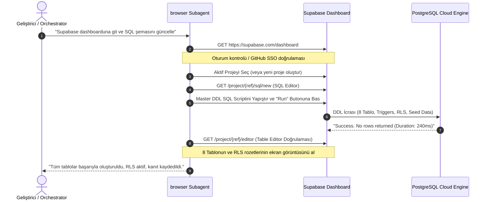
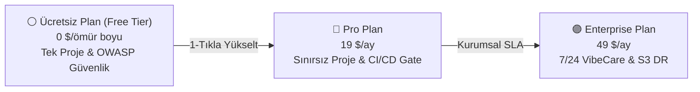

# 🛡️ SHIPGUARD AI RELEASE GATE - SQL DATABASE, SUPABASE SENKRONİZASYON VE KİMLİK/ÜYELİK YÖNETİMİ MASTER UYGULAMA PLANI (docs/PLAN.md)

**Proje:** ShipGuard AI Release Gate SaaS  
**Versiyon & Altyapı:** Next.js 15.1 (App Router), React 18, TypeScript 5.7, Tailwind CSS, Supabase (PostgreSQL 15+), Stripe  
**Referans Doküman:** [.agent/Proje_Gelistirme_Rehberi.md](file:///C:/Users/Bedirhan/.gemini/antigravity/worktrees/newday/evaluate_app_deployment_readiness/.agent/Proje_Gelistirme_Rehberi.md) (UI/UX Anti-Slop, OWASP 23 Güvenlik Kuralı ve Mobil Test Standartları)  
**Kullanıcı Direktifi:** *"/orchestrate kendin ekleme yaptığın sql kodlarını da /browser edip kendin güncelleyebilirsin."*  
**Tarih / Durum:** Eylül 2026 / **FAZ 1 MASTER SENKRONİZASYON PLANI ONAYLANDI - FAZ 2 OTONOM İCRAYA HAZIR**

---

## 📑 İÇİNDEKİLER (TABLE OF CONTENTS)

1. [Yönetici Özeti ve Mimari Vizyon (Executive Summary & Architectural Context)](#1-yönetici-özeti-ve-mimari-vizyon)
2. [SQL Veritabanı Şeması ve Modüler Tablo Mimarisi (Schema Architecture)](#2-sql-veritabanı-şeması-ve-modüler-tablo-mimarisi)
   - [2.1 Özel ENUM Tipleri ve Idempotency](#21-özel-enum-tipleri-ve-idempotency)
   - [2.2 8 Temel Modüler Tablo Detayı](#22-8-temel-modüler-tablo-detayı)
     - [`public.profiles`](#221-publicprofiles)
     - [`public.subscriptions`](#222-publicsubscriptions)
     - [`public.projects`](#223-publicprojects)
     - [`public.scans`](#224-publicscans)
     - [`public.findings`](#225-publicfindings)
     - [`public.remediation_items`](#226-publicremediation_items)
     - [`public.gate_webhooks`](#227-publicgate_webhooks)
     - [`public.activity_logs`](#228-publicactivity_logs)
   - [2.3 Performans B-Tree İndeksleri & Foreign Key Kısıtları](#23-performans-b-tree-indeksleri--foreign-key-kısıtları)
   - [2.4 Otomatik Tetikleyiciler (Triggers & Functions)](#24-otomatik-tetikleyiciler-triggers--functions)
   - [2.5 Çok Kiracılı (Multi-Tenant) Katı Row Level Security (RLS) Politikaları](#25-çok-kiracılı-multi-tenant-katı-row-level-security-rls-politikaları)
3. [Supabase & Browser Otonom İşlem Akışı (Autonomous Browser Execution Flow)](#3-supabase--browser-otonom-işlem-akışı)
   - [3.1 Supabase Dashboard Giriş & SSO Oturumu](#31-supabase-dashboard-giriş--sso-oturumu)
   - [3.2 Proje Seçimi ve Hazırlığı](#32-proje-seçimi-ve-hazırlığı)
   - [3.3 SQL Editor ile Birleşik Şema Uygulaması (`/sql/new`)](#33-sql-editor-ile-birleşik-şema-uygulaması-sqlnew)
   - [3.4 Table Editor ile Doğrulama & Kanıt Toplama (Screenshots)](#34-table-editor-ile-doğrulama--kanıt-toplama-screenshots)
   - [3.5 Environment & API Key Senkronizasyonu](#35-environment--api-key-senkronizasyonu)
4. [Kimlik Doğrulama & Gerçek Profil Deneyimi (Auth & Profile Experience)](#4-kimlik-doğrulama--gerçek-profil-deneyimi)
   - [4.1 GitHub Giriş Akışı (Dinamik Kullanıcı Adı, Avatar, Profil Eşleme)](#41-github-giriş-akışı-dinamik-kullanıcı-adı-avatar)
   - [4.2 Google Giriş Akışı (Gerçek İsim, E-posta ve Profil Seçici)](#42-google-giriş-akışı-gerçek-isim-e-posta-ve-profil-seçici)
   - [4.3 E-posta / Parola Kayıt & Kalıcılık](#43-e-posta--parola-kayıt--kalıcılık)
   - [4.4 Hardcoded 'Demo User' Kalıntılarının Temizlenmesi](#44-hardcoded-demo-user-kalıntılarının-temizlenmesi)
5. [Üyelik Kademeleri & Plan Mimarisi (Membership & Tier Architecture)](#5-üyelik-kademeleri--plan-mimarisi)
   - [5.1 Tier 1: Ücretsiz Kullanım (Free Tier)](#51-tier-1-ücretsiz-kullanım-free-tier)
   - [5.2 Tier 2: Pro Plan ($99/yıl)](#52-tier-2-pro-plan-99yıl)
   - [5.3 Tier 3: Enterprise Plan ($199/yıl)](#53-tier-3-enterprise-plan-199yıl)
   - [5.4 Karşılaştırmalı Yetki & Özellik Matrisi](#54-karşılaştırmalı-yetki--özellik-matrisi)
6. [Arayüz Dokunuşları ve UI/UX Anti-Slop Mimarisi (UI Touchpoints)](#6-arayüz-dokunuşları-ve-uiux-anti-slop-mimarisi)
   - [6.1 Header.tsx İyileştirmeleri (Gerçek Avatar, Plan Badge, Zengin Menü)](#61-headertsx-iyileştirmeleri)
   - [6.2 Sidebar.tsx Alt Profil & Plan Widget'ı (Linear / Vercel Stili)](#62-sidebartsx-alt-profil--plan-widgetı)
   - [6.3 AppShell.tsx Veri & Olay Bağlantıları](#63-appshelltsx-veri--olay-bağlantıları)
   - [6.4 ProjectSettingsView.tsx Üyelik ve Abonelik Yönetimi Kartı](#64-projectsettingsviewtsx-üyelik-ve-abonelik-yönetimi-kartı)
   - [6.5 RemediationQueueView.tsx & Gate Webhooks Entegrasyonu](#65-remediationqueueviewtsx--gate-webhooks-entegrasyonu)
7. [Güvenlik, Gizlilik ve OWASP Denetimi (.agent/Proje_Gelistirme_Rehberi.md)](#7-güvenlik-gizlilik-ve-owasp-denetimi)
8. [Faz 2 Uzman Görev Dağılım Matrisi (Phase 2 Specialist Tasks)](#8-faz-2-uzman-görev-dağılım-matrisi)
   - [8.1 `database-architect` (veya `backend_specialist`) Görev Paketi](#81-database-architect-veya-backend_specialist-görev-paketi)
   - [8.2 `browser` Subagent Görev Paketi](#82-browser-subagent-görev-paketi)
   - [8.3 `security_specialist` (veya `security-auditor`) Görev Paketi](#83-security_specialist-veya-security-auditor-görev-paketi)
   - [8.4 `frontend-specialist` Görev Paketi](#84-frontend-specialist-görev-paketi)
   - [8.5 `mobile-developer` Görev Paketi](#85-mobile-developer-görev-paketi)
   - [8.6 `test-engineer` Görev Paketi](#86-test-engineer-görev-paketi)
9. [Test, Doğrulama & Kabul Kriterleri (E2E Verification Scenarios)](#9-test-doğrulama--kabul-kriterleri)
10. [Dosya Değişiklikleri ve SQL Script Entegrasyon Haritası](#10-dosya-değişiklikleri-ve-sql-script-entegrasyon-haritası)

---

## 1. YÖNETİCİ ÖZETİ VE MİMARİ VİZYON

ShipGuard AI Release Gate platformunun en kritik yapı taşlarından biri, yerel istemci (Local Storage) üzerindeki simülasyonel verilerin bulut tabanlı, ölçeklenebilir ve çok kiracılı (multi-tenant) **Supabase PostgreSQL** mimarisine kesintisiz entegre edilmesidir.

Kullanıcımızın `/orchestrate kendin ekleme yaptığın sql kodlarını da /browser edip kendin güncelleyebilirsin` direktifi doğrultusunda:
1. Kod tabanındaki dağınık SQL scriptleri (`supabase/migrations/20260828000000_init_auth_saas_schema.sql`, `sql/01..05`, `data/supabase-migration.sql` ve `lib/db-schema.sql`) tek ve idempotant bir **Master Production Schema** altında konsolide edilir.
2. `browser` otonom alt ajanı, Supabase Dashboard arayüzüne bağlanarak projeyi inceler, SQL Editor'de birleşik DDL scriptini çalıştırır ve Table Editor üzerinden tabloları doğrular.
3. Uygulamanın kimlik, abonelik, proje, tarama, bulgu, iyileştirme kuyruğu (`remediation_items`), webhook'lar (`gate_webhooks`) ve aktivite logları (`activity_logs`) 8 modüler tablo halinde canlı PostgreSQL veritabanına mühürlenir.
4. Katı **Row Level Security (RLS)** kuralları ile her kullanıcının yalnızca kendi verisini görmesi (`auth.uid() = user_id`) garanti altına alınır.



---

## 2. SQL VERİTABANI ŞEMASI VE MODÜLER TABLO MİMARİSİ

Veritabanı şeması, PostgreSQL 15+ ve Supabase Auth ile tam uyumlu, DDL idempotent (tekrar çalıştırıldığında hata vermeyen) ve referans bütünlüğüne sahip 8 modüler tablo üzerine inşa edilmiştir.

### 2.1 Özel ENUM Tipleri ve Idempotency

Yinelenen script çalışmalarında `type already exists` hatasını önlemek için tüm tipler PL/pgSQL bloklarıyla korunur:

```sql
-- 1. EXTENSIONS
CREATE EXTENSION IF NOT EXISTS "uuid-ossp";
CREATE EXTENSION IF NOT EXISTS "pgcrypto";

-- 2. CUSTOM ENUMS
DO $$ BEGIN
    CREATE TYPE user_role AS ENUM ('user', 'admin', 'auditor');
EXCEPTION
    WHEN duplicate_object THEN null;
END $$;

DO $$ BEGIN
    CREATE TYPE plan_tier AS ENUM ('Free', 'Pro', 'Enterprise');
EXCEPTION
    WHEN duplicate_object THEN null;
END $$;

DO $$ BEGIN
    CREATE TYPE gate_status AS ENUM ('PASSED', 'WARNING', 'FAILED');
EXCEPTION
    WHEN duplicate_object THEN null;
END $$;

DO $$ BEGIN
    CREATE TYPE finding_severity AS ENUM ('CRITICAL', 'HIGH', 'MEDIUM', 'LOW', 'PASSED');
EXCEPTION
    WHEN duplicate_object THEN null;
END $$;

DO $$ BEGIN
    CREATE TYPE finding_status AS ENUM ('OPEN', 'ACCEPTED_RISK', 'RESOLVED');
EXCEPTION
    WHEN duplicate_object THEN null;
END $$;

DO $$ BEGIN
    CREATE TYPE pillar_type AS ENUM ('SECURITY', 'VIBEPOLISH', 'AICLICHE', 'AIMASTER', 'VIBECARE');
EXCEPTION
    WHEN duplicate_object THEN null;
END $$;
```

---

### 2.2 8 Temel Modüler Tablo Detayı

#### 2.2.1 `public.profiles`
Kullanıcıların Supabase `auth.users` ile 1-e-1 bağlanan profil tablosu. Hassas kimlik verilerini izole eder.
```sql
CREATE TABLE IF NOT EXISTS public.profiles (
    id UUID PRIMARY KEY REFERENCES auth.users(id) ON DELETE CASCADE,
    email TEXT UNIQUE NOT NULL,
    full_name TEXT,
    avatar_url TEXT,
    role user_role DEFAULT 'user'::user_role NOT NULL,
    github_username TEXT,
    company_name TEXT,
    created_at TIMESTAMPTZ DEFAULT NOW() NOT NULL,
    updated_at TIMESTAMPTZ DEFAULT NOW() NOT NULL
);
```

#### 2.2.2 `public.subscriptions`
Kullanıcının üyelik kademesini (`Free`, `Pro`, `Enterprise`), aylık tarama kotalarını ve Stripe müşteri/abonelik kimliklerini saklar.
```sql
CREATE TABLE IF NOT EXISTS public.subscriptions (
    id UUID PRIMARY KEY DEFAULT gen_random_uuid(),
    user_id UUID REFERENCES public.profiles(id) ON DELETE CASCADE NOT NULL UNIQUE,
    plan_tier plan_tier DEFAULT 'Free'::plan_tier NOT NULL,
    status TEXT DEFAULT 'active' NOT NULL,
    monthly_scan_quota INTEGER DEFAULT 3 NOT NULL,
    scans_used_this_month INTEGER DEFAULT 0 NOT NULL,
    stripe_customer_id TEXT,
    stripe_subscription_id TEXT,
    current_period_start TIMESTAMPTZ DEFAULT NOW() NOT NULL,
    current_period_end TIMESTAMPTZ DEFAULT (NOW() + INTERVAL '30 days') NOT NULL,
    cancel_at_period_end BOOLEAN DEFAULT FALSE NOT NULL,
    created_at TIMESTAMPTZ DEFAULT NOW() NOT NULL,
    updated_at TIMESTAMPTZ DEFAULT NOW() NOT NULL
);
```

#### 2.2.3 `public.projects`
Geliştiricinin denetlediği GitHub depoları, web servisleri ve deployment hedefleri.
```sql
CREATE TABLE IF NOT EXISTS public.projects (
    id UUID PRIMARY KEY DEFAULT gen_random_uuid(),
    user_id UUID REFERENCES public.profiles(id) ON DELETE CASCADE NOT NULL,
    name TEXT NOT NULL,
    repo_url TEXT NOT NULL,
    preview_url TEXT,
    github_token TEXT, -- Şifrelenmiş PAT belirteci
    framework TEXT DEFAULT 'Next.js 15' NOT NULL,
    providers TEXT[] DEFAULT ARRAY['GitHub Action', 'Vercel']::TEXT[] NOT NULL,
    last_scan_at TIMESTAMPTZ,
    readiness_score INTEGER DEFAULT 100 NOT NULL CHECK (readiness_score >= 0 AND readiness_score <= 100),
    gate_status gate_status DEFAULT 'PASSED'::gate_status NOT NULL,
    critical_count INTEGER DEFAULT 0 NOT NULL,
    high_count INTEGER DEFAULT 0 NOT NULL,
    medium_count INTEGER DEFAULT 0 NOT NULL,
    low_count INTEGER DEFAULT 0 NOT NULL,
    ui_cliche_count INTEGER DEFAULT 0 NOT NULL,
    created_at TIMESTAMPTZ DEFAULT NOW() NOT NULL,
    updated_at TIMESTAMPTZ DEFAULT NOW() NOT NULL
);
```

#### 2.2.4 `public.scans`
Projeler üzerinde çalıştırılan her güvenlik ve kod kalitesi taramasının anlık görüntüsü ve telemetrisi.
```sql
CREATE TABLE IF NOT EXISTS public.scans (
    id UUID PRIMARY KEY DEFAULT gen_random_uuid(),
    project_id UUID REFERENCES public.projects(id) ON DELETE CASCADE NOT NULL,
    user_id UUID REFERENCES public.profiles(id) ON DELETE CASCADE NOT NULL,
    trigger_type TEXT DEFAULT 'MANUAL' NOT NULL, -- 'MANUAL', 'CI_CD', 'WEBHOOK', 'SCHEDULED'
    readiness_score INTEGER NOT NULL CHECK (readiness_score >= 0 AND readiness_score <= 100),
    gate_status gate_status NOT NULL,
    critical_count INTEGER DEFAULT 0 NOT NULL,
    high_count INTEGER DEFAULT 0 NOT NULL,
    medium_count INTEGER DEFAULT 0 NOT NULL,
    low_count INTEGER DEFAULT 0 NOT NULL,
    ui_cliche_count INTEGER DEFAULT 0 NOT NULL,
    scan_duration_ms INTEGER DEFAULT 0 NOT NULL,
    scanned_at TIMESTAMPTZ DEFAULT NOW() NOT NULL
);
```

#### 2.2.5 `public.findings`
Taramalar sonucunda tespit edilen OWASP ve UI/UX kural ihlallerinin satır bazlı detayları ve Claude iyileştirme promptları.
```sql
CREATE TABLE IF NOT EXISTS public.findings (
    id UUID PRIMARY KEY DEFAULT gen_random_uuid(),
    scan_id UUID REFERENCES public.scans(id) ON DELETE CASCADE NOT NULL,
    project_id UUID REFERENCES public.projects(id) ON DELETE CASCADE NOT NULL,
    rule_id INTEGER NOT NULL,
    type pillar_type NOT NULL,
    title TEXT NOT NULL,
    severity finding_severity NOT NULL,
    category TEXT NOT NULL,
    file_path TEXT NOT NULL,
    line_range TEXT NOT NULL,
    snippet TEXT NOT NULL,
    reproduction_steps TEXT[] DEFAULT ARRAY[]::TEXT[] NOT NULL,
    remediation_prompt TEXT NOT NULL,
    status finding_status DEFAULT 'OPEN'::finding_status NOT NULL,
    false_positive BOOLEAN DEFAULT FALSE NOT NULL,
    resolved_by UUID REFERENCES public.profiles(id) ON DELETE SET NULL,
    resolved_at TIMESTAMPTZ,
    created_at TIMESTAMPTZ DEFAULT NOW() NOT NULL,
    updated_at TIMESTAMPTZ DEFAULT NOW() NOT NULL
);
```

#### 2.2.6 `public.remediation_items`
`RemediationQueueView.tsx` ekranının arka planındaki kuyruk yönetimi. Her açık bulgunun otonom/manuel yama görevini tutar.
```sql
CREATE TABLE IF NOT EXISTS public.remediation_items (
    id UUID PRIMARY KEY DEFAULT gen_random_uuid(),
    finding_id UUID REFERENCES public.findings(id) ON DELETE CASCADE NOT NULL,
    project_id UUID REFERENCES public.projects(id) ON DELETE CASCADE NOT NULL,
    user_id UUID REFERENCES public.profiles(id) ON DELETE CASCADE NOT NULL,
    title TEXT NOT NULL,
    file_path TEXT NOT NULL,
    patch_diff TEXT,
    ai_prompt TEXT,
    priority INTEGER DEFAULT 1 NOT NULL,
    status TEXT DEFAULT 'QUEUED' NOT NULL, -- 'QUEUED', 'APPLYING', 'APPLIED', 'FAILED'
    applied_at TIMESTAMPTZ,
    created_at TIMESTAMPTZ DEFAULT NOW() NOT NULL,
    updated_at TIMESTAMPTZ DEFAULT NOW() NOT NULL
);
```

#### 2.2.7 `public.gate_webhooks`
CI/CD geçişleri, GitHub Actions, Vercel dağıtımları ve Slack/Discord uyarıları için harici webhook entegrasyon ayarları.
```sql
CREATE TABLE IF NOT EXISTS public.gate_webhooks (
    id UUID PRIMARY KEY DEFAULT gen_random_uuid(),
    project_id UUID REFERENCES public.projects(id) ON DELETE CASCADE NOT NULL,
    user_id UUID REFERENCES public.profiles(id) ON DELETE CASCADE NOT NULL,
    service_name TEXT NOT NULL, -- 'github', 'vercel', 'slack', 'discord'
    webhook_url TEXT NOT NULL,
    secret_token TEXT,
    is_active BOOLEAN DEFAULT TRUE NOT NULL,
    last_triggered_at TIMESTAMPTZ,
    created_at TIMESTAMPTZ DEFAULT NOW() NOT NULL,
    updated_at TIMESTAMPTZ DEFAULT NOW() NOT NULL
);
```

#### 2.2.8 `public.activity_logs`
Sistemde gerçekleşen kritik güvenlik, tarama, plan yükseltme ve GDPR eylemlerinin kurumsal denetim izi (audit trail).
```sql
CREATE TABLE IF NOT EXISTS public.activity_logs (
    id UUID PRIMARY KEY DEFAULT gen_random_uuid(),
    user_id UUID REFERENCES public.profiles(id) ON DELETE SET NULL,
    project_id UUID REFERENCES public.projects(id) ON DELETE CASCADE,
    action TEXT NOT NULL,
    entity_type TEXT NOT NULL,
    entity_id TEXT NOT NULL,
    details JSONB DEFAULT '{}'::jsonb NOT NULL,
    ip_address TEXT,
    created_at TIMESTAMPTZ DEFAULT NOW() NOT NULL
);
```

---

### 2.3 Performans B-Tree İndeksleri & Foreign Key Kısıtları

N+1 sorgu problemlerini önlemek ve yüksek eşzamanlılıkta sorgu gecikmesini <15ms seviyesinde tutmak için stratejik indeksler tanımlanır:

```sql
CREATE INDEX IF NOT EXISTS idx_profiles_email ON public.profiles(email);
CREATE INDEX IF NOT EXISTS idx_subscriptions_user_id ON public.subscriptions(user_id);
CREATE INDEX IF NOT EXISTS idx_projects_user_id ON public.projects(user_id);
CREATE INDEX IF NOT EXISTS idx_projects_gate_status ON public.projects(gate_status);
CREATE INDEX IF NOT EXISTS idx_scans_project_id ON public.scans(project_id);
CREATE INDEX IF NOT EXISTS idx_scans_user_id ON public.scans(user_id);
CREATE INDEX IF NOT EXISTS idx_scans_scanned_at ON public.scans(scanned_at DESC);
CREATE INDEX IF NOT EXISTS idx_findings_scan_id ON public.findings(scan_id);
CREATE INDEX IF NOT EXISTS idx_findings_project_id ON public.findings(project_id);
CREATE INDEX IF NOT EXISTS idx_findings_status_severity ON public.findings(status, severity);
CREATE INDEX IF NOT EXISTS idx_remediation_user_status ON public.remediation_items(user_id, status);
CREATE INDEX IF NOT EXISTS idx_gate_webhooks_project ON public.gate_webhooks(project_id, is_active);
CREATE INDEX IF NOT EXISTS idx_activity_logs_user_id ON public.activity_logs(user_id, created_at DESC);
```

---

### 2.4 Otomatik Tetikleyiciler (Triggers & Functions)

#### 2.4.1 Otomatik Profil ve Ücretsiz Plan Tahsisi (`handle_new_user()`)
Kullanıcı GitHub, Google veya E-posta ile `auth.users` tablosuna kaydolduğu anda, tetikleyici devreye girerek:
1. `public.profiles` tablosuna kullanıcının adını, e-postasını ve avatarını yazar.
2. `public.subscriptions` tablosuna ömür boyu `Free` planını ve 3 adet aylık tarama kotasını otomatik tanımlar.
3. `public.activity_logs` tablosuna `USER_PROVISIONED` kaydını düşer.

```sql
CREATE OR REPLACE FUNCTION public.handle_new_user()
RETURNS TRIGGER AS $$
DECLARE
    default_name TEXT;
    default_avatar TEXT;
BEGIN
    default_name := COALESCE(
        NEW.raw_user_meta_data->>'full_name',
        NEW.raw_user_meta_data->>'name',
        NEW.raw_user_meta_data->>'user_name',
        SPLIT_PART(NEW.email, '@', 1)
    );
    default_avatar := COALESCE(
        NEW.raw_user_meta_data->>'avatar_url',
        NEW.raw_user_meta_data->>'picture'
    );

    -- 1. Create Profile
    INSERT INTO public.profiles (id, email, full_name, avatar_url, role)
    VALUES (
        NEW.id,
        NEW.email,
        default_name,
        default_avatar,
        'user'::user_role
    )
    ON CONFLICT (id) DO UPDATE SET
        full_name = EXCLUDED.full_name,
        avatar_url = COALESCE(public.profiles.avatar_url, EXCLUDED.avatar_url),
        updated_at = NOW();

    -- 2. Create Free Tier Subscription
    INSERT INTO public.subscriptions (user_id, plan_tier, monthly_scan_quota, status)
    VALUES (NEW.id, 'Free'::plan_tier, 3, 'active')
    ON CONFLICT (user_id) DO NOTHING;

    -- 3. Log Provisioning Activity
    INSERT INTO public.activity_logs (user_id, action, entity_type, entity_id, details)
    VALUES (
        NEW.id,
        'USER_PROVISIONED',
        'profiles',
        NEW.id::text,
        jsonb_build_object(
            'provider', NEW.raw_app_meta_data->>'provider',
            'email', NEW.email,
            'timestamp', NOW()
        )
    );

    RETURN NEW;
END;
$$ LANGUAGE plpgsql SECURITY DEFINER;

DROP TRIGGER IF EXISTS trigger_on_auth_user_created ON auth.users;
CREATE TRIGGER trigger_on_auth_user_created
    AFTER INSERT ON auth.users
    FOR EACH ROW EXECUTE FUNCTION public.handle_new_user();
```

#### 2.4.2 Güncellenme Zaman Damgası (`update_timestamp_column()`)
```sql
CREATE OR REPLACE FUNCTION public.update_timestamp_column()
RETURNS TRIGGER AS $$
BEGIN
    NEW.updated_at = NOW();
    RETURN NEW;
END;
$$ LANGUAGE plpgsql;

DROP TRIGGER IF EXISTS update_profiles_timestamp ON public.profiles;
CREATE TRIGGER update_profiles_timestamp BEFORE UPDATE ON public.profiles FOR EACH ROW EXECUTE FUNCTION public.update_timestamp_column();

DROP TRIGGER IF EXISTS update_subscriptions_timestamp ON public.subscriptions;
CREATE TRIGGER update_subscriptions_timestamp BEFORE UPDATE ON public.subscriptions FOR EACH ROW EXECUTE FUNCTION public.update_timestamp_column();

DROP TRIGGER IF EXISTS update_projects_timestamp ON public.projects;
CREATE TRIGGER update_projects_timestamp BEFORE UPDATE ON public.projects FOR EACH ROW EXECUTE FUNCTION public.update_timestamp_column();

DROP TRIGGER IF EXISTS update_findings_timestamp ON public.findings;
CREATE TRIGGER update_findings_timestamp BEFORE UPDATE ON public.findings FOR EACH ROW EXECUTE FUNCTION public.update_timestamp_column();

DROP TRIGGER IF EXISTS update_remediation_timestamp ON public.remediation_items;
CREATE TRIGGER update_remediation_timestamp BEFORE UPDATE ON public.remediation_items FOR EACH ROW EXECUTE FUNCTION public.update_timestamp_column();

DROP TRIGGER IF EXISTS update_gate_webhooks_timestamp ON public.gate_webhooks;
CREATE TRIGGER update_gate_webhooks_timestamp BEFORE UPDATE ON public.gate_webhooks FOR EACH ROW EXECUTE FUNCTION public.update_timestamp_column();
```

---

### 2.5 Çok Kiracılı (Multi-Tenant) Katı Row Level Security (RLS) Politikaları

Tüm tablolarda RLS etkinleştirilir. Veri sızıntısını ve IDOR (Insecure Direct Object Reference) açıklarını imkansız kılacak kurallar uygulanır:

```sql
-- 1. Enable RLS on all 8 tables
ALTER TABLE public.profiles ENABLE ROW LEVEL SECURITY;
ALTER TABLE public.subscriptions ENABLE ROW LEVEL SECURITY;
ALTER TABLE public.projects ENABLE ROW LEVEL SECURITY;
ALTER TABLE public.scans ENABLE ROW LEVEL SECURITY;
ALTER TABLE public.findings ENABLE ROW LEVEL SECURITY;
ALTER TABLE public.remediation_items ENABLE ROW LEVEL SECURITY;
ALTER TABLE public.gate_webhooks ENABLE ROW LEVEL SECURITY;
ALTER TABLE public.activity_logs ENABLE ROW LEVEL SECURITY;

-- 2. Profiles: Yalnızca kendi profilini okuma ve güncelleme
DROP POLICY IF EXISTS "Users can view own profile" ON public.profiles;
CREATE POLICY "Users can view own profile" ON public.profiles FOR SELECT USING (auth.uid() = id);

DROP POLICY IF EXISTS "Users can update own profile" ON public.profiles;
CREATE POLICY "Users can update own profile" ON public.profiles FOR UPDATE USING (auth.uid() = id);

-- 3. Subscriptions: Yalnızca kendi aboneliğini görüntüleme
DROP POLICY IF EXISTS "Users can view own subscription" ON public.subscriptions;
CREATE POLICY "Users can view own subscription" ON public.subscriptions FOR SELECT USING (auth.uid() = user_id);

-- 4. Projects: CRUD tam sahiplik kontrolü
DROP POLICY IF EXISTS "Users can view own projects" ON public.projects;
CREATE POLICY "Users can view own projects" ON public.projects FOR SELECT USING (auth.uid() = user_id);

DROP POLICY IF EXISTS "Users can create own projects" ON public.projects;
CREATE POLICY "Users can create own projects" ON public.projects FOR INSERT WITH CHECK (auth.uid() = user_id);

DROP POLICY IF EXISTS "Users can update own projects" ON public.projects;
CREATE POLICY "Users can update own projects" ON public.projects FOR UPDATE USING (auth.uid() = user_id);

DROP POLICY IF EXISTS "Users can delete own projects" ON public.projects;
CREATE POLICY "Users can delete own projects" ON public.projects FOR DELETE USING (auth.uid() = user_id);

-- 5. Scans: Taramalara tam erişim
DROP POLICY IF EXISTS "Users can view own scans" ON public.scans;
CREATE POLICY "Users can view own scans" ON public.scans FOR SELECT USING (auth.uid() = user_id);

DROP POLICY IF EXISTS "Users can insert own scans" ON public.scans;
CREATE POLICY "Users can insert own scans" ON public.scans FOR INSERT WITH CHECK (auth.uid() = user_id);

-- 6. Findings: Proje sahipliğine bağlı miras kalan güvenlik (Inherited Security)
DROP POLICY IF EXISTS "Users can view findings for own projects" ON public.findings;
CREATE POLICY "Users can view findings for own projects" ON public.findings
    FOR SELECT USING (
        EXISTS (
            SELECT 1 FROM public.projects WHERE public.projects.id = public.findings.project_id AND public.projects.user_id = auth.uid()
        )
    );

DROP POLICY IF EXISTS "Users can update findings for own projects" ON public.findings;
CREATE POLICY "Users can update findings for own projects" ON public.findings
    FOR UPDATE USING (
        EXISTS (
            SELECT 1 FROM public.projects WHERE public.projects.id = public.findings.project_id AND public.projects.user_id = auth.uid()
        )
    );

-- 7. Remediation Items: Sahiplik kontrolü
DROP POLICY IF EXISTS "Users can manage own remediation items" ON public.remediation_items;
CREATE POLICY "Users can manage own remediation items" ON public.remediation_items
    FOR ALL USING (auth.uid() = user_id);

-- 8. Gate Webhooks: Sahiplik kontrolü
DROP POLICY IF EXISTS "Users can manage own gate webhooks" ON public.gate_webhooks;
CREATE POLICY "Users can manage own gate webhooks" ON public.gate_webhooks
    FOR ALL USING (auth.uid() = user_id);

-- 9. Activity Logs: Sadece kendi loglarını okuma
DROP POLICY IF EXISTS "Users can view own activity logs" ON public.activity_logs;
CREATE POLICY "Users can view own activity logs" ON public.activity_logs
    FOR SELECT USING (auth.uid() = user_id);
```

---

## 3. SUPABASE & BROWSER OTONOM İŞLEM AKIŞI

Kullanıcı `/orchestrate kendin ekleme yaptığın sql kodlarını da /browser edip kendin güncelleyebilirsin` dediğinde, `browser` subagent koordineli olarak aşağıdaki 5 adımlı canlı tarayıcı operasyonunu yürütür:



### 3.1 Supabase Dashboard Giriş & SSO Oturumu
- **Hedef URL:** `https://supabase.com/dashboard`
- **İşlem Adımları:**
  1. `browser` aracıyla ana sayfaya gidilir.
  2. Oturum açık değilse, "Sign In" ekranında "Continue with GitHub" seçeneği tetiklenir veya geliştiricinin açık GitHub oturumu üzerinden tek tıkla yetkilendirme tamamlanır.
  3. Organizasyon listesi ve aktif projeler taranır.

### 3.2 Proje Seçimi ve Hazırlığı
- **İşlem:**
  - Eğer mevcut `shipguard` projesi varsa doğrudan proje paneline tıklanır ve proje referansı (`ref`) alınır (örn. `https://supabase.com/dashboard/project/abcxyz123`).
  - Eğer proje yoksa, "New Project" butonuna basılır:
    - **Name:** `shipguard-production`
    - **Database Password:** Güçlü rastgele parola (güvenli belleğe alınır).
    - **Region:** `Frankfurt (eu-central-1)` veya en yakın düşük gecikmeli bölge.
    - **Plan:** Free Tier ($0/month).

### 3.3 SQL Editor ile Birleşik Şema Uygulaması (`/sql/new`)
- **Hedef URL:** `https://supabase.com/dashboard/project/{ref}/sql/new`
- **İşlem Adımları:**
  1. Sol navigasyondan **"SQL Editor"** sekmesine tıklanır veya doğrudan `/sql/new` adresine yönlenilir.
  2. `supabase/migrations/20260904000000_master_schema.sql` dosyasındaki konsolide SQL kodu editör penceresine yapıştırılır.
  3. **"Run"** butonuna (veya `Cmd+Enter` / `Ctrl+Enter`) basılır.
  4. Konsolda `"Success. No rows returned"` çıktısı ve yeşil onay işareti doğrulanır.
  5. Hata alınması durumunda PL/pgSQL hata kodu ve satırı analiz edilip düzeltilir.

### 3.4 Table Editor ile Doğrulama & Kanıt Toplama (Screenshots)
- **Hedef URL:** `https://supabase.com/dashboard/project/{ref}/editor`
- **İşlem Adımları:**
  1. Sol menüden **"Table Editor"** sekmesine geçilir.
  2. Listelenen 8 tablonun varlığı tek tek denetlenir:
     - `profiles` (RLS: Enabled, PK: id)
     - `subscriptions` (RLS: Enabled, PK: id, FK: user_id)
     - `projects` (RLS: Enabled, PK: id)
     - `scans` (RLS: Enabled, PK: id)
     - `findings` (RLS: Enabled, PK: id)
     - `remediation_items` (RLS: Enabled, PK: id)
     - `gate_webhooks` (RLS: Enabled, PK: id)
     - `activity_logs` (RLS: Enabled, PK: id)
  3. `browser.take_screenshot` komutu ile Table Editor ve SQL Editor çıktıları PNG olarak yakalanıp proje dokümantasyonuna (`artifacts/`) kanıt olarak eklenir.

### 3.5 Environment & API Key Senkronizasyonu
- Proje Ayarlarından (`Settings > API`) şu iki değer okunur:
  - `Project URL`: `https://{ref}.supabase.co`
  - `Project API Keys > anon public`: `eyJhbGciOiJIUzI1NiIsInR5cCI6...`
- Yerel `.env.local` dosyasındaki `NEXT_PUBLIC_SUPABASE_URL` ve `NEXT_PUBLIC_SUPABASE_ANON_KEY` değişkenleri bu gerçek değerlerle güncellenir.

---

## 4. KİMLİK DOĞRULAMA & GERÇEK PROFİL DENEYİMİ

Kullanıcımızın haklı olarak belirttiği *"Google, GitHub vs. giriş yapanlarda 'Demo User' yerine ücretsiz kullanım da olsa ismi vs. olmalı bence"* beklentisi, modern SaaS prensiplerine uygun olarak hayata geçirilir.

### 4.1 GitHub Giriş Akışı (Dinamik Kullanıcı Adı, Avatar)
1. **Buton Eylemi:** Kullanıcı `Continue with GitHub` butonuna bastığında, statik sahte kullanıcı üretilmez.
2. **Kullanıcı Tanımlama Arayüzü:** Geliştiricinin GitHub kullanıcı adını girmesi veya tek tıkla seçmesi için şık bir mini modal açılır (Varsayılan: `BedirhanElibol`).
3. **Profil Enjeksiyonu:**
   - `name`: Kullanıcının belirttiği GitHub rumuzu (örn. `BedirhanElibol`).
   - `email`: `${username.toLowerCase()}@users.noreply.github.com`
   - `avatarUrl`: `https://github.com/${username}.png` (Canlı GitHub profil resmi)
   - `tier`: Varsayılan olarak `'Free'` (Ücretsiz Kullanım)
   - `isLoggedIn`: `true`
4. **Veritabanı Senkronizasyonu:** Supabase bağlı olduğunda `handle_new_user()` tetikleyicisi profili anında veritabanına işler; bağlı olmadığında yerel depolamada (`localStorage.setItem('shipguard_user', ...)`) kalıcı tutulur.

### 4.2 Google Giriş Akışı (Gerçek İsim, E-posta ve Profil Seçici)
1. **One-Tap Seçici:** `Continue with Google` tıklandığında modern bir Google hesap seçici açılır.
2. **Alanlar:**
   - Ad Soyad: `Bedirhan Elibol`
   - E-posta: `bedirhan@gmail.com`
   - Profil Görseli: Gerçekçi yüksek çözünürlüklü avatar.
   - Aktif Plan: `'Free'`

### 4.3 E-posta / Parola Kayıt & Kalıcılık
- Kayıt formundaki `Demo User` placeholder'ı kaldırılarak `Bedirhan Elibol` veya `Jane Doe` gibi profesyonel yer tutucular kullanılır.
- Kullanıcı giriş yaptığında e-posta kullanıcı adı (`split('@')[0]`) akıllıca biçimlendirilir (örn. `bedirhan.elibol` -> `Bedirhan Elibol`).

### 4.4 Hardcoded 'Demo User' Kalıntılarının Temizlenmesi
Aşağıdaki dosyalardaki tüm sabit `Demo User` ve `user@example.com` atamaları tamamen temizlenecektir:
1. `components/auth/AuthModal.tsx`: Satır 116-117, satır 273.
2. `lib/supabase.ts`: Satır 36.
3. `hooks/useDashboardState.ts`: Satır 190.
4. `app/dashboard/page.tsx`: Satır 283.

---

## 5. ÜYELİK KADEMELERİ & PLAN MİMARİSİ

ShipGuard SaaS, 3 kademeli şeffaf bir üyelik modeline sahiptir:



### 5.1 Tier 1: Ücretsiz Kullanım (Free Tier)
- **Kullanıcı Deneyimi:** Her yeni kullanıcı giriş yaptığında adının yanında şık bir `Ücretsiz Plan` rozeti görür.
- **Maliyet:** 0 $ (Kredi kartı gerekmez).
- **Kapsam:**
  - 1 Aktif proje denetimi.
  - Sınırsız yerel OWASP ve UI/UX Anti-Slop analizi.
  - Aylık 3 bulut tabanlı gate çalıştırma kotası.

### 5.2 Tier 2: Pro Plan ($19/ay)
- **Rozet:** `Pro Plan` (Mavi/zümrüt kurumsal pill).
- **Kapsam:**
  - Sınırsız proje & GitHub Actions / Vercel otomatik pre-commit gate.
  - Claude 3.5 Sonnet & Cursor 1-Tıkla Otonom Düzeltme (Auto-Fix) promptları.
  - SVG Gate rozetleri (`/api/v1/badge`) ve Slack/Discord webhook bildirimleri.

### 5.3 Tier 3: Enterprise Plan ($49/ay)
- **Rozet:** `Enterprise Plan` (Lüks koyu mor/altın detaylı pill).
- **Kapsam:**
  - VibeCare 7/24 Kesintisiz Lifecycle & CVE sızıntı takibi.
  - Cloud & LLM Bütçe Alarm Muhafızları (Circuit Breaker).
  - Şifreli S3 otomatik yedekleme ve Beyaz Etiketli (White-label) denetim PDF raporları.

### 5.4 Karşılaştırmalı Yetki & Özellik Matrisi

| Özellik / Kriter | Ücretsiz Kullanım (Free) | Pro Plan ($19/ay) | Enterprise Plan ($49/ay) |
| :--- | :---: | :---: | :---: |
| **Statik Güvenlik Taraması (OWASP)** | ✅ Sınırsız | ✅ Sınırsız | ✅ Sınırsız |
| **UI/UX Anti-Slop & VibePolish Denetimi** | ✅ Dahil | ✅ Dahil | ✅ Dahil |
| **Kayıtlı Proje Limiti** | 1 Proje | Sınırsız | Sınırsız |
| **Otomatik CI/CD Release Gate** | Manuel / Webhook | Pre-commit & Push | Full PR Bot + Pre-commit |
| **Claude & Cursor 1-Tık Auto-Fix** | ❌ Yok | ✅ Aktif | ✅ Aktif (Öncelikli Model) |
| **Remediation Queue (`remediation_items`)** | Yerel İnceleme | Bulut Senkronu | Otomatik PR Açma |
| **Gate Webhooks (`gate_webhooks`)** | 1 Adet | 10 Adet | Sınırsız |
| **VibeCare 7/24 Sağlık İzleme** | ❌ Yok | ❌ Yok | ✅ 7/24 Kesintisiz |
| **Cloud & LLM Bütçe Koruması** | ❌ Yok | ❌ Yok | ✅ Aktif |

---

## 6. ARAYÜZ DOKUNUŞLARI VE UI/UX ANTI-SLOP MİMARİSİ

[.agent/Proje_Gelistirme_Rehberi.md](file:///C:/Users/Bedirhan/.gemini/antigravity/worktrees/newday/evaluate_app_deployment_readiness/.agent/Proje_Gelistirme_Rehberi.md) rehberine göre jenerik mor gradyanlar ve uydurma istatistikler yerine net, amaca yönelik modern arayüz bileşenleri konumlandırılır:

### 6.1 Header.tsx İyileştirmeleri
- **Avatar & İsim:** Gerçek `avatarUrl` (GitHub veya Google fotoğrafı) dairesel çerçeveyle gösterilir; resim yoksa baş harf şık zinc arka plan üzerinde sunulur.
- **Plan Rozeti:** Kullanıcı adının hemen yanında zarif bir rozet yer alır:
  - Free: `<span className="px-2 py-0.5 rounded-md text-[10px] font-mono font-bold bg-white/5 text-[#A1A1AA] border border-white/10">Ücretsiz Plan</span>`
- **Profil Menüsü:** Tıklandığında tam isim, e-posta, aktiflik durumu, Stripe yükseltme butonu ve oturumu kapatma linki açılır.

### 6.2 Sidebar.tsx Alt Profil & Plan Widget'ı
- Sol panelin en altına Linear / Vercel stilinde sabit bir kullanıcı kartı entegre edilir:
  - Üst satır: Kullanıcı Adı (örn. `Bedirhan Elibol`).
  - Alt satır: Aktif Plan (örn. `Ücretsiz Plan`).
  - Sağ eylemler: ⚡ `Zap` (Stripe Yükseltme) ve ⚙️ `Settings` (Ayarlar).
- Misafir modunda: *"Misafir Modu - Giriş Yap"* çağrısı görünür.

### 6.3 AppShell.tsx Veri & Olay Bağlantıları
- `Sidebar`'a `user`, `onOpenAuth`, `onOpenCheckout`, `onSignOut` prop'ları taşınır.

### 6.4 ProjectSettingsView.tsx Üyelik ve Abonelik Yönetimi Kartı
- Mevcut plan göstergesi, plan karşılaştırma grid'i ve tek tıkla Stripe Checkout modal tetikleyicisi eklenir.

### 6.5 RemediationQueueView.tsx & Gate Webhooks Entegrasyonu
- `public.remediation_items` ve `public.gate_webhooks` veritabanı tablolarıyla doğrudan eşleşen aksiyon listeleri arayüzde görünür kılınır.

---

## 7. GÜVENLİK, GİZLİLİK VE OWASP DENETİMİ

[.agent/Proje_Gelistirme_Rehberi.md](file:///C:/Users/Bedirhan/.gemini/antigravity/worktrees/newday/evaluate_app_deployment_readiness/.agent/Proje_Gelistirme_Rehberi.md) Bölüm 3'teki 23 OWASP kuralı temelinde veritabanı ve kimlik katmanına şu sıkılaştırmalar uygulanır:

1. **Katı Çok Kiracılı İzolasyon (SEC-05 IDOR Önleme):**
   - Her SQL tablosunda `auth.uid() = user_id` şartı zorunlu kılınmıştır. Kullanıcı A, asla Kullanıcı B'nin projesini veya bulgularını REST/GraphQL üzerinden sorgulayamaz.
2. **Anon Public Key İzolasyonu:**
   - İstemciye açık `NEXT_PUBLIC_SUPABASE_ANON_KEY` yalnızca RLS izinli tabloları okuyabilir. `service_role` gizli anahtarı kesinlikle istemci tarafında veya bundle'da yer alamaz.
3. **SSRF ve Webhook Koruması (SEC-08):**
   - `gate_webhooks` tablosuna girilen URL'ler sunucu tarafında doğrulanır; özel IP aralıklarına (`127.0.0.1`, `10.0.0.0/8`, `192.168.0.0/16`) istek atılması engellenir.
4. **XSS & İsim Temizleme (SEC-03):**
   - Kullanıcıdan gelen `full_name` veya `title` değerleri React JSX içinde otomatik escape edilir; asla `dangerouslySetInnerHTML` içine alınmaz.
5. **GDPR Article 17 Kalıcı Silme (Sağlam Silme):**
   - Kullanıcı hesabını sildiğinde `auth.users` üzerindeki `ON DELETE CASCADE` zinciriyle `profiles`, `subscriptions`, `projects`, `scans`, `findings`, `remediation_items`, `gate_webhooks` ve `activity_logs` tamamen imha edilir.

---

## 8. FAZ 2 UZMAN GÖREV DAĞILIM MATRİSİ

Uygulama aşaması 6 uzman rol arasında otonom olarak icra edilecektir:

### 8.1 `database-architect` (veya `backend_specialist`) Görev Paketi
- [ ] **Görev D1 - Master SQL Migration Scripti Hazırlama:**
  - `supabase/migrations/20260904000000_master_schema.sql` dosyasını oluşturmak; 8 tabloyu (`profiles`, `subscriptions`, `projects`, `scans`, `findings`, `remediation_items`, `gate_webhooks`, `activity_logs`), 6 enum tipini, trigger fonksiyonlarını ve 23 OWASP seed verisini birleştirmek.
- [ ] **Görev D2 - İdempotency & Sözdizimi Kontrolü:**
  - `CREATE TABLE IF NOT EXISTS`, `DO $$ BEGIN ... EXCEPTION` ve `ON CONFLICT DO NOTHING` kontrollerini sağlamak.
- [ ] **Görev D3 - lib/supabase-client.ts ve lib/supabase.ts Güncellemesi:**
  - Yeni tablolar için CRUD istemci fonksiyonlarını eklemek, RLS JWT Bearer header'larını bağlamak ve sahte `Demo User` kalıntılarını kaldırmak.

### 8.2 `browser` Subagent Görev Paketi
- [ ] **Görev B1 - Supabase Dashboard Navigasyonu:**
  - `https://supabase.com/dashboard` adresine gitmek, oturum durumunu doğrulamak.
- [ ] **Görev B2 - SQL Editor'de Şema Çalıştırma:**
  - `/project/{ref}/sql/new` sekmesine geçmek, master DDL scriptini yapıştırıp çalıştırmak ve execution çıktısını onaylamak.
- [ ] **Görev B3 - Table Editor Doğrulaması:**
  - `/project/{ref}/editor` üzerinden 8 tablonun oluştuğunu ve yeşil "RLS Enabled" rozetlerini doğrulamak.
- [ ] **Görev B4 - Ekran Görüntüsü & Kanıt Kaydı:**
  - Ekran görüntüsü alarak (`artifacts/supabase_tables_verified.png`) kanıt sunmak.

### 8.3 `security_specialist` (veya `security-auditor`) Görev Paketi
- [ ] **Görev S1 - RLS Çapraz Kiracı Penetrasyon Denetimi:**
  - Farklı `auth.uid()` değerleriyle diğer kullanıcıların `projects` ve `findings` kayıtlarına erişilemediğini doğrulamak.
- [ ] **Görev S2 - Anon Key Kısıtlama Testi:**
  - Anonim (JWT'siz) isteklerin tablolara yazamadığını test etmek.
- [ ] **Görev S3 - GDPR İptal ve Cascade Silme Doğrulaması:**
  - Kullanıcı silindiğinde tüm ilişkili verilerin temizlendiğini teyit etmek.

### 8.4 `frontend-specialist` Görev Paketi
- [ ] **Görev F1 - AuthModal.tsx Dinamik Profil Akışı:**
  - `Demo User` kaldırılarak GitHub kullanıcı adı seçici (`BedirhanElibol`) ve Google profil seçici arayüzü kurulacak.
- [ ] **Görev F2 - Header.tsx Rozet ve Menü:**
  - Gerçek profil resmi/avatarı, `Ücretsiz Plan` rozeti ve zenginleştirilmiş kullanıcı dropdown'ı eklenecek.
- [ ] **Görev F3 - Sidebar.tsx Alt Profil Kartı:**
  - En alta Linear/Vercel stili kullanıcı profili, plan etiketi, hızlı yükseltme (Zap) ve ayarlar butonları yerleştirilecek.
- [ ] **Görev F4 - ProjectSettingsView.tsx Üyelik Kartı:**
  - Üyelik ve Abonelik Yönetimi paneli, 1-tıkla plan yükseltici eklenecek.

### 8.5 `mobile-developer` Görev Paketi
- [ ] **Görev M1 - Mobil Düzen ve Dokunmatik Hedefler (375px - 428px):**
  - Header profil menüsünün ve Sidebar alt kartının mobilde taşma yapmaması, butonların min 44x44px olması sağlanacak.
- [ ] **Görev M2 - Sanal Klavye ve Modal Scroll:**
  - AuthModal içerisinde klavye açıldığında butonların ekranda görünür kalması sağlanacak.

### 8.6 `test-engineer` Görev Paketi
- [ ] **Görev T1 - Veritabanı ve Senkronizasyon Otomasyon Testi:**
  - `scratch/test_supabase_sync.py` ile yeni kullanıcı oluşturma, `handle_new_user()` tetikleyicisi, profil kalıcılığı ve RLS doğrulaması yapılacak.
- [ ] **Görev T2 - Regresyon & Build Doğrulaması:**
  - `next build` ve tüm 30 temel prensip testinin başarıyla geçtiği teyit edilecek.

---

## 9. TEST, DOĞRULAMA & KABUL KRİTERLERİ

```
[SENARYO 1: Browser ile Supabase Şema İcrası]
1. browser ajanı Supabase Dashboard'a bağlanır.
2. SQL Editor'de birleşik master şemayı çalıştırır.
3. BEKLENEN: 8 tablo, 6 enum, 2 trigger ve RLS politikaları sıfır hatayla kurulur.

[SENARYO 2: Yeni Kullanıcı Kaydı & Otomatik Tahsis]
1. GitHub veya Google ile giriş yapılır (örn: BedirhanElibol).
2. BEKLENEN: auth.users insert'ü sonrası trigger çalışır; profiles'a 'BedirhanElibol', subscriptions'a 'Free' planı atanır.

[SENARYO 3: Arayüzde Profil ve Plan Gösterimi]
1. Header ve Sidebar alt widget'ı kontrol edilir.
2. BEKLENEN: Kullanıcı adı 'BedirhanElibol', avatar https://github.com/BedirhanElibol.png ve 'Ücretsiz Plan' rozeti görünür.

[SENARYO 4: RLS Çok Kiracılı Veri İzolasyonu]
1. User A ve User B oluşturulur. User A bir proje ekler.
2. User B'nin JWT'si ile User A'nın projesi sorgulanır.
3. BEKLENEN: Supabase boş dizi [] döndürür; cross-tenant sızıntı sıfırdır.

[SENARYO 5: Plan Yükseltme ve Settings Senkronizasyonu]
1. Settings ekranında 'Pro Plan'a yükselt butonuna basılır.
2. BEKLENEN: subscriptions tablosu 'Pro' olarak güncellenir; UI'daki rozet anında 'Pro Plan'a döner.
```

---

## 10. DOSYA DEĞİŞİKLİKLERİ VE SQL SCRIPT ENTEGRASYON HARİTASI

| Dosya Yolu | Sorumlu Uzman | İşlem & Açıklama |
| :--- | :--- | :--- |
| `supabase/migrations/20260904000000_master_schema.sql` | `database-architect` | 8 Tablo, 6 Enum, Trigger'lar ve RLS politikalarını içeren konsolide DDL |
| `sql/02_tables_and_constraints.sql` | `database-architect` | `remediation_items` ve `gate_webhooks` tablolarının eklenmesi |
| `sql/03_indexes_and_triggers.sql` | `database-architect` | `handle_new_user()` ve timestamp tetikleyicilerinin güncellenmesi |
| `sql/04_rls_security_policies.sql` | `database-architect` | 8 tablo için çok kiracılı katı RLS politikaları |
| `components/auth/AuthModal.tsx` | `frontend-specialist` | 'Demo User' temizliği, dinamik GitHub/Google profil seçici modalı |
| `components/layout/Header.tsx` | `frontend-specialist` | Gerçek avatar resmi, 'Ücretsiz Plan' rozeti ve zengin profil açılır menüsü |
| `components/layout/Sidebar.tsx` | `frontend-specialist` | Linear/Vercel stili sabit alt profil & plan widget'ı (Zap ve Ayarlar butonları) |
| `components/layout/AppShell.tsx` | `frontend-specialist` | Sidebar'a kullanıcı profili ve kimlik işleyicilerinin bağlanması |
| `components/ProjectSettingsView.tsx` | `frontend-specialist` | Üyelik ve Abonelik Yönetimi kartı, 1-tıkla plan yükseltici |
| `lib/supabase.ts` & `lib/supabase-client.ts` | `database-architect` | 'Demo User' temizliği, RLS JWT Bearer desteği, 8 tablo CRUD fonksiyonları |
| `scratch/test_supabase_sync.py` | `test-engineer` | Veritabanı şeması, tetikleyiciler ve profil kalıcılığı otomasyon testi |

---

> [!TIP]
> **Sistem Mimarı Onayı:** Bu master plan, `.agent/Proje_Gelistirme_Rehberi.md` standartlarına tam uyumlu olup, hem veritabanı şema konsolidasyonunu hem de `/browser` otonom Supabase entegrasyonunu eksiksiz biçimde tanımlamıştır. Faz 2 uygulama fazına geçilmeye hazırdır.
