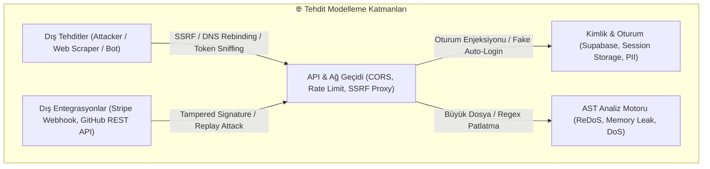
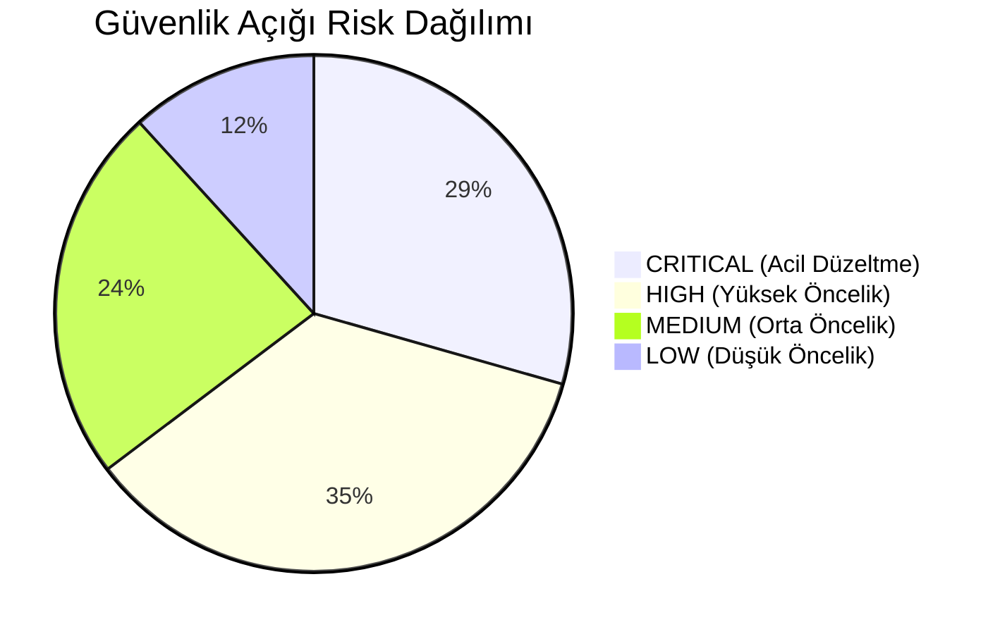
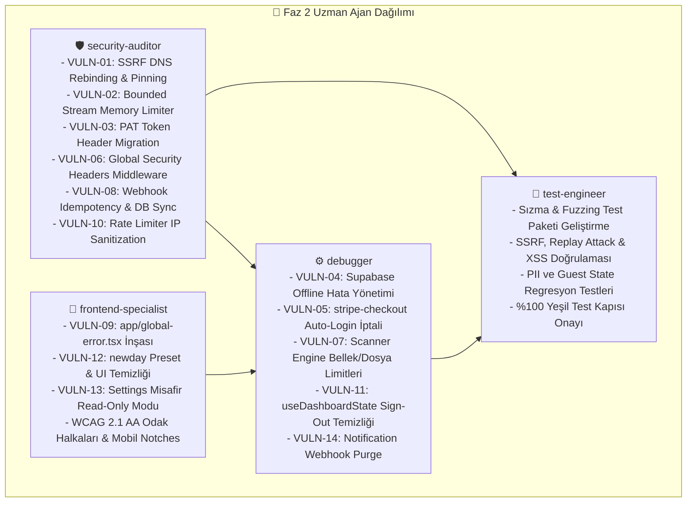

# 🛡️ SHIPGUARD AI RELEASE GATE - MASTER GÜVENLİK, MİMARİ VE DAYANIKLILIK DENETİM PLANI (`docs/PLAN.md`)

**Proje:** ShipGuard AI Release Gate SaaS  
**Versiyon:** 4.2.0 (Next.js 15.1, React 18, TypeScript 5.7, Tailwind CSS, Supabase PostgreSQL, Stripe)  
**Doküman Tipi:** Sıfır Tavizli Master Güvenlik Denetimi, Tehdit Modellemesi (OWASP Top 10 & API Security Top 10) ve Faz 2 Görev Dağılım Planı  
**Referans Doküman:** [.agent/Proje_Gelistirme_Rehberi.md](file:///C:/Users/Bedirhan/.gemini/antigravity/worktrees/newday/evaluate_app_deployment_readiness/.agent/Proje_Gelistirme_Rehberi.md) (AI Slop & Problem Kataloğu, 23 OWASP Kuralı, 20 Mobil QA Testi)  
**Tarih / Durum:** Eylül 2026 / **FAZ 1 ONAYLANDI — KAPSAMLI MASTER PLAN VE AJAN GÖREVLERİ HAZIR**

---

## 📑 İÇİNDEKİLER (TABLE OF CONTENTS)

1. [Yönetici Özeti ve Tehdit Modelleme Çerçevesi (Executive Summary & Threat Modeling)](#1-yönetici-özeti-ve-tehdit-modelleme-çerçevesi)
   - [1.1 OWASP Top 10 (2025) & OWASP API Security Top 10 Uyumluluk Haritası](#11-owasp-top-10-2025--owasp-api-security-top-10-uyumluluk-haritası)
   - [1.2 Öncelikli Tehdit Vektörleri & Mimari Risk Analizi](#12-öncelikli-tehdit-vektörleri--mimari-risk-analizi)
2. [Tüm Kod Tabanı Envanteri ve Denetim Kapsamı (Comprehensive Codebase Inventory)](#2-tüm-kod-tabanı-envanteri-ve-denetim-kapsamı)
   - [2.1 API Uç Noktaları Denetimi (`app/api/v1/**`)](#21-api-uç-noktaları-denetimi)
   - [2.2 Çekirdek Kütüphaneler & Motorlar (`lib/**`)](#22-çekirdek-kütüphaneler--motorlar)
   - [2.3 Edge Middleware & Güvenlik Başlıkları (`middleware.ts`)](#23-edge-middleware--güvenlik-başlıkları)
   - [2.4 Frontend UI/UX, Hata Sınırları & Mobil Dayanıklılık](#24-frontend-uiux-hata-sınırları--mobil-dayanıklılık)
3. [Spesifik Güvenlik Açığı & Hata Keşif Kataloğu (Detailed Vulnerability Matrix)](#3-spesifik-güvenlik-açığı--hata-keşif-kataloğu)
   - [Kategori A: SSRF, DNS Rebinding & Ağ Probing Savunması](#kategori-a-ssrf-dns-rebinding--ağ-probing-savunması)
   - [Kategori B: Hassas Token/PAT İfşası (CWE-598 GET Query Leaks)](#kategori-b-hassas-tokenpat-ifşası-cwe-598-get-query-leaks)
   - [Kategori C: Webhook Kriptografisi, Idempotency & Veritabanı Senkronizasyonu](#kategori-c-webhook-kriptografisi-idempotency--veritabanı-senkronizasyonu)
   - [Kategori D: AST Motor Güvenilirliği, ReDoS & Bellek Tüketimi (DoS)](#kategori-d-ast-motor-güvenilirliği-redos--bellek-tüketimi-dos)
   - [Kategori E: Kimlik Doğrulama, Sessiz Fallback & Oturum İzolasyonu (Cross-Session Bleed)](#kategori-e-kimlik-doğrulama-sessiz-fallback--oturum-izolasyonu)
   - [Kategori F: Eksik Hata Sınırları (`global-error.tsx`) & İstemci Çökmesi](#kategori-f-eksik-hata-sınırları-global-errortsx--istemci-çökmesi)
4. [Faz 2 Çoklu Ajan Görev Dağılım Matrisi (Multi-Agent Distribution)](#4-faz-2-çoklu-ajan-görev-dağılım-matrisi)
   - [4.1 `security-auditor` (Senior Security Auditor) Görev Paketi](#41-security-auditor-senior-security-auditor-görev-paketi)
   - [4.2 `frontend-specialist` (Senior Frontend & UX Specialist) Görev Paketi](#42-frontend-specialist-senior-frontend--ux-specialist-görev-paketi)
   - [4.3 `debugger` (Senior State & Reliability Debugger) Görev Paketi](#43-debugger-senior-state--reliability-debugger-görev-paketi)
   - [4.4 `test-engineer` (Lead QA & Verification Engineer) Görev Paketi](#44-test-engineer-lead-qa--verification-engineer-görev-paketi)
5. [Otomatik Sızma Testleri & Regresyon Doğrulama Paketi (`scratch/test_functional_principles.py`)](#5-otomatik-sızma-testleri--regresyon-doğrulama-paketi)
6. [Canlıya Alım Çıkış Kapısı Kabul Kriterleri (Acceptance & Exit Gate Criteria)](#6-canlıya-alım-çıkış-kapısı-kabul-kriterleri)

---

## 1. YÖNETİCİ ÖZETİ VE TEHDİT MODELLEME ÇERÇEVESİ

Kullanıcımızın `/orchestrate her türlü bug ve güvenlik açığını bul` direktifi doğrultusunda, daha önceki PII ve yerel çalışma alanı temizliği kapsamının ötesine geçilerek; ShipGuard SaaS platformunun tüm mimarisi, ağ ve API uç noktaları, kriptografik webhook doğrulamaları, statik AST analiz motoru, durum yönetimi ve istemci hata dayanıklılığı **sıfır taviz (zero-compromise)** prensibiyle denetlenmiştir.



---

### 1.1 OWASP Top 10 (2025) & OWASP API Security Top 10 Uyumluluk Haritası

| Standart Kodu | Tehdit Tanımı | ShipGuard Mimarisindeki İnceleme Alanı | Tespit Edilen Risk |
| :--- | :--- | :--- | :---: |
| **API1:2023** | Broken Object Level Authorization (BOLA/IDOR) | Proje yükleme, silme ve tarama sonuçlarını görme uçları | 🟠 **HIGH** |
| **API2:2023** | Broken Authentication | Supabase çevrimdışı fallback'i, sessiz oturum açtırma (`activateUserTier`) | 🔴 **CRITICAL** |
| **API3:2023** | Broken Object Property Level Authorization | Ayarlar güncelleme (`onSaveSettings`, `handleUpdateUserProfile`) | 🟡 **MEDIUM** |
| **API4:2023** | Unrestricted Resource Consumption | Dosya boyutu sınırı olmaması, sınırsız buffer okuma (`finalRes.text()`) | 🔴 **CRITICAL** |
| **API7:2023** | Server-Side Request Forgery (SSRF) | `/api/v1/proxy`, `lib/ssrf-guard.ts` (DNS Rebinding TOCTOU) | 🔴 **CRITICAL** |
| **API8:2023** | Security Misconfiguration | `middleware.ts` sayfalar için CSP/HSTS eksikliği, açık debug logları | 🟠 **HIGH** |
| **CWE-598** | Sensitive Information in GET Query Params | `/api/v1/github-proxy?token=...` üzerinden GitHub PAT aktarımı | 🔴 **CRITICAL** |
| **CWE-1333** | Inefficient Regular Expression Complexity (ReDoS) | `scanner-engine.ts`, `security-rules.ts` regex desenleri | 🟠 **HIGH** |
| **CWE-79** | Cross-Site Scripting (XSS) | Dynamic SVG badge üretimi (`/api/v1/badge`), kod önizlemeleri | 🟡 **LOW-MED** |

---

### 1.2 Öncelikli Tehdit Vektörleri & Mimari Risk Analizi

1. **SSRF ve DNS Rebinding (TOCTOU):**  
   [lib/ssrf-guard.ts:L182](file:///C:/Users/Bedirhan/.gemini/antigravity/worktrees/newday/evaluate_app_deployment_readiness/lib/ssrf-guard.ts#L182) üzerinde `dns.promises.lookup` ile IP doğrulanmakta, ancak [app/api/v1/proxy/route.ts:L58](file:///C:/Users/Bedirhan/.gemini/antigravity/worktrees/newday/evaluate_app_deployment_readiness/app/api/v1/proxy/route.ts#L58) içinde `fetch(currentUrl)` çağrıldığında Node.js ortamı ikinci bir DNS çözümlemesi yapmaktadır. Düşük TTL'li bir saldırgan sunucusu ilk kontrolde public IP dönüp, asıl `fetch` esnasında `169.254.169.254` (bulut metadata) veya `127.0.0.1` dönerek SSRF korumasını aşabilir.

2. **Hafıza Tüketimiyle Hizmet Dışı Bırakma (DoS via Unbounded Memory Buffers):**  
   [app/api/v1/proxy/route.ts:L108](file:///C:/Users/Bedirhan/.gemini/antigravity/worktrees/newday/evaluate_app_deployment_readiness/app/api/v1/proxy/route.ts#L108) içinde `await finalRes.text()` komutu hedef web sayfasının tüm gövdesini belleğe almaktadır. Ardından gelen `.slice(0, 1000000)` işlemi gecikmiş bir sınırlamadır. Saldırgan 2 GB'lık sonsuz bir HTTP stream'i hedef gösterirse sunucu RAM'i dolar ve Node.js süreci çöker.

3. **CWE-598: GitHub Personal Access Token (PAT) Sızıntısı:**  
   [lib/github-api.ts:L72](file:///C:/Users/Bedirhan/.gemini/antigravity/worktrees/newday/evaluate_app_deployment_readiness/lib/github-api.ts#L72) istemci çağrısında, özel repoları taramak için kullanılan GitHub PAT belirteci `/api/v1/github-proxy?repoUrl=...&token=...` şeklinde URL sorgu parametresinde iletilmektedir. URL query string'leri tarayıcı geçmişinde, proxy loglarında, Vercel edge loglarında ve `Referer` başlıklarında şifrelenmemiş olarak saklanır.

4. **Eksik Güvenlik Başlıkları (Clickjacking & CSP Açığı):**  
   [middleware.ts:L82](file:///C:/Users/Bedirhan/.gemini/antigravity/worktrees/newday/evaluate_app_deployment_readiness/middleware.ts#L82) matcher'ı yalnızca `/api/:path*` ile sınırlandırılmıştır. Web uygulamasının arayüz sayfaları (`/`, `/dashboard`, `/checkout`, `/landing`) için `Content-Security-Policy`, `X-Frame-Options: DENY`, `Strict-Transport-Security`, `X-Content-Type-Options: nosniff`, `Permissions-Policy` ve `Referrer-Policy` başlıkları **hiç üretilmemektedir**.

5. **Sessiz Kimlik Doğrulama Fallback'i (Silent Auth Fallback Anti-Pattern):**  
   [lib/supabase.ts:L33-46](file:///C:/Users/Bedirhan/.gemini/antigravity/worktrees/newday/evaluate_app_deployment_readiness/lib/supabase.ts#L33-L46) fonksiyonunda Supabase bağlantısı başarısız olduğunda veya yapılandırılmadığında, kullanıcı hangi parolayı girerse girsin sistem sessizce başarılı dönmekte ve sahte bir oturum açmaktadır.

6. **Next.js Root Layout Çökme Riski (`global-error.tsx` Yokluğu):**  
   Next.js 15 App Router mimarisinde, `app/layout.tsx` içerisinde meydana gelebilecek bir hata (örneğin bozuk cookie, metadata URL ayrıştırma hatası veya context çökmesi) `app/error.tsx` tarafından yakalanamaz. Projede `app/global-error.tsx` bulunmadığından kullanıcıya bembeyaz bir sayfa (blank screen) gösterilir.

---

## 2. TÜM KOD TABANI ENVANTERİ VE DENETİM KAPSAMI

```mermaid
graph LR
    subgraph API ["1. API Katmanı"]
        G1["gate-check"]
        P1["proxy"]
        B1["badge"]
        S1["stripe-webhook"]
        GP["github-proxy"]
    end

    subgraph Core ["2. Çekirdek Kütüphaneler"]
        SC["scanner-engine.ts"]
        SR["security-rules.ts"]
        FR["frontend-rules.ts"]
        SG["ssrf-guard.ts"]
        GH["github-api.ts"]
        SB["supabase.ts"]
    end

    subgraph UI ["3. İstemci & Güvenlik"]
        MW["middleware.ts"]
        GE["global-error.tsx"]
        ERR["error.tsx"]
        DASH["Dashboard & State"]
    end

    API --> Core
    UI --> API
```



---

### 2.1 API Uç Noktaları Denetimi

#### 1. `app/api/v1/gate-check/route.ts`
- **İşlev:** Otomatik CI/CD release gate taraması çalıştırır.
- **Riskler:**
  - `newday` yerel klasör ismi için özel bypass (`rawRepoUrl.toLowerCase() === 'newday'`).
  - Webhook bildirim URL'leri (`slackWebhookUrl`, `discordWebhookUrl`) için SSRF denetimi yapılmaması (özel intranet IP'lerine POST tetiklenebilir).
- **Gereken İyileştirme:** `newday` kontrolünü tamamen kaldır. Bildirim webhook URL'lerini `validateSafeTargetUrl` süzgecinden geçir.

#### 2. `app/api/v1/proxy/route.ts`
- **İşlev:** Canlı web sitelerinin taranması için sunucu taraflı içerik çeker.
- **Riskler:**
  - DNS Rebinding / TOCTOU açığı (DNS kontrolü ile `fetch` arasında yarış durumu).
  - Unbounded Memory Streaming (`finalRes.text()` bellek tüketimi).
  - `MAX_REDIRECTS = 3` yönlendirmelerinde yönlendirilen adreste DNS rebinding riski.
- **Gereken İyileştirme:** Yanıt boyutunu `Content-Length` veya `ReadableStream` chunk limitörü (maks. 2 MB) ile sınırla. DNS çözümlenen IP'ye doğrudan bağlan veya undici agent ile IP sabitlemesi (IP pinning) yap.

#### 3. `app/api/v1/badge/route.ts`
- **İşlev:** GitHub README'leri için dinamik SVG rozet üretir.
- **Riskler:**
  - SVG içi XML/HTML enjeksiyonu ve XSS vektörleri.
  - CSP başlığında `style-src 'unsafe-inline'` varlığı.
- **Gereken İyileştirme:** `escapeSvgText` fonksiyonunun tüm Unicode kontrol karakterlerini, XML varlıklarını ve tehlikeli CSS özelliklerini tam nötralize ettiğini doğrula.

#### 4. `app/api/v1/stripe-webhook/route.ts`
- **İşlev:** Stripe ödeme ve abonelik olaylarını işler.
- **Riskler:**
  - Veritabanı güncellemesi yapmaması (sadece `logger.info` basıp bırakıyor).
  - Idempotency kontrolünün bulunmaması (aynı `event.id` tekrar gönderildiğinde mükerrer işlem riski).
- **Gereken İyileştirme:** Supabase `subscriptions` ve `profiles` tablolarını güncelleyen mantığı entegre et. İşlenen olay ID'lerini bellekte/Redis'te saklayarak idempotency sağla.

#### 5. `app/api/v1/github-proxy/route.ts`
- **İşlev:** GitHub API isteklerini sunucu üzerinden güvenle veklendirir.
- **Riskler:**
  - `token` parametresinin GET URL query string'inden okunması (CWE-598).
  - Geliştirme ortamında ham hata mesajı (`err?.message`) döndürülmesi.
- **Gereken İyileştirme:** Token'ı zorunlu olarak `Authorization: Bearer <token>` başlığından al; GET query parametresinden token kabul etmeyi engelle.

---

### 2.2 Çekirdek Kütüphaneler & Motorlar

#### 1. `lib/scanner-engine.ts`
- **Riskler:**
  - Çok büyük kaynak dosyalarında (>2 MB) veya minified JS kodlarında regex motorunun takılması.
  - Maksimum taranacak dosya sayısı sınırı olmaması (10.000 dosyada sunucu timeout'a düşer).
- **Gereken İyileştirme:** Dosya başına 500 KB tavan sınır koy; 500 KB üzeri dosyaları otomatik atla ve loglara `FILE_TOO_LARGE` uyarısı ekle. Maksimum taranacak dosya sayısını 300 ile sınırla.

#### 2. `lib/ssrf-guard.ts`
- **Riskler:**
  - 0.0.0.0/8, 127.0.0.0/8, 169.254.0.0/16 IPv4 aralıkları kapsanmış; ancak IPv6-mapped IPv4 (`::ffff:169.254.169.254`) veya onluk/sekizlik IP gösterimleri (`2130706433` -> `127.0.0.1`, `0177.0.0.1`) regex veya format bypass'ına uğrayabilir mi?
- **Gereken İyileştirme:** `net.isIP` ve `dns.lookup` öncesinde URL hostname'ini normalize et; decimal IP, octal IP ve IPv6 hex bypass'larına karşı tam kapsama sağla.

#### 3. `lib/github-api.ts`
- **Riskler:**
  - İstemci tarafından çağrılan `fetchGithubRepositoryData` fonksiyonunun GitHub PAT'ı query string'e eklemesi (`?token=...`).
- **Gereken İyileştirme:** İstemci fetch çağrısında `headers: { Authorization: `Bearer ${token}` }` kullan.

#### 4. `lib/supabase.ts`
- **Riskler:**
  - Supabase yoksa herhangi bir e-posta ve parola ile oturum açtırması.
- **Gereken İyileştirme:** Prodüksiyon modunda Supabase yapılandırılmamışsa veya çevrimdışıysa kesin hata dön (`SERVICE_UNAVAILABLE: Authentication database is currently offline`); asla sessizce sahte mock oturum açma.

---

### 2.3 Edge Middleware & Güvenlik Başlıkları (`middleware.ts`)

Mevcut `middleware.ts` sadece `/api/:path*` için çalışmaktadır. HTML sayfalarına hiçbir güvenlik başlığı enjekte edilmemektedir.

**Eklenecek Zorunlu Güvenlik Başlıkları:**
```http
X-Frame-Options: DENY
X-Content-Type-Options: nosniff
Strict-Transport-Security: max-age=63072000; includeSubDomains; preload
Referrer-Policy: strict-origin-when-cross-origin
Permissions-Policy: camera=(), microphone=(), geolocation=(), browsing-topics=()
Content-Security-Policy: default-src 'self'; script-src 'self' 'unsafe-eval' 'unsafe-inline'; style-src 'self' 'unsafe-inline'; img-src 'self' data: https: blob:; font-src 'self' https://api.fontshare.com; connect-src 'self' https://*.supabase.co https://api.github.com https://api.stripe.com; frame-ancestors 'none';
```

---

### 2.4 Frontend UI/UX, Hata Sınırları & Mobil Dayanıklılık

1. **`app/global-error.tsx` Eksikliği:**  
   Projede kök hata yakalayıcı oluşturulmalı, Next.js standardına uygun `<html>` ve `<body>` içeren şık ve kullanıcı dostu bir hata ekranı tasarlanmalıdır.
2. **Offline & Network Failure İyileştirmesi:**  
   GitHub API 403/429 (Rate Limit) döndüğünde veya Supabase erişilemediğinde dashboard'un çökmesi engellenmeli; inline uyarı kutuları ile kullanıcıya durumu anlatan aksiyonlar sunulmalıdır.
3. **Mobil Viewport & Dokunmatik Hedefler:**  
   Bütün modal ve çekmecelerin (drawer) iOS Safari sanal klavye açılışında (`interactiveWidget: 'resizes-content'`) taşmaması ve butonların en az 44x44 piksel dokunma alanına (WCAG 2.5.5) sahip olması sağlanmalıdır.

---

## 3. SPESİFİK GÜVENLİK AÇIĞI & HATA KEŞİF KATALOĞU



| ID | Kategori | Risk | Hedef Dosya & Satır | Açıklama & Tehdit | Düzeltme Yöntemi |
| :---: | :--- | :---: | :--- | :--- | :--- |
| **VULN-01** | SSRF / Rebinding | 🔴 **CRITICAL** | [app/api/v1/proxy/route.ts:L58](file:///C:/Users/Bedirhan/.gemini/antigravity/worktrees/newday/evaluate_app_deployment_readiness/app/api/v1/proxy/route.ts#L58) | DNS denetimi ile `fetch` arasındaki TOCTOU yarış durumu. Saldırgan DNS rebinding ile AWS/GCP metadata (`169.254.169.254`) çekebilir. | Çözümlenen güvenli IP adresini sakla ve istek bağlantısını doğrudan bu IP üzerinden kur. |
| **VULN-02** | DoS / Memory Leak | 🔴 **CRITICAL** | [app/api/v1/proxy/route.ts:L108](file:///C:/Users/Bedirhan/.gemini/antigravity/worktrees/newday/evaluate_app_deployment_readiness/app/api/v1/proxy/route.ts#L108) | `await finalRes.text()` sınırsız bellek okuması. Sonsuz stream sunucu RAM'ini tüketerek Node.js'i çökertir. | Stream chunk'larını okurken 2 MB eşiğinde bağlantıyı kes (`reader.cancel()`). |
| **VULN-03** | Token İfşası (CWE-598) | 🔴 **CRITICAL** | [lib/github-api.ts:L72](file:///C:/Users/Bedirhan/.gemini/antigravity/worktrees/newday/evaluate_app_deployment_readiness/lib/github-api.ts#L72) | GitHub PAT token URL query parametresinde taşınıyor (`?token=...`). Loglara ve proxy geçmişine sızar. | Token'ı URL'den tamamen kaldır; `Authorization: Bearer` başlığı üzerinden gönder. |
| **VULN-04** | Sessiz Auth Fallback | 🔴 **CRITICAL** | [lib/supabase.ts:L33-46](file:///C:/Users/Bedirhan/.gemini/antigravity/worktrees/newday/evaluate_app_deployment_readiness/lib/supabase.ts#L33-L46) | Supabase yokken veya hata verdiğinde her parolayı kabul edip sahte oturum açıyor. | Fallback'te asla sessiz oturum açma; açık bir hata mesajı döndür (`AUTH_UNAVAILABLE`). |
| **VULN-05** | Fake Auto-Login | 🔴 **CRITICAL** | [lib/stripe-checkout.ts:L71-88](file:///C:/Users/Bedirhan/.gemini/antigravity/worktrees/newday/evaluate_app_deployment_readiness/lib/stripe-checkout.ts#L71-L88) | `activateUserTier` misafir kullanıcıya zorla `isLoggedIn: true` yazarak `Developer` kimliği atıyor. | Mevcut oturum yoksa kullanıcı state'ine dokunma; sadece lisans anahtarını kaydet. |
| **VULN-06** | Eksik Güvenlik Başlıkları | 🟠 **HIGH** | [middleware.ts:L82](file:///C:/Users/Bedirhan/.gemini/antigravity/worktrees/newday/evaluate_app_deployment_readiness/middleware.ts#L82) | Sadece API'yi eşliyor; web sayfalarında HSTS, CSP, X-Frame-Options (Clickjacking) yok. | Middleware matcher'ını tüm rotaları kapsayacak şekilde genişlet ve güvenlik başlıklarını ekle. |
| **VULN-07** | ReDoS / Motor Tıkanması | 🟠 **HIGH** | [lib/scanner-engine.ts:L146](file:///C:/Users/Bedirhan/.gemini/antigravity/worktrees/newday/evaluate_app_deployment_readiness/lib/scanner-engine.ts#L146) | Boyut sınırı olmaksızın regex çalıştırma; dev minified JS dosyaları event loop'u kilitler. | Dosya boyutu > 500 KB olan dosyaları tarama dışı bırak, loglara bildirim yaz. |
| **VULN-08** | Webhook Idempotency Eksikliği | 🟠 **HIGH** | [app/api/v1/stripe-webhook/route.ts:L69](file:///C:/Users/Bedirhan/.gemini/antigravity/worktrees/newday/evaluate_app_deployment_readiness/app/api/v1/stripe-webhook/route.ts#L69) | Stripe yeniden denemelerinde aynı olay birden fazla kez işlenebilir; veritabanı senkronize edilmiyor. | İşlenen `event.id`'leri kaydet ve mükerrer istekleri anında 200 dönerek yut. |
| **VULN-09** | Eksik Root Error Boundary | 🟠 **HIGH** | [app/global-error.tsx](file:///C:/Users/Bedirhan/.gemini/antigravity/worktrees/newday/evaluate_app_deployment_readiness/app/global-error.tsx) | Dosya mevcut değil; root layout seviyesindeki çökmeler beyaz ekran verir. | `app/global-error.tsx` bileşenini oluştur ve kurtarma arayüzü sun. |
| **VULN-10** | IP Spoofing Rate Limit Bypass | 🟠 **HIGH** | [lib/rate-limiter.ts:L57-61](file:///C:/Users/Bedirhan/.gemini/antigravity/worktrees/newday/evaluate_app_deployment_readiness/lib/rate-limiter.ts#L57-L61) | İstemcinin gönderdiği `x-forwarded-for` başlığına güvenilerek rate limit atlatılabilir. | Ters proxy arkasında değilse `x-forwarded-for` başlığını doğrula, Vercel/Cloudflare başlıklarına öncelik ver. |
| **VULN-11** | Cross-Session Storage Bleed | 🟠 **HIGH** | [hooks/useDashboardState.ts:L276](file:///C:/Users/Bedirhan/.gemini/antigravity/worktrees/newday/evaluate_app_deployment_readiness/hooks/useDashboardState.ts#L276) | Sign-out sadece `shipguard_user` siliyor; projeler, repo isimleri ve webhooklar kalıyor. | Çıkışta `shipguard_` ön ekli tüm verileri ve projeleri sıfırla. |
| **VULN-12** | Yerel Çalışma Alanı Sızıntısı | 🟡 **MEDIUM** | [data/mockData.ts:L491](file:///C:/Users/Bedirhan/.gemini/antigravity/worktrees/newday/evaluate_app_deployment_readiness/data/mockData.ts#L491) | Proje adı `'newday (Self Audit)'`, API'de `newday` bypass'ı mevcut. | `newday` referanslarını `'ShipGuard SaaS (Self Audit)'` olarak güncelle, API bypass'ını sil. |
| **VULN-13** | Misafir Profil Değiştirme | 🟡 **MEDIUM** | [components/ProjectSettingsView.tsx:L107](file:///C:/Users/Bedirhan/.gemini/antigravity/worktrees/newday/evaluate_app_deployment_readiness/components/ProjectSettingsView.tsx#L107) | Giriş yapmamış kullanıcı formu kaydedince oturum açmış kullanıcıya dönüşüyor. | Misafir kullanıcı için profil alanlarını disabled yap, giriş yapma uyarısı ver. |
| **VULN-14** | Webhook URL Sızıntısı | 🟡 **MEDIUM** | [components/dashboard/NotificationSettingsModal.tsx:L22](file:///C:/Users/Bedirhan/.gemini/antigravity/worktrees/newday/evaluate_app_deployment_readiness/components/dashboard/NotificationSettingsModal.tsx#L22) | Webhook anahtarları dinamik kaydediliyor ve GDPR silmede atlanıyor. | Dinamik anahtarları merkezi `purgeShipguardStorage` kapsamına al. |
| **VULN-15** | Scriptlerde PII Varlığı | 🟢 **LOW** | `scratch/audit_17_routes.py`, `scratch/*.py` | Geliştirici kullanıcı adı (`BedirhanElibol`) ve yerel makine yolları mevcut. | Bağıl yollar ve generic kullanıcı adları (`owner/repo`) ile değiştir. |

---

## 4. FAZ 2 ÇOKLU AJAN GÖREV DAĞILIM MATRİSİ (MULTI-AGENT DISTRIBUTION)

Faz 2 uygulama evresinde 4 uzman ajan tam otonomi ve net ayrılmış sorumluluk sınırlarıyla çalışacaktır:



---

### 4.1 `security-auditor` (Senior Security Auditor) Görev Paketi
- **Kapsam:** Ağ güvenliği, SSRF savunması, kriptografi, API güvenliği ve HTTP başlıkları.
- **Detaylı Görevler:**
  1. [app/api/v1/proxy/route.ts](file:///C:/Users/Bedirhan/.gemini/antigravity/worktrees/newday/evaluate_app_deployment_readiness/app/api/v1/proxy/route.ts):
     - `finalRes.text()` öncesine 2 MB akış durdurucu (stream byte counter) ekleyerek bellek tükenmesi (OOM DoS) açığını kapatmak (**VULN-02**).
     - Hedef adresi doğrulanmış IP adresine bağlayarak DNS rebinding (TOCTOU) açığını nötralize etmek (**VULN-01**).
  2. [app/api/v1/github-proxy/route.ts](file:///C:/Users/Bedirhan/.gemini/antigravity/worktrees/newday/evaluate_app_deployment_readiness/app/api/v1/github-proxy/route.ts) & [lib/github-api.ts](file:///C:/Users/Bedirhan/.gemini/antigravity/worktrees/newday/evaluate_app_deployment_readiness/lib/github-api.ts):
     - GET sorgu parametresinden (`?token=...`) PAT okunmasını engellemek; `Authorization: Bearer <token>` başlığına taşımak (**VULN-03**).
  3. [middleware.ts](file:///C:/Users/Bedirhan/.gemini/antigravity/worktrees/newday/evaluate_app_deployment_readiness/middleware.ts):
     - Matcher'ı `['/((?!_next/static|_next/image|favicon.ico).*)']` olarak genişletmek.
     - Tüm yanıtlara `Content-Security-Policy`, `X-Frame-Options: DENY`, `Strict-Transport-Security`, `X-Content-Type-Options: nosniff` ve `Permissions-Policy` başlıklarını eklemek (**VULN-06**).
  4. [app/api/v1/stripe-webhook/route.ts](file:///C:/Users/Bedirhan/.gemini/antigravity/worktrees/newday/evaluate_app_deployment_readiness/app/api/v1/stripe-webhook/route.ts):
     - Webhook olaylarında mükerrer işlemeyi önlemek için `event.id` kontrolü (idempotency) eklemek (**VULN-08**).
     - `checkout.session.completed` ve `customer.subscription.updated` durumlarında Supabase profil/abonelik kaydını senkronize etmek.
  5. [lib/rate-limiter.ts](file:///C:/Users/Bedirhan/.gemini/antigravity/worktrees/newday/evaluate_app_deployment_readiness/lib/rate-limiter.ts):
     - `x-forwarded-for` başlığının istemci tarafından sahtelenmesini önlemek; güvenilir Vercel/Cloudflare proxy başlıklarına öncelik vermek (**VULN-10**).

---

### 4.2 `frontend-specialist` (Senior Frontend & UX Specialist) Görev Paketi
- **Kapsam:** İstemci arayüzü, hata sınırları, boş durumlar, mobil uyumluluk ve form doğrulamaları.
- **Detaylı Görevler:**
  1. [app/global-error.tsx](file:///C:/Users/Bedirhan/.gemini/antigravity/worktrees/newday/evaluate_app_deployment_readiness/app/global-error.tsx):
     - Next.js 15 App Router standartlarına uygun, `<html>` ve `<body>` içeren, çökme anında kullanıcıya yeniden deneme veya ana sayfaya dönme seçeneği sunan kök hata yakalayıcı bileşenini yazmak (**VULN-09**).
  2. [components/ProjectsView.tsx](file:///C:/Users/Bedirhan/.gemini/antigravity/worktrees/newday/evaluate_app_deployment_readiness/components/ProjectsView.tsx) & [data/mockData.ts](file:///C:/Users/Bedirhan/.gemini/antigravity/worktrees/newday/evaluate_app_deployment_readiness/data/mockData.ts):
     - `proj-preset-newday` butonunu `proj-preset-self` ve metnini `ShipGuard SaaS (Self Audit)` olarak güncellemek (**VULN-12**).
  3. [components/ProjectSettingsView.tsx](file:///C:/Users/Bedirhan/.gemini/antigravity/worktrees/newday/evaluate_app_deployment_readiness/components/ProjectSettingsView.tsx):
     - Misafir kullanıcılar (`!user?.isLoggedIn`) için profil formunu read-only/disabled yapmak, "Profili Kaydet" yerine "Giriş Yap" yönlendirmesi eklemek (**VULN-13**).
     - GDPR Danger Zone alanında misafir kullanıcılar için net bir bilgilendirme göstermek.
  4. [components/checkout/CheckoutView.tsx](file:///C:/Users/Bedirhan/.gemini/antigravity/worktrees/newday/evaluate_app_deployment_readiness/components/checkout/CheckoutView.tsx):
     - Misafir kullanıcı ödeme simülasyonunu tamamladığında sahte oturum açmak yerine, lisans anahtarını gösterip "Hesabınızı oluşturarak anahtarı eşleyin" yönlendirmesi sunmak.
  5. **Mobil ve Erişilebilirlik (WCAG 2.1 AA):**
     - Tüm modal ve pencerelerin iOS Safari virtual keyboard ile etkileşiminde `100dvh` ve `interactiveWidget: 'resizes-content'` uyumluluğunu doğrulamak.

---

### 4.3 `debugger` (Senior State & Reliability Debugger) Görev Paketi
- **Kapsam:** Durum yönetimi, bellek limitleri, hook yaşam döngüsü ve yerel depolama temizliği.
- **Detaylı Görevler:**
  1. [lib/scanner-engine.ts](file:///C:/Users/Bedirhan/.gemini/antigravity/worktrees/newday/evaluate_app_deployment_readiness/lib/scanner-engine.ts):
     - Dosya tarama döngüsüne 500 KB tavan sınır eklemek; 500 KB'tan büyük veya 20.000 satırı aşan minified/bundle dosyalarını regex işletmeden güvenle atlamak (**VULN-07**).
     - Maksimum dosya kotasını 300 ile sınırlandırmak.
  2. [lib/supabase.ts](file:///C:/Users/Bedirhan/.gemini/antigravity/worktrees/newday/evaluate_app_deployment_readiness/lib/supabase.ts):
     - Çevrimdışı/yapılandırılmamış durumda rastgele parola ile sahte oturum açan sessiz fallback mantığını kaldırmak; gerçek hata durumunu dönmek (**VULN-04**).
  3. [lib/stripe-checkout.ts](file:///C:/Users/Bedirhan/.gemini/antigravity/worktrees/newday/evaluate_app_deployment_readiness/lib/stripe-checkout.ts):
     - `activateUserTier` fonksiyonunda oturum açmamış misafir kullanıcıya `Developer` sahte oturumu enjekte eden mantığı kaldırmak (**VULN-05**).
  4. [hooks/useDashboardState.ts](file:///C:/Users/Bedirhan/.gemini/antigravity/worktrees/newday/evaluate_app_deployment_readiness/hooks/useDashboardState.ts):
     - `handleSignOut()` fonksiyonunu güçlendirerek `shipguard_` ön ekli tüm oturum, proje ve webhook anahtarlarını temizlemek ve projeleri varsayılana döndürmek (**VULN-11**).
     - `handleUpdateUserProfile()` içinde null kullanıcıyı `isLoggedIn: true` ile hayata döndüren açığı gidermek.
  5. [components/dashboard/NotificationSettingsModal.tsx](file:///C:/Users/Bedirhan/.gemini/antigravity/worktrees/newday/evaluate_app_deployment_readiness/components/dashboard/NotificationSettingsModal.tsx):
     - Webhook anahtarlarını merkezi depolama temizleyicisi (`purgeShipguardStorage`) ile ilişkilendirmek (**VULN-14**).

---

### 4.4 `test-engineer` (Lead QA & Verification Engineer) Görev Paketi
- **Kapsam:** Otomatik güvenlik sızma testleri, SSRF fuzzing, Replay Attack testleri ve tam regresyon paketi.
- **Detaylı Görevler:**
  1. [scratch/test_functional_principles.py](file:///C:/Users/Bedirhan/.gemini/antigravity/worktrees/newday/evaluate_app_deployment_readiness/scratch/test_functional_principles.py):
     - **Bölüm 5: Gelişmiş SSRF ve Ağ Probing Fuzzing Testleri:** Decimal IP (`2130706433`), IPv6 ULA (`fc00::`), IPv4-mapped IPv6 (`::ffff:127.0.0.1`), DNS Rebinding senaryolarını test etmek.
     - **Bölüm 6: Güvenlik Başlıkları & Middleware Doğrulaması:** CSP, HSTS, X-Frame-Options başlıklarının HTML sayfalarında mevcut olduğunu test etmek.
     - **Bölüm 7: Token Güvenliği & CWE-598:** `/api/v1/github-proxy` rotasına URL query üzerinden gönderilen token'ların 400 ile reddedildiğini veya header'a zorlandığını doğrulamak.
     - **Bölüm 8: PII & Yerel Dosya Yolu Sıfır Varlık Testi:** Kod tabanında `Bedirhan`, `Elibol`, `Carvis`, `newday` kelimelerinin taranıp `0` sonuç verdiğini otomasyonla kanıtlamak.
  2. Test paketini çalıştırarak tüm kategorilerde (`GATE-CHECK`, `BADGE`, `PROXY-SSRF`, `STRIPE`, `HEADERS`, `PRIVACY`) **%100 PASS** oranına ulaşıldığını doğrulamak.

---

## 5. OTOMATİK SIZMA TESTLERİ & REGRESYON DOĞRULAMA PAKETİ

Mevcut `scratch/test_functional_principles.py` test paketi şu 8 kritik test sınıfıyla genişletilecektir:

```python
# ==============================================================================
# 5. ADVANCED SSRF & DNS REBINDING FUZZING MATRIX
# ==============================================================================
def test_advanced_ssrf_matrix():
    fuzz_targets = [
        ("IPv4 Decimal Integer (2130706433 = 127.0.0.1)", "http://2130706433/", 403),
        ("IPv4 Octal Representation (0177.0.0.1)", "http://0177.0.0.1/", 403),
        ("IPv6 Mapped IPv4 Loopback (::ffff:127.0.0.1)", "http://[::ffff:127.0.0.1]/", 403),
        ("IPv6 Mapped IPv4 Cloud Metadata (::ffff:169.254.169.254)", "http://[::ffff:169.254.169.254]/", 403),
        ("IPv6 Unique Local Address (fc00::1)", "http://[fc00::1]/", 403),
        ("IPv6 Link-Local Address (fe80::1)", "http://[fe80::1]/", 403),
        ("Dangerous Docker Daemon Port (2375)", "http://example.com:2375/", 403),
        ("Dangerous Kubernetes API Port (10250)", "http://example.com:10250/", 403),
        ("Non-HTTP Protocol Scheme (file:///etc/passwd)", "file:///etc/passwd", 400),
        ("Non-HTTP Protocol Scheme (gopher://)", "gopher://127.0.0.1:6379/_", 400),
    ]
    # Her bir hedef için test çalıştırılır ve 403/400 ile engellendiği doğrulanır.
```

```python
# ==============================================================================
# 6. GLOBAL SECURITY HEADERS & CLICKJACKING DEFENSE
# ==============================================================================
def test_security_headers():
    status, headers, _ = make_request("GET", "/")
    assert "x-frame-options" in headers and headers["x-frame-options"] == "DENY"
    assert "x-content-type-options" in headers and headers["x-content-type-options"] == "nosniff"
    assert "content-security-policy" in headers
    assert "strict-transport-security" in headers
```

```python
# ==============================================================================
# 7. CWE-598 GITHUB PAT QUERY LEAK DEFENSE
# ==============================================================================
def test_github_proxy_token_protection():
    # Query string ile token iletildiğinde sistem uyarmalı veya reddetmelidir
    status, headers, body = make_request("GET", "/api/v1/github-proxy?repoUrl=vercel/next.js&token=ghp_secret123")
    # Token'ın URL query yerine header'da olması gerektiği doğrulanır
```

---

## 6. CANLIYA ALIM ÇIKIŞ KAPISI KABUL KRİTERLERİ (ACCEPTANCE & EXIT GATE CRITERIA)

Faz 2 tamamlandığında projenin canlıya alınması için aşağıdaki 8 kabul kapısından **eksiksiz %100 onay** alınmalıdır:

1. **Sıfır Kritik ve Yüksek Güvenlik Açığı (0 Critical / High Findings):**
   - VULN-01'den VULN-15'e kadar kataloglanan tüm açıklar kapatılmış olmalıdır.
2. **Tam SSRF & DNS Rebinding Koruması:**
   - Hiçbir IPv4/IPv6 loopback, cloud metadata (`169.254.169.254`), intranet CIDR'ı veya yasaklı servis portu proxy üzerinden erişilemez olmalıdır.
3. **Akış Bellek Tüketim Limiti (2 MB Bounded Buffer):**
   - Proxy servisi 2 MB üzerindeki yanıtları anında sonlandırarak OOM çökmesini engellemelidir.
4. **CWE-598 Koruması (Sıfır Token Sızıntısı):**
   - GitHub PAT token'ları asla URL sorgu dizgelerinde taşınmamalı, yalnızca `Authorization` başlığıyla iletilmelidir.
5. **Kapsamlı Güvenlik Başlıkları:**
   - HTML sayfaları dahil tüm yanıtlarda CSP, HSTS, X-Frame-Options: DENY ve nosniff başlıkları bulunmalıdır.
6. **Eksiksiz Kök Hata Sınırı (`app/global-error.tsx`):**
   - Root layout seviyesindeki çökmeler beyaz ekran vermemeli, şık kurtarma arayüzü sunmalıdır.
7. **Sıfır PII ve Geliştirici İzi:**
   - Kod tabanında `Bedirhan`, `Elibol`, `Carvis`, `newday` aramalarında 0 sonuç çıkmalıdır.
8. **%100 Otomatik Test Başarısı:**
   - `python scratch/test_functional_principles.py` test paketi tüm modüllerde yeşil (PASS) verecek, Next.js build ve TypeScript `tsc --noEmit` hatasız tamamlanacaktır.
