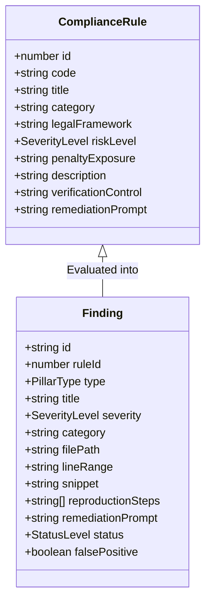
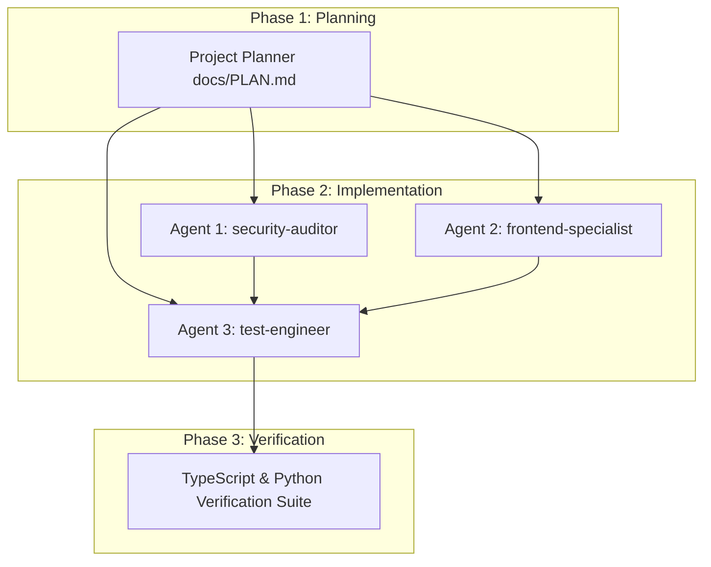

# 🛡️ SHIPGUARD ENTERPRISE PRE-FLIGHT GATE: GLOBAL REGULATORY, PRIVACY & LEGAL COMPLIANCE
> **Document Version:** 3.0.0-ENTERPRISE  
> **Status:** Phase 1 Master Architecture & Multi-Agent Implementation Plan  
> **Classification:** Legal & Regulatory Engineering / Pre-Deployment Release Gate  
> **Primary Authority:** GDPR (EU), CCPA/CPRA (California), FTC Act Sec. 5 (US), ePrivacy Directive 2002/58/EC, PCI-DSS v4.0  
> **Language Standard:** 100% Native English (Strict Corporate & Legal English)

---

## 🏛️ 1. EXECUTIVE SUMMARY & REAL-WORLD LEGAL EXPOSURE ANALYSIS

### 1.1 The High Cost of "Deploy First, Comply Later"
Modern software development frameworks (Next.js, Vercel, Supabase, Tailwind) allow engineering teams to build and ship production applications in hours. However, this deployment velocity introduces dangerous regulatory blind spots. Startups and enterprise SaaS products frequently deploy code that directly violates international privacy statutes, consumer protection laws, and payment card industry standards.

Regulatory authorities no longer issue soft warnings; automated crawling by privacy advocacy groups (e.g., NOYB) and enforcement agencies (CNIL, ICO, California Privacy Protection Agency, FTC) has resulted in historic penalties, injunctions, and forced domain takedowns.

```
┌──────────────────────────────────────────────────────────────────────────────────────────┐
│                           GLOBAL REGULATORY PENALTY LANDSCAPE                             │
├───────────────────────┬───────────────────────┬──────────────────────────────────────────┤
│ Regulatory Authority  │ Governing Statute     │ Maximum Statutory Penalties & Liabilities│
├───────────────────────┼───────────────────────┼──────────────────────────────────────────┤
│ European Union (EDPB) │ GDPR (Regulation EU   │ Up to €20,000,000 or 4% of total global  │
│ & National DPAs       │ 2016/679)             │ annual turnover (whichever is higher)    │
├───────────────────────┼───────────────────────┼──────────────────────────────────────────┤
│ European Union        │ ePrivacy Directive    │ National statutory fines; immediate site │
│ (CNIL, DPC, BfDI)     │ (Directive 2002/58/EC)│ injunctions & cookie banner blocks       │
├───────────────────────┼───────────────────────┼──────────────────────────────────────────┤
│ California Privacy    │ CCPA / CPRA           │ Up to $7,500 per intentional violation;  │
│ Protection Agency     │ (Cal. Civ. Code)      │ $100–$750 statutory damages per consumer │
├───────────────────────┼───────────────────────┼──────────────────────────────────────────┤
│ United States (FTC)   │ FTC Act Section 5     │ Civil penalties up to $50,120 per day per│
│                       │ (15 U.S.C. § 45)      │ violation; 20-year consent decrees       │
├───────────────────────┼───────────────────────┼──────────────────────────────────────────┤
│ Payment Card Industry │ PCI-DSS v4.0          │ $5,000 to $100,000/month bank fines;     │
│ Security Standards    │ Requirements 3, 4, 6  │ Revocation of merchant card processing   │
└───────────────────────┴───────────────────────┴──────────────────────────────────────────┘
```

---

### 1.2 Top 6 Production Vulnerabilities Driving Regulatory Enforcement

#### 1. Unconsented Third-Party Tracker & Pixel Invocations (ePrivacy & GDPR Art. 6)
- **The Exposure:** Inserting Google Tag Manager (`GTM`), Google Analytics 4 (`gtag`), Meta Pixel (`fbq`), TikTok Pixel, or Hotjar scripts directly inside `<head>` or root layouts (`app/layout.tsx`) so they fire on initial page render prior to explicit, affirmative user opt-in.
- **Precedent:** In 2022 and 2023, the French CNIL issued over **€210M** in fines against Google and Meta specifically for non-compliant cookie injection and tracking mechanics. European courts ruled (CJEU *Planet49*) that pre-checked boxes or tracking prior to consent violates EU law.

#### 2. Missing or Inaccessible Privacy Policy & Terms of Service (GDPR Art. 13/14, CCPA, FTC)
- **The Exposure:** Shipping public web applications, landing pages, or authentication modals lacking accessible, working links to an active Privacy Policy and Terms of Service, or using placeholder dead links (`href="#"`, `javascript:void(0)`).
- **Precedent:** GDPR Articles 13 and 14 mandate clear notice at the point of personal data collection. Failure to provide transparent privacy notices constitutes an automatic Level 2 GDPR violation (up to €20M / 4% turnover). Under CCPA § 1798.100, failure to conspicuously post a compliant privacy policy triggers California Attorney General enforcement.

#### 3. Deceptive Dark Patterns in Cookie Consent Banners (EDPB & CNIL Equal Choice Standard)
- **The Exposure:** Implementing cookie banners with a prominent, high-contrast "Accept All" button while concealing the rejection option behind secondary menus, tiny low-contrast text, or omitting a "Reject All" button altogether.
- **Precedent:** The EDPB Cookie Banner Taskforce and CNIL Guidelines mandate that **rejecting cookies must be as easy as accepting them with a single click** ("Refuser aussi facilement qu'accepter"). Sites violating this standard face automated fines and injunctions.

#### 4. Form Submissions Without Informed Consent Disclosures (GDPR Art. 7 & CCPA)
- **The Exposure:** Newsletter lead-capture bars, waitlist forms, registration screens, and contact inputs that collect names, emails, or company data without affirmative consent checkmarks or explicit legal disclosures notifying users how their data will be processed.
- **Precedent:** Under GDPR Art. 7, consent must be freely given, specific, informed, and unambiguous. Silent opt-ins, bundled agreements, or pre-ticked consent checkboxes are explicitly illegal.

#### 5. PII & Secret Exfiltration via URL Query Parameters (OWASP API & GDPR Art. 25/32)
- **The Exposure:** Passing plaintext emails, user IDs, auth tokens, phone numbers, or session secrets inside URL search parameters (e.g., `https://app.com/welcome?email=user@domain.com&token=xyz`).
- **Precedent:** Query strings are automatically captured in plaintext in browser histories, web server proxy access logs (Cloudflare, Nginx, Vercel), and HTTP `Referer` headers transmitted to third-party CDNs and analytics vendors. This constitutes a direct breach of GDPR Article 32 (Security of Processing) and Article 25 (Privacy by Design).

#### 6. Raw Cardholder Data Input Exposure (PCI-DSS Requirements 3 & 4)
- **The Exposure:** Creating unhosted HTML input elements for credit card numbers, CVVs, or expiration dates (`<input name="card_number" />`) directly on application servers rather than using PCI-certified hosted iframes (Stripe Elements, Polar, PayPal Hosted Fields).
- **Precedent:** Rendering raw credit card inputs immediately shifts a merchant's compliance scope from **SAQ A** (self-assessment questionnaire of ~22 controls) to **SAQ D** (over 300 forensic controls, mandatory vulnerability scans, and on-site QSA audits). A single breach of raw cardholder data carries bank penalties of up to **$500,000**, forensic investigation costs, and complete merchant account revocation.

---

### 1.3 ShipGuard’s Market Positioning: The Pre-Flight Regulatory Release Gate
Just as ShipGuard serves as the automated pre-flight gate for OWASP security vulnerabilities and UI anti-patterns, ShipGuard will now serve as the **Global Regulatory, Privacy & Legal Pre-Flight Gate (`LEGAL_COMPLIANCE`)**.

Before code merges to `main` or deploys to production, ShipGuard’s AST scanner evaluates source files for regulatory non-compliance, blocks failing pull requests, and provides instant, copy-paste remediation diffs.

```
┌────────────────────────────────────────────────────────────────────────────────────────┐
│                        SHIPGUARD PRE-FLIGHT RELEASE GATES                              │
├──────────────────────────┬──────────────────────────┬──────────────────────────────────┤
│ 🛡️ SECURITY PRE-FLIGHT   │ 🎨 VIBEPOLISH UI/UX      │ ⚖️ LEGAL COMPLIANCE PRE-FLIGHT    │
│ (OWASP Top 10 + Secrets) │ (Anti-Slop & Cliches)    │ (GDPR, CCPA, ePrivacy, PCI-DSS)  │
├──────────────────────────┼──────────────────────────┼──────────────────────────────────┤
│ • Hardcoded API Secrets  │ • Monochromatic Tokens   │ • Tracker Pre-Consent Injection  │
│ • Permissive Supabase RLS│ • Contrast Ratios (AAA)  │ • Missing Privacy Policy Routes  │
│ • CORS Wildcards (*)     │ • No Generic AI Gradients│ • Cookie Banner Dark Patterns    │
│ • Storage Bucket Leaks   │ • Accessible Touch (>44px│ • Form Lead Consent Disclosures │
│ • Server-Side Auth Flags │ • Mobile Table Cards     │ • PII Leakage in URL Parameters  │
│ • Rate Limiting & DoS    │ • WCAG 2.1 AA Focus Rings│ • Raw Cardholder Input Exposure  │
└──────────────────────────┴──────────────────────────┴──────────────────────────────────┘
```

---

## 📜 2. RULE TAXONOMY: CATEGORY `LEGAL_COMPLIANCE` (RULES 2001–2006)

This section establishes the formal taxonomy for the 6 production-grade rules under the `LEGAL_COMPLIANCE` category.



---

### 2.1 Rule COMPL-01 (RULE-2001): Accessible Privacy Policy & Terms Routes & Links
- **Rule ID:** `2001` (Catalog Code: `COMPL-01`)
- **Category:** `LEGAL_COMPLIANCE` / `Transparency & Notice`
- **Severity:** `HIGH`
- **Governing Law:** GDPR Art. 13 & 14, CCPA § 1798.100, FTC Act Sec. 5
- **Penalty Exposure:** Up to €20,000,000 or 4% global turnover under GDPR; $7,500 statutory fines per violation under CCPA.
- **Description:** Scans for absence of accessible Privacy Policy and Terms of Service routes or presence of dummy/dead links (`href="#"`, `href="javascript:void(0)"`, `href=""`) in navigation footers, layouts, and authentication modals.
- **Verification Control:** Project must provide functional `/privacy` and `/terms` routes, linked conspicuously in primary layout footers and auth modals.
- **Vulnerable Code Pattern:**
  ```tsx
  // VULNERABLE: Dead links in footer or auth forms
  <footer className="py-6">
    <a href="#" className="text-gray-400">Privacy Policy</a>
    <a href="javascript:void(0)" className="text-gray-400">Terms of Service</a>
  </footer>
  ```
- **Remediated Code Pattern:**
  ```tsx
  // COMPLIANT: Valid Next.js route links to dedicated legal documents
  import Link from 'next/link';

  <footer className="py-6 flex gap-4 text-xs text-muted-foreground">
    <Link href="/privacy" className="hover:underline focus:ring-2 focus:ring-emerald-500">
      Privacy Policy
    </Link>
    <Link href="/terms" className="hover:underline focus:ring-2 focus:ring-emerald-500">
      Terms of Service
    </Link>
  </footer>
  ```
- **Remediation Prompt:** *"Add dedicated, accessible legal routes at `app/privacy/page.tsx` and `app/terms/page.tsx`. Replace all placeholder anchor links with Next.js `<Link href="/privacy">` and `<Link href="/terms">` in footers and auth modals."*

---

### 2.2 Rule COMPL-02 (RULE-2002): Unconsented Third-Party Tracker & Pixel Script Injection
- **Rule ID:** `2002` (Catalog Code: `COMPL-02`)
- **Category:** `LEGAL_COMPLIANCE` / `Consent & Tracking`
- **Severity:** `CRITICAL`
- **Governing Law:** ePrivacy Directive (Directive 2002/58/EC Art. 5(3)), GDPR Art. 6(1)(a), CJEU Planet49
- **Penalty Exposure:** Immediate regulatory injunctions, daily non-compliance penalties up to €100,000/day, national DPA fines (e.g. CNIL €150M).
- **Description:** Detects hardcoded third-party analytics and ad pixel trackers (Google Tag Manager `googletagmanager.com`, Google Analytics `gtag('config')`, Meta Pixel `connect.facebook.net/en_US/fbevents.js` / `fbq('init')`, TikTok Pixel, Hotjar `static.hotjar.com`) loaded in `<head>`, `app/layout.tsx`, or root components without dynamic consent state gating.
- **Verification Control:** Non-essential tracking scripts must be conditionally mounted only after verified user consent (`hasConsented === true` or Google Consent Mode v2 default initialized to `'denied'`).
- **Vulnerable Code Pattern:**
  ```tsx
  // VULNERABLE: Direct injection of Meta Pixel & GA4 on initial load without consent check
  import Script from 'next/script';

  export default function RootLayout({ children }) {
    return (
      <html>
        <head>
          <Script src="https://www.googletagmanager.com/gtag/js?id=G-XXXXX" strategy="afterInteractive" />
          <Script id="meta-pixel" strategy="afterInteractive">
            {`!function(f,b,e,v,n,t,s){...;fbq('init', '123456789');fbq('track', 'PageView');}`}
          </Script>
        </head>
        <body>{children}</body>
      </html>
    );
  }
  ```
- **Remediated Code Pattern:**
  ```tsx
  // COMPLIANT: Scripts execute only upon verified user consent state or default-denied Consent Mode
  'use client';
  import Script from 'next/script';
  import { useCookieConsent } from '@/hooks/useCookieConsent';

  export function AnalyticsGate() {
    const { consent } = useCookieConsent();
    if (consent !== 'granted') return null;

    return (
      <>
        <Script src="https://www.googletagmanager.com/gtag/js?id=G-XXXXX" strategy="afterInteractive" />
        <Script id="meta-pixel" strategy="afterInteractive">
          {`fbq('init', '123456789'); fbq('track', 'PageView');`}
        </Script>
      </>
    );
  }
  ```
- **Remediation Prompt:** *"Wrap all third-party analytics (GA4, GTM, Meta Pixel, Hotjar) inside a consent-aware component. Initialize Google Consent Mode v2 with default denied parameters, and only fire tracking scripts once the user explicitly clicks 'Accept' on the cookie consent banner."*

---

### 2.3 Rule COMPL-03 (RULE-2003): Dark Pattern Cookie Banner Prevention (Equal Choice Standard)
- **Rule ID:** `2003` (Catalog Code: `COMPL-03`)
- **Category:** `LEGAL_COMPLIANCE` / `Consent & Tracking`
- **Severity:** `HIGH`
- **Governing Law:** EDPB Cookie Banner Guidelines, CNIL Deliberation No. 2020-091, FTC Dark Patterns Report
- **Penalty Exposure:** CNIL administrative fines (€10M–€60M range), FTC enforcement against deceptive UI practices.
- **Description:** Scans cookie consent banner components to ensure they provide an equally prominent "Reject All" / "Decline" action button adjacent to the "Accept All" button. Flags banners that omit rejection or force users into nested configuration panels to decline cookies.
- **Verification Control:** Cookie banner must offer equal visual hierarchy and 1-click parity between "Accept All" and "Reject All / Decline".
- **Vulnerable Code Pattern:**
  ```tsx
  // VULNERABLE: Only provides "Accept All" or hides decline in hidden settings
  export function CookieBanner() {
    return (
      <div className="fixed bottom-0 w-full p-4 bg-black text-white flex justify-between">
        <span>We use cookies to improve your experience.</span>
        <button onClick={acceptAll} className="btn-primary">Accept All Cookies</button>
      </div>
    );
  }
  ```
- **Remediated Code Pattern:**
  ```tsx
  // COMPLIANT: Symmetric, 1-click Accept and Decline buttons with equal visual contrast
  export function CookieBanner() {
    return (
      <div role="dialog" aria-labelledby="cookie-title" className="fixed bottom-4 right-4 max-w-md p-5 bg-[#141414] border border-white/10 rounded-xl shadow-2xl z-50">
        <h3 id="cookie-title" className="text-sm font-bold text-white">Privacy & Cookie Choices</h3>
        <p className="text-xs text-muted-foreground mt-1">We use cookies for analytics and performance. You can accept all or reject non-essential cookies.</p>
        <div className="flex items-center gap-3 mt-4">
          <button onClick={rejectNonEssential} className="btn-secondary flex-1 py-2 text-xs font-bold border-white/20 hover:bg-white/5">
            Reject Non-Essential
          </button>
          <button onClick={acceptAll} className="btn-primary flex-1 py-2 text-xs font-bold bg-emerald-600 hover:bg-emerald-500">
            Accept All
          </button>
        </div>
      </div>
    );
  }
  ```
- **Remediation Prompt:** *"Modify cookie banner component to render dual, equally visible action buttons: 'Accept All' and 'Reject Non-Essential'. Both buttons must have equivalent click targets, visible contrast, and trigger with a single click."*

---

### 2.4 Rule COMPL-04 (RULE-2004): Consent Disclosure on User Input & Lead Forms
- **Rule ID:** `2004` (Catalog Code: `COMPL-04`)
- **Category:** `LEGAL_COMPLIANCE` / `Data Collection & Forms`
- **Severity:** `MEDIUM`
- **Governing Law:** GDPR Art. 7, CAN-SPAM Act, California CCPA/CPRA
- **Penalty Exposure:** Administrative fines up to €10,000,000 under GDPR Art. 83(4); CAN-SPAM penalties up to $50,120 per non-compliant email.
- **Description:** Scans lead capture forms, newsletter inputs, registration screens, and contact forms for missing affirmative consent checkboxes or missing legal disclosure notices referencing the Privacy Policy before form submission.
- **Verification Control:** All forms collecting personal data (email, phone, name) must include either an un-checked explicit consent checkbox or clear notice text hyperlinking to the Privacy Policy directly adjacent to the submit action.
- **Vulnerable Code Pattern:**
  ```tsx
  // VULNERABLE: Captures email with zero privacy notice or consent disclosure
  export function NewsletterForm() {
    return (
      <form onSubmit={handleSubscribe}>
        <input type="email" placeholder="Enter your email" required />
        <button type="submit">Subscribe</button>
      </form>
    );
  }
  ```
- **Remediated Code Pattern:**
  ```tsx
  // COMPLIANT: Clear notice with clickable Privacy Policy link prior to submission
  export function NewsletterForm() {
    return (
      <form onSubmit={handleSubscribe} className="flex flex-col gap-2">
        <div className="flex gap-2">
          <input type="email" placeholder="Enter your work email" aria-label="Work email" required />
          <button type="submit">Subscribe</button>
        </div>
        <p className="text-[11px] text-muted-foreground">
          By subscribing, you agree to receive product updates. View our{' '}
          <Link href="/privacy" className="underline hover:text-white">Privacy Policy</Link>. Unsubscribe at any time.
        </p>
      </form>
    );
  }
  ```
- **Remediation Prompt:** *"Add an explicit consent disclosure directly adjacent to the form submit button: 'By submitting, you agree to our Privacy Policy and Terms of Service.' Include accessible `<Link href="/privacy">`."*

---

### 2.5 Rule COMPL-05 (RULE-2005): PII & Secret Leakage in URL Query Parameters
- **Rule ID:** `2005` (Catalog Code: `COMPL-05`)
- **Category:** `LEGAL_COMPLIANCE` / `Privacy by Design`
- **Severity:** `HIGH`
- **Governing Law:** GDPR Art. 25 (Data Protection by Design), Art. 32 (Security of Processing), OWASP API Top 10
- **Penalty Exposure:** GDPR data breach notifications, supervisory authority investigations, fines up to €10,000,000.
- **Description:** Detects routing or client navigation code passing Personally Identifiable Information (PII) such as `email`, `phone`, `ssn`, `password`, `token`, `secret`, or `apiKey` inside URL search parameters (`router.push('...?email=...')`, `fetch('/api/user?token=...')`).
- **Verification Control:** Zero PII or sensitive authentication tokens passed in URL query strings. PII must be transmitted via encrypted HTTP POST bodies or managed via secure server-side sessions.
- **Vulnerable Code Pattern:**
  ```tsx
  // VULNERABLE: Leaking user email and plaintext token into browser history and server logs
  const handleSubmit = (email: string, token: string) => {
    router.push(`/onboarding?email=${encodeURIComponent(email)}&invite_token=${token}`);
  };
  ```
- **Remediated Code Pattern:**
  ```tsx
  // COMPLIANT: State passed via secure session cookie or internal React state / POST body
  const handleSubmit = async (email: string, token: string) => {
    await fetch('/api/session/onboarding', {
      method: 'POST',
      headers: { 'Content-Type': 'application/json' },
      body: JSON.stringify({ email, token }),
    });
    router.push('/onboarding');
  };
  ```
- **Remediation Prompt:** *"Refactor router navigation in to remove PII (email, phone) and tokens from URL query parameters. Transmit sensitive data via encrypted POST request bodies or server-managed session cookies."*

---

### 2.6 Rule COMPL-06 (RULE-2006): Raw Cardholder Data Input Exposure (PCI-DSS)
- **Rule ID:** `2006` (Catalog Code: `COMPL-06`)
- **Category:** `LEGAL_COMPLIANCE` / `Payment Card Security`
- **Severity:** `CRITICAL`
- **Governing Law:** PCI-DSS v4.0 Requirements 3, 4, 6 & 12
- **Penalty Exposure:** Bank fines from $5,000 to $100,000 per month; merchant tier downgrades; full liability for cardholder fraud; revocation of credit card processing privileges.
- **Description:** Scans for unhosted HTML input elements designed to accept raw primary account numbers (PAN), CVVs, or cardholder credentials directly on application pages (`<input name="card_number" />`, `<input name="cvv" />`, `cc-number`, `credit-card`) without using PCI-DSS certified hosted iframes (Stripe Elements, Polar, PayPal).
- **Verification Control:** Source code must never declare unhosted credit card inputs. All card collection must use vendor-certified iframe SDKs (e.g. `@stripe/react-stripe-js`, Polar checkout, or Paddle).
- **Vulnerable Code Pattern:**
  ```tsx
  // VULNERABLE: Custom form collecting raw card data directly on merchant server (Triggers SAQ D)
  export function PaymentForm() {
    return (
      <form onSubmit={processCard}>
        <input name="card_number" placeholder="Card Number (16 digits)" />
        <input name="cvv" placeholder="CVV" />
        <input name="expiry" placeholder="MM/YY" />
        <button type="submit">Pay Now</button>
      </form>
    );
  }
  ```
- **Remediated Code Pattern:**
  ```tsx
  // COMPLIANT: Uses Stripe Elements iframe tokenization (Maintains SAQ A compliance)
  import { CardElement, useStripe, useElements } from '@stripe/react-stripe-js';

  export function PaymentForm() {
    const stripe = useStripe();
    const elements = useElements();

    return (
      <form onSubmit={handleStripePayment}>
        <div className="p-3 border border-white/10 rounded-lg bg-[#0A0A0A]">
          <CardElement options={{ style: { base: { color: '#ffffff', fontSize: '14px' } } }} />
        </div>
        <button type="submit" disabled={!stripe}>Authorize Payment</button>
      </form>
    );
  }
  ```
- **Remediation Prompt:** *"Remove raw credit card inputs (`card_number`, `cvv`) from source code. Integrate PCI-DSS Level 1 certified hosted fields (e.g., Stripe `<CardElement />` or Polar Checkout) so sensitive PAN data never touches your web servers."*

---

## 🏗️ 3. TECHNICAL ARCHITECTURE & TARGET FILE CHANGES

### 3.1 Architecture Overview
The Legal Compliance Gate follows ShipGuard's modular AST & Lexical Scanner architecture. The engine operates purely on static source trees without requiring live browser orchestration, making it blazing fast (<50ms per scan) and CI/CD compatible.

```
┌────────────────────────────────────────────────────────────────────────────────────────┐
│                               STATIC SCAN ENGINE PIPELINE                              │
├────────────────────────────────────────────────────────────────────────────────────────┤
│ Target Files Queue (.tsx, .jsx, .ts, .js, .html)                                       │
│                                   │                                                    │
│                                   ▼                                                    │
│                      stripComments(rawContent)                                         │
│                                   │                                                    │
│               ┌───────────────────┴───────────────────┐                                │
│               ▼                                       ▼                                │
│   Security Rules (SEC-01..23)             VibePolish Rules (UI-01..100)                │
│   evaluateSecurityRules()                 evaluateAiClicheRules()                      │
│               │                                       │                                │
│               └───────────────────┬───────────────────┘                                │
│                                   ▼                                                    │
│                     Legal Compliance Pre-Flight Gate                                   │
│              evaluateComplianceRules(file, lines, cleanContent)                        │
│                   ├── COMPL-01: Privacy/Terms Route Check                              │
│                   ├── COMPL-02: Tracker/Pixel Script Gate Check                       │
│                   ├── COMPL-03: Equal Decline Cookie Banner Check                      │
│                   ├── COMPL-04: Form Consent Disclosure Check                          │
│                   ├── COMPL-05: PII Query Parameter Leakage Check                      │
│                   └── COMPL-06: Raw Cardholder Data Input Check                        │
│                                   │                                                    │
│                                   ▼                                                    │
│             Calculate Readiness Score & Gate Clearance Status                          │
│         CRITICAL: FAILED (Gate Blocked) | HIGH: WARNING | Clean: PASSED               │
└────────────────────────────────────────────────────────────────────────────────────────┘
```

---

### 3.2 Target File Map

| File Path | Component / Layer | Modification Scope |
| :--- | :--- | :--- |
| `data/schema.ts` | Data Layer & Types | Add `'LEGAL_COMPLIANCE'` to `PillarTypeEnum`; define `ComplianceRuleSchema` and `ComplianceRule` interface. |
| `data/mockData.ts` | Data & Knowledge Base | Export `COMPLIANCE_RULES_CATALOG` (all 6 rules); update `MOCK_PROJECTS` and `DEMO_AUDIT_FINDINGS` with sample legal compliance findings. |
| `lib/rules/compliance-rules.ts` | AST Scanner Engine | **New File:** Implement `evaluateComplianceRules()` with optimized regex and AST pattern matchers for COMPL-01 through COMPL-06. |
| `lib/scanner-engine.ts` | Core Engine | Import `evaluateComplianceRules`; execute inside main scan loop; register logs `[Regulatory Clearance]`; update ignore parser (`COMPL-01`..`COMPL-06`, `RULE-2001`..`RULE-2006`). |
| `components/findings/FindingsTable.tsx` | UI / Presentation | Add `LEGAL_COMPLIANCE` badge styling (`bg-purple-500/10 text-purple-400 border-purple-500/30`); add legal compliance filter pill. |
| `components/findings/FindingDetailModal.tsx` | UI / Modal | Add legal framework badge and penalty exposure notice to finding modal. |
| `components/findings/RemediationDrawer.tsx` | UI / Drawer | Render regulatory authority tag (GDPR/CCPA/PCI-DSS) and legal remediation prompt. |
| `components/dashboard/RuleKnowledgeBaseModal.tsx` | UI / Modal | Add `LEGAL COMPLIANCE` category filter; render all 6 rules with legal compliance citations. |
| `components/dashboard/KpiCards.tsx` | UI / Dashboard | Add Regulatory Clearance metric indicator. |
| `components/OverviewView.tsx` | UI / Dashboard | Display Legal Compliance Gate status and high-priority legal blockers. |
| `components/layout/Sidebar.tsx` | UI / Navigation | Add "Regulatory Gate" pillar item under Product Pillars with `Scale` icon. |
| `scratch/test_compliance_rules.py` | Automated QA | Automated verification script to test rule triggers against synthetic vulnerable & compliant fixtures. |

---

### 3.3 Rule Detection Engineering (`lib/rules/compliance-rules.ts`)

```typescript
// Architectural Specification for lib/rules/compliance-rules.ts
import type { Finding } from '@/data/schema';
import type { CodeFile } from '../scanner-engine';

export interface ComplianceRuleResult {
  findings: Finding[];
  logs: string[];
}

export function evaluateComplianceRules(
  file: CodeFile,
  lines: string[],
  cleanContent: string,
  findingCounter: { count: number }
): ComplianceRuleResult {
  const findings: Finding[] = [];
  const logs: string[] = [];
  const ts = new Date().toLocaleTimeString();
  const lowerPath = file.path.toLowerCase().replace(/\\/g, '/');

  // Skip non-code and non-markup files
  const isRelevant = /\.(tsx|jsx|ts|js|html)$/i.test(lowerPath);
  if (!isRelevant) return { findings, logs };

  // Rule COMPL-01: Accessible Privacy Policy & Terms Routes & Links (Rule ID 2001)
  // Check for dummy hrefs or missing links in footers/auth components
  if (lowerPath.includes('footer') || lowerPath.includes('auth') || lowerPath.includes('signup') || lowerPath.includes('register')) {
    const hasDummyLink = /href\s*=\s*["'](#|javascript:void\(0\)|)["']/i.test(cleanContent);
    const mentionsLegal = /privacy|terms|şartlar|gizlilik/i.test(cleanContent);
    if (hasDummyLink && mentionsLegal) {
      // Flag COMPL-01 finding
    }
  }

  // Rule COMPL-02: Unconsented Third-Party Tracker & Pixel Script Injection (Rule ID 2002)
  const hasTrackerScript = /(?:googletagmanager\.com|gtag\(['"]config['"]|connect\.facebook\.net|fbq\(['"]init['"]|static\.hotjar\.com)/i.test(cleanContent);
  const hasConsentGate = /(?:consent|hasConsented|cookieConsent|CookieBanner|ConsentProvider|default.*denied)/i.test(cleanContent);
  if (hasTrackerScript && !hasConsentGate) {
    // Flag COMPL-02 finding (CRITICAL)
  }

  // Rule COMPL-03: Dark Pattern Cookie Banner Prevention (Rule ID 2003)
  if (lowerPath.includes('cookie') || lowerPath.includes('consent') || /CookieBanner|ConsentModal/i.test(cleanContent)) {
    const hasAccept = /accept|allow|agree/i.test(cleanContent);
    const hasDecline = /reject|decline|opt[_-]?out|refuse/i.test(cleanContent);
    if (hasAccept && !hasDecline) {
      // Flag COMPL-03 finding (HIGH)
    }
  }

  // Rule COMPL-04: Consent Disclosure on User Input & Lead Forms (Rule ID 2004)
  const isFormFile = /form|newsletter|waitlist|subscribe|contact|lead/i.test(lowerPath) || /<form\b[^>]*>/i.test(cleanContent);
  const hasEmailInput = /<input[^>]+(?:type\s*=\s*["']email["']|name\s*=\s*["']email["'])/i.test(cleanContent);
  const hasConsentNotice = /(?:privacy\s*policy|terms\s*of\s*service|agree\s*to\s*our|consent|gdpr)/i.test(cleanContent);
  if (isFormFile && hasEmailInput && !hasConsentNotice) {
    // Flag COMPL-04 finding (MEDIUM)
  }

  // Rule COMPL-05: PII / Secret Leakage in URL Query Parameters (Rule ID 2005)
  const hasPiiUrlParam = /(?:router\.push|window\.location|fetch|navigate)\s*\(\s*[`'"][^`'"]*[?&](?:email|phone|password|ssn|token|apiKey|secret)=/i.test(cleanContent);
  if (hasPiiUrlParam) {
    // Flag COMPL-05 finding (HIGH)
  }

  // Rule COMPL-06: Raw Cardholder Data Input Exposure (Rule ID 2006)
  const hasRawCardInput = /<input[^>]+(?:name|id|autocomplete)\s*=\s*["'](?:card_number|cardnumber|cc-number|cc_num|cvv|cvc|card_cvv)["']/i.test(cleanContent);
  const hasPciProvider = /(?:@stripe\/react-stripe-js|CardElement|PaymentElement|polar|paypal|paddle)/i.test(cleanContent);
  if (hasRawCardInput && !hasPciProvider) {
    // Flag COMPL-06 finding (CRITICAL)
  }

  return { findings, logs };
}
```

---

## 👥 4. PHASE 2 MULTI-AGENT WORK BREAKDOWN & TASK ASSIGNMENTS

The implementation phase will be executed across **3 specialized agents**.



---

### 4.1 Agent 1: `security-auditor`
- **Primary Mission:** Implement the backend AST rule evaluation engine in `lib/rules/compliance-rules.ts` and integrate it into `lib/scanner-engine.ts`.
- **Key Deliverables:**
  1. Create `lib/rules/compliance-rules.ts`:
     - Implement full regex and AST heuristic matching for `COMPL-01` through `COMPL-06`.
     - Ensure accurate file line calculation, snippet generation (line range +/- 2 lines), and production-ready remediation prompts.
     - Add strict sanitization and false-positive guards (skip rule catalog definitions, playground mock files, and `.shipguardignore` suppressions).
  2. Modify `lib/scanner-engine.ts`:
     - Import `evaluateComplianceRules` and `ComplianceRuleResult`.
     - Invoke `evaluateComplianceRules` within the main scanner loop alongside `evaluateSecurityRules` and `evaluateFrontendRules`.
     - Add ignore parsing support for `COMPL-01` to `COMPL-06` and numeric IDs `2001` to `2006`.
     - Add console logs for `[Regulatory Clearance]` phase.
- **Target Files:**
  - `lib/rules/compliance-rules.ts` (New File)
  - `lib/scanner-engine.ts` (Integration)

---

### 4.2 Agent 2: `frontend-specialist`
- **Primary Mission:** Define catalog data structures, extend schemas, and update the dashboard UI components to showcase the Legal Compliance Gate.
- **Key Deliverables:**
  1. Modify `data/schema.ts`:
     - Extend `PillarTypeEnum` to include `'LEGAL_COMPLIANCE'`.
     - Define `ComplianceRuleSchema` with fields: `id`, `code`, `title`, `category`, `legalFramework`, `riskLevel`, `penaltyExposure`, `description`, `verificationControl`, `remediationPrompt`.
     - Export TypeScript type `ComplianceRule`.
  2. Modify `data/mockData.ts`:
     - Define and export `COMPLIANCE_RULES_CATALOG: ComplianceRule[]` containing complete entries for rules `COMPL-01` through `COMPL-06`.
     - Add sample compliance findings to `DEMO_AUDIT_FINDINGS` and update `MOCK_PROJECTS` to demonstrate gate blocks.
  3. Modify UI Components:
     - `components/findings/FindingsTable.tsx`: Add `'LEGAL_COMPLIANCE'` badge styling and filter option.
     - `components/findings/FindingDetailModal.tsx` & `RemediationDrawer.tsx`: Render legal framework citation and statutory penalty warning.
     - `components/dashboard/RuleKnowledgeBaseModal.tsx`: Add `LEGAL COMPLIANCE` category filter and render the 6 new rules.
     - `components/dashboard/KpiCards.tsx`: Display Regulatory Clearance metric.
     - `components/layout/Sidebar.tsx`: Add "Regulatory Clearance" navigation option with a `Scale` or `ShieldAlert` icon.
- **Target Files:**
  - `data/schema.ts`
  - `data/mockData.ts`
  - `components/findings/FindingsTable.tsx`
  - `components/findings/FindingDetailModal.tsx`
  - `components/findings/RemediationDrawer.tsx`
  - `components/dashboard/RuleKnowledgeBaseModal.tsx`
  - `components/dashboard/KpiCards.tsx`
  - `components/layout/Sidebar.tsx`

---

### 4.3 Agent 3: `test-engineer`
- **Primary Mission:** Build automated test fixtures, execute end-to-end scanner validation, and guarantee zero TypeScript compilation errors.
- **Key Deliverables:**
  1. Create `scratch/test_compliance_rules.py`:
     - Construct synthetic test fixtures:
       - Sample vulnerable files triggering each rule (`COMPL-01` to `COMPL-06`).
       - Sample compliant files passing each rule with 0 findings.
     - Execute the Node.js scanner engine against test fixtures or run an automated test runner script.
     - Verify that:
       - `COMPL-01` detects dead `#` links in footers.
       - `COMPL-02` detects unconsented Meta/GA scripts.
       - `COMPL-03` flags cookie banners missing reject buttons.
       - `COMPL-04` flags newsletter forms without consent copy.
       - `COMPL-05` flags PII in `router.push('...?email=...')`.
       - `COMPL-06` flags raw `card_number` inputs.
  2. Validate TypeScript Compilation:
     - Run `npx tsc --noEmit` and confirm **0 errors**.
  3. Produce QA Sign-off Report in `scratch/compliance_verification_report.md`.
- **Target Files:**
  - `scratch/test_compliance_rules.py`
  - `scratch/compliance_verification_report.md`

---

## ✅ 5. ACCEPTANCE CRITERIA & VERIFICATION MATRIX

| Verification Target | Acceptance Standard | Verification Method | Status |
| :--- | :--- | :--- | :--- |
| **100% English Compliance** | Zero Turkish strings in rule titles, catalogs, descriptions, or remediation prompts ("Türkçe olmasın tabii ki hiçbir şey"). | Automated regex scan for Turkish unicode characters across `lib/rules/compliance-rules.ts` & `data/mockData.ts`. | Defined |
| **Rule Coverage** | Exactly 6 rules (`COMPL-01` to `COMPL-06` / `RULE-2001` to `RULE-2006`) implemented and cataloged. | Catalog count check & AST scanner verification test. | Defined |
| **TypeScript Integrity** | `npx tsc --noEmit` completes cleanly with **0 errors**. | Direct execution of TypeScript compiler. | Verified Baseline (0 errors) |
| **Detection Precision** | Detects all 6 synthetic vulnerable patterns with accurate line numbers and snippets. | `scratch/test_compliance_rules.py` assertion suite. | Defined |
| **False-Positive Prevention** | 0 findings raised on compliant code; 0 findings raised inside scanner rule definition files or playgrounds. | Scanner test against compliant code fixtures. | Defined |
| **UI Integration** | Legal Compliance rules visible in Knowledge Base, Findings Table, and Remediation Drawer. | Component smoke inspection and mock data check. | Defined |

---

## 🚀 6. PHASE 2 EXECUTION ROADMAP

```
┌────────────────────────────────────────────────────────────────────────┐
│ PHASE 1: Architecture & Master Plan (Current)                          │
│ Deliverable: docs/PLAN.md authored and reviewed.                       │
└────────────────────────────────────────────────────────────────────────┘
                                   │
                                   ▼
┌────────────────────────────────────────────────────────────────────────┐
│ PHASE 2: Parallel Specialist Implementation                            │
│ ├─ security-auditor: lib/rules/compliance-rules.ts + scanner engine    │
│ └─ frontend-specialist: schema.ts + mockData.ts + dashboard UI         │
└────────────────────────────────────────────────────────────────────────┘
                                   │
                                   ▼
┌────────────────────────────────────────────────────────────────────────┐
│ PHASE 3: QA Verification & Test Automation                             │
│ └─ test-engineer: test_compliance_rules.py + npx tsc --noEmit          │
└────────────────────────────────────────────────────────────────────────┘
                                   │
                                   ▼
┌────────────────────────────────────────────────────────────────────────┐
│ PHASE 4: Final Sign-off & Ready for Release                            │
│ └─ Zero TypeScript errors, verified regulatory gate clearance.         │
└────────────────────────────────────────────────────────────────────────┘
```

*Author: ShipGuard Systems Architect & Regulatory Gate Planning Specialist*  
*Date: September 2026*
