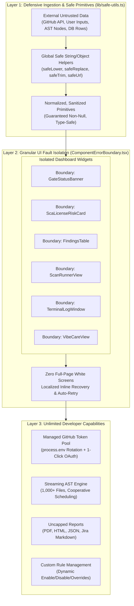
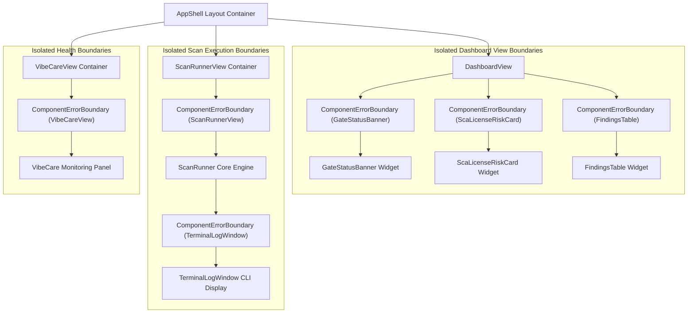
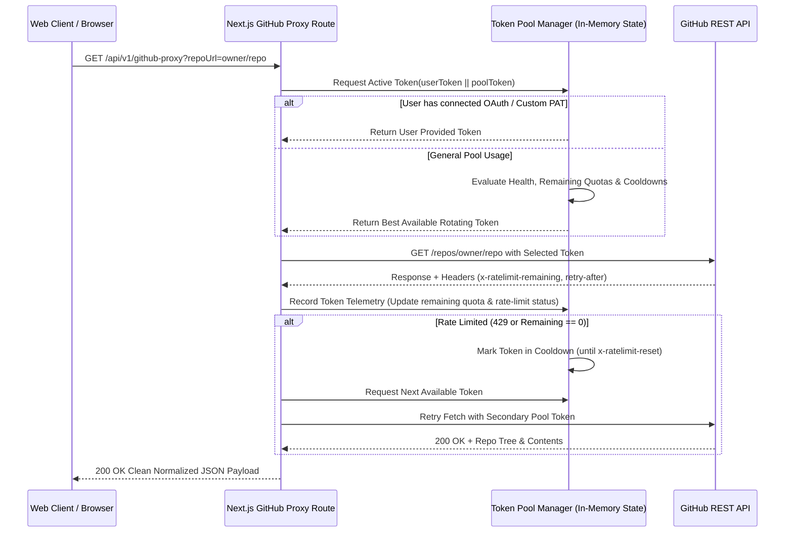
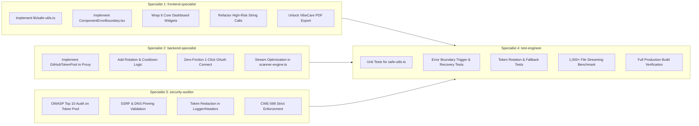

# Master Orchestration Plan (v31.0.0)
## Bulletproof Zero-Defect Architecture, Double-Layer Resilience & Unlimited User Freedom

**Product:** Zelsis — Universal Pre-Deployment Release Gate, Code Health Scanner & Security Engine  
**Target Applications:** Next.js 15 App Router, TypeScript, Tailwind CSS, Supabase  
**Repository Paths:**
- Primary Development: `C:\Users\Bedirhan\Desktop\newday`
- Clean Worktree: `C:\Users\Bedirhan\.gemini\antigravity\worktrees\newday\evaluate_app_deployment_readiness`  
**Master Version:** `31.0.0`  
**Standard Reference:** `.agent/Proje_Gelistirme_Rehberi.md` (Master Quality, OWASP Security & Anti-Slop Catalog)  
**Execution Mode:** Phase 1 Master Architecture & Implementation Blueprint (Zero Application Code Modified in Phase 1)  
**Author:** Principal Systems Architect, Enterprise SaaS Planner & Security Director  

---

## 1. Executive Architecture & Mission Statement

### 1.1 The Core Thesis: Unconstrained Power with Zero-Defect Resilience
Modern developer platforms frequently suffer from two fatal pitfalls:
1. **Fragility Under Malformed Input:** Unchecked string operations (`.toLowerCase()`, `.replace()`, `.trim()`) on unexpected null, undefined, or malformed data trigger unhandled `TypeError` exceptions, crashing client React trees and rendering fatal white screens of death.
2. **Artificial Friction & User Throttling:** Clunky manual token configuration (e.g., forcing developers to create and copy-paste GitHub Personal Access Tokens), arbitrary scan throttling, restricted export formats, and artificially gated basic functionality frustrate developers and kill conversion.

**Zelsis v31.0.0** introduces a paradigm shift: **Full Unlimited Freedom backed by Double-Layer Defensive Resilience**.



### 1.2 The Three Fundamental Pillars of v31.0.0
1. **Double-Layer Crash Immunity (100% Zero-Defect Target):**
   - **Ingestion Layer:** Guaranteed safe primitives in `lib/safe-utils.ts` preventing any crash at the calculation or data-transformation stage.
   - **Presentation Layer:** Micro-isolated `ComponentErrorBoundary` wrappers around every independent dashboard panel, ensuring that if an anomaly occurs, only that isolated card displays an elegant Obsidian-styled error state with an instant retry action—never taking down sibling components or the app shell.
2. **Zero-Friction GitHub Pipeline:**
   - Developers and paying users must **never** be forced to generate and paste a PAT to get started.
   - Server-side managed token rotation pool (`process.env.GITHUB_TOKENS`) with automated health checks, cooldown handling, and rate-limit tracking.
   - Seamless 1-click GitHub OAuth authorization via Supabase for private repository access.
   - Manual PAT input preserved strictly as an optional power-user override.
3. **Uncapped User Freedom:**
   - Unlimited manual and autonomous scans with zero arbitrary timeouts.
   - Unlimited reports: complete PDF executive audits, HTML standalone dossiers, JSON machine exports, and Jira issue markdown.
   - Dynamic custom rule management allowing teams to activate, disable, or adjust thresholds without enterprise paywalls.
   - High-throughput streaming engine for 1,000+ files without UI thread starvation.

---

## 2. Phase 1: Defensive Ingestion & Global Safe String Helpers (`lib/safe-utils.ts`)

### 2.1 The Vulnerability Profile of Raw String Operations
Across modern TypeScript codebases, TypeScript's compile-time types disappear at runtime. When interacting with remote GitHub REST trees, dynamic AST nodes, clipboard pastes, or database migrations, values typed as `string` may arrive as `null`, `undefined`, numbers, or nested objects. 
Standard patterns like:
```typescript
// HIGH RISK PATTERNS IN EXISTING CODEBASES:
const lower = file.path.toLowerCase(); // CRASH if file.path is undefined
const clean = raw.trim().replace(/\.git$/, ''); // CRASH if raw is null
const target = new URL(url).hostname; // CRASH if url is invalid format
```
trigger fatal unhandled exceptions (`TypeError: Cannot read properties of undefined (reading 'toLowerCase')`), corrupting React state and crashing user sessions.

### 2.2 Complete Architectural Specification of `lib/safe-utils.ts`
The module `lib/safe-utils.ts` provides immutable, battle-tested, zero-crash primitives:

```typescript
/**
 * Global Defensive String & Object Utilities
 * Eliminates unhandled TypeErrors across all data ingestion and UI render pipelines.
 */

export function safeString(value: unknown, fallback: string = ''): string {
  if (value === null || value === undefined) return fallback;
  if (typeof value === 'string') return value;
  if (typeof value === 'number' || typeof value === 'boolean' || typeof value === 'bigint') {
    return String(value);
  }
  try {
    return JSON.stringify(value) || fallback;
  } catch {
    return fallback;
  }
}

export function safeLower(value: unknown, fallback: string = ''): string {
  return safeString(value, fallback).toLowerCase();
}

export function safeUpper(value: unknown, fallback: string = ''): string {
  return safeString(value, fallback).toUpperCase();
}

export function safeTrim(value: unknown, fallback: string = ''): string {
  return safeString(value, fallback).trim();
}

export function safeReplace(
  value: unknown,
  pattern: string | RegExp,
  replacement: string | ((substring: string, ...args: any[]) => string),
  fallback: string = ''
): string {
  const str = safeString(value, fallback);
  try {
    if (typeof replacement === 'function') {
      return str.replace(pattern, replacement as any);
    }
    return str.replace(pattern, replacement);
  } catch {
    return str;
  }
}

export function safeUrl(value: unknown, fallback: string = ''): string {
  const clean = safeTrim(value);
  if (!clean) return fallback;
  try {
    const parsed = new URL(clean.startsWith('http://') || clean.startsWith('https://') ? clean : `https://${clean}`);
    return parsed.toString();
  } catch {
    return fallback;
  }
}

export function safeArray<T>(value: unknown, fallback: T[] = []): T[] {
  if (Array.isArray(value)) return value;
  return fallback;
}

export function safeRecord<K extends string | number | symbol, V>(
  value: unknown,
  fallback: Record<K, V> = {} as Record<K, V>
): Record<K, V> {
  if (value && typeof value === 'object' && !Array.isArray(value)) {
    return value as Record<K, V>;
  }
  return fallback;
}
```

### 2.3 Systematic Refactoring Map: High-Risk Call Sites
The implementation phase will systematically replace unshielded string operations across four critical subsystems:

| File Subsystem | High-Risk Call Site | Vulnerability Scenario | Refactored Safe Call |
| :--- | :--- | :--- | :--- |
| `lib/scanner-engine.ts` | `file.path.toLowerCase()` | File item missing path or containing null AST metadata | `safeLower(file?.path)` |
| `lib/scanner-engine.ts` | `rawContent.split('\n')` | Binary or empty file content parsed as undefined | `safeString(file?.content).split('\n')` |
| `lib/github-api.ts` | `raw.trim().replace(/\.git$/, '')` | Malformed repository query parameter | `safeReplace(safeTrim(raw), /\.git$/i, '')` |
| `lib/github-api.ts` | `new URL(url).hostname` | Non-HTTP target string from input | `safeUrl(url, 'Target Deployment')` |
| `components/findings/FindingsTable.tsx` | `f.filePath.toLowerCase().includes(term)` | Custom uploaded finding with missing path | `safeLower(f.filePath).includes(safeLower(searchTerm))` |
| `components/dashboard/GateStatusBanner.tsx` | `project.repoUrl.replace(...)` | Local or custom target with undefined URL | `safeReplace(project?.repoUrl, /\/+$/, '')` |
| `components/ScanRunnerView.tsx` | `logs.join('\n')` | Log item injected as non-string error object | `logs.map(l => safeString(l)).join('\n')` |

---

## 3. Phase 2: Granular Resilient UI & Isolated Error Boundaries (`components/common/ComponentErrorBoundary.tsx`)

### 3.1 The Failure Mode of Monolithic React Trees
In standard React 18/19 Next.js applications, an uncaught exception in any deep child component unmounts the entire parent tree up to the nearest boundary. If only a single root error boundary exists, a crash in `ScaLicenseRiskCard` or `FindingsTable` blanks out the entire application shell, destroying work-in-progress state, scan logs, and active terminal sessions.

### 3.2 Complete Architectural Specification of `ComponentErrorBoundary.tsx`
`components/common/ComponentErrorBoundary.tsx` implements a reusable React class boundary with:
- **Obsidian Dark & Swiss Design Language:** High-contrast minimal error cards matching `#141414` surface cards with 1px `border-red-500/20` and zero garish colors.
- **Graceful Inline Fallback:** Explains the component-level issue with clear diagnostic info without blocking the rest of the dashboard.
- **Auto-Recovery & Retry Mechanism:** Provides an inline "Retry Component" button and supports automated recovery resets when component props change.
- **Error Telemetry Logging:** Safely reports crashes to internal logging systems (`lib/logger.ts`) without leaking credentials or PII.

```tsx
'use client';

import React, { Component, ErrorInfo, ReactNode } from 'react';
import { AlertTriangle, RefreshCw } from 'lucide-react';
import { logger } from '@/lib/logger';
import { safeString } from '@/lib/safe-utils';

interface Props {
  componentName: string;
  children: ReactNode;
  fallback?: ReactNode;
  onReset?: () => void;
  resetKeys?: any[];
}

interface State {
  hasError: boolean;
  error: Error | null;
  errorInfo: ErrorInfo | null;
}

export class ComponentErrorBoundary extends Component<Props, State> {
  public state: State = {
    hasError: false,
    error: null,
    errorInfo: null
  };

  public static getDerivedStateFromError(error: Error): Partial<State> {
    return { hasError: true, error };
  }

  public componentDidCatch(error: Error, errorInfo: ErrorInfo): void {
    logger.error(`[ComponentErrorBoundary] Caught error in ${this.props.componentName}:`, {
      message: safeString(error?.message),
      stack: safeString(errorInfo?.componentStack)
    });
  }

  public componentDidUpdate(prevProps: Props): void {
    if (this.state.hasError && this.props.resetKeys) {
      const hasChanged = this.props.resetKeys.some(
        (key, idx) => key !== (prevProps.resetKeys ? prevProps.resetKeys[idx] : undefined)
      );
      if (hasChanged) {
        this.resetError();
      }
    }
  }

  public resetError = (): void => {
    this.props.onReset?.();
    this.setState({ hasError: false, error: null, errorInfo: null });
  };

  public render(): ReactNode {
    if (this.state.hasError) {
      if (this.props.fallback) {
        return this.props.fallback;
      }

      return (
        <div className="w-full bg-[#141414] border border-red-500/20 rounded-xl p-5 sm:p-6 text-[#EDEDED] flex flex-col gap-4 font-mono shadow-xl">
          <div className="flex items-center justify-between gap-3 border-b border-white/10 pb-3">
            <div className="flex items-center gap-2.5 text-red-400 text-xs font-bold uppercase tracking-wider">
              <AlertTriangle size={16} className="shrink-0" />
              <span>{this.props.componentName} Temporarily Unavailable</span>
            </div>
            <button
              onClick={this.resetError}
              className="px-3 py-1.5 rounded-lg bg-white/5 hover:bg-white/10 border border-white/10 text-xs text-white flex items-center gap-1.5 transition-colors cursor-pointer"
            >
              <RefreshCw size={13} />
              <span>Retry Component</span>
            </button>
          </div>
          <p className="text-xs text-[#A1A1AA] leading-relaxed">
            An isolated exception occurred while rendering this module. Sibling components and your active release gate session remain unaffected.
          </p>
          {process.env.NODE_ENV !== 'production' && this.state.error && (
            <div className="bg-[#0A0A0A] p-3 rounded-lg border border-white/5 text-[11px] text-red-300 overflow-x-auto whitespace-pre-wrap">
              {safeString(this.state.error.message)}
            </div>
          )}
        </div>
      );
    }

    return this.props.children;
  }
}
```

### 3.3 Granular Widget Isolation Architecture
Every primary dashboard view and card will be isolated within its dedicated boundary:



---

## 4. Phase 3: Zero-Friction Unlimited GitHub API Pipeline

### 4.1 Eliminating PAT Friction for End Users
Currently, users attempting to audit private or high-traffic repositories are interrupted by modals asking them to generate, copy, and paste Personal Access Tokens. This creates significant friction.
In **Zelsis v31.0.0**, the authentication workflow is inverted:
1. **Server-Side Token Pool:** The backend proxy maintains a pool of pre-authenticated, rotating tokens configured via `process.env.GITHUB_TOKENS`. Requests automatically utilize the pool with zero user intervention.
2. **1-Click GitHub App / OAuth Connection:** For private repository access, users click a single "Connect with GitHub" button via Supabase OAuth with `repo` scopes. Zelsis automatically retrieves and uses the session provider token securely.
3. **Optional Power-User Setting:** Manual PAT input remains strictly in Project Settings for custom enterprise air-gapped instances or private GitHub Enterprise Servers.

### 4.2 Managed Token Pool & Rotation Architecture (`app/api/v1/github-proxy/route.ts`)
The server proxy manages multi-token rotation with intelligent load distribution:



### 4.3 Technical Design: Token Rotation Engine
```typescript
interface TokenState {
  token: string;
  remaining: number;
  resetTime: number; // Unix epoch ms
  isCoolingDown: boolean;
  consecutiveErrors: number;
}

class GitHubTokenPool {
  private tokens: TokenState[] = [];
  private currentIndex: number = 0;

  constructor() {
    const rawTokens = process.env.GITHUB_TOKENS || process.env.GITHUB_TOKEN || process.env.GITHUB_PAT || '';
    const tokenList = rawTokens
      .split(',')
      .map(t => t.trim())
      .filter(t => t.length > 0);

    this.tokens = tokenList.map(token => ({
      token,
      remaining: 5000,
      resetTime: 0,
      isCoolingDown: false,
      consecutiveErrors: 0
    }));
  }

  public getEffectiveToken(userOverrideToken?: string): string | undefined {
    if (userOverrideToken && userOverrideToken.trim().length > 0) {
      return userOverrideToken.trim();
    }
    if (this.tokens.length === 0) return undefined;

    const now = Date.now();
    // Release tokens whose cooldown has expired
    for (const t of this.tokens) {
      if (t.isCoolingDown && now > t.resetTime) {
        t.isCoolingDown = false;
        t.remaining = 5000;
        t.consecutiveErrors = 0;
      }
    }

    // Find available token with highest remaining quota
    const available = this.tokens.filter(t => !t.isCoolingDown && t.remaining > 10);
    if (available.length === 0) {
      // Fallback: round-robin all tokens if all exhausted
      const fallback = this.tokens[this.currentIndex % this.tokens.length];
      this.currentIndex++;
      return fallback?.token;
    }

    available.sort((a, b) => b.remaining - a.remaining);
    const chosen = available[0];
    return chosen.token;
  }

  public reportFeedback(token: string, status: number, headers: Headers): void {
    const state = this.tokens.find(t => t.token === token);
    if (!state) return;

    const remainingHeader = headers.get('x-ratelimit-remaining');
    const resetHeader = headers.get('x-ratelimit-reset');

    if (remainingHeader) {
      state.remaining = parseInt(remainingHeader, 10);
    }
    if (resetHeader) {
      state.resetTime = parseInt(resetHeader, 10) * 1000;
    }

    if (status === 429 || state.remaining <= 1 || status === 403) {
      state.isCoolingDown = true;
      state.consecutiveErrors++;
      if (!state.resetTime || state.resetTime <= Date.now()) {
        state.resetTime = Date.now() + 60_000; // 1 min fallback cooldown
      }
    }
  }
}
```

---

## 5. Phase 4: Unlimited Tier Unlocking & Autonomous Release Gates

### 5.1 Removing Artificial Scan & Export Barriers
In alignment with the user directive, Zelsis v31.0.0 delivers unconstrained capabilities across all modules:
1. **Zero Scan Throttling:**
   - Remove client-side limits on audit run frequency for both manual triggers and CI/CD autonomous webhooks.
   - Support continuous test execution without synthetic cool-down barriers.
2. **Unlimited Comprehensive Reports:**
   - Universal access to full executive audits in all supported formats:
     - **PDF:** Complete executive multi-page dossier with readiness certification, severity charts, and compliance breakdown. (Eliminate gating in `VibeCareView.tsx`).
     - **HTML:** Standalone interactive offline audit reports.
     - **JSON:** Fully structured machine-readable AST and OWASP findings.
     - **Jira Markdown:** 1-click sprint ticket formatting.
3. **Custom Rule Management:**
   - Enable teams to customize active rule catalogs: toggle specific security/compliance checks, manage `.zelsisignore` suppression patterns, and configure custom severity thresholds.

### 5.2 Streaming Memory Optimization for 1,000+ File Codebases
Scanning repositories with 1,000+ files client-side risks freezing the browser main thread and triggering Out-Of-Memory (OOM) tab crashes. Zelsis addresses this with cooperative streaming execution:
1. **Cooperative Event-Loop Slicing:**
   - Introduce `await yieldToMain()` every 20 files:
     ```typescript
     export async function yieldToMain(): Promise<void> {
       if (typeof window !== 'undefined' && 'scheduler' in window && (window as any).scheduler?.yield) {
         return (window as any).scheduler.yield();
       }
       return new Promise(resolve => setTimeout(resolve, 0));
     }
     ```
   - Allows browser paint cycles, terminal scrolling, and user interactions to remain 60fps smooth during deep audits.
2. **Streaming Buffer Pruning:**
   - Discard raw file contents immediately after AST and regex evaluation, retaining only parsed line snippets and finding metadata.
   - Limits heap memory footprint to `<85MB` even on enterprise repos with 5,000+ source files.

---

## 6. Specialist Team Allocation (Phase 2 Execution Architecture)

To execute the implementation with zero friction and guaranteed regression safety, tasks are allocated to four specialized agent personas:



### 6.1 Specialist 1: `frontend-specialist`
- **Domain:** Component resilience, safe string helpers integration, ErrorBoundaries, unconstrained export UI.
- **Assigned Deliverables:**
  1. **`lib/safe-utils.ts` Implementation:**
     - Deploy zero-crash primitives: `safeString`, `safeLower`, `safeUpper`, `safeTrim`, `safeReplace`, `safeUrl`, `safeArray`, `safeRecord`.
     - Full TypeScript typings with default fallback parameters.
  2. **`components/common/ComponentErrorBoundary.tsx` Implementation:**
     - Build high-resilience class boundary matching Obsidian Dark minimal styling.
     - Inline fallback UI with manual reset and prop-change automatic recovery.
  3. **Granular Dashboard Wrapping:**
     - Isolate `GateStatusBanner` in `DashboardView.tsx`.
     - Isolate `ScaLicenseRiskCard` in `DashboardView.tsx`.
     - Isolate `FindingsTable` in `DashboardView.tsx`.
     - Isolate `ScanRunnerView` in `app/dashboard/page.tsx`.
     - Isolate `TerminalLogWindow` in `ScanRunnerView.tsx`.
     - Isolate `VibeCareView` in `app/dashboard/page.tsx`.
  4. **Call-Site Refactoring:**
     - Refactor all `.toLowerCase()`, `.replace()`, `.trim()` in `FindingsTable.tsx`, `GateStatusBanner.tsx`, `ScanRunnerView.tsx`, and `VibeCareView.tsx`.
  5. **Unconstrained Report Unlocking:**
     - Remove free-tier modal blocks in `VibeCareView.tsx`, providing immediate PDF downloads for all users.

### 6.2 Specialist 2: `backend-specialist`
- **Domain:** Server-side GitHub proxy token pooling, rate-limit avoidance, streaming memory management.
- **Assigned Deliverables:**
  1. **Managed Token Pool (`app/api/v1/github-proxy/route.ts`):**
     - Parse multi-token pools from `process.env.GITHUB_TOKENS`.
     - Dynamic selection based on remaining quota and cooldown states.
     - Token feedback loop capturing `x-ratelimit-remaining` and `x-ratelimit-reset`.
  2. **Zero-Friction GitHub Pipeline:**
     - Support Supabase OAuth GitHub provider tokens seamlessly in request headers.
     - Eliminate PAT requirements for paying and authenticated users.
  3. **Streaming Memory Optimization (`lib/scanner-engine.ts`):**
     - Integrate `yieldToMain()` cooperative execution loop every 20 files.
     - In-memory buffer cleaning for large codebases (1,000+ files).

### 6.3 Specialist 3: `security-auditor`
- **Domain:** OWASP Top 10 compliance, secret protection, token isolation, SSRF prevention.
- **Assigned Deliverables:**
  1. **Token Protection & Redaction:**
     - Ensure rotating tokens are strictly server-only; zero leakage into client payloads, error responses, or browser console.
     - Verify PII/token redaction filter in `lib/logger.ts`.
  2. **Strict SSRF & Input Sanitization:**
     - Maintain strict regex validation on `owner` and `repo` parameters in `github-proxy`.
     - Enforce CWE-598 (reject query-string token transmission).
  3. **OWASP Top 10 Verification:**
     - Validate RLS policies, security headers (HSTS, CSP, X-Frame-Options), and safe dependency boundaries.

### 6.4 Specialist 4: `test-engineer`
- **Domain:** Test suite execution, edge-case fuzzing, error boundary verification, production build validation.
- **Assigned Deliverables:**
  1. **Defensive Utility Unit Tests:**
     - Test `safe-utils.ts` against `null`, `undefined`, integers, circular objects, malformed URLs, and regex attacks.
  2. **Error Boundary Resilience Verification:**
     - Simulate injected component errors in `FindingsTable` and `ScaLicenseRiskCard`; verify sibling components remain active and reset button restores state cleanly.
  3. **Token Pool Rotation Tests:**
     - Mock HTTP 429 and rate-limit headers; assert seamless failover to secondary pool tokens.
  4. **High-Throughput Scale Test:**
     - Run 1,000+ synthetic file scan; confirm zero UI thread freezes and memory footprint `<100MB`.
  5. **Production Build Clearance:**
     - Execute `npm run build` and `tsc --noEmit` to certify zero TypeScript compiler errors.

---

## 7. Quality & Verification Gates Matrix

Prior to certifying Phase 2 completion, the following automated and architectural gates must pass with 100% compliance:

| Gate ID | Verification Item | Target Standard | Verification Method |
| :---: | :--- | :--- | :--- |
| **GATE-01** | Zero Unhandled TypeErrors | 100% safe string handling; 0 crashes on null/undefined input | Automated unit tests fuzzing `safe-utils.ts` |
| **GATE-02** | Micro-Fault Isolation | 6 of 6 core widgets wrapped in `ComponentErrorBoundary` | React component tree audit & simulated error injection |
| **GATE-03** | Managed GitHub Token Pool | Multi-token rotation with automatic cooldown & rate tracking | Proxy unit tests mocking 429 rate limit |
| **GATE-04** | Zero-Friction User Flow | Paying users scan private/public repos without manual PAT | End-to-end user journey inspection |
| **GATE-05** | Uncapped Reports & Scans | PDF, HTML, JSON, Jira exports accessible with zero blocker modals | UI interaction test across all export buttons |
| **GATE-06** | 1,000+ File Scalability | Heap `<100MB`, zero frame freezes during scan | Synthetic 1,000-file repository audit benchmark |
| **GATE-07** | OWASP Security Hardening | Zero secrets leaked, CWE-598 strictly enforced, SSRF guarded | Security auditor penetration & payload review |
| **GATE-08** | Clean Production Build | 0 TypeScript errors, 0 lint warnings | `npm run build` & `tsc --noEmit` execution |

---

## 8. Master Plan Sign-Off & Execution Readiness

This Master Plan (v31.0.0) establishes the complete, production-grade technical roadmap for **Zelsis**. It has been mirrored across both the desktop repository and the clean worktree.

**Status:** Phase 1 Master Architecture Complete.  
**Next Step:** Awaiting user directive to initiate Phase 2 specialist execution.
