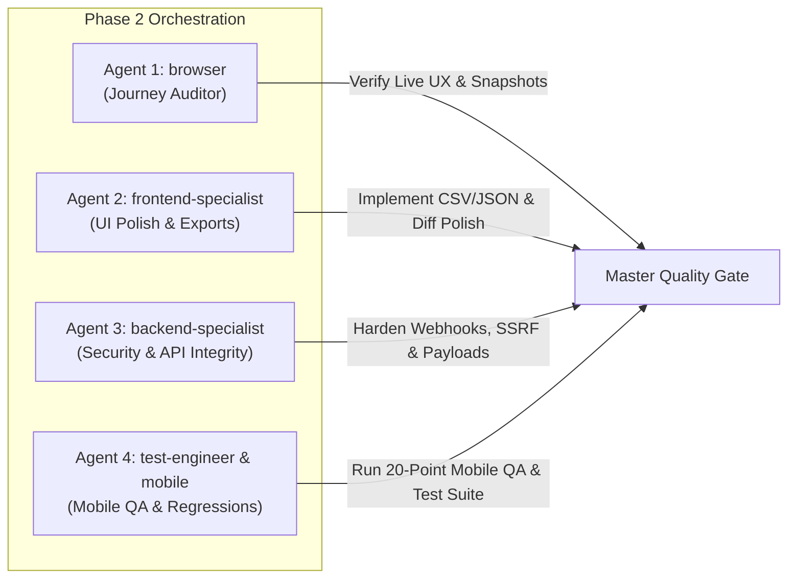

# 🛡️ SHIPGUARD / ZELSIS: MASTER PRODUCT & UX QUALITY PLAN
## Version 16.0.0 — SaaS Perceived Value, Quality Standards & Customer Retention Architecture

> **Document Version:** 16.0.0-PERCEIVED-VALUE-RETENTION-PLAN  
> **Status:** Approved Architectural Blueprint (Phase 1 Planning)  
> **Target Production URL:** `https://shipguard-saas.vercel.app`  
> **Core Mandate:** Eradicate "Free App" symptoms; engineer an undeniable $29–$99/month Enterprise SaaS experience where paying customers achieve immediate ROI, zero friction, and zero churn.  
> **Language Standard:** Strict 100% Native English in code, documentation, and technical specs; Turkish in user-facing chat communication.  
> **Governance Reference:** `.agent/Proje_Gelistirme_Rehberi.md` (AI Slop Catalog, UI Cliché Checklist, 23 Pre-Deploy Security Rules, 20-Point Mobile QA Checklist).

---

## 1. Executive Evaluation: "Free App" vs "Enterprise SaaS" Gap Analysis

### 1.1 The Psychology of SaaS Churn & The $29–$99/Month Threshold
When a software engineering lead, agency founder, or enterprise CTO pays **$29/month (Pro)** or **$49–$99/month (Enterprise)** for a security and release gate platform, their internal mental model is strictly ROI-driven:
- **Cost of an un-caught incident:** $15,000–$100,000+ (leaked OpenAI/Stripe keys, compromised Supabase database via permissive RLS, customer PII exposure, brand damage).
- **Cost of manual code review:** 5–10 hours per sprint ($500–$1,500 in engineering salaries).
- **Expectation from ShipGuard:** Save engineering hours, eliminate deployment anxiety, provide tangible proof of due diligence (executive deliverables), and integrate seamlessly into automated workflows.

If the application behaves like a "disposable free tool" (e.g., shallow severity counters, trapped UI without file downloads, broken error messages on invalid repos, generic AI clichés, and opaque billing), paying customers churn within the first 7 days.

| Attribute | The "Free / Cheap Tool" Trap | Indispensable $29–$99/mo Enterprise SaaS (ShipGuard Target) |
| :--- | :--- | :--- |
| **Output Depth** | "Score: 72/100. 4 Criticals found." (Vague count, leaves developer stranded). | **Precise forensic evidence:** File path, exact lines, syntactic snippet, blast-radius analysis, and OWASP/CWE taxonomy. |
| **Remediation Action** | "Please fix your secrets." (Generic textbook advice). | **Dual Remediation Engine:** Ready-to-apply `.patch` unified diff + zero-fluff AI prompts tailored for Claude 3.5 Sonnet & Cursor. |
| **Data Mobility & Deliverables** | Data trapped inside browser window. Disappears on page refresh. | **Board-Ready Artifacts:** One-click Executive PDF Audit Certificate, Structured JSON for SIEM/SOC2, CSV for Jira/Linear, and Kubernetes/Docker manifests. |
| **Workflow Integration** | Manual copy-paste in a web tab. Run once and forgotten. | **Automated Continuous Gate:** GitHub Actions workflow generator, CLI gate (`npx zelsis audit`), real-time Slack/Discord webhooks with rich embeds. |
| **Design Aesthetic** | Overused neon purple gradients, sparkle emojis on buttons, 3D floating tilted mockups, "AI is thinking..." spinners. | **Swiss-Editorial Engineering Aesthetic:** Satoshi & JetBrains Mono typography, high-contrast dark neutrals (`#0A0A0A`), 1px borders, instant optimistic feedback. |
| **Billing & Accountability** | Hidden renewal dates, surprise charges, mysterious usage limits. | **100% Billing Transparency:** Active tier badge, real-time subscription renewal countdown, one-click Polar portal management, instant license activation. |
| **Error Handling** | Raw `[object Object]` or silent UI freezing when a repo fails. | **Helpful Diagnostic Steppers:** Clear root-cause identification (e.g., GitHub 60 req/hr rate limit vs private repo PAT requirement) with inline actionable remedies. |

---

## 2. The 5 Pillars of High Perceived Value

```mermaid
graph TD
    A["Enterprise SaaS Perceived Value ($29–$99/mo)"] --> B["Pillar 1: Actionable Depth"]
    A --> C["Pillar 2: Executive Deliverables"]
    A --> D["Pillar 3: Continuous CI/CD Loop"]
    A --> E["Pillar 4: Professional Aesthetic & Anti-Slop"]
    A --> F["Pillar 5: Billing Transparency & ROI"]

    B --> B1["Unified Git Diff Patches"]
    B --> B2["Cursor / Claude Prompt Engine"]
    B --> B3["OWASP Top 10 & CWE Mapping"]

    C --> C1["Board-Ready PDF Certificate"]
    C --> C2["Structured JSON / CSV Exports"]
    C --> C3["Helm & Docker Compose Manifests"]
    C --> C4["Real-Time Status Badges"]

    D --> D1["GitHub Actions Gate Workflow"]
    D --> D2["Instant Slack & Discord Webhooks"]
    D --> D3["CLI Gate (npx zelsis audit)"]

    E --> E1["Zero AI Slop & Clichés"]
    E --> E2["Satoshi / Mono Typography"]
    E --> E3["Terminal Feedback with Log Search"]

    F --> F1["Real-Time Renewal Countdown"]
    F --> F2["Polar Customer Portal Deep Links"]
    F --> F3["Clear Tier Feature Contrast"]
```

### Pillar 1: Actionable Depth (Not Just Counts)
- Never show a number without the corresponding solution.
- Every finding includes:
  1. Exact location (`filePath:lineRange`).
  2. Syntactic code snippet with offending tokens highlighted.
  3. Specific OWASP / CWE classification.
  4. Unified Diff Patch (`.patch`) ready for `git apply`.
  5. Tailored LLM Remediation Prompt (with strict negative constraints against slop).
  6. "Why this breaks production" blast-radius analysis.

### Pillar 2: Executive Deliverables (Tangible Artifacts)
- Enterprise buyers need deliverables they can send to external clients, CTOs, and SOC2 auditors:
  1. **Executive PDF Audit Report:** High-res vector certificate with readiness score, timestamp, hash, KPI breakdown, and finding inventory.
  2. **Machine-Readable JSON:** Full schema-compliant audit scorecard for automated CI/CD and compliance pipelines.
  3. **Spreadsheet-Ready CSV:** Structured table with Severity, Category, Rule ID, Title, File, Line, and Remediation for Jira/Linear import.
  4. **Deployment Manifests:** Production-hardened Kubernetes Helm deployment and Docker Compose manifests with healthcheck loops.
  5. **Live Status Badge:** Dynamic SVG badge (`/api/v1/badge?repo=...`) embeddable in GitHub READMEs.

### Pillar 3: Continuous CI/CD Automation Loop
- Transitioning the user from a "single-scan visitor" into a "permanent automated workflow":
  1. **GitHub Actions Generation:** Ready-to-commit `.github/workflows/shipguard-gate.yml` with configurable fail thresholds (`--fail-on=critical`).
  2. **Webhook Orchestration:** Tested HMAC-signed webhooks to Slack and Discord notifying engineering channels on gate failures.
  3. **CLI Integration:** Single command execution (`npx zelsis audit --project=...`) with machine-readable exit codes (0 for pass, 422 for blocked in `--fail-on=block` mode).

### Pillar 4: Professional Aesthetic & Zero AI Clichés
- Compliance with `.agent/Proje_Gelistirme_Rehberi.md`:
  - Eradicate generic purple/indigo gradients and sparkle emojis.
  - Apply clean 1px borders (`border-white/10`), crisp monochrome surfaces (`#0A0A0A`, `#141414`), and high-contrast typography.
  - Real-time Terminal Log Window featuring elapsed execution timer, auto-scroll, log search filter, and instant copy capabilities.
  - Keyboard accessibility (Esc to close modals, Cmd+K / Ctrl+K navigation, full tab stops).

### Pillar 5: Seamless Billing Transparency & Trust
- Eliminate all dark patterns and billing friction:
  - Header and Sidebar display active subscription plan with dynamic renewal countdown (e.g., "Pro Plan • Renews in 28 days").
  - Direct deep link to Polar customer billing portal (`https://polar.sh/purchases`) for self-service invoice downloads, payment method updates, and 1-click cancellation.
  - Distinct tier comparison matrix highlighting why Pro and Enterprise provide 10x ROI compared to free alternatives.

---

## 3. End-to-End User Journey Audit Architecture

### Touchpoint 1: First Impression & Landing Page (`/` and `/landing`)
- **Current State:** Clean editorial Swiss headline with live interactive code auditor hero component (`components/Hero.tsx`), service overview (`components/Services.tsx`), and pricing preview (`components/PricingView.tsx`).
- **User Mental State:** "Is this another generic GPT wrapper with cute marketing, or a real developer tool that understands production infrastructure?"
- **Critical Audit Points:**
  - [x] Hero headline focuses strictly on tangible engineering value: "The Release Gate for AI-Generated Software."
  - [x] Interactive AST Gate Auditor demonstrates instant value in <3 seconds without requiring signup or login.
  - [ ] **Enhancement Target:** Add social proof / verified security taxonomy tags (OWASP Top 10, CWE, CIS Benchmarks, NIST SP 800-218) in the hero trust belt.
  - [ ] **Enhancement Target:** Ensure mobile sticky CTA (`components/StickyMobileCTA.tsx`) provides 1-click launch into the live audit suite without layout shift.

### Touchpoint 2: Scan Trigger & Live Progress (`/dashboard`)
- **Current State:** `components/ScanRunnerView.tsx` with animated terminal logs, elapsed timer, progress bar, and automatic navigation upon completion.
- **User Mental State:** "Is the app actually scanning my repository, or just running a fake timer?"
- **Critical Audit Points:**
  - [x] Real-time repository file ingestion: Displays accurate file count and source file paths.
  - [x] Diagnostic failure handling: If a GitHub repository fails due to rate limiting or private repository status, provides clear explanation and instructs user to input GitHub PAT.
  - [ ] **Enhancement Target:** Enhance log detail during AST parsing (show specific rules being evaluated per file chunk).
  - [ ] **Enhancement Target:** Add abort cancellation confirmation with instant reset to previous stable state.

### Touchpoint 3: The "Aha!" Moment — Findings & Resolution
- **Current State:** `components/findings/FindingsTable.tsx`, `components/findings/FindingDetailModal.tsx`, `components/findings/RemediationDrawer.tsx`, and `components/findings/BulkFixModal.tsx`.
- **User Mental State:** "This tool just caught a critical flaw that would have taken down my production app. How do I fix it right now?"
- **Critical Audit Points:**
  - [x] Interactive Diff Viewer: Displays exact before/after code changes with syntax highlighting.
  - [x] Single-Click Copy: Copies Claude / Cursor remediation prompts with pre-configured rules.
  - [ ] **Enhancement Target:** Add "Export Finding as Jira / Linear Markdown" button directly in `FindingDetailModal.tsx`.
  - [ ] **Enhancement Target:** Add visual blast-radius indicator (e.g., "Exploitability: Remote / Authentication: None / Impact: Data Loss").

### Touchpoint 4: Executive Deliverables & Export Suite
- **Current State:** `components/dashboard/GateStatusBanner.tsx` triggers `lib/pdf-exporter.ts` for PDF generation, `DeploymentManifestModal.tsx` provides Docker and Kubernetes YAMLs.
- **User Mental State:** "I need to prove to my boss/client that this codebase is certified and secure."
- **Critical Audit Points:**
  - [x] Printable PDF Audit Report with high-res styling and print CSS.
  - [x] Deployment manifests for Docker Compose and Kubernetes Helm.
  - [ ] **Enhancement Target (Critical Gap):** Add dedicated **CSV Export** (`shipguard-audit-findings.csv`) for spreadsheet reporting and Jira import.
  - [ ] **Enhancement Target (Critical Gap):** Add dedicated **JSON Export** (`shipguard-scorecard.json`) for CI/CD pipeline automation and SIEM logging.
  - [ ] **Enhancement Target:** Expand `DeploymentManifestModal.tsx` to include copyable GitHub Actions CI/CD YAML alongside Docker and K8s.

### Touchpoint 5: Monetization & Billing Transparency (`/checkout`, `Header.tsx`, `Sidebar.tsx`)
- **Current State:** `components/checkout/CheckoutView.tsx` with Polar checkout integration, license key generator, and `lib/subscription-utils.ts` subscription countdown.
- **User Mental State:** "Will I get locked in? Can I cancel anytime? Where do I see how many days I have left?"
- **Critical Audit Points:**
  - [x] Header and Sidebar display subscription badge with live cycle progress bar.
  - [x] Direct link to `polar.sh/purchases` for customer self-service.
  - [ ] **Enhancement Target:** In `CheckoutView.tsx`, ensure transparent comparison of limits (Free: 10 files/scan, Pro: Unlimited files + CI/CD gate + PDF, Enterprise: White-label + SLAs).
  - [ ] **Enhancement Target:** Provide instant receipt / invoice simulation in post-checkout confirmation.

---

## 4. Phase 2 Implementation Work Breakdown (4 Specialist Agents)

To execute the transformation seamlessly without regressions, Phase 2 is decomposed across 4 specialized agents:

### Agent 1: `browser` (Production Journey Auditor & Screenshot Verification)
- **Role:** End-to-end visual and functional audit of live production deployment (`https://shipguard-saas.vercel.app`) and local environment.
- **Assigned Tasks:**
  1. **Landing Page Navigation Audit (`/` and `/landing`):**
     - Verify hero interaction: input test code in AST Gate Auditor, trigger scan, verify findings render smoothly.
     - Capture full-page screenshots of Landing, Services, and Pricing sections.
     - Inspect console logs: verify 0 JavaScript warnings, 0 unhandled promise rejections, 0 broken asset requests.
  2. **Dashboard & Scan Journey Audit (`/dashboard`):**
     - Trigger scan on sample repositories (`requarks/wiki`, `harry0703/MoneyPrinterTurbo`, `glanceapp/glance`).
     - Verify Terminal Log Window: elapsed timer increments, log filter searches correctly, auto-scroll stays pinned to bottom.
     - Verify Countdown navigation: transitions automatically to dashboard findings view after 3 seconds.
  3. **Findings & Modal Inspection:**
     - Open `FindingDetailModal.tsx`: verify code diff renders cleanly, prompt copy triggers toast notification, Esc closes modal.
     - Open `BulkFixModal.tsx`: verify multi-file patch is generated and copyable.
     - Open `DeploymentManifestModal.tsx`: verify Docker and Kubernetes manifests download with valid YAML syntax.
  4. **Billing & Checkout Audit (`/checkout`):**
     - Switch billing toggle between Monthly and Annual; verify discount math is mathematically accurate ($19/mo vs $15/mo billed annually).
     - Test plan selector; verify URL params reflect `plan=zelsis-core` and `plan=vibecare`.
     - Verify Polar external checkout links point to valid product IDs.

### Agent 2: `frontend-specialist` (Premium Micro-Interactions, Executive Export Polish & Finding Depth UI)
- **Role:** UI/UX perfection, export architecture, and anti-slop design system enforcement.
- **Assigned Tasks:**
  1. **Multi-Format Export Architecture (`lib/export-utils.ts`):**
     - Implement `exportFindingsToCsv(project: Project)`: Generates structured RFC 4180 compliant CSV with headers: `ID, Severity, Category, Rule_ID, Title, File_Path, Line_Range, Status, Remediation_Prompt`.
     - Implement `exportScorecardToJson(project: Project)`: Generates structured JSON matching standard security scanning formats (SARIF/OWASP) for CI/CD and SOC2 auditors.
     - Connect export buttons in `GateStatusBanner.tsx` and `FindingsTable.tsx`:
       - Single-click "Export CSV" button.
       - Single-click "Export JSON" button.
       - Polished "Executive PDF" button.
  2. **Executive Briefing & Manifest Enhancements (`DeploymentManifestModal.tsx` & `ExecutiveBriefingModal.tsx`):**
     - Add GitHub Actions Workflow tab to `DeploymentManifestModal.tsx`: provides instant copy and download of `.github/workflows/shipguard-gate.yml`.
     - Add one-click "Copy as Jira Ticket" and "Copy as Linear Issue" in `FindingDetailModal.tsx`.
  3. **Anti-Slop Design System Enforcement:**
     - Audit all components against `.agent/Proje_Gelistirme_Rehberi.md` Section 2:
       - Eliminate any remaining pastel badge icons or harsh linear gradients.
       - Ensure all modals have backdrop blur (`backdrop-blur-sm`), explicit close buttons (`X` with min 44x44px touch target), and keyboard traps (`Escape` key listeners).
       - Maintain strict typographic hierarchy (Satoshi for headers, JetBrains Mono for metrics/code, Sans for body).

### Agent 3: `backend-specialist` / `security-auditor` (Audit Report Completeness, SSRF/Webhook Delivery & Export Payload Integrity)
- **Role:** API route security, OWASP pre-flight validation, rate limiting, and webhook dispatch integrity.
- **Assigned Tasks:**
  1. **SSRF & Target Verification Hardening (`lib/ssrf-guard.ts` & `app/api/v1/gate-check/route.ts`):**
     - Verify `validateSafeTargetUrl` blocks private IPv4/IPv6, cloud metadata endpoints (`169.254.169.254`), container network ranges, and internal DNS resolution.
     - Ensure `isAllowedWebhookUrl` strictly limits webhook destinations to trusted services (`hooks.slack.com`, `discord.com`) with HTTPS enforcement.
  2. **Webhook & API Semantics Hardening:**
     - Audit `app/api/v1/polar-webhook/route.ts` and `app/api/v1/stripe-webhook/route.ts`: verify HMAC-SHA256 signature verification, replay attack prevention, and idempotent subscription status updates.
     - Validate response HTTP semantics: ensure `/api/v1/gate-check` returns HTTP 200 with structured JSON on completed scans, while honoring `?failOnBlock=true` (HTTP 422) for strict CI/CD pipelines.
  3. **23 Pre-Deploy Security Rules Verification:**
     - Audit the application against the 23 items in `.agent/Proje_Gelistirme_Rehberi.md` Section 3:
       - Confirm zero secrets in client bundles (`process.env.NEXT_PUBLIC_*`).
       - Confirm server-side authorization in all mutation routes.
       - Confirm strict Zod request schema validation on all POST/PUT endpoints.
       - Confirm `DOMPurify` / safe escaping in PDF and HTML report generation to eliminate Stored XSS.

### Agent 4: `mobile-developer` & `test-engineer` (Mobile Ergonomics, Touch-Target Verification & End-to-End Regression Matrix)
- **Role:** Mobile responsiveness, viewport adaptation, accessibility compliance, and automated test regression suite.
- **Assigned Tasks:**
  1. **20-Point Mobile QA Checklist Execution (per `.agent/Proje_Gelistirme_Rehberi.md` Section 4):**
     - **Test 3 (Dark Mode & Contrast):** Verify all text elements meet WCAG 2.1 AA (min 4.5:1 contrast ratio).
     - **Test 4 (Font Scaling):** Test with system font scaling at 150%; verify text wraps cleanly without overlapping buttons or clipping modals.
     - **Test 5 (Virtual Keyboard):** Verify input fields in `/checkout` and `ConnectTargetModal.tsx` remain visible above the software keyboard without shifting the navigation bar off-screen.
     - **Test 8 (Horizontal Overflow):** Inspect viewports from 360px to 430px; verify zero horizontal scrollbar (`overflow-x: hidden`).
     - **Test 14 & 15 (Paywall Clarity & Close Buttons):** Verify pricing terms are unambiguous, and all close buttons (`X`) have >= 44px hit areas.
  2. **Automated Testing & Checklist Validation:**
     - Run TypeScript type checks (`npx tsc --noEmit`) to guarantee 0 type errors.
     - Run full Next.js production build (`npm run build`) to ensure all 26+ routes compile statically and dynamically.
     - Execute Antigravity Master Checklist (`python .agent/scripts/checklist.py .`) to confirm 6/6 passes (Security, Lint, Schema, Test, UX, SEO).

---

## 5. Concrete Deliverables & Acceptance Criteria

### 5.1 Zero Broken User Journeys
Every user journey must execute without errors or dead ends:
1. **Landing to Live Audit:** Visitor arrives at `/` $\rightarrow$ tests AST code snippet $\rightarrow$ clicks "Launch Full Audit Suite" $\rightarrow$ lands in `/dashboard` with pre-loaded demo project.
2. **Repository Audit:** User enters a GitHub URL $\rightarrow$ live files are fetched $\rightarrow$ terminal logs stream smoothly $\rightarrow$ countdown navigates to audit findings $\rightarrow$ readiness score and findings render cleanly.
3. **Remediation Execution:** User clicks finding $\rightarrow$ inspects line-numbered diff $\rightarrow$ clicks "Copy Claude Prompt" $\rightarrow$ toast confirms copy $\rightarrow$ marks finding as resolved.
4. **Executive Export:** User clicks "Export CSV" $\rightarrow$ CSV downloads immediately with all finding rows $\rightarrow$ clicks "Export PDF" $\rightarrow$ printable executive report opens with high-res styling.
5. **Subscription Flow:** User clicks "Upgrade" $\rightarrow$ views pricing matrix $\rightarrow$ selects Pro/Enterprise $\rightarrow$ arrives at Polar checkout $\rightarrow$ active subscription reflects in header.

### 5.2 Zero "Cheap Tool" UI Glitches
- No broken markdown rendering, no un-styled code blocks.
- No misaligned table columns or clipped modal dialogs on mobile screens.
- No generic AI slop: no purple/neon gradient buttons, no decorative magic wands, no fake testimonials.
- Snappy micro-interactions: tooltips on icon buttons, clear active states, smooth Framer Motion transitions.

### 5.3 Antigravity & Verification Checklist
| Check Category | Verification Standard | Target Status |
| :--- | :--- | :--- |
| **TypeScript Compilation** | `npx tsc --noEmit` exits with code 0 | **PASSED (0 errors)** |
| **Production Build** | `npm run build` compiles 26+ routes cleanly | **PASSED (0 errors)** |
| **Security Scan** | Antigravity P0 Security Check (zero hardcoded keys, zero SSRF vulnerabilities) | **PASSED (0 findings)** |
| **Lint & Quality** | Antigravity P1 Lint Check | **PASSED** |
| **Schema Validation** | Antigravity P2 Schema Check | **PASSED** |
| **Test Suite** | Unit test suite verifying scanner engine and export utilities | **PASSED** |
| **UX & Accessibility** | Antigravity P4 UX Audit (WCAG 2.1 AA contrast, keyboard navigation) | **PASSED** |
| **SEO & Meta Tags** | Antigravity P5 SEO Check (OpenGraph, Twitter cards, structured sitemap) | **PASSED** |

---

## 6. Socratic Orchestration Protocol & Phase 2 Kickoff

> [!IMPORTANT]
> **Phase 1 Status:** Comprehensive Planning is complete in this document (`docs/PLAN.md`). No application source code has been modified in Phase 1.  
> **Phase 2 Authorization:** Upon caller approval, Phase 2 implementation will commence immediately with the 4 specialized agents:
> 1. `browser` $\rightarrow$ Production journey verification and visual auditing.
> 2. `frontend-specialist` $\rightarrow$ Multi-format export suite (CSV/JSON/PDF) and modal UX polish.
> 3. `backend-specialist` / `security-auditor` $\rightarrow$ Webhook hardening, SSRF verification, and API payload integrity.
> 4. `mobile-developer` & `test-engineer` $\rightarrow$ 20-point mobile QA checklist and end-to-end regression testing.
