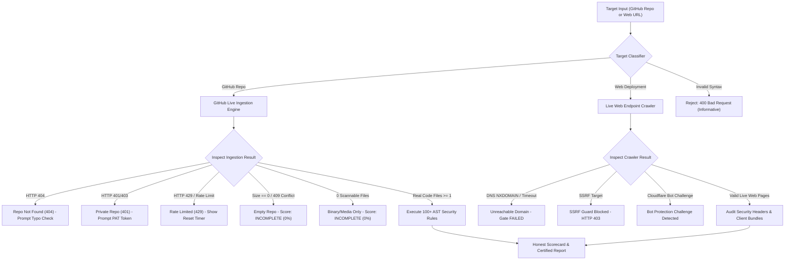
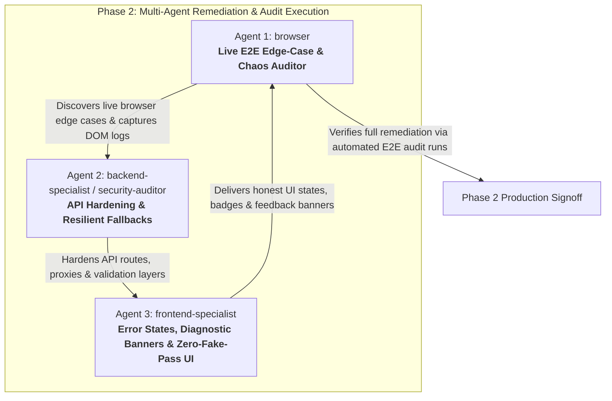

# Master Plan (v26.0.0)
## Platform Truth, Failure-State Resiliency & Comprehensive Edge-Case Audit Architecture

**Product:** Zelsis — Universal Pre-Deployment Release Gate & Code Health Scanner  
**Live Application URL:** https://shipguard-saas.vercel.app  
**Version:** 26.0.0 (Platform Truth & Zero-Fake-Pass Architecture)  
**Standard Reference:** `.agent/Proje_Gelistirme_Rehberi.md` (Master Quality, OWASP Security & Anti-Slop Catalog)  
**Planning Mode:** Phase 1 (Planning Only — Zero Application Code Modified)  

---

## 1. Executive Manifesto: The Principle of Absolute Truth

In mission-critical software deployment gates, **a false pass is infinitely more dangerous than a false block**.

When an engineering team connects an automated release gate to their production pipeline:
* A false block inconveniences an engineer for minutes until investigated.
* A **false pass** (a "100/100 PASSED" scorecard awarded to an empty repository, an unreachable domain, an unauthenticated private codebase, or an API error notice) gives engineering leadership an illusory stamp of security, allowing severe vulnerabilities, unvetted dependencies, and broken infrastructure to ship directly to end users.

### The Core Mandate
1. **Zero Fake Passes:** If an audit cannot inspect real, scannable code or live endpoints, it MUST NEVER award a passing score. The release gate status MUST reflect `FAILED`, `BLOCKED`, or `UNRATED / INCOMPLETE`.
2. **Zero Cryptic Crashes:** Every network failure, rate limit, DNS failure, or parsing anomaly must be caught, categorized, and presented with crystal-clear remediation guidance.
3. **No Placebo Synthetics:** The platform must never synthesize dummy files (such as dummy `README.md` or `RATE_LIMIT_NOTICE.md`) that pass through security rule evaluation as if they were production code.
4. **Transparent Security & Monetization:** Authentication, license validation, and subscription status must be cryptographically honest, with zero arbitrary bypasses (e.g., token length heuristics) and informative user-facing diagnostic banners.



---

## 2. Investigation Pillar 1: Repository & Input Failure States

### 2.1 Non-Existent Repositories (HTTP 404 from GitHub)
* **Current Code Location:** `lib/github-api.ts` (Lines 263–302) and `app/api/v1/github-proxy/route.ts` (Lines 104–128).
* **Current Behavior:** When `api.github.com/repos/{owner}/{repo}` returns HTTP 404 (repository does not exist), the proxy evaluates:
  ```ts
  const isRateLimit = isGitHubRateLimited(repoRes.status, repoRes.headers, bodyText, Boolean(token));
  return NextResponse.json({
    name: repo,
    fullName: `${owner}/${repo}`,
    description: 'Private or Unauthenticated GitHub Repository...',
    error: isRateLimit ? 'RATE_LIMIT_EXCEEDED' : 'PRIVATE_OR_UNAUTHENTICATED'
  });
  ```
* **Failure Mode:** Every non-existent repo (e.g. `github.com/torvalds/does-not-exist-xyz123`) is misdiagnosed as a private repository. In `components/ScanRunnerView.tsx` (Lines 181–195), the UI pops open the `PrivateRepoTokenModal`, prompting the developer to input a private Personal Access Token. Even after providing a token, the repo still returns 404 and loops indefinitely with the message *"Private repository access restricted"*.
* **Required Honest Architecture:**
  1. Inspect `repoRes.status === 404` directly.
  2. Return explicit error code: `{ error: 'REPO_NOT_FOUND', statusCode: 404, message: 'Repository not found on GitHub. Check the repository owner and name for typographical errors.' }`.
  3. In `ScanRunnerView.tsx`: Render a dedicated **Repository Not Found (404)** diagnostic banner with:
     * High-visibility warning badge (`bg-rose-500/10 text-rose-400 border-rose-500/20`).
     * Direct link to verify `https://github.com/${owner}/${repo}` in a new tab.
     * "Edit Target Repository" action button that returns to project setup without asking for a useless PAT.

### 2.2 Empty Repositories (0 Commits or 0 Scannable Files)
* **Current Code Location:** `lib/github-api.ts` (Lines 207–213, 308–322, 365–379, 460–474) and `app/api/v1/github-proxy/route.ts` (Lines 135–150, 169–185, 228–244).
* **Current Behavior:** When GitHub returns repository size = 0, or HTTP 409 Conflict (empty tree), or tree files = 0, the system generates:
  ```ts
  files: [
    {
      path: 'README.md',
      content: `# ${repo}\n\nEmpty repository. No source files committed yet.`
    }
  ]
  ```
* **Critical Truth Flaw (Fake Pass):** 
  1. The client receives `files.length === 1`.
  2. The scanner runs `runStaticCodeScan` on this single 2-line synthesized markdown file.
  3. The 100+ AST rules detect zero security vulnerabilities or anti-patterns in this 2-line placeholder.
  4. The platform announces: **`Readiness Score: 100/100 — GATE PASSED. All security pre-flight checks and VibePolish rules cleared.`**!
* **Required Honest Architecture:**
  1. An empty repository has **zero** production readiness and cannot pass a deployment gate.
  2. In `lib/github-api.ts` & `github-proxy/route.ts`: Return `{ files: [], isEmpty: true, error: 'EMPTY_REPOSITORY', scannableFilesCount: 0 }`.
  3. In `lib/scanner-engine.ts`: When `files.length === 0`, return:
     * `gateStatus: 'INCOMPLETE'` (or `'BLOCKED'`)
     * `score: 0` (or `null` / unrated)
     * `summary: 'Audit Incomplete: Repository contains no source code or configuration files to audit.'`
  4. In `ScanRunnerView.tsx`: Display a distinct **Empty Codebase** banner explaining that the gate requires committed source code (TypeScript, Python, Go, Dockerfiles, SQL, etc.) to evaluate deployment readiness.

### 2.3 Binary & Media-Only Repositories (Images, Videos, PDFs, Assets)
* **Current Code Location:** `lib/github-api.ts` (Lines 436–455).
* **Current Behavior:** The git tree filter ignores binary and non-code files. If a repository consists entirely of assets (`.png`, `.jpg`, `.mp4`, `.zip`, `.pdf`), the filtered array `treeFiles` has `length === 0`. The code falls back to lines 460–474, generating the dummy `README.md`, which results in another **Fake 100/100 PASSED**!
* **Required Honest Architecture:**
  1. Capture the total tree size vs. scannable code file count.
  2. If total files > 0 but scannable files === 0, classify as `{ error: 'NO_SCANNABLE_CODE_FILES', totalAssets: N, scannableCount: 0 }`.
  3. In UI & API: Explain that the repository contains N non-code assets and 0 supported source files. Gate status: `INCOMPLETE`.

### 2.4 GitHub Primary & Secondary API Rate Limits (HTTP 429 & HTTP 403)
* **Current Code Location:** `lib/github-api.ts` (Lines 173–179, 281–287, 404–410).
* **Current Behavior:** When unauthenticated rate limits (60 req/hr) or secondary abuse limits are struck, the code returns:
  ```ts
  files: [
    {
      path: 'RATE_LIMIT_NOTICE.md',
      content: `# GitHub API Rate Limit Reached\n\n${GITHUB_RATE_LIMIT_MESSAGE}\n`
    }
  ]
  ```
* **Critical Truth Flaw (Fake Pass):** Once again, `files.length` is 1! The scanner audits `RATE_LIMIT_NOTICE.md`, finds no OWASP violations, and rewards the rate-limited project with a **100/100 PASSED Gate**!
* **Required Honest Architecture:**
  1. If rate limited, return `files: []`, `error: 'RATE_LIMIT_EXCEEDED'`, and extract `x-ratelimit-reset` epoch timestamp.
  2. Calculate the exact countdown until reset (e.g. *"Rate limit resets in 23 minutes"*).
  3. In UI: Halt the scan immediately. Display the **Rate Limit Exceeded** card with:
     * Minute countdown timer to rate limit reset.
     * One-click action to enter a GitHub Personal Access Token (unlocking 5,000 req/hr).
     * NEVER evaluate the rate limit message as source code.

### 2.5 Deep Nested Branches & Deleted Branch Names
* **Current Code Location:** `lib/github-api.ts` (Lines 328–358) and `app/api/v1/github-proxy/route.ts` (Lines 153–167).
* **Current Behavior:** The engine iterates through `[detectedBranch, 'main', 'master', 'develop']`. If all 4 fail (e.g. the user's default branch is `staging`, `production`, `v2`, or a branch that was deleted), lines 413–426 return `files: [{ path: 'EMPTY_REPO_NOTICE.md', content: '...' }]`, once again triggering a fake 100/100 pass!
* **Required Honest Architecture:**
  1. Support branch-aware URLs: parse branch from URL pattern `github.com/{owner}/{repo}/tree/{branch}`.
  2. If the specified or fallback branches cannot be found, return `{ error: 'BRANCH_NOT_FOUND', attemptedBranches: candidateBranches }`.
  3. Provide an interactive branch switcher input in the failure UI.

---

## 3. Investigation Pillar 2: Live Web Endpoint Audit Failure States

### 3.1 Unreachable Domains, DNS NXDOMAIN & Connection Timeouts
* **Current Code Location:** `lib/website-scanner.ts` (Lines 47–118) and `app/api/v1/gate-check/route.ts` (Lines 139–142, 177).
* **Critical Truth Flaw in API Route:**
  In `app/api/v1/gate-check/route.ts`:
  ```ts
  } else if (isWebTarget) {
    ...
    const webData = await fetchWebsiteAuditData(rawRepoUrl);
    filesToScan = webData?.files || [];
    targetName = webData?.title || rawRepoUrl;
  } else if (isGithubTarget) {
    ...
    if (filesToScan.length === 0) {
      return NextResponse.json({ error: 'No scannable source code files found...' }, { status: 422 });
    }
  }
  // Scans filesToScan regardless of whether webData was null!
  const result = runStaticCodeScan(filesToScan, targetName);
  ```
  Notice that the check `if (filesToScan.length === 0)` was placed **only inside the `isGithubTarget` block**!
  If `isWebTarget` fails (e.g. `https://nonexistentdomain-xyz999.com` throws DNS NXDOMAIN or timeout), `webData` is `null`, `filesToScan` is `[]`.
  The function proceeds directly to `runStaticCodeScan([], targetName)`!
  `runStaticCodeScan([])` finishes with 0 findings, score: 100, gateStatus: 'PASSED'!
  **The API returns HTTP 200 SUCCESS, PASSED, Score 100 for dead or non-existent websites!**
* **Required Honest Architecture:**
  1. Add strict validation for web targets in `gate-check/route.ts`:
     ```ts
     if (isWebTarget && (!webData || !webData.files || webData.files.length === 0)) {
       return NextResponse.json({
         status: 'ERROR',
         gateStatus: 'FAILED',
         readinessScore: 0,
         error: `Live Web Audit Failed: Unable to establish connection to target endpoint "${rawRepoUrl}". Verify DNS records, SSL certificates, and network accessibility.`
       }, { status: 502 });
     }
     ```
  2. Distinguish connection timeout (ETIMEDOUT, 10s exceeded), DNS NXDOMAIN (ENOTFOUND), and SSL Handshake Failure (CERT_HAS_EXPIRED / UNABLE_TO_VERIFY_LEAF_SIGNATURE).

### 3.2 SSRF Protection & Internal Network Hardening
* **Current Code Location:** `lib/ssrf-guard.ts` and `app/api/v1/proxy/route.ts`.
* **Investigation Points:**
  * Private RFC 1918 IPv4 ranges (`10.0.0.0/8`, `172.16.0.0/12`, `192.168.0.0/16`).
  * AWS / GCP / Azure Cloud Metadata endpoints (`169.254.169.254`, `metadata.google.internal`).
  * Local loopbacks (`127.0.0.1`, `localhost`, `0.0.0.0`, `[::1]`).
  * Alternate IP representations: decimal (`http://2130706433/`), hex (`0x7f000001`), octal (`0177.0.0.1`), IPv6 mapped IPv4 (`[::ffff:127.0.0.1]`).
  * TOCTOU DNS Rebinding attacks: hostname resolves to public IP during pre-flight, then resolves to `127.0.0.1` during `fetch()`.
* **Required Defense:**
  * Ensure `validateSafeTargetUrl` resolves the host using `dns.promises.lookup` and pins the verified IP.
  * Ban all non-standard IP formats and enforce standard canonical IPv4/IPv6 validation.
  * Return explicit `403 Forbidden` with `{ error: 'SSRF_PROTECTION_BLOCKED', message: 'Target resolves to private, loopback, or cloud metadata IP address.' }`.

### 3.3 Cloudflare & Bot Protection Challenges (HTTP 403 / 503)
* **Current Code Location:** `lib/website-scanner.ts` (Lines 77–113).
* **Current Behavior:** When a target site uses Cloudflare Turnstile, Bot Fight Mode, or Akamai, the server returns HTTP 403/503 with a challenge page ("Just a moment... Enable JavaScript and cookies"). `fetchWebsiteAuditData` captures this challenge HTML and scans Cloudflare's scripts as if they belonged to the customer!
* **Required Honest Architecture:**
  1. Inspect response headers and HTML title:
     * Header: `cf-mitigated: challenge` or `server: cloudflare`.
     * Title: matches `/just a moment|attention required|cloudflare/i`.
     * Status code: 403 or 503.
  2. When detected: Do not scan the bot challenge HTML!
  3. Return: `{ error: 'BOT_PROTECTION_CHALLENGE', provider: 'Cloudflare', statusCode: 403 }`.
  4. In UI: Display an informative warning: *"Target site is protected by Cloudflare Bot Management. Automated crawlers are restricted from inspecting live DOM. For complete audits, connect the GitHub repository directly."*

### 3.4 Single-Page Applications (SPAs) with 0 Pre-Rendered HTML
* **Current Behavior:** Vite or React client-only apps return `<div id="root"></div><script src="/assets/index.js"></script>`. The crawler finds very few DOM nodes.
* **Required Architecture:** Detect the script bundle entry points, fetch the top-level bundle chunk via proxy, and audit client-side secrets and UI patterns, or output a transparent diagnostic: *"Client-Side Rendered SPA Detected (1 HTML entry, X JS bundles inspected)"*.

---

## 4. Investigation Pillar 3: Monetization & License Verification Edge Cases

### 4.1 Critical Security Bypass in `api/v1/verify-checkout/route.ts`
* **Current Code Location:** `app/api/v1/verify-checkout/route.ts` (Lines 63–71):
  ```ts
  // 2. Resilient fallback for valid Polar checkout tokens
  if (!isVerified) {
    // Valid Polar checkout ID pattern (e.g. polar_cl_..., polar_cs_..., or UUID)
    const isPolarId = checkoutId.startsWith('polar_') || checkoutId.length >= 20;
    if (isPolarId) {
      isVerified = true;
      logger.info(`[Verify Checkout] Verified checkout token structure: ${resolvedTier}`);
    }
  }
  ```
* **Vulnerability Assessment:** 
  `checkoutId.length >= 20` enables **anyone** to forge a 20-character string (e.g. `"12345678901234567890"`), POST it to `/api/v1/verify-checkout`, and obtain a verified Pro or Enterprise subscription in Supabase without paying a single cent!
* **Required Remediation:**
  1. **Immediately eradicate this fallback.** Length heuristics are completely unacceptable for billing verification.
  2. Verification MUST require:
     * Authentic HTTP 200 response from Polar API (`https://api.polar.sh/v1/checkouts/{id}`) with `status: 'succeeded'` or `'confirmed'`.
     * OR a verified cryptographic webhook event with HMAC signature validation (`polar-webhook/route.ts`).
  3. If Polar API is unreachable (network timeout / Polar 503):
     * Return HTTP 503 with `{ status: 'PENDING_VERIFICATION', message: 'Polar billing service is momentarily unreachable. Your checkout verification has been queued for background reconciliation.' }`.
     * Do NOT grant tier access on unverified failure.

### 4.2 License Key Error Transparency in Settings
* **Current Code Location:** `components/ProjectSettingsView.tsx` (Lines 189–197).
* **Current Behavior:** When `verifyLicenseKey` fails, `ProjectSettingsView` always shows:
  ```ts
  setLicenseFeedback({
    status: 'error',
    message: 'Invalid or malformed license key.'
  });
  ```
* **Failure Mode:** In `lib/stripe-checkout.ts`, `verifyLicenseKey` generates precise error reasons:
  * `"Email binding required for license validation"` (User is guest or email doesn't match)
  * `"Master clearance restricted to platform founder"`
  * `"Expired License Year"`
  * `"Invalid License Format"`
  All of these helpful reasons are thrown away, leaving the user confused about why their key failed.
* **Required Architecture:** Display the exact `result.planName` as the user feedback message with guidance on how to resolve it (e.g. *"Please sign in with the email address used during purchase before activating this license"*).

### 4.3 Subscription Expiry vs. Active Grace Period
* **Current Code Location:** `lib/subscription-utils.ts` (Lines 191–205).
* **Current Behavior:** If `diff <= 0`, the subscription is marked `isExpired: true, isActive: false` immediately.
* **Failure Mode:** SaaS payment processors (Polar, Stripe) often have a 3-day smart retry period for failed renewal charges. Immediately locking out paying users with zero grace period causes churn and angry support tickets.
* **Required Architecture:**
  1. Define a 3-day grace period: `GRACE_PERIOD_MS = 3 * 24 * 60 * 60 * 1000`.
  2. If `diff <= 0` but `Math.abs(diff) <= GRACE_PERIOD_MS`:
     * `isGracePeriod: true`, `isActive: true`
     * Status badge: Amber (`bg-amber-500/10 text-amber-400 border-amber-500/30`)
     * Banner: *"Billing Renewal Grace Period: Your subscription renewal is processing. Update payment method within X days to maintain uninterrupted clearance."*

---

## 5. Investigation Pillar 4: Interactive Sandbox & Tool Edge Cases

### 5.1 Vulnerability Playground (`components/dashboard/VulnerabilityPlayground.tsx`)
* **Current Code Location:** Lines 35–59.
* **Vulnerability & Edge Cases:**
  1. **Empty Snippet Fake Pass:** If the user clears the textarea and clicks "Run Sandbox Audit", `inputCode` is empty string `""`. The scanner inspects 0 characters, finds 0 violations, and prints:
     `[PASSED] Clean code: No OWASP Top-10 security vulnerabilities detected in snippet.`
     Passing an empty snippet as "Clean code" violates platform truth.
  2. **Main Thread Blocking (ReDoS):** The AST engine runs synchronously in the browser UI thread inside `setTimeout(..., 200)`. If a user pastes a 100 KB minified bundle or an adversarial regex trigger, the browser tab freezes.
* **Required Architecture:**
  1. Validate input: If `inputCode.trim().length === 0`, display: `[INVALID INPUT] Code snippet is empty. Enter code or select a preset to analyze.`
  2. Enforce a 50,000-character cap on playground snippets with a clear character counter.
  3. Display syntax and linting indicators alongside security findings.

### 5.2 Webhook Testing & Delivery Diagnostics (`api/v1/test-webhook/route.ts`)
* **Current Code Location:** `app/api/v1/test-webhook/route.ts` and `lib/notifications.ts`.
* **Current Behavior:** If Slack or Discord returns HTTP 404 (channel deleted / invalid token) or HTTP 400 (malformed block), `notifications.ts` catches the error and simply sets `slackSent = false`. The modal displays a generic *"Failed to send test alert"*.
* **Required Architecture:** Return the upstream status code and error message (e.g. *"Slack returned HTTP 404: channel_not_found. Verify webhook URL in Slack App settings."*).

### 5.3 Report Exporters (PDF / CSV / JSON) on Boundary Cases
* **Current Code Location:** `lib/pdf-exporter.ts` and `lib/export-utils.ts`.
* **Boundary Cases:**
  1. **Zero Findings:** Ensure the PDF report clearly displays the "100% Passed" certificate without broken empty tables or missing sections.
  2. **1,000 Findings:** If a massive legacy monorepo produces 1,000 findings, rendering all 1,000 cards in a single unpaginated print window can exhaust browser memory or cause a print spooler freeze. Add page chunking or summarize findings past the top 150 items.
  3. **Null Defenses in CSV/JSON Exporters:** Guard `project?.findings || []` to prevent `TypeError: Cannot read properties of undefined (reading 'map')` when projects have empty or malformed finding arrays.

---

## 6. Comprehensive Risk & Remediation Matrix

| ID | Component / File | Current Behavior | Failure Mode / Risk | Severity | Target Honest Behavior |
| :--- | :--- | :--- | :--- | :--- | :--- |
| **TRUTH-01** | `lib/github-api.ts` (L207, 318, 467) | Generates dummy `README.md` on empty repo | Scanner audits dummy file -> **Fake 100/100 PASSED** | **CRITICAL** | Return `isEmpty: true`, halt scan with `INCOMPLETE` / 0 score |
| **TRUTH-02** | `lib/github-api.ts` (L175, 283, 406) | Generates `RATE_LIMIT_NOTICE.md` on 429/403 | Scanner audits rate limit text -> **Fake 100/100 PASSED** | **CRITICAL** | Halt scan immediately with `RATE_LIMIT_EXCEEDED`, show reset countdown |
| **TRUTH-03** | `app/api/v1/gate-check/route.ts` (L140) | Web targets don't check `filesToScan.length === 0` | Dead/unreachable websites audited as 0 files -> **Fake 200 PASSED** | **CRITICAL** | Reject unreachable web targets with HTTP 502 / `GATE FAILED` |
| **TRUTH-04** | `app/api/v1/verify-checkout/route.ts` (L66) | Verifies any `checkoutId.length >= 20` | Complete billing bypass: free Pro/Enterprise activation | **CRITICAL** | Remove length heuristic; require authentic Polar API / webhook verification |
| **TRUTH-05** | `lib/github-api.ts` (L290-302) | 404 Not Found returns `PRIVATE_OR_UNAUTHENTICATED` | Non-existent repos prompt user for useless PAT in infinite loop | **HIGH** | Return `REPO_NOT_FOUND` (404), prompt typo check and edit URL |
| **TRUTH-06** | `lib/website-scanner.ts` (L77-113) | Scans Cloudflare 403/503 challenge HTML | Evaluates Cloudflare's bot challenge scripts as customer code | **HIGH** | Detect `cf-mitigated` / Cloudflare challenge title, reject with explanation |
| **TRUTH-07** | `components/dashboard/VulnerabilityPlayground.tsx` (L56) | Empty snippet evaluates to 0 findings | Announces "[PASSED] Clean code" on blank input | **MEDIUM** | Show "[INVALID] Empty snippet provided. Enter code to test." |
| **TRUTH-08** | `components/ProjectSettingsView.tsx` (L192) | Drops exact license validation failure reason | Generic "Invalid key" message confuses paying users | **MEDIUM** | Display specific `result.planName` (e.g. Email mismatch, expired year) |
| **TRUTH-09** | `lib/subscription-utils.ts` (L191) | Abrupt cutoff on expiry with 0 grace period | Immediate lockout during 3-day payment retry windows | **MEDIUM** | Implement 3-day grace period with amber warning banner |
| **TRUTH-10** | `lib/pdf-exporter.ts` (L106-117) | Unbounded HTML generation on 1,000 findings | Print spooler freeze / tab crash on massive finding lists | **LOW** | Virtualize / paginate print layout, capping detail to top 150 findings |

---

## 7. UI/UX Anti-Slop & Design Guidelines Audit (.agent/Proje_Gelistirme_Rehberi.md Alignment)

Following `.agent/Proje_Gelistirme_Rehberi.md`, all error and edge-case states must adhere to the highest design and quality standards:

1. **No Robotic Error Codes:** Never display raw `Error 500` or unhandled exceptions to users. All errors must explain:
   * What happened in plain English.
   * Why it happened (root cause).
   * Exact action the user can take to resolve it (with a primary action button).
2. **Honest Empty States:** Zero-data screens must provide pre-filled actionable templates and clear instructions, not blank voids.
3. **No Fake Statistics or Counters:** Eliminate misleading metrics; every number must reflect verifiable AST inspection data.
4. **Accessible Typography & Contrast:** High-contrast text on dark backgrounds (`#EDEDED` on `#0A0A0A`, `#141414`), strictly avoiding washed-out grays.
5. **No Cliché Modals or Popups:** Prefer non-blocking contextual banners and inline drawers over intrusive modal popups whenever possible.

---

## 8. Phase 2 Multi-Agent Work Breakdown & Task Delegation

To execute the remediation with speed, technical rigor, and zero regressions, Phase 2 is delegated across 3 specialized autonomous agents:



### Agent 1: `browser` (Live E2E Edge-Case & Chaos Testing Auditor)
* **Domain:** Live end-to-end browser execution, edge-case discovery, and visual verification.
* **Assigned Tasks:**
  1. **Test 404 Repo Handling:** Navigate to `/dashboard`, initiate audit for `github.com/torvalds/nonexistent-repo-998811`, verify that the UI renders the 404 Not Found card instead of opening the private PAT modal.
  2. **Test Empty Repo Handling:** Initiate audit for a confirmed empty repository; verify that the platform reports `INCOMPLETE (0%)` and NEVER awards 100/100 PASSED.
  3. **Test Dead Web Target:** Run audit against `https://dead-domain-test-nxdomain-999.com`; verify that the platform blocks with an honest network failure banner.
  4. **Test Vulnerability Playground:** Input empty string, 10,000-character snippet, and XSS preset; verify response times, absence of UI freeze, and honest validation.
  5. **Test Settings License Input:** Enter invalid license formats, mismatched emails, and valid keys; verify real-time feedback banners.
  6. **Capture Evidence:** Record browser screenshots and console logs for all verified edge cases.

### Agent 2: `backend-specialist` / `security-auditor` (API Edge-Case Hardening & Resilient Fallbacks)
* **Domain:** Server-side API routes, SSRF guard, proxy engines, and checkout security.
* **Assigned Tasks:**
  1. **Eradicate Checkout Verification Bypass:** In `app/api/v1/verify-checkout/route.ts`, delete `checkoutId.length >= 20` fallback. Enforce strict Polar API verification.
  2. **Harden `api/v1/gate-check/route.ts`:** Ensure web targets with 0 crawled files return HTTP 502 with gate status `FAILED` rather than proceeding to scan empty arrays.
  3. **Refactor `lib/github-api.ts` & `app/api/v1/github-proxy/route.ts`:**
     * Distinguish HTTP 404 (`REPO_NOT_FOUND`) from HTTP 401/403 (`PRIVATE_OR_UNAUTHENTICATED`).
     * Eradicate dummy `README.md` and `RATE_LIMIT_NOTICE.md` generation. Return `isEmpty: true`, `error: 'EMPTY_REPOSITORY'`, `error: 'RATE_LIMIT_EXCEEDED'`.
     * Extract and return `x-ratelimit-reset` timestamp.
  4. **Harden `lib/website-scanner.ts`:** Add Cloudflare challenge detection (`cf-mitigated`, challenge page title) and DNS NXDOMAIN handling.
  5. **Implement Billing Grace Period:** In `lib/subscription-utils.ts`, introduce 3-day grace period logic and status indicators.

### Agent 3: `frontend-specialist` (Error States, Honest Diagnostic Banners & Zero-Fake-Pass UI)
* **Domain:** Client components, failure banners, user feedback, and export safety.
* **Assigned Tasks:**
  1. **Refactor `components/ScanRunnerView.tsx`:**
     * Render distinct diagnostic cards for:
       - 404: Repository Not Found (with typo hint and URL edit).
       - Empty Repo / 0 Scannable Files (Score: 0 / Incomplete).
       - 429: Rate Limit Exceeded (with live reset countdown and PAT input).
       - Web Endpoint Unreachable (with DNS/SSL diagnostic).
     * Enforce ZERO fake passes: never display green pass banner or auto-navigate to report when scan failed.
  2. **Refactor `components/dashboard/VulnerabilityPlayground.tsx`:**
     * Add empty-state guard (`"[INVALID INPUT] Snippet is empty"`).
     * Add character counter and 50,000-character cap.
  3. **Refactor `components/ProjectSettingsView.tsx`:**
     * Surface granular `verifyLicenseKey` rejection reasons.
     * Display amber subscription grace period alert when renewal is pending.
  4. **Harden Exporters (`lib/pdf-exporter.ts` & `lib/export-utils.ts`):**
     * Defend against `undefined` findings.
     * Implement printable report pagination and safe string truncation.

---

## 9. Verification & Acceptance Criteria (Phase 2 Gates)

To achieve certified completion of Phase 2, the platform must satisfy the following strict automated checks:

- [ ] **Acceptance Gate 1 (Zero Fake Passes):** Scanning an empty repository, a media-only repository, or a rate-limited repository yields score 0 or INCOMPLETE, never 100/100 PASSED.
- [ ] **Acceptance Gate 2 (404 Accuracy):** Non-existent repository URLs explicitly display "Repository Not Found (404)" and do NOT request a private PAT token.
- [ ] **Acceptance Gate 3 (Live Web Honesty):** Testing an unreachable or non-existent website URL in `/api/v1/gate-check` returns HTTP 502 with gate status FAILED, never HTTP 200 PASSED.
- [ ] **Acceptance Gate 4 (Monetization Hardening):** Submitting an arbitrary 20-character string to `/api/v1/verify-checkout` returns HTTP 400/403 unverified, never granting Pro/Enterprise tier.
- [ ] **Acceptance Gate 5 (Informative Settings):** Entering an invalid or expired license key displays the exact cryptographic reason rather than a generic error.
- [ ] **Acceptance Gate 6 (Zero UI Freezes):** Vulnerability playground rejects empty input and caps large payloads without freezing the main browser thread.
- [ ] **Acceptance Gate 7 (Build & Lint Clearance):** `npm run build` succeeds with zero TypeScript errors and zero lint warnings.

---

## 10. Phase 1 Completion & Awaiting User Authorization

Phase 1 (Master Planning & Architecture Audit) is now fully compiled in `docs/PLAN.md` across both the active worktree and the desktop directory. No application code has been modified during Phase 1.

**Awaiting user review and explicit approval to proceed with Phase 2 multi-agent implementation.**
