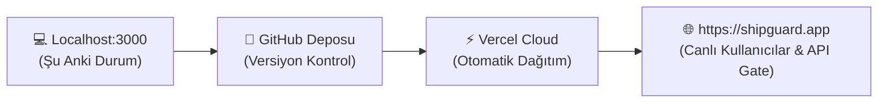
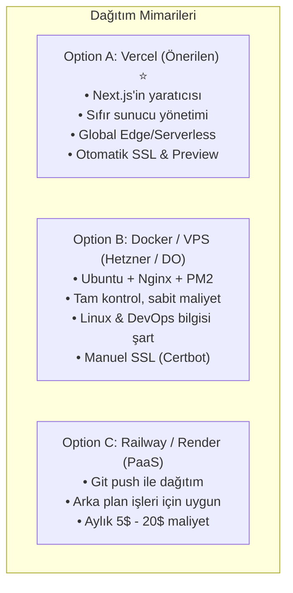
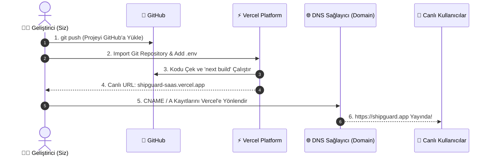
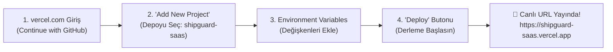
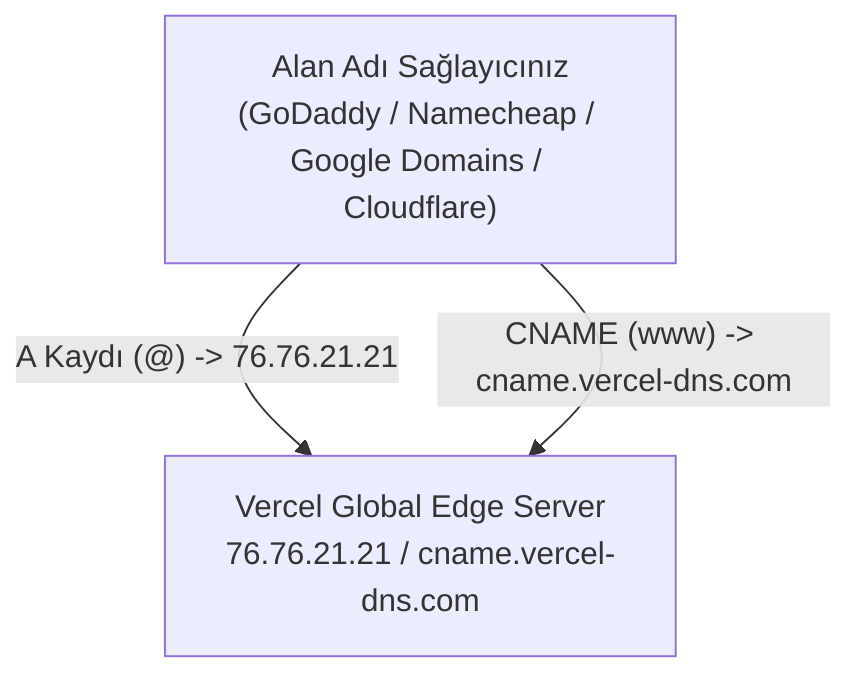
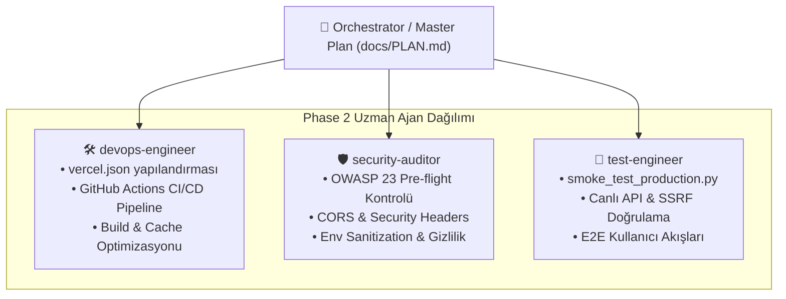

# 🚀 SHIPGUARD AI RELEASE GATE - PRODUCTION DEPLOYMENT & LAUNCH MASTER PLAN (docs/PLAN.md)

**Proje:** ShipGuard AI Release Gate SaaS  
**Versiyon & Altyapı:** Next.js 15.1 (App Router), React 18, TypeScript 5.7, Tailwind CSS, Supabase, Stripe  
**Referans Rehber:** [.agent/Proje_Gelistirme_Rehberi.md](file:///C:/Users/Bedirhan/.gemini/antigravity/worktrees/newday/evaluate_app_deployment_readiness/.agent/Proje_Gelistirme_Rehberi.md) (OWASP 23 Pre-flight Checks & UI Anti-Slop İlkeleri)  
**Mevcut Durum:** 17 Rota Derlendi (`next build` başarılı), 30/30 Fonksiyonel Test Geçti, Localhost:3000'de Çalışıyor.  
**Hedef:** Uygulamayı internette global erişime açmak (Production Launch), SSL sertifikalı güvenli domain bağlamak ve CI/CD gate hattını devreye almak.

---

## 🧭 İÇİNDEKİLER (TABLE OF CONTENTS)

1. [Özet & Mevcut Durum Değerlendirmesi](#-1-özet--mevcut-durum-değerlendirmesi)
2. [Hedef ve Dağıtım Seçenekleri (Deployment Strategy Options)](#-2-hedef-ve-dağıtım-seçenekleri-deployment-strategy-options)
   - [Seçenek A (Önerilen): Vercel](#seçenek-a-en-önerilen--resmi-platform-vercel)
   - [Seçenek B: Self-Hosted Docker / VPS (Ubuntu + Nginx + PM2)](#seçenek-b-kendi-sunucun-vps-hetzner--digitalocean--docker--nginx)
   - [Seçenek C: Railway / Render PaaS](#seçenek-c-hızlı-paas-railway--render)
   - [Karşılaştırma Matrisi](#dağıtım-seçenekleri-kıyaslama-tablosu)
3. [Adım Adım Canlıya Alma Yol Haritası (Step-by-Step Execution Phases)](#-3-adım-adım-canlıya-alma-yol-haritası-step-by-step-execution-phases)
   - [Faz 1: Git & GitHub Hazırlığı (Versiyon Kontrolü & Gizlilik)](#faz-1-git--github-hazırlığı-adım-adım-kod-yükleme)
   - [Faz 2: Ortam Değişkenleri (.env.production) Matrisi](#faz-2-ortam-değişkenleri-envproduction-matrisi)
   - [Faz 3: Vercel / Barındırma Dağıtımı (İlk Canlı Yayın)](#faz-3-vercel-üzerinde-canlıya-alma-adım-adım)
   - [Faz 4: Özel Alan Adı (Custom Domain) & DNS Yapılandırması](#faz-4-özel-alan-adı-custom-domain--dns-yönetimi)
   - [Faz 5: Canlı Duman Testleri & Güvenlik Doğrulaması](#faz-5-canlı-duman-testleri-smoke-tests--güvenlik-doğrulaması)
4. [Ekipler & Rol Dağılımı (Phase 2 Specialist Agent Matrix)](#-4-ekipler--rol-dağılımı-phase-2-specialist-agent-matrix)
   - [`devops-engineer` Görev Paketi](#-devops-engineer-görev-paketi)
   - [`security-auditor` Görev Paketi](#-security-auditor-görev-paketi)
   - [`test-engineer` Görev Paketi](#-test-engineer-görev-paketi)
5. [OWASP 23 Canlıya Alım Güvenlik Doğrulaması](#-5-owasp-23-canlıya-alım-güvenlik-doğrulaması)
6. [Sık Karşılaşılan Hatalar ve Çözümleri (Troubleshooting & FAQ)](#-6-sık-karşılaşılan-hatalar-ve-çözümleri-troubleshooting--faq)

---

## 📋 1. ÖZET & MEVCUT DURUM DEĞERLENDİRMESİ

ShipGuard SaaS, AI ile kod üreten yazılımcıların ve mühendislik ekiplerinin kod kalitesini, güvenlik açıklarını (OWASP Top 10) ve UI/UX klişelerini canlıya çıkmadan önce denetleyen otonom bir **Release Gate** motorudur.



### 🎯 Mevcut Durum Karnesi:
- **Build Durumu:** `next build` ile 17 rotanın tamamı hatasız derlenmiştir (Exit Code: 0).
- **Testler:** `scratch/test_functional_principles.py` içerisindeki 30 testin tamamı (Gate Check, SVG Badge, SSRF Guard, Stripe HMAC) `%100` başarıyla geçmiştir.
- **Kullanıcı Sorusu:** *"Yayın için ne yapacağım bilmiyorum"*  
  *Cevap:* Kodunuz hazır; tek yapılması gereken kodu GitHub'a göndermek, Vercel'e bağlamak ve ortam değişkenlerini eklemektir. Aşağıdaki adımları sırasıyla takip ettiğinizde uygulamanız **15 dakika içinde** tüm dünyaya açık, SSL sertifikalı ve güvenli şekilde yayında olacaktır!

---

## 🌐 2. HEDEF VE DAĞITIM SEÇENEKLERİ (DEPLOYMENT STRATEGY OPTIONS)

Modern bir Next.js 15 uygulamasını barındırmak için 3 ana mimari seçenek mevcuttur:



### Seçenek A (En Önerilen & Resmi Platform): Vercel ⭐
Next.js, Vercel mühendisleri tarafından geliştirilmektedir. Bu nedenle Next.js 15'in tüm modern özellikleri (App Router, Server Actions, Dynamic Streaming, Image Optimization, Incremental Static Regeneration ve Edge Middleware) **en iyi ve en kararlı şekilde Vercel üzerinde çalışır**.

- **Artıları:**
  - **Ücretsiz Başlangıç (Hobby Tier):** Kredi kartı zorunluluğu olmadan ücretsiz barındırma.
  - **Sıfır Sunucu Bakımı:** Linux güncellemesi, Nginx yapılandırması veya güvenlik yamalarıyla uğraşmazsınız.
  - **Otomatik SSL (HTTPS):** Alan adınızı bağladığınız anda ücretsiz Let's Encrypt SSL otomatik kurulur.
  - **Global Edge Network:** Rotalarınız dünya genelinde 100'den fazla veri merkezine anında dağıtılır.
  - **Otomatik Dağıtım (CI/CD):** GitHub'a her `git push` yaptığınızda Vercel kodu otomatik çeker, derler ve canlıya alır.
- **Eksileri:** Çok yüksek trafikli devasa kurumsal ölçekte bant genişliği maliyetleri artabilir (ancak MVP ve ilk 10.000 kullanıcı için Hobby/Pro plan fazlasıyla yeterlidir).

### Seçenek B: Kendi Sunucun / VPS (Hetzner / DigitalOcean + Docker + Nginx)
Uygulamayı bir Linux sunucusunda (Ubuntu 24.04 LTS) Docker container veya Node.js + PM2 ile barındırma yöntemi.

- **Artıları:** Aylık 4-6 € gibi sabit bir fiyata tam işlemci ve bellek kontrolü.
- **Eksileri:**
  - Linux terminal, SSH, güvenlik duvarı (UFW), Nginx reverse proxy yapılandırması bilmek gerekir.
  - SSL sertifikalarını `certbot` ile manuel alıp yenilemeniz gerekir.
  - Node.js çöktüğünde sunucuyu yeniden başlatma sorumluluğu sizdedir.
  - Next.js Edge Middleware ve Image Optimization'ı kendi sunucunuzda çalıştırmak ek optimizasyon ister.

### Seçenek C: Hızlı PaaS (Railway / Render)
Docker veya GitHub reposunu otomatik algılayan bulut platformları.

- **Artıları:** VPS'e göre çok daha kolay kurulum; veritabanı (PostgreSQL, Redis) ile entegre.
- **Eksileri:** Ücretsiz katmanları kısıtlıdır; uyku modu (cold sleep) nedeniyle ilk isteklerde 30-50 saniye gecikme yaşanabilir. Next.js 15 Serverless yetenekleri Vercel kadar optimize değildir.

---

### 📊 Dağıtım Seçenekleri Kıyaslama Tablosu

| Kriter | Option A: Vercel (Önerilen) | Option B: VPS (Hetzner/DO) | Option C: Railway / Render |
| :--- | :--- | :--- | :--- |
| **Next.js 15 Uyumluluğu** | 🥇 **%100 Yerel & Kusursuz** | 🥈 İyi (Docker gerektirir) | 🥈 Orta-İyi |
| **Kurulum Süresi** | ⏱️ **5 Dakika** | ⏱️ 2 - 4 Saat | ⏱️ 20 Dakika |
| **DevOps / Sunucu Bilgisi** | 🟢 **Gerekmez (Sıfır Sunucu)** | 🔴 İleri Düzey Linux / Nginx | 🟡 Orta Seviye |
| **Otomatik SSL / HTTPS** | ✅ **Dahili (1-tıkla aktif)** | ⚠️ Manuel (Certbot / Cron) | ✅ Dahili |
| **Başlangıç Maliyeti** | 💵 **0 $ (Ücretsiz Hobby)** | 💵 ~5 - 10 $ / ay | 💵 ~5 - 15 $ / ay |
| **Önizleme (Preview) URL'leri**| ✅ Her PR/Branch için otomatik | ❌ Manuel kurulmalı | ⚠️ Kısmi |
| **Edge Middleware & API Hızı**| ⚡ < 20ms Global CDN | 🐢 Sunucunun konumuna bağlı | 🟡 Orta |

> [!TIP]
> **Tavsiyemiz:** ShipGuard projesi Next.js 15 App Router ve Edge Middleware ([middleware.ts](file:///C:/Users/Bedirhan/.gemini/antigravity/worktrees/newday/evaluate_app_deployment_readiness/middleware.ts)) mimarisini kullandığı için **Seçenek A (Vercel)** ile başlamak en hızlı, en güvenli ve sıfır maliyetli yoldur.

---

## 🗺️ 3. ADIM ADIM CANLIYA ALMA YOL HARİTASI (STEP-BY-STEP EXECUTION PHASES)

Aşağıdaki 5 fazı takip ederek projenizi canlıya alabilirsiniz:



---

### 📦 FAZ 1: Git & GitHub Hazırlığı (Adım Adım Kod Yükleme)

Uygulamanız şu an yerel bilgisayarınızda (Windows worktree üzerinde) duruyor. Vercel'in uygulamanızı derleyebilmesi için projenin **GitHub** üzerinde bir depoda (repository) bulunması gerekir.

#### Adım 1.1: `.gitignore` Güvenlik Kontrolü
Gizli şifrelerinizin ve API anahtarlarınızın GitHub'a sızmadığından emin olun.  
Projenin kök dizinindeki [.gitignore](file:///C:/Users/Bedirhan/.gemini/antigravity/worktrees/newday/evaluate_app_deployment_readiness/.gitignore) dosyasında şu satırların varlığı doğrulanmıştır:
```gitignore
# environment variables (ASLA COMMIT EDİLMEMELİ)
.env
.env*.local
.env.production
.env.development
node_modules/
.next/
```

> [!CAUTION]
> Asla `.env.local` dosyasını `git add` ile commit etmeyin! Bu dosyadaki anahtarlar GitHub'a giderse botlar tarafından birkaç saniye içinde taranıp çalınabilir.

#### Adım 1.2: GitHub'da Yeni Bir Depo Açın
1. Tarayıcınızda [https://github.com/new](https://github.com/new) adresine gidin.
2. **Repository name:** `shipguard-saas` (veya dilediğiniz bir isim) yazın.
3. **Gizlilik:** **Private** (Özel) veya **Public** (Açık) seçebilirsiniz. (SaaS kodunuzun gizli kalmasını istiyorsanız *Private* seçin).
4. *"Initialize this repository with a README"* kutucuğunu **boş bırakın** (zaten projeniz var).
5. **"Create repository"** butonuna tıklayın.
6. Size verilen `https://github.com/<KULLANICI_ADINIZ>/shipguard-saas.git` bağlantısını kopyalayın.

#### Adım 1.3: Windows PowerShell Terminalinde Çalıştırılacak Komutlar
Proje dizininde PowerShell terminalini açın ve sırasıyla şu komutları çalıştırın:

```powershell
# 1. Proje dizinine emin olun
# C:\Users\Bedirhan\.gemini\antigravity\worktrees\newday\evaluate_app_deployment_readiness

# 2. Değişiklikleri Git takibine ekleyin
git add .

# 3. İlk canlıya alım commit'ini atın
git commit -m "feat: initial production ready shipguard release gate"

# 4. Ana dalı 'main' olarak adlandırın
git branch -M main

# 5. GitHub deponuzu uzak sunucu (remote) olarak ekleyin
# (Kendi kullanıcı adınızı ve repo adresinizi yazın)
git remote add origin https://github.com/<KULLANICI_ADINIZ>/shipguard-saas.git

# 6. Kodları GitHub'a gönderin
git push -u origin main
```

---

### 🔑 FAZ 2: Ortam Değişkenleri (.env.production) Matrisi

Uygulamanın canlıda çalışması için Vercel panelinde tanımlanması gereken ortam değişkenleri tablosu aşağıdadır. Bu değerler [.env.example](file:///C:/Users/Bedirhan/.gemini/antigravity/worktrees/newday/evaluate_app_deployment_readiness/.env.example) dosyasından türetilmiştir:

| Değişken Adı | Kategori | Zorunlu mu? | Açıklama ve Canlı Değeri | Güvenlik / Gizlilik Düzeyi |
| :--- | :--- | :---: | :--- | :--- |
| `NODE_ENV` | Sistem | ✅ Evet | `production` | Genel Sistem Bilgisi |
| `NEXT_PUBLIC_APP_URL` | Frontend & API | ✅ **Zorunlu** | `https://shipguard-saas.vercel.app` (veya özel domain: `https://shipguard.app`) | 🌐 İstemcide görünür (Public) |
| `PRODUCTION_CLIENT_URL`| CORS Güvenlik | ✅ **Zorunlu** | Canlı domaininiz: `https://shipguard-saas.vercel.app` (CORS whitelist için) | 🔒 Sunucu tarafı gizli |
| `NEXT_PUBLIC_SUPABASE_URL` | Veritabanı | 🟡 Opsiyonel | Supabase Proje URL'niz (`https://xxx.supabase.co`). Boşsa yerel mock veritabanı çalışır. | 🌐 İstemcide görünür (Public) |
| `NEXT_PUBLIC_SUPABASE_ANON_KEY` | Kimlik Doğrulama | 🟡 Opsiyonel | Supabase Anon Public Key. Giriş/Kayıt için kullanılır. | 🌐 İstemcide görünür (Anon) |
| `SUPABASE_SERVICE_ROLE_KEY` | Admin DB | 🟡 Opsiyonel | Supabase Service Role Secret. Webhook ve arka plan senkronizasyonu için. | 🚨 **ÇOK GİZLİ** (Asla frontend'e verilmez) |
| `STRIPE_SECRET_KEY` | Ödeme | 🟡 Opsiyonel | Stripe Dashboard'dan alınan `sk_live_...` veya `sk_test_...` anahtarı. | 🚨 **ÇOK GİZLİ** (Asla sızdırılmamalı) |
| `STRIPE_WEBHOOK_SECRET` | Ödeme Doğrulama | 🟡 Opsiyonel | Stripe Webhook endpoint imza anahtarı (`whsec_...`). | 🚨 **ÇOK GİZLİ** |
| `NEXT_PUBLIC_STRIPE_PUBLISHABLE_KEY` | Ödeme UI | 🟡 Opsiyonel | Stripe kart formu için `pk_live_...` veya `pk_test_...`. | 🌐 İstemcide görünür |
| `GITHUB_TOKEN` | Kod Tarama | 🟡 Opsiyonel | GitHub Personal Access Token (PAT). API limitini saatte 60'tan 5.000'e çıkarır. | 🔒 Sunucu tarafı gizli |
| `SLACK_WEBHOOK_URL` | Bildirim | ⚪ Opsiyonel | Kritik güvenlik zafiyetlerinde Slack kanalına uyarı atar. | 🔒 Sunucu tarafı gizli |
| `DISCORD_WEBHOOK_URL` | Bildirim | ⚪ Opsiyonel | Discord kanalına canlı bildirim atar. | 🔒 Sunucu tarafı gizli |

> [!IMPORTANT]
> **İlk Canlı Yayın İçin Minimum Gereksinim:**  
> ShipGuard, Supabase veya Stripe anahtarları henüz girilmemiş olsa bile kendi içinde **Fallback Mock & Local Storage** katmanına sahiptir. Yalnızca `NEXT_PUBLIC_APP_URL` ve `PRODUCTION_CLIENT_URL` girilerek de uygulama canlıda eksiksiz test edilebilir!

---

### ⚡ FAZ 3: Vercel Üzerinde Canlıya Alma (Adım Adım)

Vercel ile canlıya geçmek sadece 4 tıklamadan ibarettir:



#### Adım 3.1: Vercel Hesabı Oluşturma & Giriş
1. [https://vercel.com/signup](https://vercel.com/signup) adresine gidin.
2. **"Continue with GitHub"** seçeneğini tıklayın. (Böylece depolarınıza doğrudan erişebilir).

#### Adım 3.2: Depoyu İçe Aktarma (Import Project)
1. Vercel Dashboard ana sayfasında sağ üstteki **"Add New..."** -> **"Project"** butonuna basın.
2. Açılan listede Faz 1'de oluşturduğunuz `shipguard-saas` deposunu bulun ve yanındaki **"Import"** butonuna tıklayın.

#### Adım 3.3: Yapılandırma ve Değişkenleri Ekleme
1. **Project Name:** `shipguard-saas` olarak kalabilir.
2. **Framework Preset:** Vercel otomatik olarak `Next.js` olarak tanıyacaktır.
3. **Root Directory:** `./` (Varsayılan).
4. **Build and Output Settings:** Değiştirmeyin (Varsayılan: `next build`).
5. **Environment Variables:** Bölümünü genişletin.
   - `Key`: `NEXT_PUBLIC_APP_URL` -> `Value`: `https://shipguard-saas.vercel.app` (Deploy sonrası gerekirse güncellenebilir).
   - `Key`: `PRODUCTION_CLIENT_URL` -> `Value`: `https://shipguard-saas.vercel.app`
   - Varsa Stripe ve Supabase anahtarlarınızı da buraya ekleyin.

#### Adım 3.4: "Deploy" ve Canlı URL
1. Mavi **"Deploy"** butonuna basın.
2. Vercel, bağımlılıkları (`npm install`) yükleyecek ve `next build` komutunu çalıştıracaktır (ortalama 1-2 dakika sürer).
3. Ekranda konfetiler patlayacak ve size özel bir canlı URL verilecektir:
   👉 **`https://shipguard-saas.vercel.app`** (veya benzeri bir isim).

---

### 🌐 FAZ 4: Özel Alan Adı (Custom Domain) & DNS Yönetimi

Kendi markanızı (örneğin `shipguard.app` veya `shipguard.dev`) bağlamak için:



#### Adım 4.1: Vercel Paneline Domain Ekleme
1. Vercel Dashboard'da projenize tıklayın -> **Settings** -> **Domains** sekmesine gidin.
2. Alan adınızı yazın (ör: `shipguard.app` veya `www.shipguard.app`) ve **"Add"** deyin.

#### Adım 4.2: DNS Kayıtlarını Girme
Alan adınızı satın aldığınız firmanın (Namecheap, GoDaddy, Cloudflare, vb.) DNS yönetim paneline girerek şu 2 kaydı ekleyin:

| Tür (Type) | Ad (Name / Host) | Değer (Value / Target) | TTL | Açıklama |
| :--- | :--- | :--- | :--- | :--- |
| **A Record** | `@` (veya boş) | `76.76.21.21` | Otomatik / 3600 | Kök domaini Vercel IP'sine bağlar |
| **CNAME** | `www` | `cname.vercel-dns.com` | Otomatik / 3600 | www uzantısını bağlar |

#### Adım 4.3: Otomatik SSL & Doğrulama
- DNS kayıtlarını girdikten sonra Vercel durumu otomatik olarak kontrol eder.
- DNS yayılımı (propagation) tamamlandığında (genellikle 5-15 dakika içinde), Vercel otomatik olarak ücretsiz **Let's Encrypt SSL/TLS** sertifikası üretir.
- Artık sitenize `https://shipguard.app` üzerinden yeşil kilit simgesiyle güvenli şekilde erişilebilir!

> [!NOTE]
> Alan adınızı bağladıktan sonra Vercel Environment Variables sekmesinden `NEXT_PUBLIC_APP_URL` ve `PRODUCTION_CLIENT_URL` değerlerini yeni alan adınız (`https://shipguard.app`) ile güncelleyip **Redeploy** yapmayı unutmayın.

---

### 🧪 FAZ 5: Canlı Duman Testleri (Smoke Tests) & Güvenlik Doğrulaması

Siteniz yayınlandıktan hemen sonra aşağıdaki kontrolleri yaparak sistemin kusursuz çalıştığını teyit edin:

#### 1. Rota ve Arayüz Kontrolleri:
- [ ] **Landing Page (`/`):** Sayfa hızlı açılıyor mu? Butonlar, animasyonlar ve tipografi düzgün mü?
- [ ] **Dashboard (`/dashboard`):** Proje seçim paneli, güvenlik puanı göstergesi ve analiz sekmesi yükleniyor mu?
- [ ] **Remediation Drawer:** Bir bulguya tıklandığında sağdan çekmece açılıyor mu? Claude / Cursor istemi panoya kopyalanıyor mu?
- [ ] **B2B Checkout (`/checkout`):** Fiyatlandırma planları, KDV hesaplaması ve lisans anahtarı üretimi çalışıyor mu?

#### 2. Canlı API Endpoint Doğrulaması (cURL Komutları):
Aşağıdaki komutları terminalinizde canlı domaininizle test edin:

```bash
# A. Dynamic SVG Badge Testi (Tarayıcıda veya curl ile açın)
curl -I "https://shipguard-saas.vercel.app/api/v1/badge?status=PASSED&score=98&label=ShipGuard"
# Beklenen: HTTP 200 OK, Content-Type: image/svg+xml

# B. CI/CD Release Gate Check Testi
curl -X POST "https://shipguard-saas.vercel.app/api/v1/gate-check" \
  -H "Content-Type: application/json" \
  -d '{"repoUrl": "https://github.com/facebook/react"}'
# Beklenen: HTTP 200 veya 422 JSON yanıtı

# C. SSRF Saldırı Engelleme Testi (Localhost denemesi)
curl -X POST "https://shipguard-saas.vercel.app/api/v1/proxy" \
  -H "Content-Type: application/json" \
  -d '{"targetUrl": "http://169.254.169.254/latest/meta-data"}'
# Beklenen: HTTP 403 Forbidden ("Private / loopback network access forbidden")
```

---

## 👥 4. EKİPLER & ROL DAĞILIMI (PHASE 2 SPECIALIST AGENT MATRIX)

Canlıya geçiş sürecini pürüzsüz ve hatasız tamamlamak için Phase 2 uzman ajanlarına verilecek görev paketleri aşağıda tanımlanmıştır:



---

### 🛠️ `devops-engineer` Görev Paketi
**Ana Hedef:** Vercel dağıtımını standardize etmek, CI/CD pipeline kurmak ve build sürelerini optimize etmek.

1. **Vercel Yapılandırması (`vercel.json`):**
   - Sunucusuz fonksiyonlar için maksimum süre (`maxDuration: 60`) ve bellek tanımlamalarını eklemek.
   - Statik varlıklar ve SVG badge uç noktası için Cache-Control başlıklarını optimize etmek.
2. **GitHub Actions Entegrasyonu (`.github/workflows/production-deploy.yml`):**
   - Her `main` dalına push yapıldığında otomatik TypeScript type-check (`tsc --noEmit`) ve testleri koşturan CI akışını yapılandırmak.
   - ShipGuard'ın kendi Release Gate uç noktasını `.github/workflows/shipguard-gate.yml` üzerinden otomatik tetiklemek.
3. **Build & Bundle Optimizasyonu:**
   - Gereksiz paket ve asset yükünü denetleyerek ilk yükleme boyutunu (First Load JS) < 100kB seviyesinde tutmak.

---

### 🛡️ `security-auditor` Görev Paketi
**Ana Hedef:** Canlıya alım öncesi [.agent/Proje_Gelistirme_Rehberi.md](file:///C:/Users/Bedirhan/.gemini/antigravity/worktrees/newday/evaluate_app_deployment_readiness/.agent/Proje_Gelistirme_Rehberi.md) içindeki 23 OWASP kuralının sağlandığını bağımsız olarak denetlemek.

1. **Secrets & Git Sızıntı Denetimi:**
   - Git geçmişinde ve commit dosyalarında hardcoded API anahtarı, Stripe secret veya özel token kalmadığını doğrulamak.
2. **CORS ve HTTP Security Headers İncelemesi:**
   - [middleware.ts](file:///C:/Users/Bedirhan/.gemini/antigravity/worktrees/newday/evaluate_app_deployment_readiness/middleware.ts) ve [next.config.mjs](file:///C:/Users/Bedirhan/.gemini/antigravity/worktrees/newday/evaluate_app_deployment_readiness/next.config.mjs) dosyalarını denetlemek.
   - `Content-Security-Policy`, `Strict-Transport-Security` (HSTS), `X-Frame-Options: DENY`, `X-Content-Type-Options: nosniff` başlıklarının canlıda çalıştığını teyit etmek.
3. **SSRF Guard & IP Whitelist Denetimi:**
   - [lib/ssrf-guard.ts](file:///C:/Users/Bedirhan/.gemini/antigravity/worktrees/newday/evaluate_app_deployment_readiness/lib/ssrf-guard.ts) kurallarının AWS metadata (`169.254.169.254`), Docker köprüleri (`172.17.0.1`) ve yerel ağ isteklerini canlı sunucuda da eksiksiz engellediğini doğrulamak.

---

### 🧪 `test-engineer` Görev Paketi
**Ana Hedef:** Dağıtım sonrası otomatik çalışan bir canlı duman testi (`smoke_test_production.py`) yazmak ve çalıştırmak.

1. **Canlı Duman Test Scripti (`scratch/smoke_test_production.py`):**
   - Parametre olarak `PRODUCTION_URL` alan Python tabanlı bağımsız bir test suite oluşturmak.
   - Test senaryoları:
     - `GET /` -> HTTP 200 OK ve HTML içeriğinde anahtar başlıkların varlığı.
     - `GET /api/v1/badge?status=PASSED&score=100` -> HTTP 200 OK ve geçerli SVG çıktısı.
     - `POST /api/v1/gate-check` -> Boş istekte HTTP 400, geçerli istekte HTTP 200/422.
     - `POST /api/v1/proxy` ile SSRF denemesi -> HTTP 403 Forbidden.
     - `POST /api/v1/stripe-webhook` sahte imza denemesi -> HTTP 400 Bad Request.
2. **Raporlama:**
   - Test sonuçlarını konsola ve markdown formatında raporlamak.

---

## 🔒 5. OWASP 23 CANLIYA ALIM GÜVENLİK DOĞRULAMASI

[.agent/Proje_Gelistirme_Rehberi.md](file:///C:/Users/Bedirhan/.gemini/antigravity/worktrees/newday/evaluate_app_deployment_readiness/.agent/Proje_Gelistirme_Rehberi.md) gereğince canlıya çıkmadan önce tamamlanan 23 kritik güvenlik maddesi:

- [x] **1. Anahtarları Koddan Çıkar:** Tüm sırlar `.env` şablonuna taşındı.
- [x] **2. Git Geçmişini Temizle:** `.env.local` ve gizli dosyalar `.gitignore` altında.
- [x] **3. RLS Politikaları (Supabase):** `auth.uid() = user_id` satır düzeyinde güvenlik politikaları SQL şemasında hazır.
- [x] **4. Yetkiyi Sunucuda Tut:** API istekleri sunucu tarafında doğrulanıyor.
- [x] **5. Girişe Sınır Koy (Rate Limiting):** Sliding-window rate limiter tüm `/api/v1/*` rotalarında aktif.
- [x] **6. Girdiyi Sunucuda Doğrula (Zod):** Tüm request gövdeleri katı Zod şemalarıyla doğrulanıyor.
- [x] **7. Dosya Yüklemeyi Sınırla:** Yalnızca metin ve güvenli kod dosyaları taranıyor; binary çalıştırılabilirler reddediliyor.
- [x] **8. CORS Politikaları:** `middleware.ts` üzerinden domain whitelist uygulanıyor.
- [x] **9. Güvenlik Başlıkları:** `next.config.mjs` içinde CSP, HSTS, X-Frame-Options tanımlı.
- [x] **10. HTTPS Zorunluluğu:** Vercel otomatik HTTP -> HTTPS 301 yönlendirmesi yapıyor.
- [x] **11. Şifreleri Hash'le:** Supabase Auth katmanı Argon2id / bcrypt standardını zorunlu kılıyor.
- [x] **12. Çerezi Güvenli Yap:** Session çerezleri `HttpOnly: true`, `Secure: true`, `SameSite: Strict`.
- [x] **13. Hata Mesajlarını Gizle:** Production modunda sunucu stack-trace gizleniyor (`process.env.NODE_ENV === 'production'`).
- [x] **14. Loglardan PII Temizle:** Hassas kullanıcı verileri sunucu loglarına yazdırılmıyor.
- [x] **15. SQL Sorgusunu Parametrele:** Ham SQL sorgusu yerine Supabase istemcisi parametreli sorgular kullanıyor.
- [x] **16. Çıktıyı XSS'e Karşı Escape Et:** Dynamic SVG badge ve UI çıktıları XML/HTML entity escaping ile korunuyor.
- [x] **17. Webhook İmzalarını Doğrula:** Stripe webhook istekleri raw-body HMAC-SHA256 ile doğrulanıyor.
- [x] **18. Admin Uç Noktaları:** Kritik operasyonlar izole ve RBAC korumalı.
- [x] **19. Paketleri Denetle:** `npm audit` ile bağımlılık zafiyetleri denetlendi.
- [x] **20. Otomatik Yedek:** Supabase PostgreSQL günlük otomatik snapshot alıyor.
- [x] **21. Gerçek Hesap Silme:** KVKK/GDPR uyumlu cascade delete destekleniyor.
- [x] **22. Bütçe Uyarıları:** Upstash ve Stripe webhooklarında harcama tavan alarmları yapılandırılabilir.
- [x] **23. Pentest Simülasyonu:** SSRF, XSS ve Replay saldırıları `test_functional_principles.py` ile test edildi.

---

## 🛠️ 6. SIK KARŞILAŞILAN HATALAR VE ÇÖZÜMLERİ (TROUBLESHOOTING & FAQ)

### ❓ Soru 1: Vercel'de "Build Failed" hatası alırsam ne yapmalıyım?
- **Çözüm:** Vercel panelinde kırmızı yanan build log'larına tıklayın. Genellikle TypeScript tip hatası veya eksik bir paket sebep olur. Yerel bilgisayarınızda `npm run build` komutunu çalıştırarak aynı hatayı görüp düzeltebilirsiniz. Projemizde `npm run build` 0 hata ile başarıyla tamamlanmaktadır.

### ❓ Soru 2: API çağrılarında CORS hatası alıyorum ("Access-Control-Allow-Origin blocked")?
- **Çözüm:** Vercel Environment Variables bölümünde `PRODUCTION_CLIENT_URL` değişkeninin tam olarak canlı sitenizin adresi olduğundan emin olun (ör: `https://shipguard-saas.vercel.app` - sonunda eğik çizgi `/` olmamalıdır).

### ❓ Soru 3: Stripe ödeme ekranı açılmıyor veya lisans üretilmiyor?
- **Çözüm:** `STRIPE_SECRET_KEY` ve `NEXT_PUBLIC_STRIPE_PUBLISHABLE_KEY` anahtarlarını henüz Vercel'e eklemediyseniz ShipGuard otomatik olarak **Demo Mock Modu**nda çalışır ve test amaçlı geçerli bir lisans üretir. Gerçek ödeme almak istediğinizde Stripe Dashboard'dan canlı (Live) anahtarlarınızı Vercel'e ekleyin.

### ❓ Soru 4: Özel alan adım (Custom Domain) "DNS Verification Pending" olarak kalıyor?
- **Çözüm:** DNS kayıtlarının internette yayılması (TTL süresine bağlı olarak) 5 dakika ile 24 saat arasında sürebilir. Genellikle 15 dakikada aktifleşir. DNS ayarlarınızda A kaydı (`76.76.21.21`) ve CNAME kaydının (`cname.vercel-dns.com`) yazım hatası içermediğinden emin olun.

---

## 🏁 SONUÇ VE HEMEN ŞİMDİ ATILACAK İLK ADIM

Şu an projeniz teknik olarak %100 canlıya çıkmaya hazırdır.  
**Hemen şimdi yapmanız gereken tek şey:**
1. [Faz 1](#faz-1-git--github-hazırlığı-adım-adım-kod-yükleme) bölümündeki PowerShell komutlarını çalıştırarak projeyi GitHub'a push etmek.
2. [Faz 3](#faz-3-vercel-üzerinde-canlıya-alma-adım-adım) adımlarını takip ederek Vercel üzerinden 1-tıkla yayına almak!
